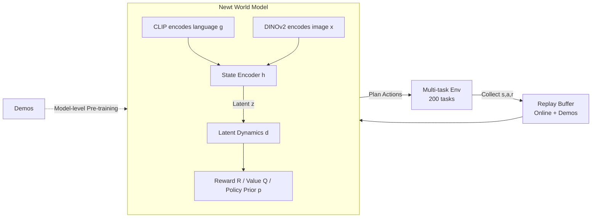

# Learning Massively Multitask World Models for Continuous Control

**Conference**: ICLR 2026  
**OpenReview**: [https://openreview.net/forum?id=MPabX9LEds](https://openreview.net/forum?id=MPabX9LEds)  
**Code**: [https://www.nicklashansen.com/NewtWM](https://www.nicklashansen.com/NewtWM)  
**Area**: reinforcement learning  
**Keywords**: multi-task reinforcement learning, world models, online RL, TD-MPC2, continuous control, language-conditioned policy  

## TL;DR
The authors propose MMBench (200 tasks across 10 domains), the first benchmark for "massively multi-task online RL," and Newt, a language-conditioned world model based on TD-MPC2. By following a foundation model paradigm of "pre-training with demonstrations followed by joint online interactive optimization across all tasks," they demonstrate that a single agent can indeed learn hundreds of continuous control tasks simultaneously using online RL.

## Background & Motivation
**Background**: General-purpose control requires agents to act across different tasks and morphologies. The current mainstream approach is to train large policies using supervised learning on massive near-expert trajectories (mostly collected via human teleoperation). While the "large-scale pre-training + lightweight RL" recipe for foundation models has been validated in video games and reasoning, the continuous control community has long been dominated by single-task or purely offline settings.

**Limitations of Prior Work**: Pure imitation learning faces two major hurdles: (i) training data volume is bottlenecked by the capacity for teleoperation collection, and (ii) policy performance is capped by the quality of the demonstrations. Online RL, the path of "continuous self-improvement," is rarely attempted in continuous control at scale, as the community generally believes that "online RL does not scale in this domain."

**Key Challenge**: Achieving general control requires online learning across hundreds of tasks. However, large-scale online multi-task RL simultaneously faces five challenges: exploration difficulties, heterogeneous observation/action spaces, massive reward scale variance, task ambiguity, and prohibitive training times. No existing algorithm effectively addresses all of these.

**Goal**: Directly challenge the prejudice that "online RL does not scale" and answer one question: **Can a single policy be successfully trained on hundreds of control tasks at once using online RL?**

**Core Idea**: **[Benchmark]** Create MMBench with 200 tasks, each equipped with language instructions, demonstrations, and optional image observations. **[Method]** Extend the single-task RL algorithm TD-MPC2 into Newt, a language-conditioned multi-task world model, and train it using the foundation model recipe of "demonstration pre-training + joint online optimization across all tasks."

## Method

### Overall Architecture
Newt is a language-conditioned (and optionally image-conditioned) multi-task world model based on TD-MPC2. It selects actions by performing trajectory optimization (planning) within a learned latent space. The process consists of two stages: first, **model-level pre-training** on demonstration data to acquire task-aware representations and action priors; second, **joint online interaction** and optimization across all 200 tasks simultaneously. The agent continuously collects data through interaction, updates the world model using these data, and outputs actions via planning based on state vectors, language instructions, and optional RGB images.

### Key Designs

**1. Self-Predictive Multi-task World Model: Fitting Heterogeneous Tasks into a Decoder-free Architecture**  
TD-MPC2 trains a world model using joint-embedding prediction (self-predictive dynamics), reward prediction, and TD-learning, rather than decoding raw future observations like generative world models. This decoder-free design saves computation and focuses on "control-centric" learning—predicting returns accurately given action sequences. Newt extends this into six components: language encoding $g=\text{CLIP}_{\text{text}}(s_{\text{lang}})$, image encoding $x=\text{DINOv2}(s_{\text{img}})$, state encoding $z=h(s_{\text{state}},x,g)$, latent dynamics $z'=d(z,a,g)$, reward $\hat r=R(z,a,g)$, terminal value $\hat q=Q(z,a,g)$, and policy prior $\hat a=p(z,g)$. Multi-input components are concatenated before entering the first MLP layer. The world model is jointly optimized via:
$L(\theta)=\mathbb{E}_{\tau\sim B}\sum_t \lambda^t(\lVert z'_t-\text{sg}(h(\cdot))\rVert_2^2+\ell_{CE}(\hat r_t,r_t)+\ell_{CE}(\hat q_t,q_t))$ 
where stop-grad (sg) prevents representation collapse and $\lambda$ exponentially decays the weight of distant samples. To handle the massive variance in reward/value distributions across tasks, rewards and values use **discrete regression (cross-entropy)** rather than MSE, modeled in log-transformed space. This allows a single prediction head to cover an extremely wide range of values. Furthermore, **per-task discount factors** $\gamma$ are used to account for varying episode lengths.

**2. Exhaustive Use of Demonstrations: Four Concurrent Paths for Action Priors**  
To overcome the severe exploration bottleneck in large-scale multi-task online RL, the authors provide 10–40 demonstrations per task (collected by single-task TD-MPC2) and exploit them in four ways. (i) **Model-level Pre-training**: All learnable components are optimized using $L(\theta)+L_p(\theta)$ before online interaction; the Q-value term in the policy objective is temporarily disabled to focus on strong action supervision. (ii) **Constrained Planning**: Since value functions are inaccurate at the start of online RL, planning might perform worse than the pre-trained policy; thus, the planner is biased toward the pre-trained policy and linearly annealed to zero over the first 12% of training. (iii) **Demo Oversampling**: Online and demo data are stored in separate buffers and sampled at a 50%:50% ratio, ensuring demos are consistently over-represented. (iv) **Action Supervision in RL Policy Updates**: The policy objective $L_p(\theta)=\mathbb{E}\sum_t\lambda^t(\lVert p(z_t,g)-a_t\rVert_2^2-Q(z_t,p(z_t,g),g)-H(p(\cdot|z_t,g)))$ includes a model-level BC term that provides action supervision when Q-estimates are inaccurate and distills planned actions into the policy prior.

**3. Overcoming Scaling Barriers with Engineering: Async Environments + Distributed Acceleration**  
The perceived impossibility of large-scale online RL is largely a computational and engineering issue. The authors distribute model updates, environment interaction, and replay buffers across multiple GPUs and processes, using `torch.compile` for both training and inference. They provide Docker images and wrappers for 200 environments spanning various simulators (MuJoCo, Box2D, Atari, etc.), supporting asynchronous stepping/rendering, batched frame stacking, and automated resets. This pipeline reduces wall-clock time to approximately 11.2 days for 100M steps across 200 tasks on a single RTX 3090, proving that online RL is indeed scalable for continuous control.

## Key Experimental Results

### Main Results (200 Tasks / 100M Steps / State Observations)

| Method | Type | Relative Performance |
|------|------|----------|
| BC (Lang-conditioned Multi-task) | Imitation | Weak baseline, capped by demo quality |
| 200× Single-task BC | Imitation | Reference for single-task upper bound |
| PPO (Tuned + Lang-conditioned) | on-policy RL | Significantly lower than Newt |
| FastTD3 (n-step=8) | off-policy RL | Significantly lower than Newt |
| TD-MPC2 (Multi-task Online, param matched) | Model-based RL | Lower than Newt (No lang/pre-training/demos) |
| **Newt (Ours)** | Model-based RL | **Highest data efficiency and total score** |

Newt's advantages primarily stem from the DMControl, DMControl Ext., ManiSkill, and MiniArcade domains. However, RL methods remain weak on MuJoCo, Box2D, and Atari (likely due to low shared structure between tasks in these domains).

### Ablation Study (20M Params / 200 Tasks)

| Design Dimension | Key Finding |
|----------|----------|
| Model Scale (2M→80M) | Scaling the model provides significant gains in multi-task settings (unlike single-task), though a ceiling exists. |
| Batch Size (128→1024) | Larger batch sizes are beneficial; suggests a "compute-optimal" (model, batch) scale. |
| Lang Conditioning (None/CLIP/Task ID) | CLIP improves normalized score from **0.371 → 0.438**; most beneficial for tasks like RoboDesk where observations alone cannot disambiguate tasks. |
| Demo Usage (Paths removed vs. all used) | Pre-training, oversampling, and BC each help; **using all four** yields the best data efficiency and asymptotic performance. |

### Key Findings
- **Few-shot Transfer**: Pre-trained Newt achieves a zero-shot score of **0.192** on 20 unseen tasks/morphologies (vs. 0.013 from scratch) and reaches **0.868** after 100k fine-tuning steps (vs. 0.480 for baseline).
- **Open-loop Control**: In 8 tasks, Newt can plan up to 48 steps (16x the training horizon) and execute open-loop plans without environment feedback, with performance near closed-loop in most cases.
- **Language and Generalization**: Unseen language instructions sometimes hurt zero-shot generalization—replacing object names with "cube" (incorrect but seen) increased success by +20.7% in push tasks, though trends were opposite for pick-and-place.
- **Visual RL**: After 30M steps of RGB fine-tuning, the total score was 0.442 (vs. 0.438 for state). Gains were significant in RoboDesk (+0.125) but negative in DMControl (-0.029), indicating unstable visual gains.

## Highlights & Insights
- **Methodological "Demystification"**: The primary value is not a single trick but the systematic refutation of the community's belief that "online RL does not scale." It successfully applies the foundation model recipe to 200 tasks in continuous control.
- **Integrated Infrastructure**: The simultaneous release of MMBench (220 tasks, including 41 new ones), Newt, 200+ checkpoints, and 4000+ demonstrations provides ready-to-use infrastructure for the community.
- **Granular Use of Demonstrations**: Breaking down the use of demonstrations into pre-training, constrained planning, oversampling, and BC supervision—and proving they are complementary—provides a clear engineering roadmap.
- **Decoder-free Architecture + Discrete Regression**: This combination is crucial for handling heterogeneous reward/value scales. Using cross-entropy in log-space prevents the scale-implosion common with MSE across diverse tasks.

## Limitations & Future Work
- **Inconsistent Domain Gains**: On MuJoCo, Box2D, and Atari, Newt often only matches the BC baseline, suggesting that shared structure is necessary for multi-task RL gains.
- **Fragile Language Generalization**: Unseen instructions degrade zero-shot performance, implying language currently acts more as a "task disambiguator" than a semantic generalizer.
- **Unstable Visual Gains**: The average gain from RGB was only +0.004. Releasing the full potential of high-resolution vision remains a challenge.
- **Scale Constraints**: Scaling to more tasks will likely require larger models and batches. With 20M parameters, Newt is still far from a "true control foundation model."

## Related Work & Insights
- **Rooted in TD-MPC2** (Hansen et al., 2024): Newt is essentially its massively multi-task online extension. Understanding latent planning in TD-MPC2 is essential for this work.
- **Counterpart to Supervised Frameworks**: While GATO, RT-X, and π0 focus on supervised learning for general policies, Newt explores the complementary path of "continuous improvement via online RL."
- **Offline-to-Online RL**: Techniques like equal-ratio buffer sampling and BC regularization align with strategies found in RLPD (Ball et al., 2023).
- **Insight**: The foundation model recipe is not exclusive to NLP and CV. With solid benchmarks, engineering, and demonstration utilization, online RL can scale in control, offering a new paradigm for Embodied AI and general robot policies.

## Rating
- **Novelty**: ⭐⭐⭐⭐ High path-breaking potential by bringing the foundation model recipe to continuous control; algorithms are mostly systematic integrations.
- **Experimental Thoroughness**: ⭐⭐⭐⭐⭐ 200 tasks across 10 domains, 5 strong baselines, comprehensive ablations, and extensive analysis (transfer, open-loop, vision).
- **Writing Quality**: ⭐⭐⭐⭐ Clear motivation and structured methodology, though some details require referring to the extensive appendix.
- **Value**: ⭐⭐⭐⭐⭐ Open-sourcing the benchmark, method, and resources provides immediate value and feasibility evidence for "control foundation models."

<!-- RELATED:START -->

## Related Papers

- [\[ICLR 2026\] WIMLE: Uncertainty-Aware World Models with IMLE for Sample-Efficient Continuous Control](wimle_uncertainty-aware_world_models_with_imle_for_sample-efficient_continuous_c.md)
- [\[ICLR 2026\] Mixture-of-World Models: Scaling Multi-Task Reinforcement Learning with Modular Latent Dynamics](mixture-of-world_models_scaling_multi-task_reinforcement_learning_with_modular_l.md)
- [\[ICLR 2026\] Beyond Distributions: Geometric Action Control for Continuous Reinforcement Learning](beyond_distributions_geometric_action_control_for_continuous_reinforcement_learn.md)
- [\[ICLR 2026\] From Observations to Events: Event-Aware World Models for Reinforcement Learning](from_observations_to_events_event-aware_world_models_for_reinforcement_learning.md)
- [\[ICLR 2026\] Learning to Be Uncertain: Pre-training World Models with Horizon-Calibrated Uncertainty](learning_to_be_uncertain_pre-training_world_models_with_horizon-calibrated_uncer.md)

<!-- RELATED:END -->
