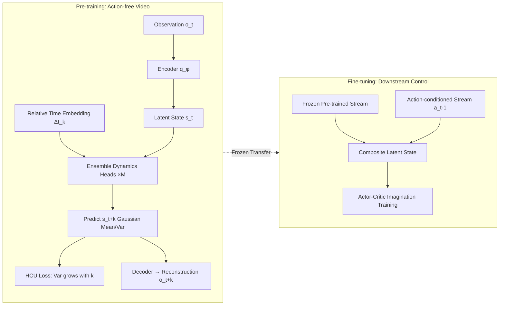

# Learning to Be Uncertainty: Pre-training World Models with Horizon-Calibrated Uncertainty

**Conference**: ICLR 2026  
**OpenReview**: [https://openreview.net/forum?id=pZuZWRuPyi](https://openreview.net/forum?id=pZuZWRuPyi)  
**Code**: To be confirmed  
**Area**: reinforcement learning  
**Keywords**: World models, action-free video pre-training, uncertainty calibration, ensemble models, model-based reinforcement learning  

## TL;DR
Addressing the issue where world models are "forced to predict a single deterministic future" during action-free video pre-training, this paper proposes HAUWM. It utilizes an ensemble of dynamics heads with variable horizon prediction and explicitly compels prediction variance to grow monotonically with the prediction horizon via a Horizon-Calibrated Uncertainty (HCU) loss. This allows the model to learn a latent space with "temporal confidence decay awareness," significantly outperforming the SOTA on downstream control tasks.

## Background & Motivation
**Background**: Pre-training world models on large-scale, action-free video data is considered a promising path toward general-purpose agents. Agents can acquire physics and dynamics priors from passive observation and then quickly fine-tune on downstream control tasks (APV, ContextWM, iVideoGPT, etc.). These methods are mostly based on RSSM/Dreamer-style latent dynamics models.

**Limitations of Prior Work**: Mainstream pre-training methods optimize for a single objective of "deterministic single-step prediction accuracy"—predicting the unique "correct" future of frame $t+1$ given frame $t$. However, action-free videos naturally lack action labels, and the same past can reasonably lead to multiple futures. Forcing the model to predict a deterministic future **punishes any representation of environmental stochasticity**. Consequently, the model learns to suppress ambiguity and manufacture "false certainty," losing its capability for diverse predictions.

**Key Challenge**: The paper quantifies this "uncertainty collapse" in Figure 1(b). Even when equipped with ensemble heads, the prediction uncertainty of APV/ContextWM remains an artificially low flat line that does not grow with the horizon. In contrast, true dynamics uncertainty should increase as the prediction distance grows. This deterministic bias becomes a liability during fine-tuning: the agent must actively "choose one" from multiple possible futures based on actions, but the pre-trained model was never equipped to handle such action-conditioned stochastic dynamics.

**Goal**: Reconstruct the objective of action-free pre-training from "pursuing only prediction accuracy" to "learning structured temporal uncertainty representations," allowing the world model to explicitly learn the principle that "prediction confidence decays over time," which is actively suppressed by existing methods.

**Core Idea**: **Use ensemble prediction disagreement as a proxy for uncertainty and employ a loss term linearly weighted by the horizon to force the inductive bias that "variance increases with the prediction horizon" into the latent space.** This is combined with variable horizon prediction, allowing the model to predict across arbitrary time intervals in a single forward pass.

## Method

### Overall Architecture
HAUWM is a two-stage framework: In the **pre-training** stage, an ensemble consisting of $M$ independent dynamics heads is trained on action-free videos. Each head predicts the latent state after a randomly sampled horizon $k$ conditioned on a relative time embedding $\Delta t^e_k$, with the HCU loss shaping the "variance growth over time" structure. In the **fine-tuning** stage, the uncertainty-aware model from pre-training is frozen, and a lightweight, trained-from-scratch action-conditioned dynamics stream is superimposed. This injects action effects without destroying the pre-trained priors, ultimately driving an actor-critic policy to learn within imagined trajectories using dual-stream composite latent states.

### Key Designs

**1. Ensemble dynamics heads modeling "discrete distributions of possible futures": quantifying stochasticity via disagreement.** Instead of using a single deterministic transition, HAUWM uses $M$ independent dynamics heads $p^{(i)}_\theta$. Each head outputs Gaussian parameters for the future latent state conditioned on the current state $s_t$ and horizon embedding $\Delta t^e_k$: $p^{(i)}_\theta(s_{t+k}\mid s_t,\Delta t^e_k)=\mathcal{N}(\mu_{\theta_i}, \sigma^2_{\theta_i}I)$. This set of predicted means $\{\mu_{\theta_i}\}$ naturally forms a discrete distribution of "multiple possible futures," and the disagreement between heads serves as a computable proxy for environmental stochasticity. When reconstructing images, the ensemble mean $\bar\mu_{t+k}=\frac1M\sum_i \mu_{\theta_i}$ is used for decoding, preserving both diversity and prediction fidelity.

**2. HCU Loss: Explicitly embedding "uncertainty growth over time" into the latent space.** This is the core of the paper. The prediction loss $\mathcal{L}_{pred}=\beta D_{KL}(q_\phi\|p_\theta)-\ln p_\phi(\hat o_{t+k}\mid s_{t+k})$ is responsible for representation learning and prediction accuracy, but it inherently approximates determinism. To counter collapse, the HCU loss weights the ensemble disagreement by the horizon length $k$:

$$\mathcal{L}_{HCU}=-k\cdot\frac{1}{M-1}\sum_{i=1}^{M}\big(\mu_{\theta_i}(s_t,\Delta t^e_k)-\bar\mu_{t+k}\big)^2$$

Because of the negative sign, **minimizing $\mathcal{L}_{HCU}$ is equivalent to maximizing the ensemble disagreement amplified by $k$**. As the prediction looks further into the future (larger $k$), the loss provides a stronger reward for disagreement, forcing the variance to grow monotonically with the horizon. In the total objective $\mathcal{L}_{total}=\mathcal{L}_{pred}+\lambda\mathcal{L}_{HCU}$, $\lambda$ acts as a self-adjusting weight that maintains the tension between "fidelity ($\mathcal{L}_{pred}$)" and "uncertainty diversity ($\mathcal{L}_{HCU}$)," avoiding collapse into either extreme uncertainty or artificial determinism.

**3. Variable Horizon Prediction + Relative Time Embedding: Enabling controllable emergence of structured uncertainty.** During training, a random horizon $k\sim\mathrm{Uniform}\{1,\dots,K_{max}\}$ is sampled for each sample to construct observation pairs $(o_t, o_{t+k})$. Instead of absolute positions, sinusoidal positional embeddings $E\in\mathbb{R}^{T\times d_e}$ are generated for the entire video, and $\Delta t^e_k=E[k]$ is taken as the relative time embedding. This encodes the relative ratio $k/T$ rather than absolute steps, automatically normalizing temporal relationships across videos of different lengths. Crucially, unlike positional encodings in Transformers used for "ordering," $\Delta t^e_k$ directly encodes the physical time interval, **forcing each dynamics head to learn the "jump" transition $s_t\to s_{t+k}$ in a single forward pass** rather than through recursive single-step rollouts. This embedding also serves as the condition signal upon which the HCU loss relies to execute "monotonically increasing variance," making structured, horizon-dependent uncertainty emerge naturally.

**4. Dual-stream Fine-tuning: Freezing uncertainty priors + Injecting action effects.** During fine-tuning, the visual encoder and ensemble dynamics heads are frozen to preserve visual/temporal representations. The architecture runs two parallel latent streams: the pre-trained stream remains unchanged, taking the $\Delta t^e_{k=1}$ time embedding and injecting Gaussian noise with $\sigma=0.01$ to enhance robustness to temporal discretization, outputting an action-agnostic $\hat s_t$. A new action-conditioned stream $p_\psi(\tilde s_t\mid s_{t-1},a_{t-1},\hat s_t)$ learns the actual action effects from scratch. The composite latent state $[\hat s_t;\tilde s_t]$ along with a reward predictor $R_\theta$ drives actor-critic imagination-based planning, allowing the policy to utilize action knowledge while remaining aware of environmental stochasticity.

## Key Experimental Results

### Main Results (Downstream Control, RQ1)
Evaluated on three pixel-level continuous control benchmarks: DeepMind Control Suite (DMC), MetaWorld, and RoboDesk. All models were pre-trained on action-free Something-Something-v2 videos (HAUWM and all baselines used the same source data) with 64×64×3 observations. Compared against four strong baselines: APV, ContextWM, PreLAR, and iVideoGPT (4 random seeds, 95% confidence intervals).

**Conclusion**: HAUWM achieves SOTA sample efficiency and final returns on most tasks. Its advantage is particularly evident in motor control tasks with complex dynamics (e.g., Walker Run, Hopper Hop), where it learns faster and converges to higher returns. An exception is Push Green, where ContextWM performs better; the authors attribute this to the task's more deterministic dynamics and narrower goals, where the benefit of complex uncertainty modeling is reduced.

### Ablation Study (RQ2, Normalized Returns averaged across tasks)

| Method | DMC | MetaWorld | RoboDesk |
|------|-----|-----------|----------|
| $\lambda=10.0$ | 0.67±0.13 | 0.77±0.05 | 0.61±0.09 |
| $\lambda=10^{-1}$ | 0.69±0.06 | 0.80±0.10 | 0.60±0.05 |
| $\lambda=10^{-2}$ | 0.70±0.04 | 0.76±0.07 | 0.65±0.07 |
| w/o HCU | 0.64±0.11 | 0.73±0.14 | 0.55±0.08 |
| **Ours ($\lambda=1.0$)** | **0.74±0.03** | **0.85±0.05** | **0.71±0.05** |

### Key Findings
- **HCU is core**: Removing HCU (w/o HCU) leads to degradation across all three benchmarks, especially on DMC (0.74→0.64), proving that explicitly modeling structured temporal uncertainty is vital for learning robust dynamics representations.
- **Moderate $\lambda$ is Necessary**: Setting $\lambda$ too high (10.0) sacrifices prediction fidelity, while setting it too low ($10^{-2}$) provides insufficient training signal. $\lambda=1.0$ strikes the best balance.
- **$K_{max}$ Ablation**: A larger maximum prediction horizon allows the model to learn richer multi-scale temporal relationships. Combined with HCU, this allows the property of uncertainty increasing with the horizon to be fully realized.
- **Uncertainty Visualization**: Figure 1(b) shows that HAUWM's prediction uncertainty grows naturally with the frame interval and is well-calibrated, whereas APV/ContextWM exhibit artificially suppressed near-flat lines even with ensemble heads.

## Highlights & Insights
- **Redefining the Pre-training Objective**: This work flips the default assumption that "action-free video pre-training should pursue prediction accuracy" to "should learn structured temporal uncertainty." Quantifying the "uncertainty collapse" in Figure 1(b) makes the problem definition highly compelling.
- **The HCU loss is simple yet precise**: Using a single formula to weight ensemble disagreement by $-k$ transforms the physical intuition of "variance growing with time" into an optimizable inductive bias, while leveraging the established model disagreement framework with low implementation cost.
- **Coupled Design of Variable Horizon + Relative Time Embedding**: Allowing the model to predict across arbitrary intervals in one forward pass avoids error accumulation from recursive rollouts and provides the necessary conditional signals for HCU to enforce "monotonic variance growth." The components support each other rather than being simple stacks.
- **Dual-stream Frozen Fine-tuning**: Injecting action effects without destroying pre-trained uncertainty priors echoes and extends the stacked architecture of APV, resulting in a clean engineering solution.

## Limitations & Future Work
- **Variance introduced by Ensembles**: Although the $M$-head ensemble improves average performance, it leads to larger variance across seeds in tasks like Dial Turn, an inherent trade-off of the architecture.
- **Diminishing returns on deterministic tasks**: In tasks with highly deterministic dynamics and narrow goals (Push Green), complex uncertainty modeling was outperformed by methods directly learning action-result mappings.
- **Simplified Uncertainty Form**: HCU uses isotropic Gaussians and ensemble disagreement to approximate stochasticity, which is still a coarse-grained representation of multi-modal futures. Future work could explore more explicit multi-modal distribution modeling.
- **Limited Pre-training Data**: Validated only on Something-Something-v2. Scalability across larger-scale, more heterogeneous video domains and whether "uncertainty calibration still holds" remains to be tested.

## Related Work & Insights
This paper sits at the intersection of RSSM/Dreamer latent dynamics models (PlaNet, Dreamer v1-v3) and action-free video pre-training (APV, ContextWM, iVideoGPT, PreLAR). Its greatest insight is: **when supervision signals are inherently under-determined (no actions → multiple futures), rather than forcing the model to provide a single deterministic answer, it is better to explicitly teach it "how uncertain it should be."** This approach is relevant for all self-supervised/unlabeled sequence prediction tasks (video generation, trajectory prediction, long-range uncertainty in LLMs). The method of "using ensemble disagreement as a stochasticity proxy + weighting by horizon" also provides a clean example of how to encode physical intuition into a loss function.

## Rating
- **Novelty**: ⭐⭐⭐⭐ Re-framing action-free pre-training around learning structured uncertainty and implementing it with HCU loss + variable horizon prediction is original, despite borrowing some mature components.
- **Experimental Thoroughness**: ⭐⭐⭐⭐ Covers three benchmark categories, four strong baselines, $\lambda$ and $K_{max}$ ablations, and uncertainty visualization. The chain of evidence is complete, though limited by a single pre-training data source.
- **Writing Quality**: ⭐⭐⭐⭐ Clear motivation, highly persuasive visualization of "uncertainty collapse," and concise presentation of methods and formulas.
- **Value**: ⭐⭐⭐⭐ Provides a transferable uncertainty calibration paradigm for world model pre-training, offering practical improvements for the sample efficiency of model-based RL and general agents.

<!-- RELATED:START -->

## Related Papers

- [\[ICLR 2026\] From Observations to Events: Event-Aware World Models for Reinforcement Learning](from_observations_to_events_event-aware_world_models_for_reinforcement_learning.md)
- [\[ICLR 2026\] WIMLE: Uncertainty-Aware World Models with IMLE for Sample-Efficient Continuous Control](wimle_uncertainty-aware_world_models_with_imle_for_sample-efficient_continuous_c.md)
- [\[ICLR 2026\] Learning Massively Multitask World Models for Continuous Control](learning_massively_multitask_world_models_for_continuous_control.md)
- [\[ICLR 2026\] Context and Diversity Matter: The Emergence of In-Context Learning in World Models](context_and_diversity_matter_the_emergence_of_in-context_learning_in_world_model.md)
- [\[ICLR 2026\] Unsupervised Learning of Efficient Exploration: Pre-training Adaptive Policies via Self-Imposed Goals](unsupervised_learning_of_efficient_exploration_pre-training_adaptive_policies_vi.md)

<!-- RELATED:END -->
