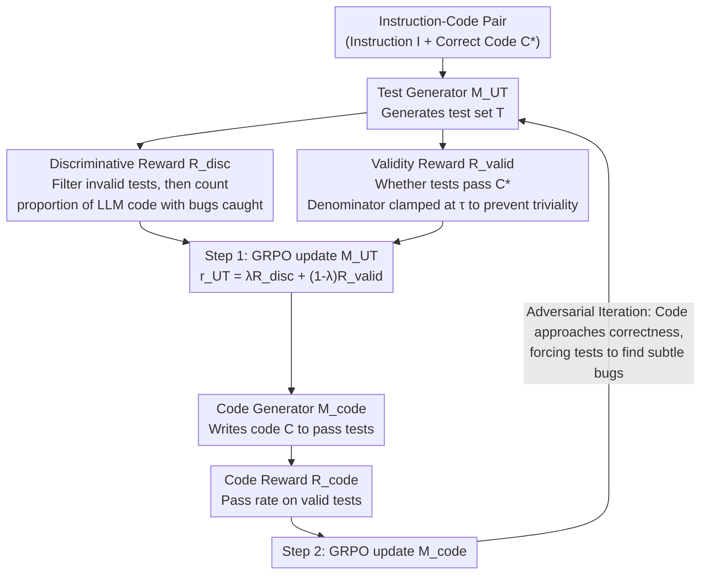

# Learning to Generate Unit Test via Adversarial Reinforcement Learning

**Conference**: ICLR 2026  
**arXiv**: [2508.21107](https://arxiv.org/abs/2508.21107)  
**Code**: [Project Page](https://dgjun32.github.io/UTRL)  
**Area**: Code Generation/Reinforcement Learning  
**Keywords**: Unit Test Generation, Adversarial Training, RLVR, Self-play, Discriminative Reward

## TL;DR
The UTRL framework is proposed to iteratively train a unit test generator and a code generator through adversarial RL. The test generator learns to produce discriminative test cases that distinguish LLM-generated code from correct code, while the code generator learns to pass these tests. After training, Qwen3-4B surpasses GPT-4.1 in test generation quality.

## Background & Motivation

**Background**: Unit testing is a core practice in programming, and high-quality tests are essential for best-of-N sampling and RLVR reward functions. LLMs have been applied to automated test generation, yet methods for training LLMs to generate high-quality tests remain inadequate.

**Limitations of Prior Work**: (1) SFT requires labeled instruction-test pairs, which are expensive and difficult to scale across domains; (2) Evaluating test quality is an open problem with no single correct answer; (3) Defining verifiable rewards for test generation is non-trivial—unlike code generation, which has clear pass/fail criteria.

**Key Challenge**: A method is required to train test generators without test labels, yet defining reward signals for "good tests" typically requires reference standards.

**Key Insight**: Given the availability of instruction-code pair datasets, the ability to "distinguish LLM-generated code from correct code" can serve as a proxy metric for test quality—effective tests should identify bugs in LLM code.

**Core Idea**: The test generator is rewarded for "catching" bugs in the code generator, while the code generator is rewarded for passing the tests, leading to adversarial co-evolution.

## Method

### Overall Architecture
UTRL addresses the challenge of "training models to generate high-quality unit tests without test labels." It positions the test generator $\mathcal{M}_{\text{UT}}$ and the code generator $\mathcal{M}_{\text{code}}$ as adversaries. Given a set of instruction-code pairs, the test generator first produces a set of test cases for a specific instruction, and the code generator then attempts to write code that passes these tests. Training proceeds over multiple iterations in two alternating steps: Step 1 updates only the test generator, rewarding it for "catching" bugs in the code generator while maintaining test validity; Step 2 updates only the code generator, rewarding it for passing increasingly difficult tests. Both models share a Qwen3-4B base and are optimized using GRPO. The key innovation lies in transforming the open-ended test evaluation problem into a computable reward signal by measuring whether a set of tests can distinguish buggy LLM code from correct ground-truth code.

### Key Designs

**1. Discriminative Reward: Redefining "Good Tests" as "Bug-Catching Tests"**

As there is no gold standard for test quality, the adversarial framework uses a proxy metric: how many LLM-generated code samples $\mathcal{C}$ a test set can distinguish from the correct code $C^*$. The discriminative reward first filters out invalid tests that do not pass the correct code $C^*$ (using $\text{Pass}(C^*,T)$ as an exponent, setting the factor to 1 for invalid tests to exclude them). It then counts how many LLM code samples $C$ are "caught" by at least one valid test:

$$R_{\text{disc}}(\mathcal{T}, \mathcal{C}, C^*) = \frac{1}{|\mathcal{C}|}\sum_{C \in \mathcal{C}}\Big[1 - \prod_{T \in \mathcal{T}}(1-\text{Pass}(C,T))^{\text{Pass}(C^*,T)}\Big]$$

A higher discrimination rate indicates stronger test set quality. This allows the test generator to focus on the objective of "finding bugs in LLM code" rather than defining abstract quality.

**2. Validity Reward: Preventing Shortcuts via Trivial Tests**

Rewarding only discrimination could lead to a loophole where the model generates a minimal number of simple tests that pass the correct code. The validity reward measures the functional correctness of test cases (input-output mapping) and clamps the denominator with a threshold $\tau$:

$$R_{\text{valid}}(\mathcal{T}, C^*, \tau) = \frac{\sum_{T} \text{Pass}(C^*, T)}{\max(|\mathcal{T}|, \tau)}$$

When the number of tests is fewer than $\tau$, the denominator is forced to $\tau$, preventing a small number of trivial tests from receiving full marks and compelling the model to generate a sufficient quantity of correct tests. The final reward for the test generator is a weighted sum $r_{\text{UT}} = \lambda R_{\text{disc}} + (1-\lambda) R_{\text{valid}}$.

**3. Code Generator Training: Using Evolving Tests as Curriculum**

The reward for the code generator is its pass rate on "valid tests"—only tests that pass the correct code $C^*$ are included in the denominator to avoid noise from invalid tests:

$$R_{\text{code}} = \frac{\sum_T \text{Pass}(C,T) \cdot \text{Pass}(C^*,T)}{\sum_T \text{Pass}(C^*,T)}$$

As the test generator improves and produces tests targeting edge cases, the code generator must produce increasingly correct code to maintain high scores. Conversely, improved code forces the test generator to find more subtle bugs. This mutual pressure facilitates co-evolution without manually designed curricula.

### Loss & Training
Both models are optimized via GRPO. The test generator target is $r_{\text{UT}} = \lambda R_{\text{disc}} + (1-\lambda) R_{\text{valid}}$, and the code generator target is $R_{\text{code}}$. Training alternates between Step 1 (update test generator) and Step 2 (update code generator) over multiple iterations, sharing a Qwen3-4B base.

## Key Experimental Results

### Main Results
Evaluation on TACO (Competitive Programming) for Best-of-N performance:

| Method | Model | Best-of-N Code Accuracy Gain | Test Fidelity |
|------|------|-------------------|----------|
| Base Qwen3-4B | 4B | 1× | Baseline |
| SFT (w/ GT Tests) | 4B | Med | Med |
| SFT (w/ Reasoning) | 4B | Med+ | Med+ |
| **UTRL** | **4B** | **3.1×** | **Highest** |
| GPT-4o | ~Trillion | Med | Med |
| **GPT-4.1** | ~Trillion | High | High |
| **UTRL (Qwen3-4B)** | **4B** | **Outperforms GPT-4.1** | **Outperforms** |

### Ablation Study

| Iteration | Disc. Rate | Valid. Rate | Description |
|---------|--------|--------|------|
| Round 0 | Baseline | Baseline | Un-trained |
| Round 1 | Increase | Increase | Initial adversarial step |
| Round 2 | Continued ↑ | Continued ↑ | Sustained improvement |
| Round 3 | Continued ↑ | Continued ↑ | No signs of saturation |

### Key Findings
- The 4B model trained via UTRL outperforms GPT-4.1 in test generation—demonstrating that adversarial RL can be more significant than model scale.
- UTRL requires no test labels, using only instruction-code pairs—making it significantly cheaper and more effective than SFT.
- The code quality from the adversarial generator approaches that of versions trained with ground-truth tests, indicating the test generator provides an effective reward proxy.
- Iterative training continuously improves both: the code generator produces more correct code, which in turn forces the test generator to find more subtle bugs.

## Highlights & Insights
- **Elegant Discriminative Reward**: Eliminates the need for "gold" test definitions by treating test evaluation as a measurable discrimination task between LLM and correct code.
- **Natural Curriculum Learning**: As the code generator improves, its errors become more subtle, naturally forcing the test generator to learn harder edge cases.
- **4B Outperforming GPT-4.1**: Test generation is a niche scenario for UTRL; the 4B model dominates trillion-parameter models on this specific task, showcasing the power of targeted RL.

## Limitations & Future Work
- Validated only on competitive programming (TACO); generalization to other domains (Web/Systems) remains to be tested.
- Shared base model for both generators; using independent models might yield better results.
- Discriminative reward depends on the code generator's distribution—if the code generator is too weak, discrimination becomes too easy, leading to a loss of learning signal.
- Lack of direct fair comparison with CURE (due to different base models).

## Related Work & Insights
- **vs. SFT Methods (CodeRM/UTGEN)**: SFT requires labeled tests; UTRL requires only code labels and achieves better performance.
- **vs. CURE**: CURE uses RL but requires test-labeled datasets, whereas UTRL is label-free for tests.
- **vs. AZR Self-Play**: AZR involves problem generation and solving; UTRL involves test generation and code implementation, presenting a clear parallel in adversarial logic.

## Rating
- Novelty: ⭐⭐⭐⭐⭐ Innovative use of discriminative rewards and adversarial training for test generation.
- Experimental Thoroughness: ⭐⭐⭐⭐ Extensive baselines, multiple metrics, and thorough iterative analysis.
- Writing Quality: ⭐⭐⭐⭐ Clear methodological descriptions and complete pseudocode.
- Value: ⭐⭐⭐⭐⭐ Direct engineering value for code evaluation and automated testing.

<!-- RELATED:START -->

## Related Papers

- [\[ICLR 2026\] Minimax Optimal Adversarial Reinforcement Learning](minimax_optimal_adversarial_reinforcement_learning.md)
- [\[ICLR 2026\] Latent Wasserstein Adversarial Imitation Learning](latent_wasserstein_adversarial_imitation_learning.md)
- [\[ICLR 2026\] On Discovering Algorithms for Adversarial Imitation Learning](on_discovering_algorithms_for_adversarial_imitation_learning.md)
- [\[ICLR 2026\] Self-Harmony: Learning to Harmonize Self-Supervision and Self-Play in Test-Time Reinforcement Learning](self-harmony_learning_to_harmonize_self-supervision_and_self-play_in_test-time_r.md)
- [\[ICLR 2026\] Robust Deep Reinforcement Learning against Adversarial Behavior Manipulation](robust_deep_reinforcement_learning_against_adversarial_behavior_manipulation.md)

<!-- RELATED:END -->
