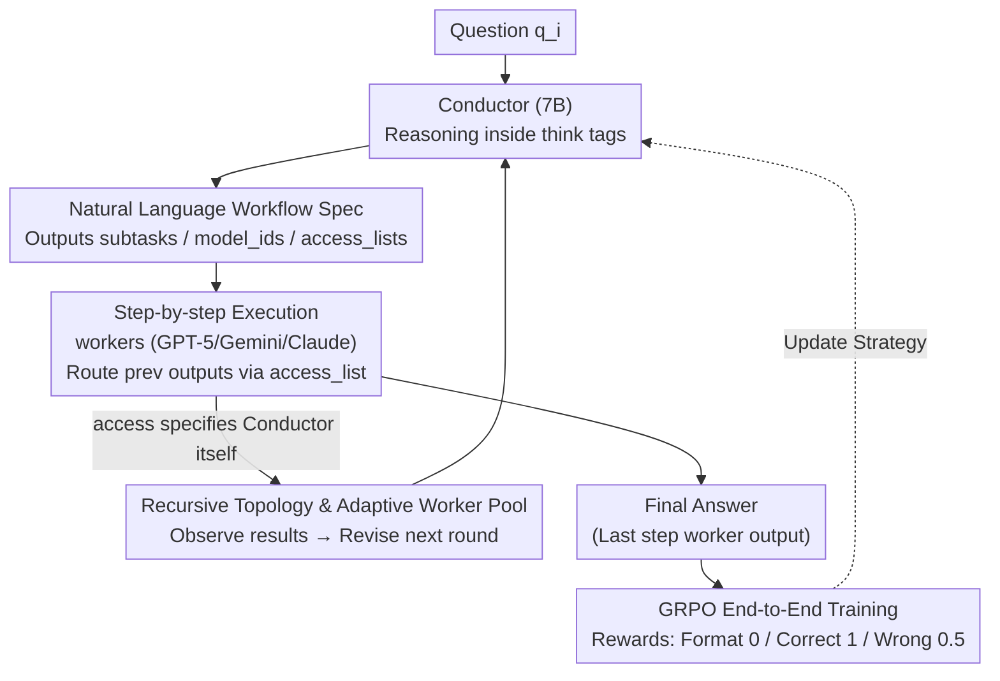

# Learning to Orchestrate Agents in Natural Language with the Conductor

**Conference**: ICLR 2026  
**arXiv**: [2512.04388](https://arxiv.org/abs/2512.04388)  
**Code**: Yes (submitted with paper)  
**Area**: Reinforcement Learning  
**Keywords**: multi-agent coordination, reinforcement-learning, workflow orchestration, test-time scaling, collective intelligence

## TL;DR
A 7B Qwen2.5 model is trained as a "Conductor" using GRPO to output complete Agent workflows (subtask instructions + worker assignment + communication topology access lists) in natural language. Coordinating frontier models like GPT-5/Claude Sonnet 4/Gemini 2.5 Pro, it achieves an average of 77.27% across 7 reasoning benchmarks with only 960 questions × 200 training iterations, surpassing all single models (GPT-5 at 74.78%) and multi-agent baselines.

## Background & Motivation

**Background**: Different LLMs possess expertise in different domains (GPT-5 excels in coding, Gemini in scientific reasoning). Commercial AI products rely on manually designed agent workflows to leverage the advantages of model combinations.

**Limitations of Prior Work**:
- Manually designed Agent scaffolding requires extensive prompt engineering and lacks adaptivity.
- Methods such as MoA/RouterDC only perform model routing or use fixed topologies, with expressiveness limited by a predefined set of options.
- Self-reflection strategies show diminishing returns after 5 rounds, with limited room for intra-model improvement.
- Lack of a method for end-to-end learning of coordination strategies—allowing RL to automatically discover "who does what and how to cooperate."

**Key Challenge**: Flexible Agent coordination strategies are needed to maximize the potential of heterogeneous model combinations → however, the cost of manual strategy design is high and not generalizable, while the strategy space of routing classifiers is restricted by predefined topologies.

**Goal**: Let a small model automatically learn to design optimal multi-model coordination workflows for any problem through RL.

**Key Insight**: Use natural language as the specification language for workflows—the Conductor directly outputs three Python lists: subtask descriptions, model IDs, and access lists. Any coordination strategy expressible in natural language falls within the search space.

**Core Idea**: Modeling "Agent workflow design" as a sequence generation task that can be optimized end-to-end using RL.

## Method

### Overall Architecture

The problem this paper addresses is that while heterogeneous frontier models have individual strengths, combining them into an optimal workflow for a specific problem currently relies on manual prompt engineering or routing classifiers limited by predefined topologies. The Conductor's approach is to train a 7B small model to "direct" these large models: it receives a question $q_i$, performs reasoning within `<think>` tags, and directly outputs three Python lists—`subtasks` (natural language subtask instructions for each step), `model_ids` (which worker is assigned to this step), and `access_lists` (which previous step outputs this worker can see). Together, these three lists form a complete coordination topology, referred to later as the "natural language workflow specification." The workflow is executed sequentially; responses from preceding workers are injected into the context of subsequent workers based on the access_list. The output of the final step worker is the final answer. If the Conductor itself is specified in the access_list, the workflow enters recursion—allowing it to revise the strategy for the next round based on previous results. The key to the system is that the coordination strategy is not hard-coded by humans but learned by the small model from result correctness using GRPO.

### Key Designs

**1. Natural Language Workflow Specification: Making the search space equal to "any prompt a human can write"**

Addressing the limitation where routing classifiers only pick from predefined options, Conductor formalizes a workflow as a sequence $\{(\text{subtask}_i, \text{agent}_i, \text{access}_i)\}_{i=1}^L$. Each step carries a natural language subtask, a worker ID, and an access list. The access list determines the topology—it can degrade into a simple best-of-N, a chain, or a tree structure using notation like `access=[[],[],["all"]]` (two workers in parallel, the third summarizing both). Worker contexts are organized using conversation templates that inject "task + response" from previous steps. Using natural language instead of discrete labels as the interface allows for coordination behaviors far beyond "selection": the Conductor can perform prompt engineering (writing focused instructions), task decomposition (multi-step planning), verification (checking previous results), or role assignment ("you are a planner"/"you write code"). These capabilities emerge automatically as long as the model can write the corresponding subtask text.

**2. GRPO End-to-End Training: Forcing coordination skills out of reward maximization via a 3-tier reward**

With a highly expressive action space, the challenge is learning. Conductor uses GRPO for end-to-end optimization with the objective:

$$J(\theta) = \mathbb{E}\Big[\frac{1}{G}\sum_{i=1}^{G}\min\big(r_i A_i,\ \text{clip}(r_i, 1-\epsilon, 1+\epsilon)A_i\big)\Big]$$

The advantage function $A_i = (r_i - \text{mean})/\text{std}$ is normalized within the group, and no KL constraint is applied (β=0). The reward design is intentionally simple: 0 for format errors, 1 for correct answers, and 0.5 for wrong answers. Crucially, setting "correct format but wrong answer" to 0.5 instead of -1 provides a gradient between "wrong answer" and "incorrect format," encouraging the model to explore diverse coordination strategies without retreating into safe but conservative workflows. Training converges in only 960 questions and 200 iterations because the frontier workers already provide a strong execution foundation; the Conductor only needs to learn "how to schedule" rather than "how to solve."

**3. Recursive Topology and Adaptive Worker Pool: Turning the coordinator itself into an extensible test-time compute axis**

While the first two points define "one-off" workflows, this allows for self-extension. Recursion is implemented by allowing the Conductor to specify its own ID in an access_list. Upon recursive call, it receives parental output plus preceding worker responses as context to decide the next move (with a manual recursion limit). This opens a new test-time scaling axis—the Conductor can adaptively revise after observing initial strategy results. For instance, if GPT-5 performs poorly on BigCodeBench, it can pivot the task to Claude or Gemini in the next round. The Adaptive Worker Pool addresses "whether the model remains usable with different models" by fine-tuning the pre-trained Conductor with random samplings of $k$ worker subsets, enabling it to operate in purely closed-source scenarios or with only open-source models (R1-Distill/Gemma/Qwen).

### A Complete Example

Consider a complex coding problem. The Conductor first identifies it as a LiveCodeBench-level challenge in `<think>`, then plans a 3-step workflow: Step 1 assigns GPT-5 to draft code (`subtask`="write solution", `access=[]`); Step 2 has Gemini 2.5 Pro review and fix it (`access=[[0]]`); Step 3 uses a worker to finalize (`access=[["all"]]`). If recursion is enabled, seeing GPT-5's weakness in a specific sub-domain allows the Conductor to pivot subsequent rounds to Claude/Gemini—accounting for the +2.2% gain on BigCodeBench. Conversely, for a simple MMLU question, the Conductor generates only a 2-step workflow, saving expensive multi-model coordination. This "automatic computation allocation based on difficulty" emerges from the rewards without manual rules.

### Loss & Training

Training data: 960 questions from 4 domains (MATH 300, MMLU, RLPR, LiveCodeBench V1). Hyperparameters: batch_size=256 (4 questions × 64 rollouts), lr=1e-6, cosine scheduling, AdamW(β₁=0.9, β₂=0.999), max completion=1024, 200 GRPO iterations. Worker settings: max 4096 output tokens, temperature 0.2, minimum inference budget. Hardware: 2×H100 80GB.

## Key Experimental Results

### Main Results — Comparison with "Unconstrained" Best Results

| Model | MATH500 | LiveCodeBench | AIME25 | GPQA-D | Average |
|------|---------|--------------|--------|--------|------|
| GPT-5 | 99.0 | 82.90 | 90.8 | 82.3 | 74.78 |
| Gemini 2.5 Pro | 96.0 | 67.24 | 78.3 | 84.8 | 70.97 |
| Claude Sonnet 4 | 96.0 | 46.54 | 74.3 | 77.7 | 65.69 |
| R1-Distill-32B | 82.5 | 26.86 | 63.0 | 58.1 | 54.49 |
| **Ours (Conductor 7B)** | **99.4** | **83.93** | **93.3** | **87.5** | **77.27** |

### Comparison with Multi-Agent Baselines (Constrained settings, 4K tokens/Min inference)

| Method | MATH500 | MMLU | RLPR | LCB | Average |
|------|---------|------|------|-----|------|
| MoA | 83.10 | 88.46 | 38.37 | 38.57 | 62.13 |
| MASRouter | 80.60 | 86.28 | 32.80 | 27.86 | 56.89 |
| RouterDC | 59.25 | 87.52 | 27.53 | 35.33 | 52.41 |
| 5× Self-Reflection (GPT-5) | 76.93 | 91.79 | 31.80 | 57.57 | 64.52 |
| **Ours (Conductor)** | **89.33** | **93.14** | **42.63** | **64.29** | **72.35** |

### Ablation Study

| Configuration | MATH500 | LiveCodeBench | Description |
|------|---------|--------------|------|
| Conductor (Full) | 89.33 | 64.29 | OOD few-shot + subtasks |
| w/o subtasks | 88.50 | 58.62 | Removed prompt engineering → LCB drops 5.7% |
| w/o few-shot | 82.00 | 54.86 | Removed few-shot examples → Overall drop |
| All GPT-5 workers | 93.33 | - | Fixed workers → Loss of heterogeneity |

### Key Findings
- 7B Conductor outperforms GPT-5 by 2.5% on AIME25 and 5.2% on GPQA-D—levels corresponding to an entire generational improvement.
- Conductor averages only 3 workflow steps (well below the 5-step limit), whereas MASRouter uses 4-5 steps → Conductor is more efficient.
- Emergent behavior: 2 steps for simple MMLU questions, 3-4 steps for complex LiveCodeBench problems → automated difficulty-adaptive compute allocation.
- When using only open-source models (R1-Distill/Gemma/Qwen), it still outperforms Claude Sonnet 4 by ~10%.
- Recursive topology provides an additional +2.2% on BigCodeBench and +1% on GPQA-D → a new axis for test-time scaling.
- While the 3B Conductor selects the same model distribution as the 7B, the 7B gains extra performance through better prompt engineering → model scale translates directly into coordination ability.

## Highlights & Insights
- **Paradigm Innovation**: First use of pure RL for end-to-end learning of Agent coordination strategies—prompt engineering, verification, debate, and task decomposition all emerge naturally from reward maximization without human priors.
- **Small Models Directing Large Models**: A 7B Conductor coordinates frontier models 100× its size to reach new heights of collective intelligence—training costs for a production-grade Agent framework are just 2×H100 for a few days.
- **Natural Language as a Universal Workflow Language**: Outputs are not discrete choices but complete natural language instructions, with expressiveness equivalent to anything a human prompt engineer can write.
- **Counter-intuitive OOD few-shot discovery**: Using successful coordination strategies from out-of-domain tasks as few-shots performs better than using in-domain tasks—avoiding "lazy exploitation."

## Limitations & Future Work
- Dependency on expensive closed-source APIs (GPT-5/Claude/Gemini) makes evaluation costs high and uncontrollable.
- Training data is limited to 960 questions; generalization to non-math/code/science domains remains to be verified.
- Recursion depth is manually limited; the automatic discovery of optimal recursion strategies hasn't been explored.
- Lack of analysis on Conductor failure modes—when it misallocates models or writes poor prompts.
- Worker pool is fixed at 7 models; scaling efficiency and combinatorial explosion issues in larger pools have not been studied.

## Related Work & Insights
- **vs MoA**: MoA uses fixed layer+aggregator topologies; 7 candidate responses can confuse correct/incorrect answers (especially in large-solution spaces like LiveCodeBench). Conductor avoids this by learning targeted subtask assignments.
- **vs MASRouter**: MASRouter trains a routing classifier to select from predefined topologies; expressiveness is limited. Conductor builds any topology freely using natural language.
- **vs Self-Reflection**: 5 rounds of self-correction already approach the single-model ceiling (GPT-5: 57.57→no significant gain). Conductor breaks this ceiling (64.29) through cross-model coordination.

## Rating
- Novelty: ⭐⭐⭐⭐⭐ Paradigm shift in using RL for agent coordination; recursive topology opens a new scaling axis.
- Experimental Thoroughness: ⭐⭐⭐⭐⭐ 7 benchmarks + comprehensive multi-agent baselines + ablations + scaling and efficiency analysis.
- Writing Quality: ⭐⭐⭐⭐⭐ Fascinating analysis of emergent behaviors and thorough discussion of design decisions.
- Value: ⭐⭐⭐⭐⭐ Groundbreaking work defining a new paradigm for training Agent coordinators using RL.

<!-- RELATED:START -->

## Related Papers

- [\[ICLR 2026\] Toward Efficient Exploration by Large Language Model Agents](toward_efficient_exploration_by_large_language_model_agents.md)
- [\[ICLR 2026\] Reinforcement Learning for Machine Learning Engineering Agents](reinforcement_learning_for_machine_learning_engineering_agents.md)
- [\[ICLR 2026\] The State of Reinforcement Finetuning for Transformer-based Agents](the_state_of_reinforcement_finetuning_for_transformer-based_agents.md)
- [\[ICLR 2026\] RLVER: Reinforcement Learning with Verifiable Emotion Rewards for Empathetic Agents](rlver_reinforcement_learning_with_verifiable_emotion_rewards_for_empathetic_agen.md)
- [\[ICLR 2026\] Deconstructing Memory in Reinforcement Learning Agents: A Taxonomy and Evaluation Methodology](unraveling_the_complexity_of_memory_in_rl_agents_an_approach_for_classification_.md)

<!-- RELATED:END -->
