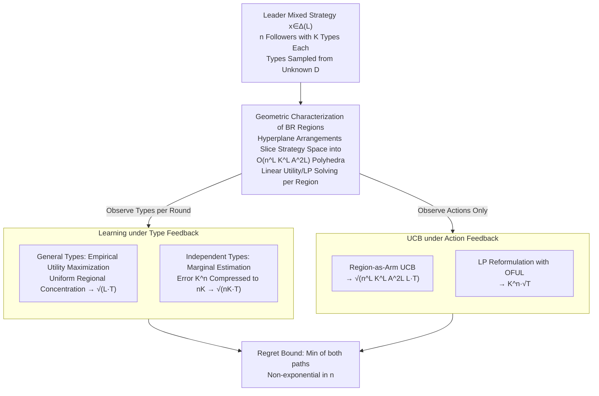

# Learning to Play Multi-Follower Bayesian Stackelberg Games

**Conference**: ICLR 2026  
**arXiv**: [2510.01387](https://arxiv.org/abs/2510.01387)  
**Code**: None  
**Area**: Game Theory/Online Learning  
**Keywords**: Stackelberg Games, Bayesian Games, Online Learning, Best Response Regions, Regret Bounds

## TL;DR

This work provides the first systematic study of the online learning problem in Multi-Follower Bayesian Stackelberg Games (BSG). By employing a geometric partition of the leader's strategy space into "Best Response Regions," the authors achieve a regret bound of $\tilde{O}(\sqrt{\min\{L, nK\} \cdot T})$ under type feedback. Importantly, this bound does not grow polynomially with the number of followers $n$. An almost matching lower bound of $\Omega(\sqrt{\min\{L, nK\}T})$ is also established.

## Background & Motivation

**Background**: Stackelberg games serve as a foundational framework for modeling asymmetric interactions where a leader commits to a strategy first, and followers respond optimally. Applications span security games (e.g., airport patrol resource allocation), platform economics (feature releases affecting consumers), information design (Bayesian persuasion), and contract design. In the Bayesian version, followers possess private types; the leader must know the type distribution to compute an optimal strategy (Stackelberg Equilibrium). Existing online learning works (Balcan et al. 2015, 2025; Bollini et al. 2026) only handle the **single-follower** case.

**Limitations of Prior Work**: In the presence of $n$ followers, each with $K$ types, the joint type space size is $K^n$, which is exponentially large. Directly estimating the joint distribution yields an error of $\Omega(\sqrt{K^n/t})$, leading to a regret bound of $\Omega(\sqrt{K^n T})$, which is unacceptable for large $n$. Furthermore, the followers' best response is a piecewise-constant function of the leader's mixed strategy, making the leader's utility **discontinuous and non-convex** over the strategy space. Even in the offline, single-follower version, computing the optimal strategy is NP-Hard as the number of leader actions $L$ grows (Conitzer & Sandholm, 2006).

**Key Challenge**: Multi-follower settings introduce exponential explosion in the joint type space. How can a learning algorithm be designed so that the regret bound avoids exponential dependence on $n$? Intuitively, a $K^n$ joint distribution is hard to learn, but the leader primarily cares about the **utility function** rather than the distribution itself—is the complexity of the utility function significantly lower than that of the distribution?

**Goal**: (1) Is online learning in multi-follower BSGs feasible? (2) What are the optimal regret bounds under type feedback and action feedback settings? (3) Can the regret bound avoid exponential dependence on $n$?

**Key Insight**: The authors observe that while the joint type space $K^n$ is exponentially large, the leader's strategy space $\Delta(\mathcal{L})$ remains $(L-1)$-dimensional. Utilizing classical results from computational geometry regarding hyperplane arrangements, they prove the strategy space is partitioned into **at most $O(n^L K^L A^{2L})$ non-empty best-response regions**. This quantity grows only polynomially with $n$ (when $L$ is fixed). Crucially, the leader's utility is **linear** within each region, allowing for efficient solving via linear programming.

**Core Idea**: Partition the leader's strategy space into polyhedral regions based on follower best responses. Leveraging the property that the number of regions is polynomially controlled with respect to $n$, the authors design learning algorithms based on UCB and concentration inequalities to achieve regret bounds that do not grow exponentially with $n$.

## Method

### Overall Architecture

The problem setting is as follows: a leader has $L$ actions; $n$ followers each have $K$ types and $A$ actions. In each round, the leader selects a mixed strategy $x \in \Delta(\mathcal{L})$, follower types are sampled from an unknown distribution $\mathcal{D}$, and each follower chooses a best-response action after observing $x$. The leader aims to minimize cumulative regret over $T$ rounds. Key assumptions include: (1) Myopic best response by followers; (2) No externalities—each follower's utility depends only on their own action, type, and the leader's action, independent of other followers' actions.

The mechanism relies on a single pivot—**Geometric Partition of Best Response Regions**: The strategy space $\Delta(\mathcal{L})$ is first sliced into finitely many polyhedral "regions of linear utility," transforming non-convex discontinuous optimization into a set of linear programs across these regions. Two paths are then taken based on feedback intensity: under **Type Feedback** (observing follower types each round), the regional structure is used to prove uniform convergence of empirical utility to true utility; under **Action Feedback** (observing actions only), each region is treated as an arm in a multi-armed bandit, using UCB for exploration. Both paths converge to regret bounds that avoid exponential growth relative to $n$.

### Key Designs

**1. Geometric Characterization: Transforming Discontinuity into Hyperplane Arrangement Counts**

The leader's utility is non-convex and discontinuous because follower best responses are piecewise-constant functions of the leader's mixed strategy—a slight shift in strategy may trigger a follower to jump to a different action. The solution is to explicitly characterize these segments. Defining a response pattern $W = (w_1, \ldots, w_n)$, where $w_i: \Theta \to \mathcal{A}$ specifies the action for follower $i$ across types, the **Best Response Region** $R(W) = \{x \in \Delta(\mathcal{L}) \mid \mathbf{br}(\theta, x) = W(\theta), \forall \theta\}$ is the set of leader strategies inducing response $W$.

Each region is the intersection of $O(nKA)$ half-spaces $R(W) = \bigcap_{i, \theta_i, a_i} H(d_{\theta_i, w_i(\theta_i), a_i})$, where $H(d) = \{x: \langle x, d \rangle \geq 0\}$ encodes the linear constraint "follower $i$ of type $\theta_i$ prefers $w_i(\theta_i)$ over $a_i$." The strategy simplex is thus cut by hyperplanes into polyhedra. Using results from computational geometry, the number of non-empty regions $|\mathcal{W}| = O(n^L K^L A^{2L})$—polynomial in $n$ for fixed $L$. These regions can be enumerated in $\mathrm{poly}(n^L, K^L, A^L, L)$ time. Within a region, the leader's utility is linear, global optimization becomes an LP over $|\mathcal{W}|$ regions. This also proves BSG is solvable in polynomial time for constant $L$, filling a known complexity gap.

**2. Learning under Type Feedback: Bypassing $K^n$ via Uniform Convergence**

When types are observable, Algorithm 1 (General types) chooses the strategy maximizing empirical utility $x^t = \arg\max_x \sum_{s<t} u(x, \mathbf{br}(\theta^s, x))$. Instead of estimating the $K^n$-parameter joint distribution $\mathcal{D}$, the regional structure proves **Uniform Concentration**: utility in each region is an $L$-dimensional linear function with pseudo-dimension $\leq L$. Applying a union bound over $|\mathcal{W}|$ regions yields $|U_\mathcal{D}(x) - \hat{U}^t(x)| \leq O(\sqrt{L \log(nKAT)/t})$, achieving $\tilde{O}(\sqrt{L \cdot T})$ regret—avoiding the exponential complexity of the distribution.

For independent types across followers, Algorithm 2 estimates marginal distributions $\hat{\mathcal{D}}_i$ and takes the product $\hat{\mathcal{D}} = \prod_i \hat{\mathcal{D}}_i$. Independence allows decomposition of TV distance into the sum of Hellinger distances of marginals, reducing estimation error from $O(\sqrt{K^n/t})$ to $O(\sqrt{nK/t})$, corresponding to $O(\sqrt{nK \cdot T})$ regret. Both analyses are complementary: Algo 1 excels for large $n$, small $L$; Algo 2 excels for small $K$.

**3. UCB under Action Feedback: Exploring Continuous Space via Region-based Bandits**

In real-world scenarios, the leader might only observe actions rather than types. The core insight is: as long as the leader plays within the same region $R(W)$, observed actions follow the same conditional distribution $\mathcal{P}(\cdot \mid R(W))$, allowing utility estimation. Each region is treated as an "arm" with a UCB score $\mathrm{UCB}^t(W) = \hat{u}^*_{R(W)} + \sqrt{4(L+1)\log(3T)/N^t(W)}$. This yields $O(\sqrt{n^L K^L A^{2L} L \cdot T \log T})$ regret—exponential in $L$, which is computationally inevitable since BSG is NP-Hard for varying $L$. Complementarily, the authors reformulate BSG as a linear program for OFUL, yielding $O(K^n \sqrt{T} \log T)$ regret, which is preferable for small $n$.

### Loss & Training

This is a theoretical work in online learning; there is no training loss function. The leader's goal is to maximize cumulative utility (equivalent to minimizing regret $\mathrm{Reg}(T) = \sum_{t=1}^T [U_\mathcal{D}(x^*) - U_\mathcal{D}(x^t)]$). Type-feedback algorithms are based on Empirical Utility Maximization (ERM), while action-feedback is based on optimism (UCB). Key theoretical tools include uniform concentration inequalities for pseudo-dimensions and the relationship between TV and Hellinger distances.

## Key Experimental Results

### Main Results

| Feedback Setting | Type Distribution | Regret Upper Bound | Regret Lower Bound | Gap Analysis |
|---------|------------|---------|---------|---------|
| Type Feedback | Independent | $\tilde{O}(\sqrt{\min\{L, nK\} \cdot T})$ | $\Omega(\sqrt{\min\{L, nK\} \cdot T})$ | Nearly optimal (log gap) |
| Type Feedback | General | $\tilde{O}(\sqrt{\min\{L, K^n\} \cdot T})$ | $\Omega(\sqrt{\min\{L, nK\} \cdot T})$ | Gap between $K^n$ and $nK$ |
| Action Feedback | Any | $\tilde{O}(\min\{\sqrt{n^L K^L A^{2L} L}, K^n\} \cdot \sqrt{T})$ | $\Omega(\sqrt{\min\{L, nK\} \cdot T})$ | Significant gap, open problem |

### Complexity Comparison

| Algorithm | Feedback Type | Per-round Time Complexity | Applicability |
|------|---------|-------------|---------|
| Algorithm 1 (General Type ERM) | Type Feedback | $\mathrm{poly}((nKA)^L \cdot L \cdot T)$ | Small $L$, large $n$ |
| Algorithm 2 (Independent Type ERM) | Type Feedback | $\mathrm{poly}((nKA)^L \cdot L \cdot T \cdot K^n)$ | Independent types, small $n, K$ |
| Algorithm 3 (Region UCB) | Action Feedback | $\mathrm{poly}((nKA)^L \cdot L \cdot T)$ | Small $L$, large $n$ |
| Linear Bandit (OFUL) | Action Feedback | $\mathrm{poly}(K^n \cdot T)$ | Small $n, K$ |

### Key Findings

- **Regret independent of exponential $n$**: In independent type feedback settings, bounds are $\Theta(\sqrt{\min\{L, nK\} \cdot T})$, showing only linear dependence on $n$.
- **Role of $L$**: While $L$ increases computational difficulty (NP-Hard), a small $L$ is statistically advantageous as the number of regions grows exponentially with $L$.
- **Feedback Information Gap**: Type feedback allows nearly optimal $\tilde{O}(\sqrt{L \cdot T})$ regret. Action feedback optimal rates remain an open statistical-computational trade-off.
- **Offline Solvability**: The work proves BSG is solvable in polynomial time when $L$ is a constant.

## Highlights & Insights

- **Bridging Geometry and Game Theory**: Slicing the strategy space into regions where utility is linear transforms non-convex optimization into standard LP. This "geometrization → discretization → regional optimization" paradigm is a major contribution.
- **Learning Distribution vs. Utility**: While $\mathcal{D}$ requires $K^n$ parameters, utility within a region is an $L$-dimensional linear function. Learning the utility function is significantly easier than learning the distribution.
- **Lower Bound Reduction**: The reduction from distribution learning to single-follower BSG and then to multi-follower BSG provides a robust template for proving lower bounds in multi-agent systems.

## Limitations & Future Work

- **No Externalities Assumption**: The assumption that a follower's utility is independent of others' actions is restrictive (e.g., in auctions or congestion games).
- **Myopic Followers**: Followers are assumed to best-respond independently each round rather than acting strategically for long-term gains.
- **Action Feedback Gap**: The optimal regret rate for action feedback remains open; whether a $\mathrm{poly}(n, K, L)\sqrt{T}$ algorithm exists is unknown.
- **Adversarial Types**: The study focuses on stochastic types; extensions to adversarial settings (e.g., via EXP3/FTRL) were conjectured but not formally verified.

## Related Work & Insights

- **vs. Balcan et al. (2015, 2025)**: They studied single-follower BSG. This work extends it to multi-follower cases where the joint type space grows to $K^n$.
- **vs. Bernasconi et al. (2023)**: They used adversarial linear bandits for Bayesian persuasion with $\tilde{O}(K^{3n/2}\sqrt{T})$ regret. This work improves this to $O(K^n \sqrt{T})$ via OFUL and further via regional UCB for small $L$.
- **vs. Piecewise Linear Bandits (Bacchiocchi et al. 2025)**: They study unknown intervals in 1D; this work handles multi-dimensional known polyhedral regions.

## Rating

- Novelty: ⭐⭐⭐⭐⭐ 
- Experimental Thoroughness: ⭐⭐⭐
- Writing Quality: ⭐⭐⭐⭐ 
- Value: ⭐⭐⭐⭐ 

<!-- RELATED:START -->

## Related Papers

- [\[ICLR 2026\] Nearly-Optimal Bandit Learning in Stackelberg Games with Side Information](nearly-optimal_bandit_learning_in_stackelberg_games_with_side_information.md)
- [\[ICML 2026\] Learning in Structured Stackelberg Games](../../ICML2026/reinforcement_learning/learning_in_structured_stackelberg_games.md)
- [\[ICLR 2026\] SPIRAL: Self-Play on Zero-Sum Games Incentivizes Reasoning via Multi-Agent Multi-Turn Reinforcement Learning](spiral_self-play_on_zero-sum_games_incentivizes_reasoning_via_multi-agent_multi-.md)
- [\[ICLR 2026\] Bayesian Robust Cooperative Multi-Agent Reinforcement Learning Against Unknown Adversaries](bayesian_robust_cooperative_multi-agent_reinforcement_learning_against_unknown_a.md)
- [\[ICLR 2026\] Stackelberg Coupling of Online Representation Learning and Reinforcement Learning](stackelberg_coupling_of_online_representation_learning_and_reinforcement_learnin.md)

<!-- RELATED:END -->
