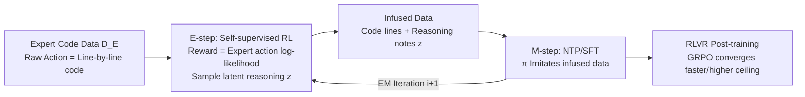

# Learning to Reason as Action Abstractions with Scalable Mid-Training RL

**Conference**: ICLR 2026  
**OpenReview**: [https://openreview.net/forum?id=uWd9A1zp0Y](https://openreview.net/forum?id=uWd9A1zp0Y)  
**Code**: TBD  
**Area**: Reinforcement Learning / LLM Mid-Training  
**Keywords**: mid-training, action abstraction, temporal abstraction (options), self-supervised RL, EM, RLVR, code generation  

## TL;DR
This paper provides the first theoretical characterization of "how mid-training shapes post-training RL," pointing out that effective mid-training should occur within **temporal action abstractions** rather than the raw token space. Based on this, it proposes RA3—a scalable mid-training algorithm that discovers latent reasoning structures via self-supervised RL and feeds them back through SFT.

## Background & Motivation
**Background**: Current LLM training has stabilized into a "Pre-training → Mid-training → RLVR Post-training" pipeline, where mid-training (continued pre-training on expert data sampled from optimal policies) is widely used to strengthen policy priors and is the key step for succeeding in subsequent RL.

**Limitations of Prior Work**: Although mid-training has become a standard practice, its specific role in post-training RL remains unclear. Researchers often rely on heuristic indicators like "initial policy accuracy" or "entropy" to judge the quality of mid-training. These signals are indirect and do not guarantee downstream improvements, leading to mid-training algorithm designs that are largely empirical.

**Key Challenge**: Mid-training typically utilizes standard next-token prediction (NTP), which performs imitation learning in the **raw token action space**—characterized by a massive action set and extremely long planning horizons. Conversely, post-training RL requires a well-initialized starting point where the action space is pruned and the planning horizon is shortened. There is a structural mismatch between the prior provided by NTP and the prior actually required by RL.

**Goal**: To decompose "mid-training effectiveness" into provable quantities—where post-training RL regret is decomposed into "action set pruning error" + "RL error within the pruned space"—thereby answering at what granularity and with what objective mid-training should be conducted.

**Core Idea**: **[Mid-training in the action abstraction space]**. The authors theoretically prove that temporal abstraction can simultaneously reduce the action set size $|Z|$ and the decision horizon. Consequently, they rewrite NTP as an EM process of "discovering hidden reasoning + feedback imitation" using a **temporal variational lower bound (temporal ELBO)**, allowing the model to develop transferable high-level "skills" via RL.

## Method

### Overall Architecture
The method consists of "a theory + an algorithm." On the theoretical side (Section 3), post-training regret is decomposed into pruning error and RL error, proving that (i) the number of expert samples required for pruning is proportional to the minimum cardinality of the approximately optimal action subset $|Z_\epsilon|$, and (ii) longer action durations lead to faster RL convergence—both pointing toward "training in a temporal abstraction space." On the algorithmic side (RA3), a temporal ELBO with latent variables $z_{0:T}$ is derived for the NTP objective and optimized via EM: the E-step uses self-supervised RL to discover hidden reasoning that "explains" expert actions, and the M-step performs SFT on data infused with this reasoning. A Bernoulli prior is used to enforce temporal consistency of latent variables, achieving both action abstraction and rollout cost control.

### Key Designs

**1. Regret Decomposition → Turning "Mid-training Quality" into a Provable Quantity**: The paper first formulates the post-training RL goal as minimizing cross-task regret $\min_\pi \mathbb{E}_{M}[V^*_M(s_0)-V^\pi_M(s_0)]$. It then proves that for any action subspace $Z'$, this decomposes into "action set pruning error $\mathbb{E}[\Delta(M,Z')]$" plus "RL error within $Z'$." This step translates the vague concept of "prior quality" into two clear optimization objectives: accurate pruning + efficient RL execution. It directly explains why initial accuracy or entropy alone is insufficient. The pruning efficiency theorem further states: to achieve a given pruning error, the required number of expert rollouts is $|D_E|=\Theta(|Z_\epsilon|\log(|Z|/\delta)/\sigma)$. Thus, a more compact action space (smaller $|Z_\epsilon|$ and $|Z|$) leads to cleaner pruning with the same amount of data, providing the theoretical motivation for introducing action abstraction.

**2. Temporal Abstraction Simultaneously Compresses Action Sets and Decision Horizons**: Action abstraction $z\in Z$ is defined as a Markov option—a high-level intent that executes a raw action sequence of length $\tau\sim p(\cdot|s,z)$, where raw tokens are just a special case with $\tau=1$. The convergence theorem shows that the iterations $N$ required to reach $\varepsilon$-optimality satisfy $N\ge \frac{1}{1-\bar\gamma}\log\frac{R_{\max}}{\varepsilon(1-\bar\gamma)}$, where $\bar\gamma=\sup E[\gamma^\tau|s,z]\le\gamma$. As the action duration increases, $\bar\gamma$ decreases, and each Bellman backup covers $\tau$ steps at once, which is equivalent to shortening the effective planning horizon and accelerating convergence. Thus, "action abstraction" benefits both pruning efficiency and RL convergence, forming the core argument of the paper.

**3. Temporal Variational Lower Bound + EM: Rewriting NTP as "Reason then Imitate"**: The authors derive an ELBO for the NTP objective: $J_{\text{NTP}}(\pi)\ge \mathbb{E}_{z_t\sim q}\big[\sum_t \log\pi(a_t|s_t,z_t)-D_{\mathrm{KL}}(q(z_t|\cdot)\,\|\,p(z_t|\cdot))\big]$, introducing a sequence of hidden intents $z_{0:T}$ to explain expert actions. It is optimized via EM: **E-step** fixes $\pi$ and performs $T$-horizon RL with the "log-likelihood of expert actions" as the step-wise reward, allowing the sampled latent sequence to "explain" expert decisions (Eq. 4.1); **M-step** fixes $q$ and performs standard NTP imitation on trajectories infused with latent variables (Eq. 4.2). Essentially, the model uses RL to unearth "thoughts" not explicitly written in the data and uses them as additional conditions to fit the next step.

**4. Bernoulli Prior for Temporal Consistency and Cost Control**: To ensure $z_t$ represents a time duration, one needs $z_t=z_{t+1}=\dots=z_{t+\tau}$. This is implemented via a prior $p(z_t|s_t,z_{t-1})=\alpha\,\delta(z_{t-1})+(1-\alpha)\,U(z_t)$. The Dirac term concentrates mass on "continuing the previous latent variable" to maintain temporal consistency, while the uniform term encourages diverse reasoning. In implementation, two types of latent variables are used: $z=$ `<act>` represents "follow the previous intent and output the next line," while starting with `<think>` triggers a new reasoning rollout. Proposition 5.1 decomposes the KL into a Bernoulli-KL plus an entropy term. By adding a fixed penalty $c$ whenever $z_t\ne$ `<act>`, a threshold for "whether to think anew" is established: new reasoning is only worth it if it increases the log-likelihood reward by more than $c$. This ensures full rollouts only occur during `<think>` phases, keeping RL inference costs manageable at the mid-training scale (1 billion tokens); as $\alpha\to 1$, the algorithm reduces to pure NTP.

## Key Experimental Results

**Setup**: Python line-by-line code as raw actions, `<act>=\n`, `<think>=\n#` (optionally generating a line of comment as a high-level abstraction). Mid-training was performed on Qwen-2.5-1.5B, Llama-3.2-1B, and Llama-3.1-8B using 3.5M code snippets / 1B tokens. Post-training used GRPO (DeepCoder codebase + AReaL-boba-2-RL-Code 7.7K data).

### Main Results (Mid-training pass@k, selected average scores)

| Model | Method | HumanEval p@1 | MBPP p@1 | HE+ p@1 | MBPP+ p@1 | Avg p@1 | Avg p@5 |
|------|------|------|------|------|------|------|------|
| Llama-3.2-1B | Base | 18.9 | 25.8 | 17.1 | 31.5 | 23.3 | 35.3 |
| | NTP | 21.3 | 27.8 | 17.7 | 34.4 | 25.3 | 40.3 |
| | **RA3** | **25.0** | **32.8** | **22.0** | **39.4** | **29.8** | **43.1** |
| Qwen-2.5-1.5B | Base | 37.2 | 38.6 | 32.3 | 43.4 | 37.9 | 54.8 |
| | NTP | 41.5 | 43.4 | 35.4 | 46.6 | 41.7 | 58.7 |
| | **RA3** | **48.2** | **45.8** | **42.7** | **49.7** | **46.6** | **62.2** |
| Llama-3.1-8B | Base | 36.6 | 45.2 | 30.5 | 51.6 | 41.0 | 59.3 |
| | NTP | 48.2 | 48.6 | 42.7 | 51.1 | 47.7 | 63.1 |
| | **RA3** | **50.0** | 48.0 | **44.5** | **53.2** | **48.9** | **64.6** |

RA3 is approximately 4 points higher than NTP and 8 points higher than the base model on average. The CE Loss in the M-step is significantly lower than NTP across all three models, indicating that the "next token is more predictable" after reasoning is infused. In post-training RLVR, RA3 starts from a better position and achieves **faster convergence and higher asymptotic performance** on HumanEval+/MBPP+/LiveCodeBench/Codeforces.

### Ablation Study (Effect of Penalty $c$, Qwen)

| Penalty $c$ | Avg length of $z$ | Full rollout % | HE+MBPP Mean | Interpretation |
|------|------|------|------|------|
| 0.01 | Long | High | Lower | Thinks at every step; degrades to NTP without advantage and with high cost |
| 0.05 (Default) | <6 | <40% | Highest (~40.6) | Best trade-off between performance and compute |
| 0.2 | Short | Low | Slightly lower | Mostly outputs `<act>`; cost ≈ NTP |

### Key Findings
- The E-step RL reward converges within a few steps, so compute can be primarily allocated to M-step infusion and fine-tuning.
- Fine-tuning with infused data in the M-step significantly reduces CE Loss (Fig 3), confirming that hidden reasoning exists behind expert trajectories and unearthing it via RL makes next-step prediction easier.
- Infused examples (Fig 2) show that the model abstracts reusable "skill" comments like dummy head creation or BFS traversal, proving that latent variables correspond to high-level intent rather than noise.
- Comparison with synthetic reasoning NTP baseline (Fig 7): Distilling comments from an external LLM for NTP is less effective than RA3. The authors attribute this to RA3's latent variables being self-learned and proven to be a log-likelihood lower bound, making them easier for subsequent RL to optimize (better learnability).
- Relation to BRiTE: RA3 reduces to BRiTE when the decision horizon is 1. In multi-step problems, using the log-prob of an entire code block as a single-step reward leads to high variance and unstable training; RA3's temporal decomposition addresses this.

## Highlights & Insights
- **Turning "Mid-training Heuristics" into Provable Optimization Objectives**: Through the regret decomposition, pruning efficiency, and convergence rate theorems, the paper provides the first theoretical answer to "why mid-training is useful and at what granularity it should be done," moving beyond simple metrics.
- **Elegant Migration of Option/HRL Ideas to LLMs**: Captures the "option compression horizon" of classical hierarchical RL into the token world using temporally consistent latent variables. The implementation uses a simple `<act>`/`<think>` dual-token strategy for scalable deployment.
- **Cost-Adjustable Knob**: A single penalty $c$ controls both reasoning frequency and compute overhead. The smooth degradation to NTP as $\alpha\to 1$ makes it engineering-friendly.

## Limitations & Future Work
- **Verification Limited to Python Code Generation**: The setting where raw actions equal line-by-line code makes the syntactic alignment of `<act>/<think>` natural. How to define "line-level actions" and abstraction granularity in domains like mathematics (single-step answers), agentic tasks, or natural language remains to be verified; the authors themselves excluded math.
- **Model Scale Capped at 8B**: While results hold for 1B–8B, it is unknown if the advantage of "self-learned reasoning vs. direct distillation from stronger models" reverses at larger scales.
- **Strong Theoretical Assumptions**: Theorems for pruning and convergence rely on idealized settings like approximately optimal action subsets, leaving a gap between theory and real LLM training dynamics.
- **Engineering Complexity of EM + Asynchronous Rollout**: Compared to simple NTP, RA3 requires multiple rounds of EM, self-supervised RL, and asynchronous sampling (e.g., SGLang), raising the barrier to implementation.

## Related Work & Insights
- **LLM Mid-Training**: Unlike augmenting data by distilling reasoning from frontier models (which suffers from distribution shift and expensive large-scale re-annotation), RA3 allows the model to self-learn reasoning. This is better suited for corpora like code, where data is primarily human-written without existing reasoning annotations.
- **Self-supervised RL**: Following the line of work using expert action log-probs as rewards (e.g., BRiTE), RA3 generalizes the single-step ELBO to temporal sequences.
- **Markov Options / Hierarchical RL**: The definition of action abstraction and decision space analysis draws from Sutton’s Options and the transfer analysis of Brunskill & Li, but applies it to the design of mid-training algorithms and their impact on post-training RL.
- **Insight**: Treating "at what action granularity one should learn" as a provable design variable rather than a default token-level choice offers a valuable perspective for pre-training/mid-training in long-horizon tasks like agentic workflows and multi-step tool use.

## Rating
- Novelty: ⭐⭐⭐⭐⭐ The first theoretical framework to characterize the mid-training → post-training RL transition, directly deriving an algorithm from theory. Highly self-consistent.
- Experimental Thoroughness: ⭐⭐⭐⭐ Solid across three models, four benchmarks, RLVR, ablations, and synthetic comparisons, though limited to code generation up to 8B.
- Writing Quality: ⭐⭐⭐⭐ Clear connection between theory and algorithm; the motivation for theorems is well-explained. High formula density may be challenging for readers without an RL background.
- Value: ⭐⭐⭐⭐⭐ Provides principled guidance and a scalable implementation for "how to conduct mid-training," offering methodological value for LLM reasoning training paradigms.

<!-- RELATED:START -->

## Related Papers

- [\[ICLR 2026\] Reinforcement Mid-Training](reinforcement_mid-training.md)
- [\[ICLR 2026\] Scalable Offline Model-Based RL with Action Chunks](scalable_offline_model-based_rl_with_action_chunks.md)
- [\[ICLR 2026\] DEAS: DEtached value learning with Action Sequence for Scalable Offline RL](deas_detached_value_learning_with_action_sequence_for_scalable_offline_rl.md)
- [\[ICLR 2026\] ExGRPO: Learning to Reason from Experience](exgrpo_learning_to_reason_from_experience.md)
- [\[ICLR 2026\] Learning to Reason Efficiently with Discounted Reinforcement Learning](learning_to_reason_efficiently_with_discounted_reinforcement_learning.md)

<!-- RELATED:END -->
