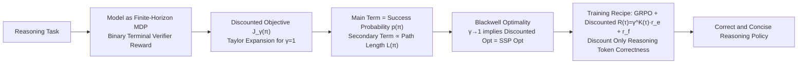

# Learning to Reason Efficiently with Discounted Reinforcement Learning

**Conference**: ICLR 2026  
**OpenReview**: [https://openreview.net/forum?id=R4GPttoDyn](https://openreview.net/forum?id=R4GPttoDyn)  
**Code**: TBD (Implemented based on HuggingFace TRL + vLLM)  
**Area**: Reinforcement Learning / Efficient Reasoning (LLM Reasoning)  
**Keywords**: Discounted Reinforcement Learning, Blackwell Optimality, Stochastic Shortest Path, GRPO, Efficient Reasoning, RLVR  

## TL;DR
Verifiable reward reasoning in LLMs is modeled as a finite-horizon stochastic shortest path (SSP) MDP. By applying a discount factor $\gamma < 1$ only to reasoning tokens, the authors use Blackwell optimality to prove that if $\gamma$ is sufficiently close to 1, the discounted optimal policy first maximizes accuracy and then selects the shortest trajectory among all correct ones—achieving "lossless reasoning compression."

## Background & Motivation
**Background**: Large Reasoning Models (LRMs) solve math/coding problems by generating a large number of intermediate reasoning tokens before the final answer. Post-training via RL (e.g., GRPO) can improve accuracy but often results in increasingly long responses.

**Limitations of Prior Work**: Longer chains of thought are not free—attention has quadratic complexity, and the KV cache expands with length, hurting inference latency and service throughput. Existing "efficient reasoning" approaches mainly include: (i) adding per-token length penalties in policy optimization; (ii) performing SFT on shortened or compressed trajectories; (iii) directly requesting conciseness via prompts. These methods are largely engineering heuristics and lack a principled explanation for why length can be reduced without sacrificing accuracy.

**Key Challenge**: There is ongoing debate in the academic community regarding the inherent trade-off between "length vs. accuracy." Many works assume that shortening must sacrifice accuracy. This paper seeks to challenge this assumption.

**Goal**: Train an LRM that is both "correct and concise"—minimizing response length without losing Pass@1 accuracy.

**Core Idea (Discounting as Shortest Path)**: Reasoning is modeled as a finite-horizon MDP with binary terminal rewards. Generating additional reasoning tokens is equivalent to taking extra steps, and valid termination is equivalent to reaching a goal. **By multiplying the correctness reward by a discount $\gamma^{K(\tau)}$ (where $K$ is the number of reasoning tokens) and letting $\gamma$ approach 1, the discounted objective reduces to the SSP criterion: first maximize the probability of success, then minimize the path length among successful trajectories**. This "plain old discounting" is equivalent to adding a small per-step negative reward, backed by strict Blackwell optimality.

## Method

### Overall Architecture
The work consists of a theoretical framework and a training recipe. On the theoretical side: Reasoning is formulated as an MDP $M=(S,A,P,r,H,\gamma,\mu)$, where states are token sequences, actions are vocabulary tokens, and `eos` triggers a verifier to provide a binary reward. A Taylor expansion for $\gamma \to 1$ reveals a hierarchical structure of "accuracy term + length term" in the discounted objective, with Blackwell optimality proving that discounted optimality equals SSP optimality. On the recipe side: "Discounting" is integrated into GRPO by discounting only the correctness reward of reasoning tokens, using KL regularization and token budget alignment without modifying the policy optimization algorithm itself.

### Key Designs

**1. Modeling RLVR reasoning as an SSP MDP and using Taylor expansion to decouple accuracy and length.** Under the RLVR assumption (binary rewards $r(s,a_{term})=\mathbb{I}\{s\in G\}$ only at termination; zero rewards otherwise), the success probability $p(\pi)=P_{\pi,\mu}(\text{success})$ and conditional success path length $L(\pi)=E_{\pi,\mu}[\tau\mid\text{success}]$ are defined. The core is the uniform Taylor expansion (Lemma 3.5), where $\varepsilon=1-\gamma$:

$$J_\gamma(\pi)=E_{\pi,\mu}[\gamma^{\tau-1}\mathbb{1}\{\text{success}\}]=p(\pi)\big(1-\varepsilon(L(\pi)-1)\big)+R_\pi(\varepsilon),\quad |R_\pi(\varepsilon)|\le C_H\varepsilon^2$$

where $C_H=\tfrac12(H-1)(H-2)$. This expansion explains that as $\gamma \uparrow 1$, the primary term is success probability $p(\pi)$ (Pass@1 accuracy), while the secondary term $-\varepsilon\,p(\pi)(L(\pi)-1)$ uses length to break ties among equally successful policies. Thus, maximizing discounted return for $\gamma \approx 1$ precisely achieves the SSP goal of "maximizing success first, then minimizing steps."

**2. Proving "Discounted Optimality = SSP Optimality" via Blackwell optimality.** The paper formalizes "correct and concise" using Blackwell optimality (optimal for all $\gamma$ sufficiently close to 1). Theorem 3.6 presents the main conclusion: In a binary termination verifier MDP, every Blackwell optimal policy is an SSP policy, i.e.,

$$\Pi^\star_{bw}\subseteq\arg\min_{\pi\in\Pi_{\max p}}L(\pi),\qquad \Pi_{\max p}=\arg\max_{\pi\in\Pi}p(\pi).$$

Theorem 3.8 further proves that for a **finite restricted policy class** $\Pi$, there exists $\gamma' < 1$ such that the discounted optimal set on $(\gamma', 1)$ is constant and equal to the Blackwell optimal set. This is crucial because softmax/greedy deployment yields a finite set of deterministic policies. Proposition 3.1 illustrates with a counterexample that if $\gamma$ is not close enough to 1, the model might prefer a "shorter but less accurate" policy.

**3. Instance-dependent Blackwell discount factor $\gamma_{bw}$.** The authors introduce $\gamma_{bw}:=\inf\{\gamma:\Pi^\star_{\gamma'}=\Pi^\star_{bw}\ \forall\gamma'\in(\gamma,1)\}$ and prove it exists and is $< 1$ (Lemma 3.10). For any finite set of instances $\{M_i\}$, a uniform critical discount $\gamma_{crit}=\max_i\gamma_{bw}(M_i,\Pi)<1$ exists. Lemma 3.11 ensures that Blackwell optimal policies are also optimal for the undiscounted problem, closing the logic of "discounted training $\leftrightarrow$ lossless accuracy."

**4. Practical training recipe: Discounted GRPO.** Since correctness and formatting signals are calculated at the end of the trajectory, sequence-level rewards are used. Let $m_t \in \{0,1\}$ flag whether token $t$ is in the reasoning span, $K(\tau)=\sum_t m_t$ be the reasoning token count, $r_e(\tau)$ be the correctness reward, and $r_f(\tau)$ be the formatting reward. The discounted return is:

$$R(\tau)=\gamma^{K(\tau)}r_e(\tau)+r_f(\tau),$$

with the optimization target $E_{S_1\sim\mu,\tau\sim\pi}[R(\tau)]-\beta\,\mathrm{KL}(\pi\,\|\,\pi')$. Four engineering principles support this: (i) **Discount only external correctness rewards**, not intrinsic format rewards, to prevent the model from dropping tags or numbers to stay short; (ii) **Anchor KL regularization to a sliding reference policy** $\pi_{ref}\leftarrow\text{stop\_grad}(\pi)$ every $u$ steps to prevent premature collapse; (iii) **Discount only reasoning tokens** within `<reasoning>` tags; (iv) **Align token budgets** by increasing rollout counts for the discounted method to ensure fair comparison despite shorter trajectories.

## Key Experimental Results

### Main Results (GSM8K / MATH, Qwen2.5-7B & Llama3-8B)

| Dataset | Model | Undiscounted Pass@1 | Undiscounted Length | Discounted Pass@1 | Discounted Length |
|---|---|---|---|---|---|
| GSM8K | Qwen2.5-7B-Instruct | 91.06 | 217.60 | 91.07 | **170.08** (−22%) |
| GSM8K | Llama3-8B-Instruct | 80.87 | 125.43 | 81.07 | **108.67** (−13%) |
| MATH | Qwen2.5-7B-Instruct | 64.80 | 491.32 | 64.55 | **384.96** (−22%) |
| MATH | Llama3-8B-Instruct | 24.48 | 328.43 | 24.75 | **257.73** (−22%) |

> Accuracy changes are non-significant, while lengths are significantly reduced, validating Theorem 3.6.

### Generalization (DeepScaleR Training, Cross-Dataset Evaluation)

| Model | Dataset | Undiscounted Pass@1 | Undiscounted Length | Discounted Pass@1 | Discounted Length |
|---|---|---|---|---|---|
| Phi-4 | AMC 2023 | 51.00 | 1134.30 | **61.00** | **716.29** |
| Phi-4 | AIME 2025 | 14.00 | 1263.87 | **19.33** | **800.09** |
| Phi-4 | MINERVA | 28.46 | 553.74 | **29.85** | **318.10** |

> Even on out-of-distribution math competitions, length reduction persists, and accuracy occasionally increases (e.g., Phi-4 on AMC/AIME).

### Ablation Study
- **$\gamma$ Sweep**: As $1-\gamma$ increases, length decreases monotonically, but accuracy remains stable before eventually dropping—consistent with the theory that $\gamma$ must be close to 1 to preserve accuracy.
- **Discount Range**: Discounting the entire response (including format tokens) drops accuracy by 0.5%–1.0%, supporting the "discount reasoning tokens only" design.
- **$\gamma$ Selection**: A binary search is used to find the $\gamma$ furthest from 1 that does not degrade training accuracy.

### Key Findings
1. Discounting has almost no effect on Pass@1 but can reduce length by 13%–37% across models and benchmarks.
2. Length and accuracy are not inherently in conflict; there is an instance-dependent threshold above which shortening is lossless.
3. Larger models on OOD datasets can be "correct and concise," suggesting compressed reasoning might facilitate generalization.

## Highlights & Insights
- **Classic RL tools for modern phenomena**: The authors utilize Blackwell optimality and Taylor expansion to justify "discounting" as a principled mechanism for lossless reasoning compression.
- **Theoretical and empirical alignment**: The prediction of "accuracy first, length second" (Theorem 3.6) is reproduced across 4 models and 6 benchmarks.
- **Non-intrusive recipe**: The method does not require changes to the policy optimization algorithm; it only modifies the correctness reward with $\gamma^{K(\tau)}$ and a token mask.
- **Clarifying the length debate**: This work provides a clear conclusion: there is no trade-off within the threshold, only beyond it.

## Limitations & Future Work
- **Finite Policy Class Assumption**: The Blackwell existence proof relies on $|\Pi| < \infty$, providing limited guarantees for continuous policy classes.
- **Binary Verifier Limitation**: The RLVR assumption requires deterministic binary terminal rewards; effectiveness in code, open-domain, or process-reward scenarios remains unverified.
- **Budget Alignment**: Comparing methods requires manual rollout adjustment to align the total token count.
- **Future Work**: Investigating whether compressed reasoning improves generalization; combining "long reasoning for exploration + short reasoning for compression."

## Related Work & Insights
- **Efficient Reasoning Schools**: This work unifies RL length penalties, SFT on compressed data, and prompt-based control under the framework of "discounting as per-step negative reward," arguing they all target the same SSP ordering in the near-undiscounted regime.
- **Blackwell Optimality Lineage**: This extends the discounting theory of Blackwell (1962) and Puterman (2014) to the domain of restricted policy classes in LLM reasoning.
- **Foundations**: The implementation is built directly upon GRPO and RLVR principles.

## Rating
- **Novelty**: ⭐⭐⭐⭐ — Principles of "discounting = lossless shortening" are well-explained via Blackwell optimality, unifying existing heuristics.
- **Experimental Thoroughness**: ⭐⭐⭐⭐ — Includes 4 models, 6 benchmarks, paired seeds, and extensive ablations, though limited to math/binary verifiers.
- **Writing Quality**: ⭐⭐⭐⭐ — Clear theoretical roadmap with a direct mapping between theorems and the practical recipe.
- **Value**: ⭐⭐⭐⭐ — Provides theoretical backing and a non-intrusive recipe for reducing inference costs in LRM.

<!-- RELATED:START -->

## Related Papers

- [\[ICLR 2026\] ExGRPO: Learning to Reason from Experience](exgrpo_learning_to_reason_from_experience.md)
- [\[ICLR 2026\] Learn to Reason Efficiently with Adaptive Length-based Reward Shaping](learn_to_reason_efficiently_with_adaptive_length-based_reward_shaping.md)
- [\[NeurIPS 2025\] Training Language Models to Reason Efficiently](../../NeurIPS2025/reinforcement_learning/training_language_models_to_reason_efficiently.md)
- [\[ICLR 2026\] R1-Code-Interpreter: LLMs Reason with Code via Supervised and Multi-stage Reinforcement Learning](r1-code-interpreter_llms_reason_with_code_via_supervised_and_multi-stage_reinfor.md)
- [\[ICLR 2026\] Learning to Reason as Action Abstractions with Scalable Mid-Training RL](learning_to_reason_as_action_abstractions_with_scalable_mid-training_rl.md)

<!-- RELATED:END -->
