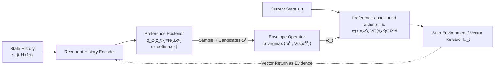

# Learning What Matters Now: Dynamic Preference Inference under Contextual Shifts

**Conference**: ICLR 2026  
**OpenReview**: [https://openreview.net/forum?id=qRbCkTk9ZR](https://openreview.net/forum?id=qRbCkTk9ZR)  
**Code**: [https://github.com/XianweiC/DPI](https://github.com/XianweiC/DPI)  
**Area**: Multi-Objective Reinforcement Learning / Preference Inference / Cognition-Inspired Decision Making  
**Keywords**: Multi-objective RL, dynamic preferences, variational inference, preference-conditioned policy, non-stationary environments, Envelope operator  

## TL;DR
This work models preference weights in multi-objective RL (MORL)—traditionally treated as "known constants"—as **latent variables that drift with context**. It maintains a posterior belief of "what matters now" via online variational inference and jointly trains this with a preference-conditioned actor–critic, enabling agents to rapidly reprioritize goals following event-driven distribution shifts.

## Background & Motivation
**Background**: Multi-objective reinforcement learning (MORL) deals with vector-valued rewards (e.g., efficiency vs. safety, energy vs. ethics). Two main approaches exist: scalarization, which collapses vector rewards into scalars using a fixed preference vector, and Pareto-based methods (e.g., Envelope Q-learning, PD-MORL), which approximate the Pareto front for post-hoc preference selection. A common prerequisite for these methods is that **preference vectors are externally provided**.

**Limitations of Prior Work**: In reality, preferences are almost never directly observed. Humans may prioritize fairness and patience while waiting in a queue, but as hunger increases or time runs out, they shift weight toward "energy/survival" and justify cutting in line. That is, the relative importance of goals **drifts dynamically** with contextual factors like resources, time, and risk; certain goals may become unreachable, temporarily irrelevant, or exceptionally important. Agents with fixed weights either pursue unreachable goals or ignore emerging priorities, which can be catastrophic in safety-critical scenarios like autonomous driving or healthcare.

**Key Challenge**: Cognitive science offers descriptive theories (self-regulation, multi-goal pursuit, constructive preferences) on how humans reprioritize preferences according to context, but these are not algorithms deployable in high-dimensional, partially observable, non-stationary control problems. Conversely, RL algorithms excel at policy optimization but outsource the determination of "what is worth optimizing" to a fixed reward function. A bridge between the two is missing.

**Goal**: To enable agents to **infer and adapt to their current goal trade-offs online** while remaining effective and interpretable, given only vector rewards and partial observations under non-stationary conditions.

**Core Idea**: **[Preference as Latent State]** The preference vector $\omega_t$, which encodes the relative importance of multiple objectives, is modeled as a latent variable that must be inferred online rather than a prior fixed input. The agent maintains a posterior $q_\phi(\omega_t \mid s_{t-H+1:t})$, sampling from it to capture cognitive uncertainty and explore multiple value configurations before acting. A preference-conditioned actor–critic then conditions its policy on the inferred $\omega_t$. This framework is intentionally decomposed into two processes inspired by cognitive science: **value appraisal** (determining "what matters now") and **action selection** (deciding "how to act accordingly").

## Method

### Overall Architecture
DPI (Dynamic Preference Inference) is a two-module, cognition-inspired agent. The **value appraisal module** feeds recent state history $s_{t-H+1:t}$ (including observations and internal states like energy/remaining time) into a recurrent encoder, outputting a distribution of latent preference vectors over the simplex $\Delta^{d-1}$, from which $\hat\omega_t$ is sampled. The **action selection module** is a preference-conditioned actor–critic. During decision-making, an on-policy envelope operator selects the candidate with the highest scalarized value among $K$ preference candidates. The entire pipeline is stabilized by three regularization terms: variational ELBO, directional alignment, and self-consistency. Note: the environment transition $p_{env}(s_{t+1}\mid s_t,a_t)$ is independent of $\omega_t$ and remains a standard MDP; the generative decomposition of preferences is strictly an internal perceptual model for inference.

### Key Designs

**1. Value Appraisal as Variational Inference: Automatically amplifying uncertainty in ambiguous contexts.** Preferences are handled as distributed latent states with uncertainty. Specifically, an unconstrained latent vector $z_t\in\mathbb{R}^d$ is introduced with posterior $q_\phi(z_t\mid e_t)=\mathcal{N}(\mu_t,\mathrm{diag}(\sigma_t^2))$, which is mapped to the simplex via $\omega_t=\mathrm{softmax}(z_t)$. This design allows for two benefits: ambiguous contexts yield wider posteriors (expressing "I am unsure what to prioritize"), and the agent explores multiple value configurations by sampling $z_t$ rather than sticking to a single trade-off. Evidence support for preference configurations is defined via a Boltzmann-rational likelihood, where the scalarized return under a given preference serves as the log-likelihood: $p(e_t\mid z_t)\propto\exp(\beta\,U_t(\omega_t;e_t))$, where $U_t(\omega_t;e_t)=\langle\omega_t,\vec{G}_t(e_t)\rangle$ and $\vec{G}_t$ is the vector return estimated by the actor–critic. With an isotropic Gaussian prior $p_0(z)=\mathcal{N}(0,I)$, minimizing the KL divergence between $q_\phi$ and the target posterior $p^*(z_t\mid e_t)$ is equivalent to maximizing the ELBO:
$$\mathcal{L}_{\text{ELBO}}=\beta\,\mathbb{E}_{z_t\sim q_\phi}\big[U_t(\omega_t;e_t)\big]-\mathrm{KL}\big(q_\phi(z_t\mid e_t)\,\|\,\mathcal{N}(0,I)\big).$$
The first term aligns beliefs with evidence, while the second "anchors" preferences via the prior, preventing drastic shifts unless recent returns provide strong contradictory evidence.

**2. Action Selection via On-Policy Envelope Operator: Selecting the most promising trade-off from candidates.** Humans rarely commit to a single objective weight; they weigh several reasonable configurations and act on the most promising one. Correspondingly, policies and values are preference-conditioned: $\pi_\theta(a_t\mid s_t,\omega_t)$, $\vec{V}_\theta(s_t,\omega_t)\in\mathbb{R}^d$, with scalarized value $V^{\text{scalar}}(s_t,\omega_t)=\langle\omega_t,\vec{V}_\theta\rangle$. At each step, $K$ candidates are sampled from the posterior, and the one maximizing scalarized value is chosen: $\hat\omega_t=\arg\max_i\langle\omega_t^{(i)},\vec{V}_\theta(s_t,\omega_t^{(i)})\rangle$. This adapts the envelope operator from Yang et al., but executes it **on-policy at decision time with a single preference-conditioned actor–critic** rather than offline on a Q-network. This $\hat\omega_t$ is reused for optimization: vector TD error $\delta_t=\vec{r}_t+\gamma\vec{V}_\theta(s_{t+1},\hat\omega_t)-\vec{V}_\theta(s_t,\hat\omega_t)$ and vector advantage $\vec{A}_t$ via GAE are projected to scalars $A_t=\langle\hat\omega_t,\vec{A}_t\rangle$ for PPO's clipped surrogate, ensuring consistency between action and preference spaces. The critic is stabilized by dual supervision: $\mathcal{L}_{\text{critic}}=\xi\|\vec{V}_\theta-\vec{G}\|_2^2+(1-\xi)(V^{\text{scalar}}_\theta-\langle\hat\omega,\vec{G}\rangle)^2$.

**3. Directional Alignment + Self-Consistency: Preventing jitter and "loophole exploitation."** Simply maximizing $U_t=\langle\omega_t,\vec{G}_t\rangle$ may induce degenerate solutions where preferences oscillate violently or exploit transient reward fluctuations. DPI adds two cognition-inspired regularizations. Directional alignment aligns the predicted preference with the direction of the vector return:
$$\mathcal{L}_{\text{dir}}=\mathbb{E}\Big[1-\tfrac{\langle\omega_t^{\text{pred}},\vec{G}_t\rangle}{\|\omega_t^{\text{pred}}\|_2\,\|\vec{G}_t\|_2}\Big],$$
active only when $\|\vec{G}_t\|>0$, which prevents the agent from caring about unattainable goals. Self-consistency $\mathcal{L}_{\text{stab}}=\|\omega_t^{\text{pred}}-\hat\omega_t\|_2^2$ anchors the encoder's prediction to the preference selected by the envelope operator, reducing misalignment between "what the strategy intends" and "what the inference yields." The total objective is:
$$\mathcal{L}=\mathcal{L}_{\text{PPO}}+\mathcal{L}_{\text{critic}}-\mathcal{L}_{\text{ELBO}}+\lambda\mathcal{L}_{\text{dir}}+\gamma\mathcal{L}_{\text{stab}}.$$

## Key Experimental Results

### Main Results
Evaluated in Queue (energy vs. ethics) and Maze (2D navigation with deadlines, hazards, and energy constraints) environments under non-stationarity. Comparison against 6 baselines (MER = Mean Episode Return, SR = Success Rate):

| Method | Queue MER | Queue SR(%) | Maze MER | Maze SR(%) |
|------|-----------|-------------|----------|-------------|
| RANDOM | −24.24 | 17.25 | −223.55 | 0.00 |
| FIXED (Fixed Prefs) | −4.19 | 10.05 | 16.15 | 1.12 |
| RS (Random Switch) | −4.29 | 11.43 | −23.66 | 0.01 |
| HEURISTIC (Rule-based) | −1.60 | 10.05 | −3.65 | 0.00 |
| ENVELOPE (Ext. Prefs) | −3.54 | 25.10 | 10.36 | 0.01 |
| **DPI (w/ Q-learning)** | 3.74 | 29.09 | 27.35 | 42.94 |
| **DPI (w/ PPO)** | **10.34** | **39.95** | **30.16** | **59.04** |

In Queue, DPI surpasses the strongest baseline (ENVELOPE) by 14.85 percentage points in SR. In Maze, MER is **+191.1%** higher than ENVELOPE, with a 59.0% SR (while FIXED/HEURISTIC/ENVELOPE fail almost entirely).

### Ablation Study
Short-term resilience measured by Post-Shift Performance (PS@K, average return over $K$ steps after an event):

| Variant | Description | Effect |
|------|------|------|
| Full DPI | All reg. terms + PPO | Fastest recovery, highest PS@K |
| w/o KL | No KL prior in ELBO | Significant performance drop |
| w/o dir | No directional alignment | Significant performance drop |
| w/o sta | No self-consistency anchoring | Significant performance drop |
| w/ Q-learning | Q-learning instead of Actor-Critic | Significant degradation in recovery |

History window $H$ ablation: performance degrades at $H=1$ (lack of context) and plateaus after $H\geq9$; $H=3$ is chosen as a compute-performance trade-off.

### Key Findings
- **PS@K Curves**: HEURISTIC and ENVELOPE remain stagnant post-event. FIXED maintains moderate PS@K by greedily farming scalar rewards but fails tasks (low SR), proving no single preference handles all events. DPI recovers quickly and leads significantly.
- **Preference–Reward Alignment**: Measured by $\mathrm{Align}(t)=\frac{\langle\hat\omega_t,\vec{r}_t\rangle}{\|\hat\omega_t\|\|\vec{r}_t\|}$, DPI maintains positive cosine similarity that spikes post-event, while baselines hover near zero or become negative. This indicates only DPI learns value representations that track task semantics.
- **Interpretable event→preference→behavior chain**: The agent takes shortcuts when deadlines tighten, increases avoidance during hazard surges, and prioritizes waiting when energy is low. Patterns are consistent across contexts, showing DPI re-evaluates "what matters now" rather than replaying fixed plans.

## Highlights & Insights
- **Challenging the "Known Reward/Preference" Assumption**: DPI's true contribution lies in reframing the problem: preference is a latent state, and value appraisal is a sub-problem to be learned. It translates descriptive theories of "constructive preferences" into a deployable variational inference algorithm.
- **Elegant Reuse of the Envelope Operator**: By bringing the envelope operator online at decision time within a preference-conditioned actor–critic, the agent maintains on-policy consistency across both action and preference spaces.
- **Regularization against Degeneracy**: Directional alignment and self-consistency terms prevent the agent from pursuing unattainable goals or exploiting transient fluctuations, abstracting the intuition that human preferences are smooth and grounded in feasibility.
- **Uncertainty as Exploration**: The Gaussian posterior + softmax captures cognitive uncertainty and naturally provides an exploration mechanism within the preference space.

## Limitations & Future Work
- **Controlled Simulations**: The environments (Queue/Maze/Modified MuJoCo) are closed and controlled. Moving toward open-world or real-world scenarios remains a core challenge.
- **Simple Preference Dynamics**: Current event-driven shifts are discrete and single-agent, lacking multi-agent coupling or long-term evolutionary preference dynamics.
- **Strong Boltzmann-Rationality Assumptions**: Treating scalarized returns directly as log-likelihoods may not hold in more complex POMDPs.
- **Hyperparameter Sensitivity**: While robust to major parameters, the cost of tuning $\beta$ and coefficients $\lambda, \gamma$ on more difficult tasks is not fully shown.

## Related Work & Insights
- **MORL Strands**: Both scalarization and Pareto/Envelope methods assume external preferences. DPI fills the gap where preference weights are treated explicitly as latent states.
- **Cognitive Bridging**: Bounded rationality, appraisal theory, and dual-process frameworks support the "appraisal vs. selection" split, while the Bayesian brain theory provides the foundation for variational posterior updates.
- **Difference from RLHF**: Unlike RLHF, which infers rewards from external human feedback, DPI enables agents to infer their **own current** trade-offs online using internal vector reward evidence.

## Rating
- **Novelty**: ⭐⭐⭐⭐ — Reframing preferences as drifting latent states is a significant shift in problem setting; credit for a clean instantiation via VI + envelope, though components are existing tools.
- **Experimental Thoroughness**: ⭐⭐⭐ — Systemic benchmarks across three environments and six baselines with detailed alignment analysis; however, environments are somewhat toy-like, and MuJoCo results are secondary.
- **Writing Quality**: ⭐⭐⭐⭐ — Clear narrative from cognitive motivation to interpretable behavior; intuitive examples like the queue-jumping anecdote.
- **Value**: ⭐⭐⭐⭐ — Provides an interpretable, online-adaptive preference inference paradigm for MORL and cognitive-inspired RL, with open-source code enhancing utility.

<!-- RELATED:START -->

## Related Papers

- [\[ICLR 2026\] What Matters for Batch Online Reinforcement Learning in Robotics?](what_matters_for_batch_online_reinforcement_learning_in_robotics.md)
- [\[ICML 2026\] Safe Reinforcement Learning with Preference-Based Constraint Inference](../../ICML2026/reinforcement_learning/safe_reinforcement_learning_with_preference-based_constraint_inference.md)
- [\[ICLR 2026\] Who Matters Matters: Agent-Specific Conservative Offline MARL](who_matters_matters_agent-specific_conservative_offline_marl.md)
- [\[AAAI 2026\] Where and What Matters: Sensitivity-Aware Task Vectors for Many-Shot Multimodal In-Context Learning](../../AAAI2026/reinforcement_learning/where_and_what_matters_sensitivity-aware_task_vectors_for_many-shot_multimodal_i.md)
- [\[ICLR 2026\] Dual-Robust Cross-Domain Offline Reinforcement Learning Against Dynamics Shifts](dual-robust_cross-domain_offline_reinforcement_learning_against_dynamics_shifts.md)

<!-- RELATED:END -->
