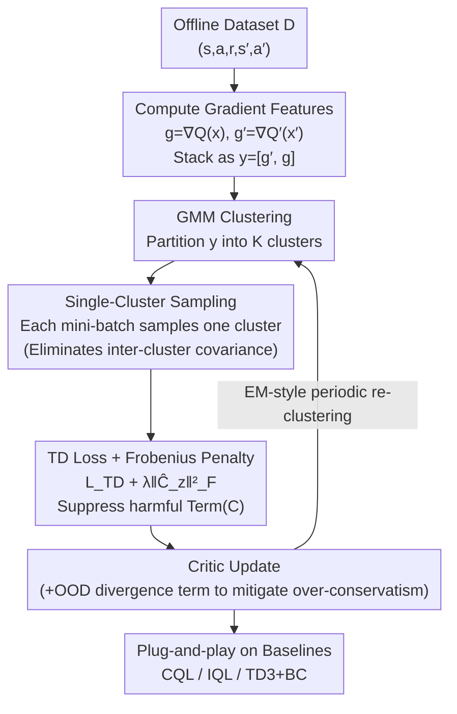

# Less is More: Clustered Cross-Covariance Control for Offline RL

**Conference**: ICLR 2026  
**arXiv**: [2601.20765](https://arxiv.org/abs/2601.20765)  
**Code**: None  
**Area**: Reinforcement Learning  
**Keywords**: Offline RL, Distributional Shift, TD Cross-Covariance, Buffer Partitioning, Conservatism Control

## TL;DR

This paper reveals that the standard mean squared error (MSE) objective in offline RL introduces harmful TD cross-covariance. It proposes the C⁴ (Clustered Cross-Covariance Control for TD) method, which suppresses this effect through partitioned buffer sampling and explicit gradient correction penalties, achieving up to 30% return improvement in small dataset and OOD-dominated scenarios.

## Background & Motivation

The core challenge of offline reinforcement learning is Distributional Shift: the policy must make decisions on state-action pairs not covered by the offline dataset, yet the value function estimates in these regions are unreliable. This issue is particularly severe in the following scenarios:

**Background**: Offline dataset sizes are limited, failing to sufficiently cover the state-action space.

**Limitations of Prior Work**: The distribution in the dataset differs significantly from the target policy distribution, causing a large number of updates to fall in out-of-distribution (OOD) regions.

**Key Challenge**: Existing methods (such as CQL) address distributional shift by penalizing Q-values in OOD regions, but this conservative strategy may lead to overly pessimistic value estimates in extreme OOD areas.

The key insight of this paper is that **the standard mean squared error (MSE) TD objective introduces harmful TD cross-covariance**. This cross-covariance effect is amplified in OOD regions, causing the optimization direction to deviate from the optimum and reducing the quality of policy learning. This mechanism was previously under-recognized.

## Method

### Overall Architecture

C⁴ attributes the failure of offline RL in small-data and OOD-dominated scenarios to an overlooked gradient term: hidden within the second-moment expansion of the standard MSE TD objective is a TD-specific **cross-covariance term**. This term enters the minimized loss with a negative sign, causing optimization to increase it instead, which reverses update directions in OOD regions and may even trigger training collapse. Around this diagnosis, the method suppresses this term using two complementary means, both designed as plug-and-play modules that can be superimposed on any policy-constrained baseline. First, the "current critic gradient" and "target critic gradient" for each transition are stacked into a pair and clustered in gradient space using a Gaussian Mixture Model (GMM). Each mini-batch then samples only from a single cluster to eliminate "inter-cluster" covariance. For the remaining "intra-cluster" covariance, a Frobenius norm penalty is added to the loss for explicit cancellation. Clustering and critic updates alternate in an EM-style fashion with periodic re-clustering (as gradients change during training). The entire process is paired with a lightweight divergence term activated only in OOD regions to prevent over-conservatism.

### Key Designs

**1. TD Cross-Covariance Diagnosis: Identifying Parasitic Gradient Terms**

TD learning in offline RL minimizes the second moment of the residual square $\mathbb{E}[\delta^2]=(\mathbb{E}[\delta])^2+\mathrm{Var}[\delta]$. This paper perform a first-order Taylor expansion on $\mathrm{Var}[\delta]$ after a virtual displacement ($x\mapsto x+kw$) in the feature space towards OOD directions, decomposing it into three terms: the first two terms $k^2\mathrm{Var}\langle w,\nabla_x Q\rangle$ and $\gamma^2 k'^2\mathrm{Var}\langle w',\nabla_{x'}Q'\rangle$ are beneficial implicit regularizations (analogous to noise-induced regularization in supervised learning, lowering Q-value variance in OOD regions); the third term $-2\gamma k k'\,\mathrm{Cov}(\langle w',g'\rangle,\langle w,g\rangle)$ is the TD-specific **cross-covariance term (Term C)**. It couples the current critic gradient $g=\nabla_x Q_\phi$ and the target critic gradient $g'=\nabla_{x'}Q_{\phi'}$ of the same transition. Crucially, it enters the objective with a negative sign, leading optimization to **increase** it, pushing the gradient direction further off-course in severe OOD regions. The diagnosis specifies that it is the cross-temporal covariance of **gradient features**, rather than Q-values themselves, that is harmful.

**2. Single-Cluster Sampling: Clustering Gradient Pairs to Eliminate Inter-cluster Covariance**

Since Term C arises from the irregular coupling of gradients across regions, C⁴ stacks the two gradients of each transition into $y=[g',g]\in\mathbb{R}^{2m}$, clusters them into $K$ components in $y$-space using a GMM, and modifies the sampling such that **each mini-batch samples from only one cluster**. According to the law of total covariance $C=\mathbb{E}[C_Z]+\mathrm{Cov}(\mu'_Z,\mu_Z)$, single-cluster sampling causes the "inter-cluster mean shift" term to zero out within that batch, leaving only the intra-cluster covariance $C_z$. A theorem provides a batch-level upper bound $2\gamma kk'\|C_z\|_2\le 2\gamma kk'\sqrt{\mathrm{tr}\,\Sigma'_z}\sqrt{\mathrm{tr}\,\Sigma_z}$. Clustering is based on gradient geometry rather than raw states/actions, and since gradients change during training, **periodic re-clustering** is performed (alternating with critic updates). The paper also proves that this sampling maintains the lower-bound property of the optimization objective.

**3. Frobenius Correction Penalty: Suppressing Residual Intra-cluster Covariance**

While single-cluster sampling eliminates inter-cluster terms, $C_z$ remains. C⁴ applies an explicit correction by adding a penalty proportional to the Frobenius norm of the intra-cluster cross-covariance matrix: $\min_\phi L_{\mathrm{TD}}(\phi)+\lambda\sum_z p_z\|C_z\|_F^2$, where $\|C_z\|_F^2=\mathrm{tr}(C_z C_z^\top)$ bounds the spectral norm and is easy to estimate per batch. In practice, $\hat C_z(B)=\mathrm{Cov}_B(g',g)$ is estimated, and the penalty is defined as $\|\hat C_z(B)\|_F^2+\beta(\mathrm{tr}\,\hat C_z(B))^2$. This term provides active, precise de-biasing at the mini-batch granularity, complementing the "structural isolation" of sampling.

**4. Design Motivation: Plug-and-play + OOD Divergence Term**

Both controls in C⁴ do not modify the primary loss of the base algorithm—clustering only affects sampling, and the Frobenius penalty only adds a gradient term. Thus, it can be applied directly to policy-constrained offline RL like CQL, IQL, and TD3+BC. To prevent the corrected direction from leading to over-conservatism, C⁴ includes a lightweight divergence term that is neutral in-distribution but active OOD, mitigating unnecessary pessimism without changing the core "conservative constraint" behavior of the baseline.

## Key Experimental Results

### Main Results

Evaluations were conducted on standard benchmarks like D4RL:

| Dataset Type | Baseline | Baseline + C⁴ | Gain | Note |
|------------|----------|---------|----------|------|
| Small Dataset (1%) | CQL | CQL+C⁴ | Up to 30% | Most significant gain in data-scarce settings |
| Small Dataset (1%) | IQL | IQL+C⁴ | Significant | Compatible with various baselines |
| OOD-dominated | CQL | CQL+C⁴ | Significant | Superior performance when OOD regions are prevalent |
| Standard Dataset | Various | Various + C⁴ | Stable improvement | Improvement even under normal conditions |
| Medium-Expert | TD3+BC | TD3+BC+C⁴ | Gain | Benefits mixed-quality data |

### Ablation Study

| Configuration | Key Metric | Note |
|------|---------|------|
| Partition Only | Significant Gain | Partitioning alone effectively suppresses covariance |
| Correction Only | Obvious Gain | Precise correction is effective but less stable than partitioning |
| Partition + Correction | Optimal | Best performance with complementary effects |
| Different K | Optimal K exists | K too small loses effect; K too large lacks data per partition |
| Data Size Scaling | Larger gain on small data | Matches theoretical expectation: scarcer data yields more bias |
| OOD Ratio Scaling | Larger gain with more OOD | Validates C⁴'s specificity to OOD regions |

### Key Findings

1.  **Cross-covariance is a neglected key factor**: Previous offline RL research focused on value overestimation and policy constraints, ignoring the harmful effects of cross-covariance.
2.  **Small datasets benefit most**: Using only 1% of data, C⁴ provides the most significant improvements (up to 30%), showing covariance bias is acute when data is scarce.
3.  **Mitigating over-conservatism**: C⁴ reduces unnecessary pessimism in extreme OOD regions, allowing for better policy generalization.
4.  **Stability Gains**: Beyond return improvements, training stability is significantly enhanced.
5.  **Universal Enhancer**: C⁴ serves as a general plugin to strengthen multiple offline RL baselines, demonstrating the universal value of its theoretical insights.

## Highlights & Insights

1.  **Deep Theoretical Insight**: Reveals the harmful mechanism of cross-covariance in TD learning, a seemingly simple yet long-overlooked issue.
2.  **Elegant Solution**: The partitioned buffer sampling is extremely simple and adds almost no computational overhead while yielding significant improvements.
3.  **Strong Theoretical Guarantees**: Proves that partitioning does not violate the lower-bound property and that constraints mitigate over-conservatism without altering core behavior.
4.  **Comprehensive Validation**: Effectiveness verified across various baselines and dataset configurations.
5.  **Philosophy of "Less is More"**: The name is fitting—by restricting the data scope for each update (less), better optimization directions are obtained (more).

## Limitations & Future Work

1.  **Clustering Quality**: The effectiveness of partitioning depends on the clustering algorithm quality; clustering in high-dimensional gradient space may be inaccurate.
2.  **Clustering Design is Open**: C⁴ requires periodic re-clustering (EM-style), but the authors note that design remains a challenge—adaptive determination of frequency and cluster count $K$ lacks mature solutions.
3.  **Online RL Extension**: Analysis is focused on the offline setting; performance in online or hybrid settings is unknown.
4.  **Selection of K**: $K$ requires tuning, and there is currently no adaptive method to determine it.
5.  **Computational Overhead**: Periodic re-clustering on massive buffers may be time-consuming.

## Related Work & Insights

-   **CQL (Conservative Q-Learning)**: Addresses shift by penalizing OOD Q-values; C⁴ approaches a similar problem from the perspective of covariance control.
-   **IQL (Implicit Q-Learning)**: Avoids OOD action queries via expectile regression; C⁴ can be used as an enhancement module.
-   **TD3+BC**: Adds BC constraints to TD3; C⁴ can be similarly integrated.
-   **Related Work**: While Prioritized Experience Replay controls sampling via priority, C⁴ uses partitioning; the starting points differ.
-   **Insights**: 
    - Gradient analysis of TD learning may yield more neglected bias terms for discovery.
    - Structured buffer management (beyond just priority) may become a new research direction in offline RL.
    - The "limit scope for quality" approach could be generalized to other machine learning problems.

## Rating
- Novelty: ⭐⭐⭐⭐
- Experimental Thoroughness: ⭐⭐⭐⭐⭐
- Writing Quality: ⭐⭐⭐⭐
- Value: ⭐⭐⭐⭐

<!-- RELATED:START -->

## Related Papers

- [\[ICLR 2026\] Sample More to Think Less: Group Filtered Policy Optimization for Concise Reasoning](sample_more_to_think_less_group_filtered_policy_optimization_for_concise_reasoni.md)
- [\[ICLR 2026\] Learn More with Less: Uncertainty Consistency Guided Query Selection for RLVR](learn_more_with_less_uncertainty_consistency_guided_query_selection_for_rlvr.md)
- [\[ICLR 2026\] Scalable Offline Model-Based RL with Action Chunks](scalable_offline_model-based_rl_with_action_chunks.md)
- [\[ICLR 2026\] Dual-Robust Cross-Domain Offline Reinforcement Learning Against Dynamics Shifts](dual-robust_cross-domain_offline_reinforcement_learning_against_dynamics_shifts.md)
- [\[ICLR 2026\] ReFORM: Reflected Flows for On-support Offline RL via Noise Manipulation](reform_reflected_flows_for_on-support_offline_rl_via_noise_manipulation.md)

<!-- RELATED:END -->
