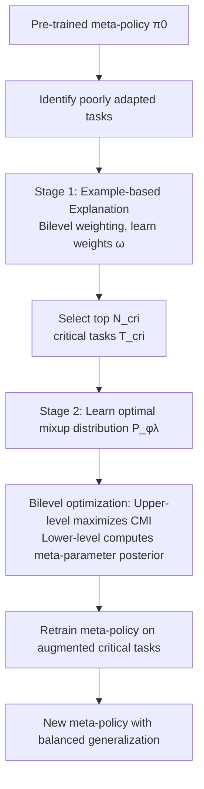

# Leveraging Explanation to Improve Generalization of Meta Reinforcement Learning

**Conference**: ICLR 2026  
**OpenReview**: [https://openreview.net/forum?id=Rg8PBd9Ow2](https://openreview.net/forum?id=Rg8PBd9Ow2)  
**Code**: TBD  
**Area**: reinforcement learning / meta-RL  
**Keywords**: meta reinforcement learning, generalization, explainability, example-based explanation, conditional mutual information, mixup data augmentation, bilevel optimization  

## TL;DR
Adopts a strategy analogous to "humans reviewing the most relevant previous problems after making mistakes": first use example-based explanations to identify "critical training tasks" most relevant to poorly adapted tasks, then use conditional mutual information (CMI) to guide the meta-strategy to "pay more attention" to these tasks. By learning an optimal mixup augmentation distribution to encode more critical task information into meta-parameters, the model post-hoc rectifies the unbalanced generalization in meta-reinforcement learning.

## Background & Motivation
- **Background**: Meta-reinforcement learning (MRL) learns a meta-prior (usually a meta-policy $\pi_0$) from a batch of training tasks, aiming for rapid adaptation to new tasks in the distribution. Mainstream methods like MAML employ a bilevel structure: "upper-level learns meta-policy, lower-level performs task-specific adaptation."
- **Limitations of Prior Work**: The learned meta-policy $\pi_0$ exhibits **unbalanced generalization**—it adapts well to some tasks but poorly to others. This has been confirmed by prior work (Yu et al. 2020) and repeated in this paper's experiments (Appendix M.9), yet few methods specifically "remedy" those poorly adapted tasks.
- **Key Challenge**: Directly weighting or retraining poorly adapted tasks either requires specifying a target task set (a flaw in task weighting methods) or merely optimizes the overall distribution without truly focusing on the specific training tasks that need reinforcement. Predefined data augmentation rules (fixed mixup distributions) increase information but **do not guarantee maximization** of critical task information encoded into the meta-policy.
- **Goal**: Improve generalization in a **post-hoc** manner after the MRL algorithm has yielded $\pi_0$, without damaging performance on other tasks.
- **Core Idea**: A **two-stage "Identification + Review" framework**. Stage one uses example-based explanation to locate "critical tasks"; stage two formalizes "paying more attention" as "storing more critical task information in meta-parameters" via information theory and maximizes this increment by **learning an optimal data augmentation distribution**.

## Method

### Overall Architecture
The method is named **XMRL** (Explainable Meta-RL) and consists of two interconnected stages: **Explain** (identify training tasks critical to poor performance) and **Augment** (learn a mixup distribution to encode more critical task information into parameters). Both stages are bilevel optimization problems. The optimal augmentation distribution in the second stage is solved via hyper-gradient iteration of Conditional Mutual Information (CMI), supported by theoretical convergence and generalization guarantees.

### Key Designs

**1. Example-based Explanation: Explicitly solving "which training tasks to review" via bilevel weighting.** Inspired by recent work in RL explainability (treating state-action pairs or preference data most critical to poor performance as explanations), this paper transfers "explanation" to MRL: learning an importance vector $\omega \in \mathbb{R}^{N^{tr}}$, where each $\omega_i$ measures the contribution of training task $T_i^{tr}$ to "achieving high rewards on poorly adapted tasks." Formally, it is a bilevel optimization $\max_\omega L(\theta^*(\omega), \{T_i^{poor}\})$ subject to $\theta^*(\omega)=\arg\max_\theta \sum_i \omega_i J_i^{tr}(\pi_i^{tr}(\theta))$. The top $N^{cri}$ tasks are identified as **critical tasks**. Visualizations show these tasks are exactly those whose goals are closest to the poorly adapted tasks, aligning with the intuition of "finding similar previous problems."

**2. Translating "Attention" to "Information Storage," measured by CMI.** Unlike existing task weighting methods, this paper does not assume a target task set. Instead, it defines attention through information theory: the more critical task information stored in meta-parameters $\theta$, the more the meta-strategy "attends" to them. Augmentation introduces extra information and diversity; thus, **Conditional Mutual Information** quantifies the increment: $I(\theta; \{\bar T_i^{cri}(\Lambda_i\sim P(\lambda))\} \mid \{T_i^{cri}\})$. A value $>0$ indicates that augmentation successfully encodes more critical task information into the meta-parameters.

**3. Learning Optimal Augmentation Distributions instead of predefined rules.** Augmentation uses mixup: sampling two states $s,s'\sim\rho^\pi$ for a critical task to generate $\bar s=\lambda_i s+(1-\lambda_i)s'$ with $\lambda_i\sim P(\lambda)$. Interacting at $\bar s$ collects augmented tuples, shifting the state-action distribution and inducing a new optimization objective $\bar J_i^{cri}$. Crucially, **$P(\lambda)$ is learned rather than fixed**. Parameterizing the distribution as $P_{\phi_\lambda}(\lambda)$, the goal is to maximize the CMI via **bilevel optimization** $\max_{\phi_\lambda} I(\cdot)$. The upper level selects the distribution maximizing information gain, while the lower level computes the posterior of $\theta$ under augmented/original tasks (treating $\theta$ as a random variable parameterized by a Gaussian with reparameterization).

**4. Single-loop algorithm and triple theoretical guarantee.** The XMRL algorithm (Algorithm 1) iterates by first generating explanations, then performing $K$ steps where the lower level samples coefficients and the upper level updates the distribution using the hyper-gradient $\phi_{\lambda,k+1}=\phi_{\lambda,k}+\beta g_{\phi_\lambda,k}$ (Lemma 1). Theory proves: (i) $O(1/\sqrt{K})$ convergence (Theorem 1); (ii) the learned augmentation ensures information increment $>0$ for critical tasks without affecting non-critical tasks (Theorem 2); (iii) under softmax policies and MAML, augmentation is equivalent to adding a quadratic regularizer $-\theta^\top(\tfrac{1}{N^{cri}}\sum \bar H_i^{cri})\theta$ (Lemma 2), which shrinks the solution space and compresses the generalization gap to $O(\sqrt{\bar\gamma/N^{tr}}+\sqrt{\log(1/\delta)/N^{tr}})$ (Theorem 3).

## Key Experimental Results
Verified using two real-world experiments (Drone navigation, Stock trading), two MuJoCo tasks (HalfCheetah, Ant), and Meta-World. **MAML** serves as the base, compared against three MRL improvements: Task Weighting (TW), Meta-Augmentation (MA, fixed mixup), and Meta-Regularization (MR).

### Main Results

| Method | Drone (Success Rate) | Stock Market (Cumulative Reward) | HalfCheetah | Ant |
|------|------|------|------|------|
| MAML | 0.87 ± 0.01 | 359.13 ± 18.63 | −68.89 ± 4.36 | 100.64 ± 3.63 |
| **MAML+XMRL (Ours)** | **0.97 ± 0.01** | **421.13 ± 12.11** | **−44.67 ± 4.35** | **119.15 ± 4.02** |
| MAML+TW | 0.87 ± 0.02 | 362.07 ± 14.21 | −65.14 ± 4.26 | 99.92 ± 4.56 |
| MAML+MA | 0.91 ± 0.02 | 389.17 ± 12.66 | −63.49 ± 4.07 | 106.44 ± 4.55 |
| MAML+MR | 0.91 ± 0.02 | 362.53 ± 14.27 | −61.15 ± 3.82 | 104.15 ± 4.74 |

XMRL leads across all four benchmarks. In HalfCheetah, it improves MAML by ~**35%**, whereas baselines improve by less than 15%.

### Ablation Study

Ablation on the number of critical tasks $N^{cri}$ (focusing on side effects to "non-poor tasks"):

| Metric | MAML | MAML+XMRL |
|------|------|------|
| Drone: Poor task performance | 0.55 | 0.93 |
| Drone: Non-poor task performance | 0.95 | 0.98 |
| Drone: Degraded task ratio | N/A | 0% |
| Stock: Poor task performance | 71.05 | 381.33 |
| Stock: Non-poor task performance | 431.15 | 431.08 |
| Stock: Degraded task ratio / Avg. Drop | N/A | 5% / 3.8% |
| HalfCheetah: Poor task performance | −162.09 | −55.00 |
| HalfCheetah: Degraded task ratio | N/A | 2.5% |

### Key Findings
- **Optimal critical task ratio exists**: Approximately 10% for Drone/HalfCheetah/Ant and 30% for Stock. Selecting too many includes tasks unhelpful to poor performance, hindering generalization, though still outperforming baseline MAML.
- **Minimal impact on other tasks**: The ratio of sacrificed non-poor tasks is ≤5%, with drops <4%. Meanwhile, performance on poor tasks significantly improves while average performance on non-poor tasks remains stable.
- **Rational Explanation Viz**: Identified critical tasks are those with goals most similar to the poorly adapted tasks, confirming the "revisiting similar problems" intuition.

## Highlights & Insights
- **Operationalizing Explainability**: Example-based explanation is not just for post-hoc diagnosis but directly drives the second-stage augmentation, creating an "Explanation → Intervention → Improvement" loop.
- **Clean Information-Theoretic Definition**: CMI transforms the vague concept of "paying attention to critical tasks" into an optimizable, provable quantity, establishing a causal chain from augmentation to solution space shrinkage and better generalization.
- **Learnable vs. Fixed Augmentation**: Compared to predefined mixup in MA, maximizing CMI allows "customized" augmentation, significantly widening the performance gap in experiments.
- **Post-hoc Plug-and-play**: Does not require redesigning MRL algorithms; works as a "patch" for existing meta-policies.

## Limitations & Future Work
- **Dependency on Identification Accuracy**: The definition and selection of "poor tasks" and the ratio of critical tasks are sensitive hyperparameters.
- **Augmentation Feasibility Assumption**: States generated by mixup ($\bar s$) are assumed feasible, which holds in continuous control but might not in environments with strong structural or physical constraints.
- **Extra Interaction Cost**: Augmentation requires real environmental interaction at augmented states, incurring non-negligible sampling overhead.
- **Strong Theoretical Assumptions**: Generalization bounds are based on softmax parameterization and MAML; validity for more complex policy classes or adaptation algorithms requires further verification.

## Related Work & Insights
- **Meta-RL and Unbalanced Generalization**: Follows the MAML paradigm, addressing the "poorly adapted sub-populations" issue highlighted by Yu et al. (2020).
- **Example-based Explanation**: Builds on works by Liu & Zhu (2025) which treat critical data as explanations, transferring this to the "critical training task" level.
- **Data Augmentation and Mixup**: Unlike Yao et al. (2021) or Wang et al. (2020) using fixed rules, this work uses CMI to learn the distribution, echoing the mutual information motivations in Yin et al. (2019).
- **Insight**: When a model performs unevenly across sub-populations, "identifying responsible samples via explanation, then targeted reinforcement via information-theoretic objectives" is a generalizable remedy for SL, alignment, and recommendation systems.

## Rating
- Novelty: ⭐⭐⭐⭐ Combines example-based explanation with CMI-driven learnable augmentation in a coherent "Identification + Review" loop.
- Experimental Thoroughness: ⭐⭐⭐⭐ Covers five diverse environments and three baselines with ablation on degradation rates, though task scales are relatively small.
- Writing Quality: ⭐⭐⭐⭐ Uses effective human-learning analogies; information-theoretic formalization is clear and well-connected to intuition.
- Value: ⭐⭐⭐⭐ Post-hoc plug-and-play with theoretical guarantees offers practical value for fixing MRL generalization gaps.

<!-- RELATED:START -->

## Related Papers

- [\[ICLR 2026\] Erase to Improve: Erasable Reinforcement Learning for Search-Augmented LLMs](erase_to_improve_erasable_reinforcement_learning_for_search-augmented_llms.md)
- [\[ICLR 2026\] TROLL: Trust Regions improve Reinforcement Learning for Large Language Models](troll_trust_regions_improve_reinforcement_learning_for_large_language_models.md)
- [\[ICLR 2026\] On the Generalization of SFT: A Reinforcement Learning Perspective with Reward Rectification](on_the_generalization_of_sft_a_reinforcement_learning_perspective_with_reward_re.md)
- [\[ICLR 2026\] Principled Fast and Meta Knowledge Learners for Continual Reinforcement Learning](principled_fast_and_meta_knowledge_learners_for_continual_reinforcement_learning.md)
- [\[ICLR 2026\] Self-Improving Skill Learning for Robust Skill-based Meta-Reinforcement Learning](self-improving_skill_learning_for_robust_skill-based_meta-reinforcement_learning.md)

<!-- RELATED:END -->
