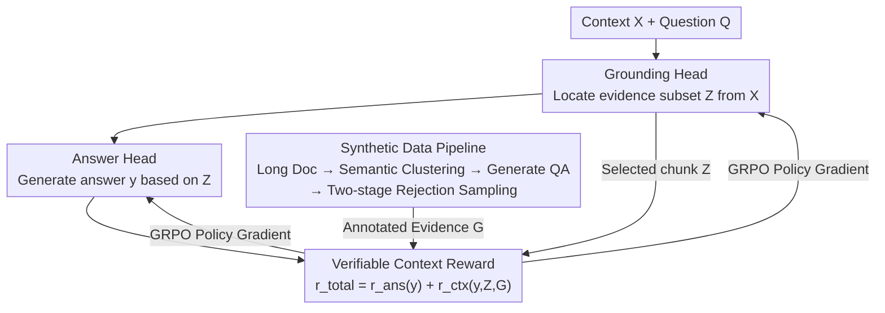

# LongRLVR: Long-Context Reinforcement Learning Requires Verifiable Context Rewards

**Conference**: ICLR 2026  
**arXiv**: [2603.02146](https://arxiv.org/abs/2603.02146)  
**Code**: [real-absolute-AI/LongRLVR](https://github.com/real-absolute-AI/LongRLVR)  
**Area**: Reinforcement Learning  
**Keywords**: RLVR, long-context reasoning, context localization, verifiable rewards, gradient vanishing, GRPO  

## TL;DR

LongRLVR is proposed to introduce verifiable context rewards into RLVR training, addressing the gradient vanishing problem in context grounding caused by outcome-only rewards in long-context scenarios, thereby significantly enhancing the long-context reasoning capabilities of LLMs.

## Background & Motivation

**RLVR failure in long-context**: RLVR (e.g., DeepSeek-R1) performs excellently on reasoning tasks relying on parametric knowledge like math and programming but shows poor results in long-context scenarios requiring retrieval and reasoning from external documents.

**Contextual grounding as the core bottleneck**: Long-context reasoning requires accurate localization of relevant evidence (contextual grounding) before generating answers. Reward signals based solely on the final answer are too sparse to effectively guide the grounding process.

**Theoretical proof of gradient vanishing**: The authors theoretically demonstrate that outcome-only rewards cause the gradient of the grounding head to be scaled by the "activation event" probability $Pr(\varepsilon_j)$. Specifically, a positive gradient signal for a particular evidence chunk is obtained only when all other necessary evidence chunks have already been selected, which is statistically improbable during early training stages.

**Experimental verification**: During naive RLVR training, contextual recall quickly stagnates, which directly limits the upper bound of answer accuracy (Figure 1).

## Method

### Overall Architecture

The core problem LongRLVR addresses is that applying RLVR directly to long-context scenarios fails because models cannot learn to "find the right evidence" using only sparse "correct/incorrect" rewards. The approach explicitly decomposes the long-context policy into two sequential heads: a Grounding Head $\pi_\theta^{gnd}(Z|X,Q)$ that identifies a relevant evidence subset $Z$ from context $X$, and an Answer Head $\pi_\theta^{ans}(y|X,Q,Z)$ that generates the answer $y$ based on the identified evidence. During inference, the model emits a sequence of chunk identifiers to complete grounding before generating the final answer. During training, a new reward function simultaneously incentivizes "correct answers" and "correct localization" to provide direct learning signals for the grounding process. This requires training data with ground-truth evidence annotations, produced offline via a synthetic data pipeline.

### Key Designs

**1. Verifiable Context Rewards: Supplementing sparse answer signals with dense grounding gradients**

The failure of outcome-only rewards in long-context tasks has a theoretical root: the authors prove (Proposition 1) that the positive gradient for selecting a ground-truth chunk $c_j$ is scaled by an "activation event" probability $Pr(\varepsilon_j)$. This evidence only shows value when all other necessary pieces of evidence are already selected. Since concurrent selection of all evidence is rare in early training rollouts, the grounding head gradient remains near zero, causing recall to stagnate.

LongRLVR decomposes the total reward into an answer reward and a context reward: $r_{total}(y,Z) = r_{ans}(y) + r_{ctx}(y,Z,G)$. The context reward is designed using a "modulated F-score":

$$r_{ctx}(y,Z,G) = \eta \cdot F_\beta(Z,G) + (1-\eta) \cdot r_{ans}(y) \cdot F_\beta(Z,G)$$

The first term $\eta \cdot F_\beta$ is an unconditional grounding reward that scores the F-score of selected chunks versus ground-truth $G$ regardless of answer correctness, ensuring dense signals. The second term $(1-\eta) \cdot r_{ans} \cdot F_\beta$ is a synergistic success reward, unlocking the full localization score only if the answer is correct to prevent reward hacking (selecting chunks indiscriminately to boost recall). Weights are set to $\eta=0.1$ and the F-score uses $\beta=2$ to prioritize recall, as missing evidence is more costly than including irrelevant chunks in multi-evidence reasoning. Proposition 2 provides a theoretical guarantee: the context reward contributes a gradient term $\alpha_j \cdot Var(z_j)$ that depends only on the variance of the specific chunk selection, eliminating the vanishing gradient problem.

**2. Synthetic Data Pipeline: Creating long-context QA with grounding annotations via rejection sampling**

Context rewards require ground-truth chunk annotations $G$ for every sample. Since such datasets are rare, a pipeline was built to collect 8K–64K token documents from Book/arXiv/Code domains. For each document, four semantic clusters are randomly selected. Qwen3-235B generates three candidate $(Q, y, G)$ triplets per cluster using Chain-of-Thought (CoT) and labels the required evidence. The same model then acts as a judge to score candidates (1–10) based on clarity, correctness, and evidence relevance. Two-stage rejection sampling selects the single best QA per document, discarding samples with scores below 9. This resulted in 46K high-quality long-context QA pairs.

## Experimental Results

### Main Results

| Model | RULER-QA (AVG) | LongBench v2 | LongReason (AVG) |
|------|:-:|:-:|:-:|
| Qwen2.5-14B-1M (base) | 75.20 | 40.2 | 73.55 |
| +RLVR | 73.17 | 39.8 | 72.33 |
| **+LongRLVR** | **88.90** | **46.5** | **78.42** |
| Qwen2.5-7B-1M (base) | 65.00 | 33.0 | 66.45 |
| +RLVR | 66.90 | 32.4 | 69.27 |
| **+LongRLVR** | **78.67** | **38.6** | **79.22** |
| LLaMA-3.1-8B (base) | 62.77 | 30.4 | 49.31 |
| +RLVR | 67.80 | 32.4 | 49.62 |
| **+LongRLVR** | **80.33** | **36.2** | **53.23** |

- Qwen2.5-14B-LongRLVR outperforms Qwen3-14B (88.90 vs 87.60 on RULER-QA) and QwenLong-L1-32B.
- Qwen2.5-7B-LongRLVR significantly surpasses LLaMA-3.1-70B on LongReason (79.22 vs 57.59).

### Ablation Study

| Dimension | Key Findings |
|---------|---------|
| **Reward Components** | Answer-only leads to recall stagnation and performance plateaus; context-only yields high recall but inaccurate answers; synergy is optimal. |
| **Data Quality** | Rejection sampling best > median > worst; filtering simple problems is beneficial, while filtering hard ones is detrimental. |
| **$\eta$ Mixing Factor** | $\eta=0.1$ is optimal; $\eta=0$ results in sparse initial signals; $\eta=1$ decouples grounding from the final goal. |
| **F-score $\beta$** | $\beta=2$ is optimal; emphasizing recall is critical for multi-evidence reasoning. |
| **Chunk Count** | Performance is robust across 16-128 chunks; the model learns semantic-level localization rather than relying on partitioning strategies. |

## Highlights & Insights

- Rigorous analysis revealing the fundamental flaws of outcome-only RLVR in long-context through both theoretical (gradient vanishing) and experimental lenses.
- The modulated F-score context reward design successfully balances dense signals with goal alignment, preventing reward hacking.
- High parameter efficiency: 7B/14B models outperform 70B+ models and specialized reasoning models (e.g., Qwen3-14B) after training.
- Robustness to chunk counts suggests the model acquires genuine semantic localization capabilities.

## Limitations & Future Work

- Dependency on high-quality synthetic data pipelines for ground-truth grounding annotations; generalization to unannotated scenarios remains unverified.
- Validation is limited to QA tasks; performance on summarization or information extraction is unknown.
- Training data is limited to 8K-64K tokens; scalability to extremely long contexts (e.g., 256K+) is not explored.
- F-score rewards assume the availability of chunk-level annotations, which can be costly in practice.
- Theoretical analysis assumes independent chunk selection, whereas dependencies exist in auto-regressive generation.

## Related Work & Insights

- **RLVR Reasoning Enhancement**: DeepSeek-R1, Kimi, DAPO—Ours identifies their limitations in long-context scenarios.
- **Long-context Alignment**: RoPE extensions (YaRN, LongRoPE), long-context SFT/DPO—Ours improves upon the RLVR approach.
- **QwenLong-L1-32B**: Long-context RLVR based on reasoning models—LongRLVR achieves comparable performance with smaller models.
- **Long-context Agents**: Chunk-based multi-turn collaboration schemes—Ours is orthogonal and potentially combinable.

## Rating

⭐⭐⭐⭐ (4/5)

- **Novelty**: ⭐⭐⭐⭐ — Clear, theory-driven reward design; gradient vanishing analysis is a core contribution.
- **Experimental Thoroughness**: ⭐⭐⭐⭐ — Extensive ablations across multiple models and benchmarks.
- **Writing Quality**: ⭐⭐⭐⭐⭐ — Strong connection between theory and experiments with clear logic.
- **Value**: ⭐⭐⭐⭐ — Provides direct guidance for long-context RLVR training, though requires synthetic annotations.

<!-- RELATED:START -->

## Related Papers

- [\[ICLR 2026\] RLVMR: Reinforcement Learning with Verifiable Meta-Reasoning Rewards for Robust Long-Horizon Agents](rlvmr_reinforcement_learning_with_verifiable_meta-reasoning_rewards_for_robust_l.md)
- [\[ICLR 2026\] Rubrics as Rewards: Reinforcement Learning Beyond Verifiable Domains](rubrics_as_rewards_reinforcement_learning_beyond_verifiable_domains.md)
- [\[ICLR 2026\] Reinforcement Learning with Verifiable Rewards Implicitly Incentivizes Correct Reasoning in Base LLMs](reinforcement_learning_with_verifiable_rewards_implicitly_incentivizes_correct_r.md)
- [\[ICLR 2026\] Scalable In-Context Q-Learning](scalable_in-context_q-learning.md)
- [\[ICLR 2026\] From Verifiable Dot to Reward Chain: Harnessing Verifiable Reference-based Rewards for RL of Open-ended Generation](from_verifiable_dot_to_reward_chain_harnessing_verifiable_reference-based_reward.md)

<!-- RELATED:END -->
