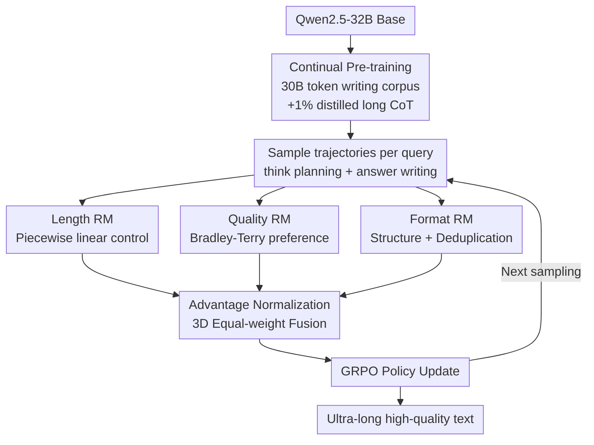

# LongWriter-Zero: Mastering Ultra-Long Text Generation via Reinforcement Learning

**Conference**: ICLR 2026 (Oral)  
**arXiv**: [2506.18841](https://arxiv.org/abs/2506.18841)  
**Code**: [https://huggingface.co/THU-KEG/LongWriter-Zero-32B](https://huggingface.co/THU-KEG/LongWriter-Zero-32B)  
**Area**: Reinforcement Learning / Long-form Generation  
**Keywords**: Ultra-long text generation, Reinforcement Learning, GRPO, Composite Reward Model, Test-time Reasoning  

## TL;DR

LongWriter-Zero is proposed: starting from a base model and without relying on any annotated or synthetic data, ultra-long high-quality text generation capability emerges solely through GRPO reinforcement learning combined with a three-dimensional composite reward model (Length / Quality / Format). With 32B parameters, it outperforms 100B+ models such as DeepSeek-R1 and Qwen3-235B on WritingBench.

## Background & Motivation

Ultra-long text generation (reports, novels, legal documents, etc.) is a high-frequency application for LLMs, but it faces two core bottlenecks: (1) the model's maximum generation length is limited, with quality degrading beyond the training distribution; (2) as sequences grow, issues like local incoherence, internal contradictions, repetitive phrasing, topic drift, and structural collapse occur.

Prior methods, represented by LongWriter, follow a "teaching" route—performing SFT on synthetic long texts. This approach has fundamental ceilings:

| Limitations of SFT Route | Specific Manifestations |
|:---|:---|
| Data quality capped by teacher models | Diversity and innovation of synthetic data are locked by the upper limits of existing models |
| MLE objective lacks global signals | Inability to explicitly optimize global attributes like coherence and format consistency |
| High construction cost and unstable quality | Synthetic long text requires complex agent pipelines, often resulting in incoherent output |
| Artificial style | Synthetic data patterns are monotonous and overly artificial |

**Key Insight**: Instead of "teaching" the model how to write (SFT), it is better to "incentivize" the model to learn to write by itself (RL). This aligns with the DeepSeek-R1-Zero philosophy—emerging capabilities entirely from scratch via RL, bypassing the dependence on meticulously constructed training data.

## Method

### Overall Architecture

LongWriter-Zero treats ultra-long text generation as a pure Reinforcement Learning (RL) problem: it neither teaches the model how to write nor feeds it annotated long texts. Instead, it provides a "ruler" for scoring, allowing long-form writing capabilities to emerge through self-exploration. The pipeline follows three steps: first, continual pre-training on Qwen2.5-32B using a 30B token writing corpus to elevate the base writing foundation; second, sampling a group of trajectories (32 per step) for each query, with each trajectory generated using a "brainstorming and outlining in `<think>`, then writing in `<answer>`" format to leverage test-time reasoning dividends; finally, scoring via Length, Quality, and Format reward models, which are fused into a scalar advantage after advantage-level normalization to update the policy via GRPO. Training was conducted on 8 nodes × 8 × H800, with a maximum output of 14,000 tokens, temperature $T=0.8$, and top-p of 1.0.

### Key Designs

**1. Three-dimensional Composite Reward Model: Creating an optimizable ruler for open-ended writing**

Open-ended writing lacks ground truth for rule-based scoring. The authors decompose "writing well" into three complementary signals. The **Length RM** handles precise length control, using QwQ-32B to predict a reasonable word count range $[L_{\text{lower}}, L_{\text{upper}}]$ for each query. A piecewise linear function $r_{\text{length}}(o)$ yields a full score within the range, with linear decay for deficiency or excess—specifically, $\text{len}(o)/L_{\text{lower}}$ if $\text{len}(o)<L_{\text{lower}}$, and $(L_{\text{max}}-\text{len}(o))/(L_{\text{max}}-L_{\text{upper}})$ if exceeding $L_{\text{upper}}$, quantifying "writing enough without fluff" into a differentiable signal. The **Writing RM** evaluates overall quality (fluency, coherence, informativeness) using Qwen2.5-72B as a backbone, trained on human preference data with a Bradley-Terry objective $\mathcal{L}=-\mathbb{E}[\log\sigma(r(x,y_w)-r(x,y_l))]$. The **Format RM** enforces structure and deduplication, checking for strict adherence to the "one `<think>` + one `<answer>`" format and penalizing duplicate paragraphs based on semantic overlap—a common shortcut models take to "cheat" length in RL.

If these signals were directly summed, components with larger magnitudes would dominate, biasing the model. The authors use **advantage-level averaging**: instead of averaging raw scores, they normalize each component's advantage within the same group of sampled trajectories before taking the mean $A_{\text{final}}=\frac{1}{3}(A_{\text{length}}+A_{\text{write}}+A_{\text{format}})$. This ensures equal contribution from all three dimensions.

**2. Test-time Reasoning in Writing: Allowing the model to draft outlines before writing**

While R1-Zero relies on long Chain-of-Thought (CoT) for math, whether writing requires "thinking before writing" is an open question. The authors compare a **Think Prompt** (brainstorming, outlining, selecting style, audience adaptation, and self-review in `<think>` before outputting the `<answer>`) against **Direct-Answer**. Results show that while Base-think initially lags behind Base-nothink (due to learning the format), it eventually reaches a higher ceiling, with Arena-Write Elo gaps extending to 1221 vs. 668. Interestingly, the writing `think` length converges to approximately 2000–3000 tokens rather than expanding infinitely, suggesting a natural saturation point for planning in writing.

**3. Continual Pre-training Elevates the RL Ceiling: Satiating the base writing capability allows RL to explore further**

Research indicates that RL limits are constrained by base capabilities. The authors verified this for writing tasks. Pre-training used 30B tokens of Chinese and English books, reports, and academic papers (from Common Crawl), mixed with 1% long CoT data distilled from Base-think for format alignment. A low 1% ratio was used to prevent the model from memorizing specific CoT patterns. Training utilized a 512 batch size, packed sequences, and 32K context. Continual-Pretrain-think achieved higher initial quality and length scores than Base-think, with a final Arena-Write Elo converging around 1400, representing a nearly 80% win rate against DeepSeek-R1.

## Key Experimental Results

### Main Results: Comparison across WritingBench Metrics

| Model | Params | Avg | Academic/Eng | Finance/Biz | Law/Gov | Arts/Lit | Edu | Marketing | Style | Format | Length | Elo |
|:---|:---|:---|:---|:---|:---|:---|:---|:---|:---|:---|:---|:---|
| **LongWriter-Zero** | 32B | **8.69** | **8.7** | **8.8** | **8.8** | 8.4 | **8.9** | **8.6** | **8.7** | **8.7** | 8.6 | **1447** |
| Qwen3-235B-A22B | 235B | 8.68 | 8.6 | 8.6 | 8.6 | 8.7 | 8.8 | 8.6 | 8.7 | **8.7** | **8.7** | 1343 |
| Claude-Sonnet-4 | - | 8.60 | 8.6 | 8.6 | 8.5 | **8.6** | 8.7 | 8.5 | 8.6 | 8.6 | 8.6 | 1185 |
| DeepSeek-R1 | 671B | 8.55 | 8.5 | 8.5 | 8.6 | **8.6** | 8.7 | 8.6 | 8.7 | 8.6 | 8.6 | 1343 |
| GPT-4o | - | 8.16 | 8.1 | 8.1 | 8.2 | 8.1 | 8.4 | 8.1 | 8.3 | 8.2 | 8.2 | 947 |
| LongWriter-8B (SFT) | 8B | 7.91 | 8.0 | 8.1 | 8.1 | 7.7 | 8.1 | 7.6 | 7.9 | 8.1 | 7.7 | 457 |

### Ablation Study

| Configuration | WritingBench Avg | Arena-Write Elo | Key Change |
|:---|:---|:---|:---|
| LongWriter-Zero (Full) | **8.69** | **1447** | CPT + Think + 3 RMs |
| w/o Continual Pre-train (Base-think) | 8.12 | 1221 | Avg drops 0.57, Elo drops 226 |
| w/o Thinking (Base-nothink) | 8.04 | 668 | Think has a larger impact on Elo (1221→668) |

### SFT vs RL Comparison

| Initialization | SFT Elo | RL Elo | Gain |
|:---|:---|:---|:---|
| Qwen2.5-32B (Base) | 964 | 1221 | RL +257 |
| Qwen2.5-32B (CPT) | 971 | 1447 | RL +476 |

SFT yields almost no benefit from continual pre-training (964 → 971) because performance is locked by training data quality; RL benefits significantly (1221 → 1447), proving that a stronger base provides a higher exploration ceiling for RL.

## Highlights & Insights

- **Paradigm Validation**: Systematically demonstrates for the first time that "pure RL is superior to SFT" in the field of open-ended text generation, answering key questions on reward design, test-time scaling, and continual pre-training.
- **32B Outperforms 100B+**: Surpasses DeepSeek-R1 (671B) and Qwen3-235B with less than 1/7th of the parameters, indicating high parameter efficiency for RL training in writing tasks.
- **Saturation of Writing Reasoning**: The `think` length converges during training rather than growing infinitely, revealing a fundamental difference between writing and mathematical reasoning in test-time scaling behaviors.
- **Advantage-level Normalization**: Advantage-level averaging is a practical multi-reward fusion strategy that avoids skewed optimization caused by unequal scales.
- **Fully Open Source**: Data, training frameworks, reward models, and model weights are all released.

## Limitations

- **Factuality not included in rewards**: The Writing RM does not cover fine-grained factual correctness, meaning there is no explicit constraint on factual hallucination risks in long texts.
- **Validated only at 32B scale**: Not yet verified on 7B or smaller models; the lower limit of parameter efficiency for RL writing remains unclear.
- **Computational Overhead**: RL training cost on 8 nodes × 8 × H800 is significantly higher than SFT, presenting a high engineering barrier.
- **Evaluation Bias Risk**: Judges for WritingBench and Arena-Write are from specific model families, which may lead to preference leakage.
- **Lack of Style Controllability**: Inability to finely control specific writing styles (Academic vs. Literary vs. Legal); current reward designs are generic.

## Related Work & Insights

- **LongWriter** (SFT method): Fine-tuning on synthetic long texts; serves as the primary baseline.
- **R1-Zero / DeepSeek R1**: The paradigm of emerging reasoning through RL from scratch, successfully migrated to writing tasks here.
- **WritingBench**: The standard evaluation benchmark for long-form writing.
- **RLHF / PPO**: The foundational application of policy gradient RL in LLM fine-tuning.

**Insight**: This work proves that RL can significantly enhance not only the reasoning capabilities but also the generation capabilities of LLMs. The RL-from-scratch paradigm may show similar emergent effects in more tasks (code generation, translation, summarization, etc.). The multi-dimensional reward design approach is worth referencing for other generative tasks.

## Rating

- Novelty: ⭐⭐⭐⭐⭐ — First successful application of the R1-Zero paradigm to long-form writing; pioneering work.
- Experimental Thoroughness: ⭐⭐⭐⭐ — SOTA across WritingBench and Arena-Write, though evaluation scenarios could be more diverse.
- Writing Quality: ⭐⭐⭐⭐ — Oral-level paper, clear logic, well-motivated.
- Value: ⭐⭐⭐⭐⭐ — High practical value, open-souced weights, advances the RL+Writing direction.

<!-- RELATED:START -->

## Related Papers

- [\[ICLR 2026\] Mastering Sparse CUDA Generation through Pretrained Models and Deep Reinforcement Learning](mastering_sparse_cuda_generation_through_pretrained_models_and_deep_reinforcemen.md)
- [\[ICLR 2026\] LoongRL: Reinforcement Learning for Advanced Reasoning over Long Contexts](loongrl_rl_for_reasoning_long_contexts.md)
- [\[ICLR 2026\] R-Zero: Self-Evolving Reasoning LLM from Zero Data](r-zero_self-evolving_reasoning_llm_from_zero_data.md)
- [\[ICLR 2026\] LongRLVR: Long-Context Reinforcement Learning Requires Verifiable Context Rewards](longrlvr_long-context_reinforcement_learning_requires_verifiable_context_rewards.md)
- [\[ICLR 2026\] RLVMR: Reinforcement Learning with Verifiable Meta-Reasoning Rewards for Robust Long-Horizon Agents](rlvmr_reinforcement_learning_with_verifiable_meta-reasoning_rewards_for_robust_l.md)

<!-- RELATED:END -->
