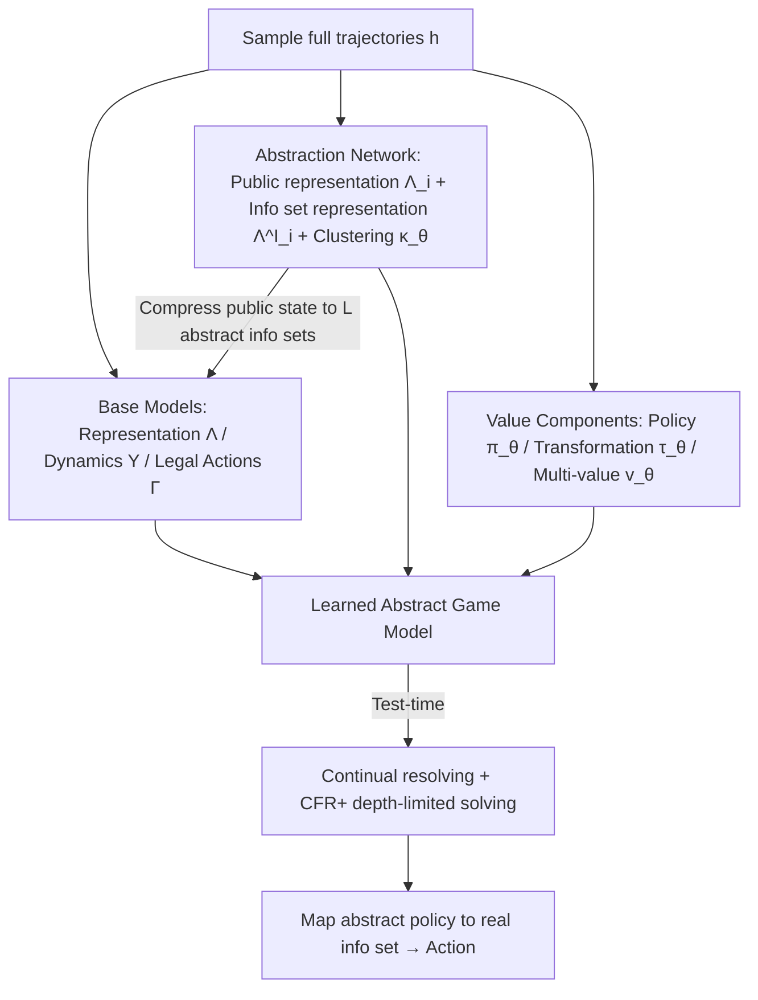

# Look-ahead Reasoning with a Learned Model in Imperfect Information Games

**Conference**: ICLR 2026  
**OpenReview**: [https://openreview.net/forum?id=NnBbr4hI8a](https://openreview.net/forum?id=NnBbr4hI8a)  
**Code**: To be confirmed  
**Area**: reinforcement learning / game theory  
**Keywords**: imperfect-information games, test-time reasoning, learned environment models, MuZero, abstraction, continual resolving, CFR, Nash equilibrium  

## TL;DR
This paper proposes LAMIR, which learns an **imperfect-information game model with abstraction** from interaction trajectories without explicit game rules. This allows the MuZero-style "learn a model then perform look-ahead reasoning" paradigm to operate in large-scale imperfect-information games in a theoretically sound manner for the first time.

## Background & Motivation
- **Background**: Test-time look-ahead search significantly enhances the performance of pre-trained agents. In perfect-information games, MuZero demonstrated that agents can **implicitly learn an environment dynamics model** and run MCTS using it, thereby removing the dependency on explicit game rules.
- **Limitations of Prior Work**: Extending this "learned model + search" paradigm to imperfect-information games (IIG, e.g., Poker, Stratego, Dark Chess) is extremely difficult. In IIG, players only observe their own information set $s_i$. Theoretically sound look-ahead reasoning must perform joint reasoning over **all hidden histories consistent with the public state $s_0$** (otherwise, it effectively leaks the player's private hand to the opponent), which is fundamentally different from the MCTS used by MuZero. Furthermore, the number of histories associated with a single decision point can explode exponentially with game length, reaching scales of $10^{18}$, making search computationally infeasible.
- **Key Challenge**: Existing IIG reasoning methods (such as DeepStack, ReBeL, Student of Games, and SePoT for continual resolving) either require **manually written explicit rules** to construct game trees and manage belief states, or rely on **domain-expert-designed abstractions**—both of which limit their applicability in scenarios where rules are unavailable or state spaces are too large.
- **Goal**: In **two-player zero-sum, non-stochastic** imperfect-information games, automatically learn a **sufficiently small, domain-agnostic abstract model** using only sampled full game trajectories, and use it for theoretically sound test-time look-ahead reasoning.
- **Key Insight**: A combined approach of **"MuZero-style model learning + online clustering-based automatic abstraction + multi-valued state value functions + continual resolving"**—using the learned abstraction to compress the number of information sets within each public state to a constant $L$, making depth-limited CFR reasoning tractable in games that were previously unsolvable.

## Method

### Overall Architecture
LAMIR (Learned Abstract Model for Imperfect-information Reasoning) assumes access to a simulator to generate full trajectories during the training phase, but only receives its own information set $s_i$ during the test phase, relying entirely on the learned model for planning. Building upon the MuZero trifecta (representation / dynamics / legal actions), it adds an **abstraction network** (clustering exponential information sets into $L$ representatives) and a **value function component** (supporting depth-limited reasoning). Finally, it uses continual resolving + CFR+ at test time to solve for the strategy within the abstract game.

### Key Designs

**1. IIG Version of MuZero Model: Explicitly building "joint evolution."** While search in perfect-information games starts from a single known state, an information set in IIG corresponds to multiple possible world states; thus, the model must simultaneously model both players. LAMIR learns three functions: the representation function $\Lambda^I_\theta: S_i \to \bar S_i$ maps high-dimensional information sets to fixed-length latent representations; the dynamics function $\Upsilon_\theta:(\bar s_1, \bar s_2, a_1, a_2) \to (\bar s_1', \bar s_2', r, l)$ predicts the next latent states for **both** players, immediate reward, and termination flag given both players' latent states and joint actions—this step explicitly builds the "joint evolution of the game across all hidden states," which is the key difference from MuZero's unilateral MCTS; and the legal action function $\Gamma_\theta$ predicts action masks to constrain the search to feasible branches. The model is trained by recursively unfolding $k$ steps along real trajectories, with a loss comprising four terms: legal actions, termination, reward, and latent states (BCE for the first two, MSE for the latter two). The target for the latent state is the representation of the true successor information set, enabling $\Upsilon_\theta$ to become a "learned simulator" for look-ahead.

**2. Online Clustering-based Domain-Agnostic Abstraction: Compressing exponential information sets to $L$.** The number of information sets within a public state grows exponentially with history length (e.g., in Texas Hold'em, a player has 1326 possible hands), which is the source of intractability for sound look-ahead reasoning. LAMIR learns abstractions during training without expert rules: it splits the representation function into two parts—the public state representation $\Lambda_{i,\theta}: S_0 \to \bar S_i^L$ produces $L$ abstract information sets for each public state; the information set representation $\Lambda^I_{i,\theta}: S_i \to \Delta \bar S_i$ maps a real information set to a probability distribution over these $L$ abstractions and **enforces an argmax for a many-to-one hard mapping** (ensuring the search tree constructed by the dynamics is compatible with algorithms like CFR). Clustering is performed in a $K$-dimensional space: an attribute function $\kappa$ provided by the user/environment (which can be the current RNaD policy, or legal actions + policy + action history) characterizes that information sets with "similar behavior" should be categorized together. Two new losses are trained collaboratively: $L^A_\theta$ uses a soft-clustering objective similar to fuzzy c-means to align real and abstract attributes and update $\Lambda_{i,\theta}$ and $\kappa_\theta$; $L^S_\theta$ uses cross-entropy to push $\Lambda^I_{i,\theta}$ toward the nearest-neighbor abstraction (with stop-gradient):
$$L^A_\theta = \sum_t \sum_i \sum_{\bar s_i \in \Lambda_{i,\theta}(s^t_0)} \|\kappa_\theta(\bar s_i) - \kappa(s^t_i)\|^2 \cdot \frac{e^{-\gamma\|\kappa_\theta(\bar s_i)-\kappa(s^t_i)\|^2}}{\sum_{\bar s_i'} e^{-\gamma\|\kappa_\theta(\bar s_i')-\kappa(s^t_i)\|^2}}$$
The crucial decoupling design is that $L^M_\theta$ is computed based on the selected abstract information set, but its gradient is **not back-propagated** to $\Lambda_{i,\theta}, \Lambda^I_{i,\theta}, \kappa_\theta$, thereby separating "learning the abstract structure" from "learning the model dynamics" to avoid mutual interference.

**3. Multi-valued State Value Function + Transformations: Making depth-limited reasoning learnable.** In large games, it is impossible to search to the end, necessitating a value function to estimate returns beyond the reasoning horizon. The optimal value in IIG theoretically depends on belief states and is difficult to train directly. LAMIR follows the multi-valued states approach and learns three additional components: a policy function $\pi_\theta$ (trained by policy-gradient algorithms like RNaD), a transformation function $\tau_\theta$ (representing $T$ characteristic directions in the policy space, where a single transformation $\chi$ locally modifies the policy $\pi^\chi_i(s_i,a_i)=\pi_i(s_i,a_i)+\chi(s_i,a_i)$, followed by clipping and normalization), and a value function $v_\theta$ (estimating the expected values for various combinations of transformed strategies for both players, using V-trace for off-policy targets). Transformations are derived via the same soft-clustering from policy change vectors $\delta^t_i = \pi^{t,\text{NEW}}_i - \pi^{t,\text{OLD}}_i$ during training. Note that the value function inherent to RNaD **cannot** be used directly for look-ahead reasoning, as it is only valid for a specific belief, whereas look-ahead reasoning requires values that hold for arbitrary beliefs. The entire training is a **two-step update**: the first step uses the policy-gradient loss $L^{PG}_\theta$ (NeuRD for RNaD) to train $\pi_\theta$, and the second step calculates $L^{MA}_\theta + L^V_\theta + L^T_\theta$ (including all abstraction-related losses)—the two steps are necessary because the transformation loss $L^T_\theta$ depends on the policy change caused by the policy-gradient step.

**4. Test-time Continual Resolving: Iteratively solving on an $L^2$-sized gadget game.** At test time, starting from the initial history, $\Lambda_{i,\theta}$ and $\Lambda^I_{i,\theta}$ are used to generate the abstract subgame for the root public state, and the learned $\Upsilon_\theta$ and $\Gamma_\theta$ are used to construct a depth-limited game tree. A "decision layer" is added at the depth limit—where both players choose from $T$ artificial actions (corresponding to strategy choices for the remainder of the game), with payoffs provided by $v_\theta$. Then, CFR+ is run on this abstract game to obtain strategies for each decision point. The current real information set is mapped to an abstract one via $\Lambda^I_{i,\theta}$, and an action is sampled to advance the real game. The key source of scalability is that all histories consistent with $s_0$ from the previous game tree are collected into a new gadget game. Since each history is associated with a joint abstract information set, there are at most $L^2$ combinations. **Histories sharing the same joint abstraction are merged**, resulting in a new subgame root with at most $L^2$ nodes. Counterfactual values and reach probabilities are reused from the previous subtree—this compresses the exponentially large public states into a constant scale, making continual resolving feasible in large games.

## Key Experimental Results

### Main Results: Win Rates against RNaD in Large Games
Trained with 3 random seeds for 3 million episodes each, and played against RNaD (6 seeds) for over 100,000 games:

| Algorithm | II Goofspiel 10 | II Goofspiel 13 | II Goofspiel 15 |
|-----------|-----------------|-----------------|-----------------|
| LAMIR (κ = Legal Actions) | 54.47 ± 0.25 % | 60.68 ± 0.34 % | **80.49 ± 0.26 %** |
| LAMIR (κ = RNaD Policy) | **61.60 ± 0.29 %** | 58.33 ± 0.27 % | 61.80 ± 0.36 % |

LAMIR consistently outperforms RNaD in all test games, reaching win rates up to 80%. In II Goofspiel, where public states are massive, continual resolving without abstraction is completely infeasible.

### Ablation Study: Exploitability in Small Games
In small games where exploitability can be precisely calculated, trained with 10 seeds for 100,000 episodes with a depth limit of 1:

| Setting | Observations |
|---------|--------------|
| Different $\kappa$ (Legal Actions / +RNaD Policy / +Action History) and different $L$ | With sufficient capacity, every $\kappa$ can defeat a concurrently trained RNaD within the same number of episodes. |
| II Goofspiel 5, $\kappa$=Action History, $L=30$ | The abstraction matches real information sets one-to-one, and the dynamics network accurately recovers the underlying game. |
| RNaD baseline | Exploitability stops decreasing after a certain point (consistent with the original paper's observations on Leduc), primarily due to network approximation error. |

### Key Findings
- **Accurate Game Structure with Sufficient Capacity**: When $\kappa$ includes action history and $L$ is large enough, each information set within a public state is unique, and the dynamics network can learn the precise structure of the underlying game; residual exploitability mainly stems from reward prediction errors in the dynamics function.
- **Useful Abstraction with Limited Capacity**: Even with insufficient capacity, the learned abstractions significantly improve the performance of pre-trained agents in large games.
- **Cost**: A single training step is 2–2.5x slower than RNaD (depending on $L$), but RNaD's exploitability stops improving even with increased training.

## Highlights & Insights
- **Transitioning MuZero's "Rule-Free Model Learning" to IIG**: Previous IIG continual resolving methods (DeepStack/ReBeL/SoG) all relied on explicit rules for tree construction and belief management. LAMIR is the first solution that learns models entirely from trajectories and does not touch rules or simulators at test time.
- **"Automatic Abstraction" as the Real Engine for Scalability**: The core insight is compressing the number of info sets per public state to $L$ and joint abstractions to $L^2$. This makes games that were unsolvable due to state explosion ($10^{18}$) tractable, and the abstraction is domain-agnostic and learned during training.
- **Decoupled Design of Learning Abstraction and Dynamics** (where $L^M_\theta$ gradient does not back-propagate to abstraction networks) is critical to prevent the two objectives from interfering with each other.
- Significant application potential: AI opponents can be created for commercial games without source code, massive online game databases, or frequently changing game designs without hand-writing representations for each game.

## Limitations & Future Work
- **CFR Complexity Remains**: When using CFR for look-head reasoning, the complexity is linear with respect to the number of information sets in the game. LAMIR only compresses the scale of each public state; the number of nodes in a depth-$D$ subgame can still be large.
- **Limited to Two-Player Zero-Sum Games without Random Events**: The authors intentionally excluded chance events (e.g., dealing cards) to study the abstraction problem in isolation, but this excludes core benchmarks like Poker. Extending to games with stochasticity is a clear next step.
- **Bias Introduced by Abstraction**: Mapping multiple real histories with different reach probabilities to the same abstract state introduces value bias. Importance sampling could theoretically correct this, but the authors found the impact insignificant in experiments (likely because the transformations themselves are heuristic approximations).
- **Abstractions may entail imperfect recall**, the theoretical implications of which require further analysis.
- Training is 2–2.5x slower and still requires a simulator for full trajectory generation (during training), remaining a step away from "pure interaction."

## Related Work & Insights
- **Direct Policy Optimization** (RNaD/NeuRD, Deep CFR/DREAM, PSRO): These store policies implicitly in network weights but rely only on the trained actor for play, unable to refine decisions with test-time compute, making them often highly exploitable—LAMIR **augments these pre-trained policies with test-time reasoning**.
- **IIG Look-ahead Reasoning** (CFR, Libratus, DeepStack, ReBeL, SoG, SePoT): All require explicit rules for tree building and belief management; knowledge-limited subgame solving reduces the burden but is still insufficient. LAMIR bypasses rule dependency with learned abstractions.
- **Model Learning** (Dreamer, TD-MPC, MuZero): Learned models in single-player and perfect-information games can match model-free methods. LAMIR extends this to non-stochastic IIG. Its model structure is similar to TD-MPC but includes additional training for abstraction and IIG search components.
- **Insight**: Test-time compute is becoming a universal lever for performance across domains. "Automatically learning a sufficiently small abstract world model" may be a universal path to bringing search/planning into high-dimensional environments where rules are unavailable, beyond just games.

## Rating
- **Novelty**: ⭐⭐⭐⭐⭐ First to bring "rule-free model learning + automatic abstraction" into IIG continual resolving, filling the gap for MuZero in IIG with a solid combination and theoretical motivation.
- **Experimental Thoroughness**: ⭐⭐⭐⭐ Precision exploitability is used in small games to verify Nash approximation, and large-scale play verifies scalability in large games, covering various $\kappa$/$L$ ablations; however, it is limited to non-stochastic games like Goofspiel/Oshi-Zumo, lacking classic benchmarks like Poker.
- **Writing Quality**: ⭐⭐⭐⭐ Clear motivation, insightful explanation of why IIG reasoning is harder, with rigorous definitions of formulas and components; however, the notation is dense, posing a high barrier for readers unfamiliar with CFR/multi-valued states.
- **Value**: ⭐⭐⭐⭐ Provides a practical test-time reasoning framework for large IIGs where rules are unavailable or states explode, with practical significance for game AI and imperfect-information decision-making, showing even greater potential if extended to stochastic games.

<!-- RELATED:START -->

## Related Papers

- [\[ICLR 2026\] Reevaluating Policy Gradient Methods for Imperfect-Information Games](reevaluating_policy_gradient_methods_for_imperfect-information_games.md)
- [\[ICLR 2026\] Nearly-Optimal Bandit Learning in Stackelberg Games with Side Information](nearly-optimal_bandit_learning_in_stackelberg_games_with_side_information.md)
- [\[ICLR 2026\] Solving Football by Exploiting Equilibrium Structure of 2p0s Differential Games with One-Sided Information](solving_football_by_exploiting_equilibrium_structure_of_2p0s_differential_games_.md)
- [\[ICLR 2026\] Structured In-context Environment Scaling for Large Language Model Reasoning](structured_in-context_environment_scaling_for_large_language_model_reasoning.md)
- [\[ICLR 2026\] Information-based Value Iteration Networks for Decision Making Under Uncertainty](information-based_value_iteration_networks_for_decision_making_under_uncertainty.md)

<!-- RELATED:END -->
