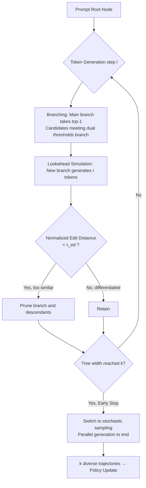

# Lookahead Tree-Based Rollouts for Enhanced Trajectory-Level Exploration in Reinforcement Learning with Verifiable Rewards

**Conference**: ICLR 2026  
**OpenReview**: [https://openreview.net/forum?id=4nLvUk8edu](https://openreview.net/forum?id=4nLvUk8edu)  
**Code**: [https://github.com/starreeze/latr](https://github.com/starreeze/latr)  
**Area**: Reinforcement Learning / LLM Reasoning (RLVR)  
**Keywords**: RLVR, GRPO, DAPO, Trajectory Diversity, Tree Search, Lookahead Simulation, Rollout Exploration

## TL;DR
LATR replaces independent token-level stochastic sampling in RLVR with a "branching-lookahead simulation-pruning" tree-based rollout. This explicitly generates trajectory-level diversity under a fixed generation budget, accelerating GRPO/DAPO training by 131% and improving final pass@1 by 4.2%.

## Background & Motivation
- **Background**: RLVR (Reinforcement Learning with Verifiable Rewards), represented by GRPO, has become the mainstream paradigm for enhancing LLM reasoning. It samples a group of trajectories for the same prompt and estimates advantages based on relative rewards within the group to update the policy, ensuring stable training without a value network.
- **Limitations of Prior Work**: The **diversity is too low** among the group of trajectories sampled during the rollout phase. When trajectories within a group are highly homogeneous, the relative advantage approaches zero, causing the learning signal to collapse and the policy update to become uninformative, which hinders scaling.
- **Key Challenge**: Existing attempts to mitigate this are superficial—increasing sampling temperature only creates token-level jitter and does not guarantee trajectory-level differentiation. Post-hoc filtering of groups with identical rewards (as in DAPO) is effective but costly, trading excessive over-generation for limited diversity. The root cause lies in the **"nearsightedness" of token-level stochastic sampling**: each sequence is sampled independently without lookahead, meaning local variations like "compute → calculate" often converge back to nearly identical reasoning paths, resulting in redundant exploration and diminishing returns.
- **Goal**: To explicitly enhance intra-group trajectory-level diversity under a **fixed generation budget** and provide a non-intrusive plugin for any policy update algorithm.
- **Core Idea**: **Replace independent sampling with tree-based rollouts**. Actively branch at token positions where the model shows high uncertainty into semantically different candidates, then use lookahead simulation to verify if "this branch truly leads to a different reasoning path." Branches that remain highly similar to the parent after simulation are directly pruned, ensuring the final $k$ trajectories are genuinely distinct from each other.

## Method

### Overall Architecture
LATR (Lookahead Tree-Based Rollout) is inspired by MCTS, maintaining a group of rollouts as a dynamic search tree. Starting from the prompt root node, it iteratively executes three stages during token-by-token generation: (1) **Branching**—creating new branches at positions of model uncertainty; (2) **Lookahead Simulation**—continuing each new branch for a fixed $r$ tokens; (3) **Pruning**—deleting branches (and their descendants) that remain too similar to the parent branch after simulation. These steps repeat until the tree width reaches the target rollout count $k$, after which all surviving branches switch to standard parallel stochastic sampling. The entire process is backtracking-free, and the number of forward passes for a group of rollouts is bounded by $O(nk)$ ($k$=tree width, $n$=maximum length).

### Key Designs

**1. Dual-Threshold Branching: Only branching at "real crossroads."** LATR does not branch blindly at every token, which would lead to exponential budget exhaustion. For each active branch at every step, the highest probability token $c^\star_s=\arg\max_c P_s[c]$ is used to extend the main branch, ensuring progress along the most likely path. Simultaneously, a new sub-branch is created only when a candidate $c$ **simultaneously** satisfies an absolute probability threshold $P_s[c] > \tau_{abs}$ and a relative difference threshold $P_s[c^\star_s] - P_s[c] < \tau_{rel}$ (Eq. 5). The former filters out low-probability noise, while the latter ensures the new branch does not deviate too far from the policy distribution—together, they precisely target reasoning crossroads where the model is genuinely hesitant between semantically different continuations. If the budget $k$ is full, candidates are prioritized by descending probability $P_s[c]$.

**2. Lookahead Simulation + Edit Distance Pruning: Judging branch value using the "future."** Branching alone cannot solve the collapse problem where token-level forks quickly converge back to the same reasoning path. For every new branch born at step $l-r$, LATR allows it to generate a fixed window of $r$ tokens (lookahead simulation), then calculates the **normalized edit distance** (Levenshtein distance of token-IDs divided by length) between these $r$ tokens and the corresponding segment of the parent branch. If $\text{EditDist}(s[-r:], s.\text{parent}[-r:]) < \tau_{ed}$ (Eq. 7), the branch is deemed not to have led to a truly different path and is pruned along with its descendants (Eq. 8). This ensures that only branches that "truly differentiate in the future" are kept, spending the precious budget only on meaningful diversity.

**3. Early Stop + Hybrid Annealing: Bridging the train-test distribution gap.** Two engineering optimizations make LATR viable for training. **Early Stop**: Once the tree width reaches $k$, there are already $k$ sequences likely to follow different paths; all further generation switches to standard stochastic sampling to maintain diversity gains without additional branching overhead. **Hybrid Rollout**: LATR explicitly pursues differentiation, but at test time, the model generates single trajectories prioritizing correctness and coherence. Pure LATR training might drive the policy toward "over-exploration." Thus, only a proportion $\eta$ of rollouts per step are assigned to LATR, while the remaining $k-\eta k$ follow stochastic sampling (Eq. 9), with $\eta$ exponentially annealing over training steps $\eta = \eta_0 \cdot \gamma^i$ ($\gamma<1$, Eq. 10). Initial training relies on LATR for diverse exploration, while later stages align closer to test-time behavior.

## Key Experimental Results

### Main Results
Model: Qwen2.5-3B, 500 training steps, 8 samples per problem for evaluation. Pass@1/Pass@8 and average length (shorter is better) are reported.

**Countdown (Logical Reasoning):**

| Method | Pass@1 ↑ | Pass@8 ↑ | Avg Length ↓ |
|---|---|---|---|
| GRPO w/ Stochastic | 65.9 | 73.9 | 473 |
| DAPO w/ Stochastic | 70.7 | 78.0 | 483 |
| GRPO w/ LATR | 70.9 (+5.0) | 77.4 | 378 (-20%) |
| DAPO w/ LATR | **74.7** (+4.0) | **81.5** | 367 (-24%) |

**Math (DAPO-Math / AMC-2023 subset Pass@1):**

| Method | DAPO-Math | AMC-2023 |
|---|---|---|
| DAPO w/ Stochastic | 26.8 | 37.8 |
| GRPO w/ LATR | 28.4 (+4.3) | 35.6 (+2.8) |
| DAPO w/ LATR | **32.5** (+5.7) | **45.3** (+7.5) |

On MATH-500 and Olympiad-Bench, LATR also shows universal gains, with average lengths decreasing by 5%–25%.

### Ablation Study (Diversity)

| Method | Pass@1 | Pass@8 | Unique Answer Count ↑ |
|---|---|---|---|
| Qwen2.5-3B + Stoch. | 5.8 | 28.9 | 6.3 |
| Qwen2.5-3B + LATR | 6.1 | 30.7 | 6.9 |
| Qwen2.5-3B-Instruct + Stoch. | 9.4 | 35.2 | 6.4 |
| Qwen2.5-3B-Instruct + LATR | 10.9 | 40.6 | 6.9 |

LATR consistently increases the number of "semantically distinct answers within a group" (judged by numerical result), measuring semantic rather than literal diversity.

### Key Findings
- **GRPO+LATR ≈ or even ≥ DAPO+Stochastic**: Without needing expensive group filtering or over-sampling from DAPO, rollout diversity alone matches heavier algorithms, confirming that "trajectory diversity is the primary driver of performance gains."
- **Significant Training Acceleration**: On Countdown, DAPO+Stochastic takes 450 steps to peak, while LATR takes only 150 steps (3× speedup); on math tasks, it is 500 steps vs 240 steps (2×). The acceleration from LATR exceeds the gains of upgrading from GRPO to DAPO.
- **Faster and Shorter**: While improving accuracy, it shortens reasoning length—diverse exploration allows the policy to internalize more efficient reasoning strategies, avoiding the long, repetitive, and over-expanded chains typical of stochastic sampling.

## Highlights & Insights
- **Elevating "Exploration" from Token to Trajectory Level**: The paper accurately identifies that the diversity bottleneck in RLVR is the nearsightedness of token-level sampling and addresses it directly with "branching position selection + lookahead verification."
- **Lookahead Simulation is the Masterstroke**: Simple branching cannot solve path convergence; using $r$-step lookahead + edit distance for post-hoc validation of branch value is a more fundamental solution than simply adjusting temperature or post-hoc filtering.
- **Non-intrusive and Budget-Controllable**: Backtracking-free with $O(nk)$ forward passes, it can be plugged into any policy update algorithm without modification, making it engineering-friendly.
- **Hybrid Annealing Confronts the Train-Test Gap**: It does not ignore the fact that explicit diversity seeking might deviate from test-time behavior, instead treating it as a first-class problem via annealing.

## Limitations & Future Work
- **High Number of Hyperparameters**: There are a total of 6 threshold/scheduling parameters ($\tau_{abs}, \tau_{rel}, \tau_{ed}, r, \eta_0, \gamma$), requiring further verification for robustness and tuning costs across different tasks.
- **Limited Scale**: Experiments focus on Qwen2.5-3B and math/logic tasks with verifiable rewards. Applicability to larger models, code generation, or open-ended long-CoT remains to be seen.
- **Simple Diversity Metric**: Pruning uses token-level edit distance, which might miss cases where "phrasing differs but logic is the same" or vice versa. Semantic-level metrics might bring further gains.
- **Extra Inference Overhead**: Tree rollouts and lookahead simulation introduce extra forward passes compared to pure stochastic sampling; while bounded by $O(nk)$, the impact on compatibility and throughput with engines like vLLM deserves quantification.

## Related Work & Insights
- **RLVR / GRPO / DAPO**: This work builds upon GRPO (group relative advantage, no value network) and DAPO (over-sampling filtering + token-level loss + decoupled clipping), treating them as pluggable "policy update backends" while only modifying the rollout phase.
- **Transferring MCTS Ideas to Rollout**: It introduces the "branching-simulation-pruning" concepts from Monte Carlo Tree Search into the RL sampling stage, but in a backtracking-free, budget-controlled lightweight version to avoid MCTS overhead.
- **Insight**: The performance bottleneck of RLVR may not lie in the policy update formula, but rather in whether the "group of samples fed to it is informative enough." Spending exploration budget on "creating truly different trajectories" might be more cost-effective than upgrading the algorithm itself—a perspective valuable for rollout strategy design, data construction, and inference-time scaling.

## Rating
- **Novelty**: ⭐⭐⭐⭐ — Explicitly integrating trajectory-level diversity into rollouts and using lookahead to verify branching is novel and hits a real RLVR pain point.
- **Experimental Thoroughness**: ⭐⭐⭐⭐ — Covers 5 datasets across GRPO/DAPO with multiple ablations on diversity, training dynamics, and thresholds; however, model scale and task types are somewhat narrow.
- **Writing Quality**: ⭐⭐⭐⭐ — Clearly derived motivation, complete with algorithms, formulas, and diagrams; the three-stage narrative is easy to follow.
- **Value**: ⭐⭐⭐⭐ — Plug-and-play, 131% speedup, 4.2% improvement, and shortened outputs; highly practical value for RLVR training.

<!-- RELATED:START -->

## Related Papers

- [\[ICLR 2026\] Rubrics as Rewards: Reinforcement Learning Beyond Verifiable Domains](rubrics_as_rewards_reinforcement_learning_beyond_verifiable_domains.md)
- [\[ICLR 2026\] LongRLVR: Long-Context Reinforcement Learning Requires Verifiable Context Rewards](longrlvr_long-context_reinforcement_learning_requires_verifiable_context_rewards.md)
- [\[ICLR 2026\] Reinforcement Learning with Verifiable Rewards Implicitly Incentivizes Correct Reasoning in Base LLMs](reinforcement_learning_with_verifiable_rewards_implicitly_incentivizes_correct_r.md)
- [\[ICLR 2026\] From Verifiable Dot to Reward Chain: Harnessing Verifiable Reference-based Rewards for RL of Open-ended Generation](from_verifiable_dot_to_reward_chain_harnessing_verifiable_reference-based_reward.md)
- [\[ICLR 2026\] RLVMR: Reinforcement Learning with Verifiable Meta-Reasoning Rewards for Robust Long-Horizon Agents](rlvmr_reinforcement_learning_with_verifiable_meta-reasoning_rewards_for_robust_l.md)

<!-- RELATED:END -->
