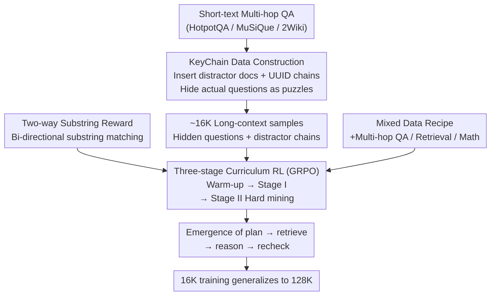

# LoongRL: Reinforcement Learning for Advanced Reasoning over Long Contexts

**Conference**: ICLR 2026 Oral  
**arXiv**: [2510.19363](https://arxiv.org/abs/2510.19363)  
**Code**: Yes (Training code and KeyChain data synthesis code provided in supplementary materials)  
**Area**: Reinforcement Learning  
**Keywords**: long-context reasoning, reinforcement-learning, GRPO, multi-hop QA, emergent reasoning patterns

## TL;DR
LoongRL is proposed, which utilizes synthesized KeyChain data for reinforcement learning to induce the emergence of "plan–retrieve–reason–recheck" patterns in LLMs for long-context reasoning. Models trained solely on 16K contexts generalize to 128K; the 14B model achieves a score of 74.2, nearing the performance of o3-mini (74.5) and DeepSeek-R1 (74.9).

## Background & Motivation

**Background**: Recent advancements in LLM reasoning (e.g., DeepSeek-R1, o1) primarily focus on short-context reasoning tasks (mathematics, code), utilizing RL to guide models toward longer chains-of-thought and self-reflection. However, long-context reasoning—requiring retrieval and integration of information from thousands of tokens of external input—remains largely unexplored.

**Limitations of Prior Work**: (a) Current long-context models support large windows (128K+) but excel mainly at **retrieval**, performing poorly in scenarios requiring **reasoning**; (b) High-difficulty long-context data for RL is extremely scarce, and diverse answer formats make verification difficult; (c) Scaling RL rollouts from short texts (<1K) to 128K contexts is computationally prohibitive; (d) Training exclusively on long-context data degrades short-context capabilities.

**Key Challenge**: Long-context reasoning requires a unique cognitive pattern (plan → retrieve → reason → verify), which cannot be acquired through simple SFT or prompting and necessitates RL for exploration and incentivization. However, datasets suitable for RL—sufficiently difficult to trigger reasoning, requiring retrieval from long contexts, and possessing verifiable answers—do not exist.

**Goal**: (a) Design high-quality RL training data to incentivize long-context reasoning; (b) Train on short contexts while generalizing to ultra-long contexts; (c) Maintain short-context performance.

**Key Insight**: It is observed that if RL data requires "tracing a chain of clues → identifying the actual question → retrieval → reasoning," structured long-context reasoning patterns will emerge. Once learned, these patterns generalize to arbitrary lengths.

**Core Idea**: Construct high-difficulty RL training data by inserting UUID chains (KeyChain) into short multi-hop QA pairs to hide the actual questions, forcing LLMs to develop "plan-retrieve-reason-recheck" patterns that generalize to 128K contexts.

## Method

### Overall Architecture
LoongRL aims to elicit long-context reasoning using data that is "challenging, verifiable, and cost-effective." Existing short-text multi-hop QA pairs are transformed into high-difficulty long-context problems (KeyChain). Multi-stage RL is then performed using GRPO on these problems, mixed with mathematics and retrieval data to preserve short-context capabilities. Inputs consist of ~16K token long texts plus a question; outputs include reasoning processes with final answers enclosed in `\boxed{}`. Crucially, training is kept at 16K, while the reasoning patterns transfer to 128K.

### Key Designs

**1. KeyChain Data Construction: Hiding the "Actual Question" via UUID Chains**

Simply adding distractor documents to the context is insufficient, as models can still directly retrieve answers. KeyChain hides the "question itself" as a puzzle. First, medium-difficulty QA pairs are filtered from HotpotQA, MuSiQue, and 2WikiMultiHopQA (277K → 72K, selected by keeping samples where Qwen2.5-32B achieves a pass rate between 0 and 1). Context is expanded to ~16K tokens with irrrelevant documents. Multiple UUID key-value chains are inserted: each key is a 32-character UUID, and its value contains either the next key or the final question. One chain leads to the original question $o\_q_i$, while others lead to distractors. The model must follow the correct chain step-by-step to find the hidden question before retrieving information from the long context. This prerequisite naturally pushes the model towards structured "plan → retrieve → reason → recheck" thinking.

**2. Two-way Substring Exact Match: A Balanced Reward Signal for Open QA**

Unlike mathematics, general QA lacks unique solutions, making reward verification difficult. Strict exact matching misclassifies valid answers in different formats, F1 is imprecise, and LLM-as-a-judge is computationally expensive and prone to bias. LoongRL employs Two-way Substring matching, where a full score is given if either the predicted answer $a$ or the ground truth string $y_{\text{ans}}$ is a substring of the other:

$$r_i = 1 \iff a \subseteq y_{\text{ans}} \lor y_{\text{ans}} \subseteq a$$

Models are required to place the final answer in `\boxed{}`. This accommodates formatting variations and is faster and more robust against reward hacking than LLM judges.

**3. Three-stage Curriculum RL: From Solvable Problems to Hard Cases**

To prevent gradient collapse where all initial rollouts fail (reward 0), LoongRL uses a three-stage strategy. Warm-up (42 steps, required for 7B) focuses on non-KeyChain data (standard QA, retrieval, math). Stage I (168 steps) introduces KeyChain data to induce the "plan-retrieve-reason-recheck" pattern. Stage II (~120-150 steps) performs hard-mining: 8 rollouts are generated per sample, and samples that are entirely correct (approx. 60-70%) are discarded to focus training on remaining difficult samples and prevent overfitting.

**4. Mixed Data Recipe: Retaining Short-Context Capabilities**

Exclusive long-context training can lead to degradation in general short-context abilities. The training set is thus a mixture: 7,500 KeyChain QA + 7,500 standard multi-hop QA + 1,024 needle retrieval + 5,000 math problems (DAPO + MATH), all restricted within ~16K context. Mathematics acts as a "ballast" to maintain general reasoning capabilities.

### Loss & Training
Group Relative Policy Optimization (GRPO) is utilized with group size $G=8$, learning rate $1 \times 10^{-6}$ with cosine decay, and KL penalty $\beta=0.001$. The entropy loss term is removed for stability. Max output length is 4,096 tokens, with temperature 0.6 and top-p 0.95 during inference.

## Key Experimental Results

### Main Results

| Model | LongBench v1 Avg | HotpotQA | 2Wiki | MuSiQue | NarrativeQA | QASPER |
|------|------------------|----------|-------|---------|-------------|--------|
| o3-mini | 74.5 | 83.0 | 89.0 | 64.0 | 60.7 | 60.5 |
| DeepSeek-R1 | 74.9 | 82.7 | 91.3 | 72.2 | 66.9 | 61.4 |
| QwenLong-L1-32B | 70.1 | 80.7 | 89.1 | 65.2 | 58.6 | 56.7 |
| Qwen2.5-7B-Instruct | 48.9 | 69.5 | 50.5 | 34.0 | 44.5 | 46.0 |
| **LoongRL-7B** | **72.4** | 83.1 | 91.1 | 65.6 | 58.4 | 63.6 |
| Qwen2.5-14B-Instruct | 53.1 | 74.0 | 60.5 | 36.5 | 48.5 | 46.0 |
| **LoongRL-14B** | **74.2** | 82.2 | 93.3 | 67.5 | 63.4 | 64.5 |

### Ablation Study

| Configuration | LongBench v1 Avg | Description |
|------|------------------|------|
| Qwen2.5-7B-Instruct | 48.9 | Baseline |
| LoongRL-7B (no KeyChain) | 66.2 | KeyChain replaced with standard multi-hop QA |
| LoongRL-7B (full) | 72.4 | Full model, KeyChain contribution +6.2% |

| Reward Verifier | Avg | Description |
|-----------|-----|------|
| F1 score | 65.1 | Insufficient precision |
| LLM-as-a-judge | 65.2 | Extra model required, poor performance |
| Exact match | 69.2 | Overly strict |
| Two-way Substring (ours) | **72.4** | Optimal |

### Key Findings
- **KeyChain is the core contribution**: Removing KeyChain drops performance from 72.4 to 66.2. Models trained with KeyChain exhibit explicit "plan" and "recheck" behaviors, whereas models without it mix reasoning and retrieval haphazardly.
- **16K training generalizes to 128K**: LoongRL-7B reaches 76.8 on RULER 128K (baseline 69.4); LoongRL-14B reaches 79.9 (baseline 73.6). NarrativeQA gains +14.8% and +16.0% in the 32K-64K range.
- **Reward Verifier Comparison**: Two-way Substring matching significantly outperforms F1, LLM judge, and exact match, demonstrating the importance of appropriate relaxation for open-ended QA.
- **Needle-in-a-haystack passed perfectly**: LoongRL-7B achieves 100% accuracy across all depths and lengths, exceeding the baselines.
- **Short-context capability maintenance**: MMLU scores increased by +2.8%/+1.1%, IFEval showed only minor decreases (-0.3%/-2.6%), and mathematics performance remained stable.

## Highlights & Insights
- **Ingenious KeyChain Data Construction**: By introducing a "find the question before answering" structure at the data level, planning capabilities emerge naturally. This approach can be transferred to other tasks requiring structural reasoning—incentivizing reasoning through data design rather than explicit instruction.
- **Short-to-Long Generalization**: Generalizing from 16K to 128K is a significant finding, suggesting that reasoning patterns once learned are length-invariant. This drastically reduces the cost of long-context RL training.
- **Two-way Substring Matching**: A simple yet effective reward design that addresses answer diversity in QA without the overhead or reward-hacking risks of an LLM-as-a-judge.
- **Multi-stage Curriculum Learning**: The "warm-up → KeyChain → hard-mining" strategy is highly practical. Specifically, the Stage II hard-mining strategy prevents computational waste on mastered samples.

## Limitations & Future Work
- **Limited Task Scope**: Evaluation is primarily focused on QA (LongBench, NarrativeQA); long-document summarization and cross-document reasoning require further testing.
- **Fixed Training Length (16K)**: While 16K to 128K generalization is effective, performance on extreme lengths (256K, 1M) is unverified.
- **Synthetic Nature of KeyChain**: UUID chains are artificial. Investigating more natural variants of information-tracing tasks is a potential direction.
- **Architecture Coverage**: Experiments were conducted only on the Qwen series; generalization to LLaMA or Mistral remains to be seen.
- **Behavioral Analysis**: Further study is needed on the stability of the emergent "plan-retrieve-reason-recheck" pattern and failure case patterns.

## Related Work & Insights
- **vs QwenLong-L1**: QwenLong-L1 utilized 60K context RL on R1-distill-Qwen-32B with only a +4.6% gain. LoongRL-7B outperforms it by +2.3% using only 16K training, highlighting the importance of KeyChain data quality.
- **vs R1-Distill Series**: R1 distilled models often degrade in long-context scenarios (e.g., 7B model -17.7%) because the distilled long CoT data focuses on short-context logic and lacks long-context-specific retrieval-reasoning patterns.

## Rating
- Novelty: ⭐⭐⭐⭐ KeyChain data construction is highly creative, though the GRPO framework is established.
- Experimental Thoroughness: ⭐⭐⭐⭐⭐ Comprehensive comparisons (including o3-mini, R1), extensive ablation, and 128K generalization/NIAH tests.
- Writing Quality: ⭐⭐⭐⭐⭐ Clear motivation, professional methodology description, and intuitive visualizations.
- Value: ⭐⭐⭐⭐⭐ Provides an efficient and reproducible solution for long-context LLM reasoning; KeyChain construction is widely applicable.

<!-- RELATED:START -->

## Related Papers

- [\[ICLR 2026\] Echo: Towards Advanced Audio Comprehension via Audio-Interleaved Reasoning](echo_towards_advanced_audio_comprehension_via_audio-interleaved_reasoning.md)
- [\[ICLR 2026\] RLVMR: Reinforcement Learning with Verifiable Meta-Reasoning Rewards for Robust Long-Horizon Agents](rlvmr_reinforcement_learning_with_verifiable_meta-reasoning_rewards_for_robust_l.md)
- [\[ICLR 2026\] LongWriter-Zero: Mastering Ultra-Long Text Generation via Reinforcement Learning](longwriter-zero_mastering_ultra-long_text_generation_via_reinforcement_learning.md)
- [\[NeurIPS 2025\] Incentivizing Reasoning for Advanced Instruction-Following of Large Language Models](../../NeurIPS2025/reinforcement_learning/incentivizing_reasoning_for_advanced_instruction-following_of_large_language_mod.md)
- [\[ICLR 2026\] LongRLVR: Long-Context Reinforcement Learning Requires Verifiable Context Rewards](longrlvr_long-context_reinforcement_learning_requires_verifiable_context_rewards.md)

<!-- RELATED:END -->
