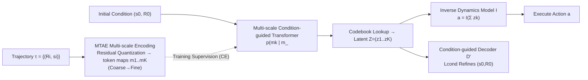

# MAGE: Multi-scale Autoregressive Generation for Offline Reinforcement Learning

**Conference**: ICLR 2026  
**OpenReview**: [https://openreview.net/forum?id=32BLpC50V0](https://openreview.net/forum?id=32BLpC50V0)  
**Code**: [https://github.com/xmu-rl-3dv/MAGE](https://github.com/xmu-rl-3dv/MAGE)  
**Area**: Reinforcement Learning / Offline RL / Generative Decision-Making  
**Keywords**: Offline Reinforcement Learning, Multi-scale Autoregressive, Trajectory Generation, VAR, Long-horizon Sparse Reward  

## TL;DR
Transferring the "Visual Autoregressive (VAR)" paradigm from the image domain to trajectory modeling in offline RL: a coarse-grained global trajectory sketch is generated first, followed by layer-wise autoregressive refinement to fine granularity. This approach simultaneously ensures global coherence and local controllability in long-horizon sparse-reward tasks.

## Background & Motivation
- **Background**: Generative offline RL (Decision Transformer, Diffuser, Decision Diffuser, etc.) has become a mainstream direction due to its powerful distribution modeling capabilities, which can characterize complex multi-modal trajectory distributions.
- **Limitations of Prior Work**: Existing methods struggle with "long-horizon + sparse-reward" tasks. Transformer-based models use unidirectional step-by-step autoregression, lacking bi-directional global context understanding. Diffusion models, while stronger overall, exhibit "local generation bias," producing trajectories that are locally plausible but globally inconsistent, alongside slow iterative denoising inference.
- **Key Challenge**: Existing hierarchical generation methods (HGM, such as HDMI, HD) attempt to alleviate long-horizon issues using a fixed two-layer hierarchy ("high-level subgoals + low-level actions"). however, **the fixed two-layer structure cannot capture the multi-scale temporal structures inherent in trajectories**, and requiring the joint optimization of two interdependent policies harms training efficiency and stability.
- **Goal**: To model trajectories across multiple temporal resolutions with a unified model, capturing both long-term dependencies (coarse scales) and short-term details (fine scales), while maintaining precise conditional control over the starting state of the generated trajectory.
- **Core Idea (Multi-scale Autoregressive Generation)**: Migrate the VAR paradigm of "generating token maps scale-by-scale from low to high resolution" to trajectories—**top-down, coarse-to-fine** autoregressive generation of a multi-scale trajectory representation, followed by an inverse dynamics model to extract executable actions from the latent representation.

## Method

### Overall Architecture
MAGE represents a trajectory as a sequence of "return-to-go and states" $\tau = \{(R_0, s_0), \dots, (R_T, s_T)\}$. The pipeline consists of two primary modules: the **Multi-scale Trajectory Autoencoder (MTAE)** (compressing trajectories into coarse-to-fine multi-scale discrete token maps) and the **Multi-scale Condition-guided Autoregressive Generator** (generating these token maps scale-by-scale guided by initial conditions $(s_0, R_0)$). After generation, an inverse dynamics model extracts actions from the aggregated latent representation.

### Key Designs

**1. Multi-scale Trajectory Autoencoder (MTAE): Using residual quantization to decompose trajectories into a "coarse-to-fine" token pyramid.** MTAE follows the VQ-VAE encoder-quantization-decoder framework, but with a critical modification: **top-down multi-scale quantization**. Given a predefined set of temporal scales $[l_k]_{k=1}^K$, the encoder first obtains a continuous feature $f$. At the $k$-th scale, $f$ is downsampled and quantized to obtain a token map $m_k \in [V]^{l_k}$. The quantized result is then upsampled and subtracted from $f$ ($f \leftarrow f - z_k$), forcing the next finer scale to fit only the "residual." Thus, $m_1$ encodes the coarsest global structure while $m_K$ encodes the finest short-term details. All scales **share the same codebook $C$**, ensuring tokens have consistent dimensions and vocabulary for unified autoregression. Empirical results show that modeling $(R, s)$ is superior to modeling actions or $(R, s, a)$.

**2. Multi-scale Condition-guided Autoregressive Generation: Converting the "scale-by-scale" VAR generation into a return-conditioned decision-maker.** The generator uses a causal Transformer to autoregressively predict the entire sequence of token maps, where the joint probability is factorized into scale-wise conditionals:
$$p(m_1,\dots,m_K \mid s_0, R_0) = \prod_{k=1}^{K} p(m_k \mid m_{<k}, s_0, R_0).$$
The input at each scale includes the initial state $s_0$, return $R_0$, and all previously generated coarser maps $m_{<k}$. Training is performed via cross-entropy alignment with ground-truth token maps: $\mathcal{L}_{CE} = -\sum_k \sum_i m_{k,i}^\top \log \hat{m}_{k,i}$. This "coarse-to-fine + global RTG conditioning" allows the model to determine macro-trends first and then fill in details layer-by-layer, resulting in global coherence and precise guidance toward high-reward trajectories.

**3. Latent Space Inverse Dynamics for Actions: Extracting actions from aggregated latent representations instead of full trajectories.** After obtaining the latent representation $Z=(z_1,\dots,z_K)$, MAGE does not directly read actions from a decoded trajectory. Instead, a latent inverse dynamics model $I$ decodes the current action from the aggregated representation:
$$a = I\Big(\sum_{k=1}^{K} z_k\Big), \qquad \mathcal{L}_{inv} = \|a - a_0\|_2^2,$$
where $a_0$ is the ground-truth action at $t=0$. This objective forces $Z$ to retain "dynamically consistent" information for the immediate step at the finest scale. Ablations show that using aggregated latents is more effective than using full generated trajectories.

**4. Condition-guided Refinement: Using a lightweight adapter decoder to anchor the trajectory start to real initial conditions.** Cross-entropy alone cannot guarantee that the first state of a generated trajectory strictly equals $s_0$, and information loss from quantization can cause the starting point to drift. MAGE adds a parameter-efficient refinement module $D'$ within the decoder, using MSE to pull the decoded initial state-return pair back to the ground truth:
$$\mathcal{L}_{cond} = \|D'(Z, R_0)_0 - (s_0, R_0)\|_2^2.$$
This term ensures "conditional coherence"—without it, trajectories may deviate from the set starting condition immediately.

## Key Experimental Results

### Main Results Table (Selected normalized scores, higher is better)
Evaluated across 5 offline RL benchmarks against 15 baselines, MAGE significantly leads in long-horizon sparse-reward tasks.

| Benchmark | Task/Setting | Prev. SOTA | MAGE | Notes |
|------|-----------|----------|------|------|
| Adroit | Mean(w/o Expert) | IQL 21.4 | **38.3** | Sparse reward, high-dim dexterous manipulation |
| Adroit | Mean(all settings) | DT 49.2 | **66.9** | — |
| Franka Kitchen | Average | HD 72.5 | **88.8** | Compositional sequential subgoals |
| AntMaze | Average | ADT 78.1 | **89.7** | Long-horizon navigation, wins 5/6 datasets |
| Maze2D | Single-task Avg | HD 139.9 | **153.3** | — |
| Multi2D | Multi-task Avg | HD 149.9 | **155.0** | — |

On extremely difficult settings like Adroit Hammer-Human/Cloned, MAGE often shows multi-fold improvements over the second-best method (e.g., Hammer-Cloned 13.2 vs. 2.1). It also ranks first in 7/9 dense-reward MuJoCo locomotion tasks, proving its versatility.

### Ablation Study
Ablations on Adroit Pen-Expert / Door-Cloned (Ours represents full MAGE):

| Ablation Dimension | Comparison | Pen-Expert | Door-Cloned |
|----------|----------|-----------|-------------|
| Num. Scales K | K=1 → K=8(Ours) | 123.5 → **147.8** | 5.2 → **20.5** |
| Gen. Scheme | A+CQL / (R,S,A) / (R,S)=Ours | 127.6 / 124.9 / **147.8** | 4.9 / 17.2 / **20.5** |
| RTG Condition | w/o D / w/o mk>1 / w/o Lcond / Ours | 140.3 / 139.5 / 139.9 / **147.8** | 12.3 / 16.3 / 17.1 / **20.5** |

**Inference Speed (Adroit, ms per step, lower is better)**:

| Method | MAGE | DT | TT | ADT | DD | HD |
|------|----|----|----|----|----|----|
| Time(ms) | 27.3 | 6.5 | 12863 | 7.8 | 2339 | 1480 |

### Key Findings
- **Multi-scale is effective**: Performance improves consistently as $K$ increases up to 8, validating the value of multi-scale temporal modeling. However, performance may drop beyond $K=8$ (e.g., Door-Cloned), suggesting excessive subdivision introduces noise; the optimal $K$ is task-dependent.
- **Modeling (R, S) is optimal**: Modeling only states, only actions, actions+CQL, or (R,S,A) is inferior to modeling only returns and states. Adding actions introduces unnecessary complexity, while (R,S) balances high-level intent with environmental dynamics.
- **RTG conditions are indispensable**: Removing RTG from the autoencoder, fine-scale Transformer, or condition loss leads to performance degradation.
- **Fast and practical**: Approximately 50× faster than HD and 80× faster than DD. At 27 ms/step, it meets the requirement for 20 Hz real-time robot control.

## Highlights & Insights
- **Clean Cross-modal Paradigm Transfer**: Successfully migrates the "next-scale prediction" of VAR from image generation to trajectories. "Coarse-to-fine" naturally maps to "global planning → local refinement" in the temporal dimension, an analogy that fits the hierarchical nature of decision tasks better than diffusion.
- **Single Unified Policy vs. Dual Heterogeneous Policies**: Unlike HDMI/HD/ADT which rely on two interdependent policies, MAGE use a single model across all temporal levels, bypassing training instabilities associated with dual-policy optimization.
- **Latent Inverse Dynamics + Starting Refinement are Key Engineering Patches**: The former avoids over-reliance on the full quantized reconstruction, while the latter anchors the starting point via a lightweight adapter. Both ensure "conditional coherence," as verified by ablations.

## Limitations & Future Work
- **Global Commitment Constraints**: Once a global plan is fixed at a coarse scale, the flexibility for refinement at finer scales is constrained—an inherent trade-off in hierarchical design.
- **Extreme Sparse/Long-horizon Scenarios**: In extreme tasks like OGBench, MAGE is "competitive" but not dominant; the authors acknowledge these scenarios remain an open challenge.
- **Distribution Shift / OOD Robustness**: Traditional offline RL issues regarding robustness in out-of-distribution scenarios require further study.
- **Manual Scale Scheduling**: The optimal $K$ and scale scheduling are task-specific hyperparameters lacking an adaptive mechanism.
- Future work intends to extend multi-scale mechanisms to multi-agent collaborative modeling.

## Related Work & Insights
- **Generative Offline RL**: Decision Transformer / Trajectory Transformer (Autoregressive), Diffuser / Decision Diffuser / RGG (Diffusion-based planning), Diffusion-QL (Diffusion actions). MAGE identifies "local generation bias" and slow inference as root causes for diffusion-based failures in long-horizon tasks.
- **Hierarchical Offline RL**: HDT, ADT (Autoregressive 2-layer); HDMI, HD (Diffusion 2-layer) involve fixed scales and dual policies. CARP uses coarse-to-fine autoregression but models only action sequences without explicit return conditioning. MAGE differentiates itself via **a single unified policy + multi-scale + return-conditioned state/RTG autoregression**.
- **Foundations**: Organic integration of VAR (multi-scale autoregressive image generation), VQ-VAE (discrete latent representations), and Decision Transformer's RTG conditioning.

## Rating
- **Novelty**: ⭐⭐⭐⭐ — Porting the VAR "next-scale" paradigm to offline RL trajectory modeling is a clear and persuasive cross-modal innovation.
- **Experimental Thoroughness**: ⭐⭐⭐⭐ — Broad coverage across 5 benchmarks and 15 baselines. Comprehensive ablations. Minor penalty as it is only "competitive" in extremely sparse OGBench tasks.
- **Writing Quality**: ⭐⭐⭐⭐ — Logical flow from motivation to method to experiments. Clear visualizations and pseudocode.
- **Value**: ⭐⭐⭐⭐ — achieves SOTA on the "hard nut" of long-horizon sparse-reward tasks with inference speeds 1-2 orders of magnitude faster than diffusion baselines. Significant practical implications for robotics/planning.

<!-- RELATED:START -->

## Related Papers

- [\[ICLR 2026\] Trajectory Generation with Conservative Value Guidance for Offline Reinforcement Learning](trajectory_generation_with_conservative_value_guidance_for_offline_reinforcement.md)
- [\[ICLR 2026\] In-Context Compositional Q-Learning for Offline Reinforcement Learning](in-context_compositional_q-learning_for_offline_reinforcement_learning.md)
- [\[ICLR 2026\] MOBODY: Model-Based Off-Dynamics Offline Reinforcement Learning](mobody_model-based_off-dynamics_offline_reinforcement_learning.md)
- [\[ICLR 2026\] Belief-Based Offline Reinforcement Learning for Delay-Robust Policy Optimization](belief-based_offline_reinforcement_learning_for_delay-robust_policy_optimization.md)
- [\[ICLR 2026\] Peng's Q($\lambda$) for Conservative Value Estimation in Offline Reinforcement Learning](pengs_qlambda_for_conservative_value_estimation_in_offline_reinforcement_learnin.md)

<!-- RELATED:END -->
