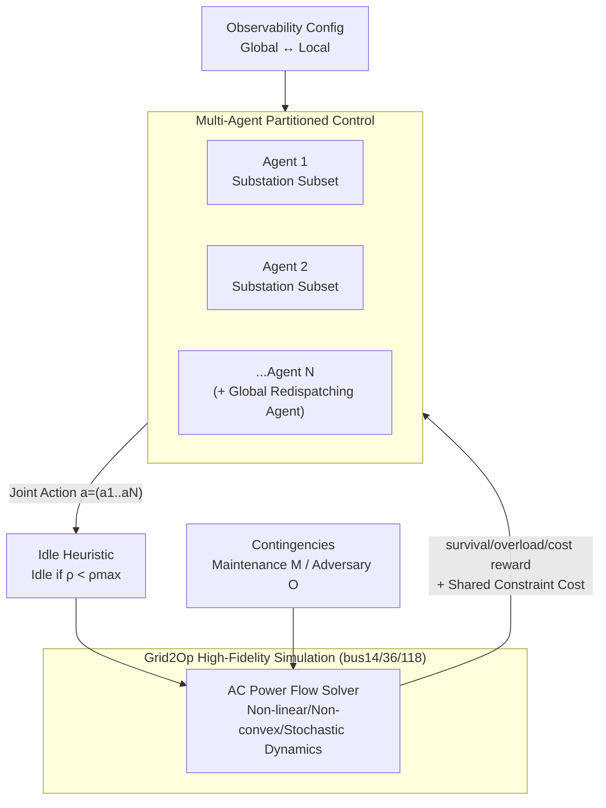

# MARL2Grid-TR: A Multi-Agent RL Benchmark in Power Grid Operations

**Conference**: ICLR 2026  
**OpenReview**: [https://openreview.net/forum?id=mpAMH1OyMO](https://openreview.net/forum?id=mpAMH1OyMO)  
**Code**: Open-sourced (released with the paper on OpenReview)  
**Area**: Reinforcement Learning / Multi-Agent Reinforcement Learning / Power Grid Operations Benchmark  
**Keywords**: Multi-Agent Reinforcement Learning, Power Grid Topology Optimization, Redispatching and Curtailment, Dec-POMDP, Constrained MARL, Grid2Op  

## TL;DR
This paper introduces MARL2Grid-TR, the first multi-agent RL benchmark for "topology optimization + redispatching/curtailment" control in realistic transmission grids. Based on the high-fidelity Grid2Op simulation platform from a French TSO, it models power grid control as a multi-agent collaborative task. Experiments demonstrate that mainstream MARL methods fail significantly under realistic constraints, particularly in high-dimensional topology tasks.

## Background & Motivation
**Background**: With the large-scale integration of variable renewable energy (VRE) such as wind and solar, power grid operations require unprecedented flexibility. System operators primarily use two methods to maintain stability: (i) topology optimization (reconfiguring grid connections to alleviate line overloads), and (ii) redispatching and curtailment (adjusting generator/storage output to balance supply and demand in real-time). Reinforcement Learning has shown potential through the L2RPN competition series and the recent RL2Grid benchmark.

**Limitations of Prior Work**: Almost all previous work models power grid control as a **single-agent task**. However, real power grids are inherently decentralized—they are divided among multiple operators, and even within a single operator's jurisdiction, the system operates in a decentralized manner. Existing benchmarks (L2RPN, RL2Grid) support neither diverse observability settings nor coordination between multiple agents, creating a gap between research and actual deployment.

**Key Challenge**: Topology actions involve a **combinatorial explosion** of discrete spaces (a single substation can have over 65,000 valid actions). This is compounded by partial observability, long-horizon objectives, and hard physical constraints (line thermal capacity, generator ramping, substation switching limits). Violating constraints leads to blackouts or economic losses. This is a high-dimensional, non-convex, and non-linear decision problem that must be solved in real-time, posing significant difficulties for both traditional optimizers and human operators.

**Goal**: To fill the vacancy of "decentralized multi-agent" research by providing a standardized, scalable multi-agent RL benchmark developed in collaboration with TSOs.

**Core Idea**: **Reformulate power grid control as a multi-agent coordination problem**, where each agent controls a subset of substations and collaborates to maintain supply-demand balance and grid stability under configurable observability. The benchmark provides two types of tasks (discrete topology and continuous redispatching), an expert-heuristic idle transition, and a formalization of globally shared security constraints.

## Method

### Overall Architecture
MARL2Grid-TR models the power grid as a Multi-Agent Markov Decision Process (MMDP), which degrades to a Dec-POMDP under partial observability. The benchmark is built upon three real-scale Grid2Op networks (bus14/bus36/bus118). Substations are assigned to agents using a partitioning method that ensures "strong internal connectivity and weak external coupling," replicating real TSO control zones. Each agent performs topology (discrete) or redispatching/curtailment (continuous) actions within its jurisdiction during long episodes (weekly to monthly) with 5-minute steps. The observability can be toggled between "global" and "strictly local." These elements are integrated with an expert idle heuristic to compress decision horizons and globally shared security constraints.

### Key Designs

**1. Dual-Task and Dual-Action Spaces: Discrete Topology vs. Continuous Redispatching, capturing the inherent difficulty of combinatorial explosion.** In the discrete topology task, each agent can toggle line connections and reassign elements to one of two buses within a substation ("bus-splitting"). For a double-bus substation with $N_{lines}$ lines, $N_g$ generators, and $N_l$ loads, the number of discrete actions is $N = 2^{N_{lines}+N_g+N_l-1}-1$. For instance, a 7-element substation has 63 configurations, while a single substation in bus36 can exceed 65,000 valid actions, making traditional optimization infeasible. The continuous redispatching task uses a **hybrid agent structure**: decentralized agents manage renewable curtailment and storage charging/discharging in their zones, while a **global redispatching agent** adjusts the output of remaining generators. The action space grows linearly with the number of generators and storage units ($N = N_{redisp}+N_{curt}+N_{stor}=69$ for bus118), making it inherently simpler than the topology task.

**2. Multi-agent idle heuristic: Injecting expert knowledge into transition dynamics to compress effective horizons.** Given the complexity and dimensionality, an expert idle heuristic $I$ is introduced to focus on "safety-critical moments." In topology tasks, an idle action is issued if all line loads $\rho$ are below a safety threshold $\rho_{max}$, suspending agent control while the environment advances. If any line exceeds the limit, control is returned to the agents for restoration. In continuous tasks, the system first attempts to reconnect available lines before performing the same idle check. Crucially, this heuristic **complements rather than replaces** agent learning; an agent's action can trigger a sequence of heuristic-guided transitions where rewards accumulate, reducing redundant exploration and improving sample efficiency. However, experiments also reveal it can "backfire" in decentralized discrete control (see Key Findings).

**3. Task-Adaptive Reward Design: Tri-component weighting for topology and margin-driven rewards for continuous tasks.** Topology optimization follows a three-component reward designed with TSOs: $R = \alpha R_{survive} + \beta R_{overload} + \eta R_{cost}$, encouraging survival, penalizing overloads, and accounting for economic costs. Continuous redispatching uses line margins directly to construct the reward: $R = 1 - \frac{\sum_{l\in L_c}\rho_l}{|L_c|}$, where $L_c$ is the set of connected lines and $\rho_l$ is the line load. Since the grid becomes riskier as it approaches thermal limits, modeling the margin directly improves learning in continuous settings.

**4. Globally Shared Multi-Agent Security Constraints: Global consequences of local actions force system-level collaboration.** Due to the high coupling and non-linear nature of power grids, an agent's local decision can affect the entire network. Thus, constraint costs are **not assigned to individual agents but are globally aggregated and shared**, mirroring the joint reward structure. This forces agents to look beyond local perspectives to maintain system-wide safety. Two types of constraints are defined: Load shedding and Islanding (L), using indicators $L(s,a)=\mathbb{1}(P_G(s,a)<P_D(s,a))$ and $I(s,a)=\mathbb{1}(N_I(s,a)>0)$ to form a step cost $C_L=L+I$, requiring zero cumulative cost for safety; and Line Overload (O), using overload indicators $O_\ell=\mathbb{1}(P_{F,\ell}>P^{max}_{F,\ell})$ and disconnection indicators $D_\ell$ to form $C_O = \sum_{\ell\in L}(O_\ell+D_\ell)$, with a cumulative constraint $\sum_t C_O \le \tau$. Constraints are typically solved via Lagrangian relaxation, leading to LagrMAPPO being the primary constrained baseline.

## Key Experimental Results

The benchmark evaluates several mainstream MARL methods that serve as foundations for advanced algorithms: QPLEX, MAPPO (with/without idle heuristic), and LagrMAPPO (constrained version). It also compares against fully observable single-agent PPO/LagrPPO to determine if challenges arise from MARL decomposition or the task itself. Experiments involved ~120,000 CPU hours, with results averaged over 5 independent runs and a 100-episode window using 95% bootstrap confidence intervals.

### Main Results

Average Survival Rate for bus14 Discrete Topology Task (2-year test data):

| Agent Type | Average Survival Rate |
|---|---|
| DoNothing (Idle only) | 0.18 |
| QPLEX | 0.04 |
| **MAPPO** | **0.79** |
| PPO (Fully Obs. Single-Agent) | 0.38 |
| LagrMAPPO (L \| O) | 0.19 \| 0.04 |
| LagrPPO (L \| O) | 0.04 \| 0.01 |

Average Survival Rate for bus118 Continuous Redispatch/Curtailment (2-year test data):

| Agent Type | Average Survival Rate |
|---|---|
| DoNothing | 0.29 |
| RecoPowerline (Idle heuristic only) | 0.34 |
| MASAC | 0.25 |
| MAPPO | 0.58 |
| **PPO (Trained to convergence ~10M steps)** | **0.67** |

### Ablation Study

Impact of idle heuristic and constraint dimensions on the bus14 discrete task:

| Configuration | Average Survival Rate | Observation |
|---|---|---|
| MAPPO (Peak of training curve) | ~0.84 | Learned the most effective strategy |
| MAPPO + Idle Heuristic | ~0.20 | Idle **significantly hurts performance** in decentralized discrete tasks |
| Best LagrMAPPO (L) | ~0.21 | Good constraint satisfaction but poor performance |
| MAPPO on bus118 Topology | Failed | Even the best baseline cannot control large grid topology |

### Key Findings
- **MAPPO outperforms fully observable single-agent PPO** (0.79 vs. 0.38 in bus14 discrete), proving that decentralized decomposition provides benefits and the challenge is not solely a MARL decomposition issue.
- **The idle heuristic backfires in discrete topology tasks**: It compresses the agent's already limited window for "multi-step coordinated reconfiguration." Successful topological interventions are rare and require temporal coordination in exponential action spaces; depriving agents of action opportunities severely hinders exploration—contrary to findings in single-agent settings.
- **Four root causes for total failure in large-scale grid topology**: (i) Difficulty in exploring combinatorial action spaces; (ii) Coordination issues in electrical coupling across zones (local margin gains causing remote overloads); (iii) Severe credit assignment problems due to partial observability and delayed global overload penalties; (iv) Long-term irreversible consequences of topology switching (cooldown timers, islanding, overloads turning into disconnections), where early random actions lead to unrecoverable states.
- **Continuous tasks are relatively simpler**: MAPPO reached ~0.58 and PPO reached 0.67 after convergence (though requiring ~10M steps with lower sample efficiency). Both roughly doubled the survival time of DoNothing.

## Highlights & Insights
- **The first multi-agent topology + redispatching benchmark for realistic transmission grids**, built on industrial-grade Grid2Op in collaboration with TSOs. It is the only environment that simultaneously supports "large-scale + multi-agent + topology + redispatching/curtailment + constraints" compared to predecessors (Table 1).
- **PettingZoo standard interface + optional heuristic transitions + constraint formalization + multiple baseline implementations**, making it reproducible and highly configurable (users can redefine partitions, toggle observability, or even test extreme decentralization).
- **Honest negative results**: The authors do not hide the total failure of mainstream MARL in large-grid topology. Instead, they decompose the failure into four root causes and systematically list future directions (beyond imitation, coordination under partial observability, scalability, etc.), treating the benchmark as a "diagnostic tool for exposing problems" rather than a leaderboard.
- **Hybrid agent structures and shared constraints** originated from discussions with TSOs, encoding the real-world operational pain point where "local actions have global consequences" into the formal model.

## Limitations & Future Work
- **Unsolved at the algorithmic level**: The paper proves the difficulty but does not propose a new algorithm to master large-grid topology—this remains an open challenge for the community.
- **Simulation fidelity boundaries**: While the Grid2Op AC solver captures core operational constraints, it omits fast transients, detailed inverter/protection dynamics, and some operational constraints; it also lacks N-1 security.
- **Narrow evaluation metrics**: Primarily focused on average survival rate. The authors acknowledge the need to evaluate economic impact, robustness against rare but critical extreme conditions (using formal tools), and coordination in massive heterogeneous networks.
- **Scalability ceiling**: bus118 is a "sweet spot" for exposing core challenges while remaining computationally feasible, but scaling to thousands of buses is not yet viable for current algorithms or compute resources.
- **Deployment path**: The conservative nature of the power industry requires staged validation through offline simulation, shadow mode deployment, and safety filters before real-world adoption.

## Related Work & Insights
- **Extended the L2RPN / RL2Grid lineage**: RL2Grid (Marchesini et al., 2025b) established single-agent Grid2Op benchmarks for L2RPN. This work extends it to multi-agent settings and formalizes multi-agent idle transitions and constraints.
- **MARL Algorithm Stack**: Value decomposition (QPLEX) and policy gradients (MAPPO/MASAC) under the CTDE paradigm, along with constrained variants like LagrMAPPO. These were chosen as baselines for their widespread adoption and role as foundations for advanced methods.
- **Inspiration**: This paper demonstrates a high-value path for "benchmark papers"—not just stacking tasks to chase metrics, but using realistic constraints to **precisely expose and attribute failure modes of existing methods**. This directs community attention toward true bottlenecks (combinatorial actions, partial observability, irreversible long-term effects). The "shared constraints + hybrid agents + configurable observability" design can be transferred to other collaborative control fields where local decisions have global consequences, such as traffic or communication networks.

## Rating
- **Novelty**: ⭐⭐⭐⭐ First multi-agent topology + redispatching benchmark for realistic grids; fills a clear gap between single-agent and multi-agent research. Formalization of multi-agent idle transitions and shared constraints are significant contributions.
- **Experimental Thoroughness**: ⭐⭐⭐⭐ Comprehensive coverage of three grid scales, dual discrete/continuous tasks, constrained vs. unconstrained, and single vs. multi-agent comparisons. Involves ~120k CPU hours and diagnostic analysis, though algorithm coverage is representative rather than exhaustive.
- **Writing Quality**: ⭐⭐⭐⭐ Logic flows clearly from motivation to formalization to failure attribution. Table 1 provides clear positioning, and negative results are addressed with thorough "why it failed" analysis.
- **Value**: ⭐⭐⭐⭐ Provides a standardized, scalable, industrial-grade platform for power grid MARL. By identifying failure modes, it offers significant steering value for the Energy AI and Constrained MARL communities.

<!-- RELATED:START -->

## Related Papers

- [\[ICLR 2026\] Multi-Agent Guided Policy Optimization](multi-agent_guided_policy_optimization.md)
- [\[ICLR 2026\] Retaining Suboptimal Actions to Follow Shifting Optima in Multi-Agent RL](retaining_suboptimal_actions_to_follow_shifting_optima_in_multi-agent_reinforcem.md)
- [\[ICLR 2026\] When Is Diversity Rewarded in Cooperative Multi-Agent Learning?](when_is_diversity_rewarded_in_cooperative_multi-agent_learning.md)
- [\[ICLR 2026\] MATH-Beyond: A Benchmark for RL to Expand Beyond the Base Model](math-beyond_a_benchmark_for_rl_to_expand_beyond_the_base_model.md)
- [\[CVPR 2026\] MangoBench: A Benchmark for Multi-Agent Goal-Conditioned Offline Reinforcement Learning](../../CVPR2026/reinforcement_learning/mangobench_a_benchmark_for_multi-agent_goal-conditioned_offline_reinforcement_le.md)

<!-- RELATED:END -->
