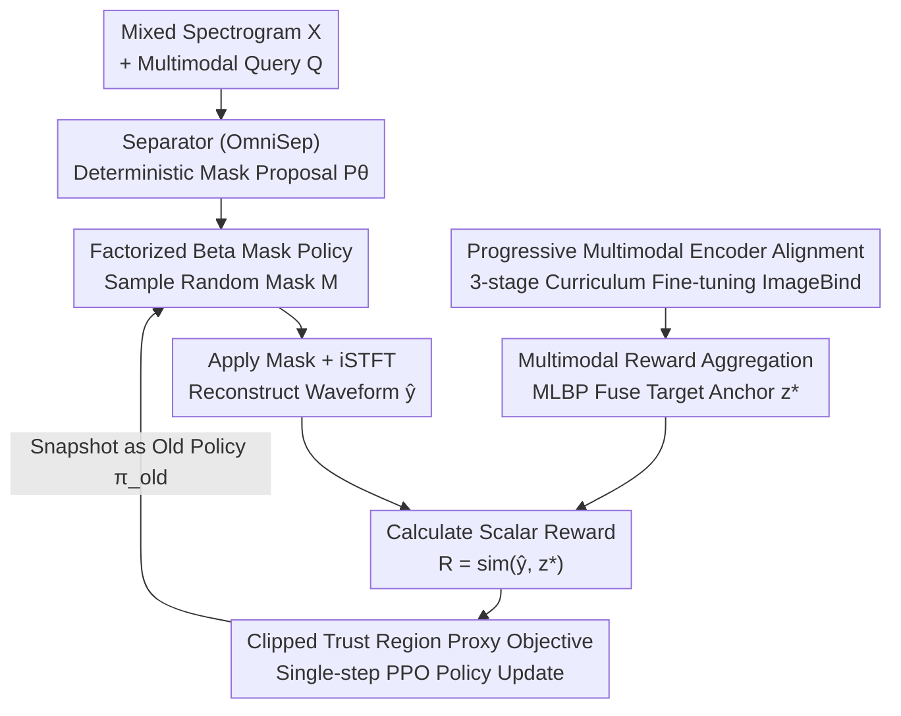

# MARS-Sep: Multimodal-Aligned Reinforced Sound Separation

**Conference**: ICLR 2026  
**arXiv**: [2510.10509](https://arxiv.org/abs/2510.10509)  
**Code**: [https://github.com/mars-sep/MARS-Sep](https://github.com/mars-sep/MARS-Sep)  
**Area**: Audio Processing / Reinforcement Learning  
**Keywords**: Sound Separation, Reinforcement Learning, Multimodal Alignment, Beta Policy, Preference Reward

## TL;DR

MARS-Sep reformulates query-conditioned sound separation as a reinforcement learning problem. It performs stochastic decision-making in the time-frequency domain via a factorized Beta mask policy and utilizes a progressively aligned multimodal encoder to provide semantic reward signals, achieving simultaneous improvements in signal fidelity and semantic consistency.

## Background & Motivation

**Background**: Universal Sound Separation aims to isolate individual sound sources from any audio mixture. Query-conditioned sound separation further allows users to specify target sources via audio, text, or image queries. Current mainstream methods (e.g., AudioSep, OmniSep) primarily optimize signal-level loss functions (e.g., SDR, SI-SDR) to reconstruct target waveforms by predicting time-frequency masks.

**Limitations of Prior Work**: Existing methods face a fundamental "metric dilemma"—models optimized for waveform reconstruction may score high on signal metrics but still contain perceptually significant interference in the output, violating semantic correspondence with the query. For instance, a model optimizing SDR might fail to distinguish between acoustically similar but semantically distinct sources (e.g., violin vs. viola) because signal-level losses do not encode semantic information.

**Key Challenge**: There is a fundamental misalignment between signal-level optimization objectives (low-level feature matching) and semantic-level separation requirements (high-level semantic alignment). Traditional regression-based mask prediction directly aligns with ground-truth masks, failing to integrate the user's semantic intent into the optimization process.

**Goal**: (1) How to enable the separation model's optimization objective to consider both signal fidelity and semantic consistency? (2) How to transform mask prediction from deterministic regression into explorable stochastic decision-making? (3) How to obtain stable and semantically rich reward signals?

**Key Insight**: Inspired by RLHF, the authors analogize query-conditioned sound separation to a preference alignment problem—the user query represents the preference, and the goal is to produce an output that maximizes semantic alignment with that query. The separation model is treated as a base policy and optimized via reinforcement learning.

**Core Idea**: Use a factorized Beta distribution policy to perform stochastic mask sampling on time-frequency bins, provide semantic rewards via a progressively aligned multimodal encoder, and stabilize training with a clipped trust region proxy objective.

## Method

### Overall Architecture

MARS-Sep addresses the "metric dilemma" of query-conditioned sound separation: models optimizing only signal-level loss achieve high scores but fail to preserve semantics. The core strategy is to rewrite separation from a one-time regression into a **single-step reinforcement learning** loop—the separator no longer directly outputs a final mask but provides a "proposal," which is then explored stochastically, scored by semantic rewards, and converged using trust region updates.

Mechanism: The input consists of a mixed spectrogram $X$ and a multimodal query $Q$ (audio/text/image). A separator built on OmniSep first predicts a deterministic mask proposal $P_\theta(X,Q) \in [0,1]{H \times W \times K}$. This proposal is parameterized into a mask policy $\pi_\theta(M|X,Q)$ composed of a family of Beta distributions, from which a stochastic mask $M$ is sampled. The mask is applied to the spectrogram, and the waveform $\hat{y}$ is reconstructed via iSTFT. On the reward side, a multimodal encoder (based on ImageBind), fine-tuned through three-stage curriculum learning, fuses the three potential query modalities into a single anchor $z^*$ using MLBP. The scalar reward $R$ is then calculated based on the similarity between $\hat{y}$ and $z^*$. Finally, the policy is updated using a clipped trust region proxy objective, with the current policy snapshotted as the old policy for the next iteration.

### Key Designs

**1. Factorized Beta Mask Policy: Turning Deterministic Masks into Explorable Stochastic Decisions**

Regression-based mask prediction outputs a fixed value for each time-frequency bin, leaving no room for "trial and error" or adjustment based on downstream semantic feedback. MARS-Sep reinterprets the separator output $P_\theta$ as parameters for a family of Beta distributions. The mask policy is defined as the product of independent Beta distributions across all bins:

$$\pi_\theta(M|X,Q) = \prod_{h,w,k} \text{Beta}(M_{h,w,k}; \alpha_{h,w,k}, \beta_{h,w,k}), \quad \alpha = 1 + \kappa P_\theta,\ \beta = 1 + \kappa(1-P_\theta)$$

The concentration scale $\kappa > 0$ controls the balance between exploration and exploitation: smaller $\kappa$ results in a flatter distribution and more divergent sampling. This allows for exploration in early training followed by annealing to tighten the distribution (experiments found $\kappa=9$ achieves the best balance). Beta is chosen over Gaussian or discrete distributions because its $[0,1]$ support naturally matches the mask value range, avoiding truncation and preventing degradation into near-binary masks. The factorized structure allows per-bin log-probability calculation, making sampling and computation efficient.

**2. Progressive Multimodal Encoder Alignment: Cultivating Real Discriminative Power in Reward Models**

Using a pre-trained ImageBind directly as a reward model often leads to "reward hacking," where the policy improves scores without improving separation quality. MARS-Sep progressively fine-tunes ImageBind into a reliable reward model in three stages before RL, freezing the backbone and only unfreezing task heads and temperature parameters. Stage 1 focuses on audio-text alignment using symmetric InfoNCE loss $\mathcal{L}_{S1}$ to establish semantic anchors. Stage 2 shifts to audio-audio discrimination, adding triplet loss and consistency loss $\mathcal{L}_{S2}$ to enhance intra-class distinction (critical for distinguishing similar sources like violin and viola), while mixing in Stage 1 data to prevent forgetting. Stage 3 handles audio-video grounding using joint InfoNCE and triplet loss $\mathcal{L}_{S3}$, retaining capabilities from previous stages. This curriculum-based approach ensures the encoder provides more stable and informative rewards than one-step alignment.

**3. Multimodal Reward Aggregation: Fusing Three Modalities into One Semantic Anchor**

Target sources can be specified by audio, text, or image. Simply summing per-modality similarities can bias the reward toward one modality. MARS-Sep uses Multi-Modal Low-Rank Bilinear Pooling (MLBP) to fuse the three target embeddings into a single anchor $z^* = \text{MLBP}(\phi_a(y^*), \phi_t(t^*), \phi_v(v^*))$. The scalar reward is the similarity $R = \text{sim}(\phi_a(\hat{y}), z^*)$. Bilinear pooling explicitly models multiplicative cross-modal interactions (e.g., an instrument named in text should also appear in the image), forcing the separation to align with all given modalities simultaneously. Ablations show MLBP is more stable than Max/Average Pooling or learnable weighting when semantic cues are complex.

**4. Clipped Trust Region Proxy Objective: Stabilizing Updates with Single-step PPO**

Directly using plain policy gradient after stochastic sampling leads to high variance and instability. MARS-Sep adapts PPO’s clipped trust region logic to constrain update magnitudes. An importance ratio $r_\theta(M) = \pi_\theta(M|X,Q) / \pi_{\theta_{\text{old}}}(M|X,Q)$ is defined, and a GRPO-style group relative advantage $\tilde{A} = (A - \mu(A))/(\sigma(A) + \varepsilon)$ is used to normalize reward scales. The final optimization target is:

$$\mathcal{J}_{\text{clip}}(\theta) = \mathbb{E}\big[\min(r_\theta \tilde{A},\ \text{clip}(r_\theta, 1-\epsilon, 1+\epsilon)\tilde{A}) + \lambda_H \mathcal{H}(\pi_\theta) - \lambda_{\text{KL}} \text{KL}(\pi_\theta \| \pi_{\theta_{\text{old}}})\big]$$

Entropy regularization $\mathcal{H}(\pi_\theta)$ prevents premature convergence, while the KL penalty keeps the current policy near the old one. This design keeps the training loop simple—no additional value network or complex advantage estimators are required, and the trust region provides sufficient stability.

### Loss & Training

The total training loss is $\mathcal{L}_{\text{RL}}(\theta) = -\mathcal{J}_{\text{clip}}(\theta)$, comprising the clipped proxy objective, entropy regularization, and KL penalty. During each training step, masks are sampled from the frozen old policy $\pi_{\theta_{\text{old}}}$, rewards are calculated to update the current policy, and the current policy is then snapshotted as the old policy for the next step.

## Key Experimental Results

### Main Results on VGGSOUND-clean+

| Method | Query | SDR↑ | SIR↑ | SAR↑ | SI-SDRi↑ | CLAP↑ |
|------|------|------|------|------|----------|-------|
| AudioSep | Text | 6.26 | 8.69 | 12.85 | 4.01 | 8.21 |
| OmniSep | Text | 6.70 | 9.04 | 13.61 | 4.38 | 8.98 |
| **MARS-Sep** | **Text** | **6.91** | **9.14** | **13.73** | **4.55** | **9.03** |
| OmniSep | Image | 6.66 | 10.00 | 13.73 | 4.43 | 8.79 |
| **MARS-Sep** | **Image** | **6.93** | **10.18** | **13.41** | **4.57** | **9.19** |
| OmniSep | Omni | 7.79 | 10.76 | 14.53 | 5.16 | 8.85 |
| **MARS-Sep** | **Omni** | **7.93** | **10.65** | **14.49** | **5.20** | **9.22** |

### Cross-domain Validation on MUSIC-clean+

| Method | Query | SDR↑ | SIR↑ | SAR↑ | SI-SDRi↑ | CLAP↑ |
|------|------|------|------|------|----------|-------|
| CLIPSEP-NIT | Text | 11.03 | 16.40 | 17.37 | 7.53 | 5.29 |
| OmniSep | Text | 12.37 | 17.51 | 17.96 | 9.18 | 5.41 |
| **MARS-Sep** | **Text** | **12.91** | **17.61** | **18.28** | **9.85** | **6.18** |
| OmniSep | Image | 13.03 | 18.97 | 17.88 | 10.21 | 6.53 |
| **MARS-Sep** | **Image** | **13.64** | **19.24** | **18.05** | **10.70** | **6.94** |

### Key Findings

- **Simultaneous Improvement in Signal and Semantic Metrics**: MARS-Sep consistently leads in CLAP score (proving improved semantic alignment), while also enhancing SDR/SIR/SI-SDRi, indicating that RL rewards do not sacrifice signal quality.
- **Strong Cross-Domain Generalization**: Gains are maintained or increased moving from VGGSound (300+ categories) to MUSIC (focused on instruments). On MUSIC, the CLAP score improved by +0.77 (14.2% relative gain).
- **Comparison with Generative Methods**: Generative approaches like FlowSep and ZeroSep exhibit high variance in CLAP scores, whereas MARS-Sep is significantly more stable (e.g., $6.18 \pm 0.93$ on MUSIC).
- **Necessity of Progressive Alignment**: Using pre-trained ImageBind as a reward model without three-stage fine-tuning leads to reward hacking and decreased separation quality.

## Highlights & Insights

- **Refined Analogy of Sound Separation × RLHF**: Successfully implementing the "user query = preference" analogy into a complete RL framework, with the Beta policy design being an elegant engineering choice for mask value ranges.
- **Robustness of Progressive Alignment**: The three-stage curriculum (semantic anchoring → intra-class discrimination → cross-modal grounding) avoids the instability of one-step alignment and prevents forgetting by mixing previous stage data.
- **Simplicity of Actor-Only Design**: By treating mask prediction as a "single-step MDP," the model achieves stable training with single-step PPO and moving average baselines, removing the need for complex RL infrastructure like value networks.

## Limitations & Future Work

- **Single-step MDP Constraints**: Currently treats mask prediction as a single-step decision, ignoring temporal structure—sequential decision-making might be more effective for long audio.
- **Reward Model Generality**: Progressive alignment depends on ImageBind; performance may be limited for sound categories not covered by the backbone.
- **Computational Overhead**: RL training requires multiple mask samplings and reward calculations; training speed compared to direct supervised learning is not reported.
- **Lack of Human Evaluation**: Relies on objective metrics; subjective listening tests are needed to verify the perceptual effect of semantic alignment.

## Related Work & Insights

- **vs. OmniSep (Cheng et al., 2025)**: OmniSep provides a base separator with unified multimodal queries but relies on weighted BCE loss. MARS-Sep builds on this architecture, injecting semantic supervision via RL.
- **vs. AudioSep (Liu et al., 2024)**: AudioSep uses CLAP encoders and 14k hours of data for zero-shot separation via regression. MARS-Sep demonstrates that RL + semantic rewards can outperform pure supervision even with less data.
- **vs. RLHF in LLMs**: This work represents an innovative application of the RLHF paradigm to audio generation and processing. The progressive reward model training strategy is transferable to other cross-modal generation tasks.

## Rating

- Novelty: ⭐⭐⭐⭐ Introducing RL preference alignment to sound separation is a novel cross-domain transfer; the Beta policy is well-designed.
- Experimental Thoroughness: ⭐⭐⭐⭐ Comprehensive comparison across two datasets and four query modalities, though missing human evaluation and overhead analysis.
- Writing Quality: ⭐⭐⭐⭐ Clear framework and effective RLHF analogy, though notation is dense.
- Value: ⭐⭐⭐⭐ Introduces the RL alignment paradigm to audio processing, potentially advancing methodology in the field.

<!-- RELATED:START -->

## Related Papers

- [\[ICLR 2026\] Self-Aligned Reward: Towards Effective and Efficient Reasoners](self-aligned_reward_towards_effective_and_efficient_reasoners.md)
- [\[ICLR 2026\] RuleReasoner: Reinforced Rule-based Reasoning via Domain-aware Dynamic Sampling](rulereasoner_reinforced_rule-based_reasoning_via_domain-aware_dynamic_sampling.md)
- [\[ICLR 2026\] Multimodal LLM-assisted Evolutionary Search for Programmatic Control Policies](multimodal_llm-assisted_evolutionary_search_for_programmatic_control_policies.md)
- [\[ICLR 2026\] UME-R1: Exploring Reasoning-Driven Generative Multimodal Embeddings](ume-r1_exploring_reasoning-driven_generative_multimodal_embeddings.md)
- [\[ICLR 2026\] Spotlight on Token Perception for Multimodal Reinforcement Learning](spotlight_on_token_perception_for_multimodal_reinforcement_learning.md)

<!-- RELATED:END -->
