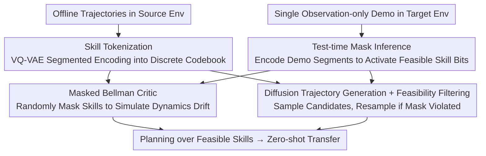

# Masked Skill Token Training for Hierarchical Off-Dynamics Transfer

**Conference**: ICLR 2026  
**OpenReview**: [https://openreview.net/forum?id=K4ngUOra9m](https://openreview.net/forum?id=K4ngUOra9m)  
**Code**: To be confirmed  
**Area**: Reinforcement Learning / Offline Hierarchical RL / Cross-Dynamics Transfer  
**Keywords**: off-dynamics transfer, offline hierarchical RL, skill tokens, masked Bellman, diffusion policy

## TL;DR
MSTT abstracts the condition where "structural changes in the environment render certain skills unexecutable" into a binary skill mask. It utilizes VQ-VAE to segment trajectories into discrete skill tokens, trains a "feasibility-aware" critic by simulating dynamics drift with random masks, and employs a diffusion trajectory generator for feasibility filtering. This allows for zero-shot transfer to new environments with structural changes using only a **single observation-only demonstration (without action labels)** from the target environment.

## Background & Motivation
**Background**: Reinforcement learning policies often fail when the deployment environment differs from the training environment, a problem known as off-dynamics (dynamics mismatch). Existing methods like DARC and VGDF typically learn a discriminator or ensemble model to correct rewards or filter transferable transitions; DARA estimates the alignment between source and target domain transitions using a classifier under a purely offline setting to rewrite source rewards.

**Limitations of Prior Work**: Almost all these methods require **trajectories with action labels** or the ability to **interact with the target environment**. However, in real-world scenarios like navigation or manipulation, deployment environment changes are often "structural"—such as a blocked corridor or a new obstacle—which do not require the agent to learn new skills, but rather make a subset of existing behaviors invalid. Retraining or collecting data with action labels for such minor failures is prohibitively expensive.

**Key Challenge**: There is a gap between the nature of dynamics drift (which paths are open vs. blocked) and the supervision signals available to the agent (demonstrations consisting only of video or coordinate sequences, without actions). Modeling this drift directly in the raw state-action space is both expensive and difficult to generalize.

**Goal**: Achieve adaptation to structural dynamics changes in a pure offline training setting (using only source environment data) with zero-shot deployment, given only a single observation-only demonstration in the target environment.

**Key Insight**: The authors observe that structural dynamics drift can be abstracted as "constraints over a set of temporally extended skills." A blocked path $\approx$ a high-level skill becoming unexecutable. Thus, instead of explicitly modeling changes in low-level transitions, one only needs to mark which skills remain feasible at the **skill level**.

**Core Idea**: Encode feasibility constraints of the target environment using a binary "skill mask" $m(z) \in \{0, 1\}$. During training, **randomly mask** portions of skills to simulate various dynamics drifts and learn a critic that only propagates value through feasible skills. During deployment, this mask is inferred from a single observation-only demonstration.

## Method

### Overall Architecture
MSTT (Masked Skill Token Training) is a fully offline hierarchical RL framework that takes offline trajectory datasets from a source environment as input and outputs a hierarchical policy capable of zero-shot execution in a structurally modified target environment. The pipeline consists of two stages: The **training stage** is completed entirely offline in the source domain—trajectories are first segmented and encoded into discrete skill tokens using VQ-VAE to form a compact "skill codebook," then a "feasibility-aware" critic is trained via a masked Bellman operator using randomly sampled skill masks to simulate dynamics drift, while a diffusion trajectory generator is trained separately. The **deployment stage** requires only a single observation-only demonstration in the target environment; the demonstration is segmented and encoded into skill tokens to activate the corresponding mask bits (others set to 0). The diffusion generator then samples candidate sub-trajectories, which undergo feasibility filtering via the mask (resampling if unfeasible), and the critic performs planning over feasible skills to produce complete behavior.

The theoretical foundation of the method is that when skills are temporally extended and transitions are low-entropy ($p_{\min} \approx 1$), the value function learned using the masked Bellman operator can approximate the optimal value under the actual blocked dynamics (Theorem 1), ensuring that simulating drift via masks in the source domain is effective.

### Key Designs

**1. Skill Tokenization: Compressing Continuous Trajectories into a Reusable Discrete Skill Vocabulary**

Continuous state-action spaces cannot be directly abstracted into finite MDPs like a Four-room grid. MSTT utilizes VQ-VAE to learn discrete behavioral primitives from offline data in an **unsupervised** manner. Given a sub-trajectory of length $H$, $\tau_{1:H}=(s_1, \dots, s_H)$, the encoder $\phi_\theta$ maps it to a discrete token $z=\phi_\theta(\tau_{1:H})$, where $z \in \mathcal{Z}=\{1, \dots, L\}$ ($L$ is the codebook size). Each token indexes a cluster of similar sub-trajectories, making the codebook $\mathcal{Z}$ a discrete abstraction of the continuous behavior space. The training objective is the standard VQ-VAE loss:

$$L_{\text{skill-enc}}=\underbrace{\|\tau_{1:H}-\xi_\vartheta(z)\|^2}_{\text{Reconstruction}}+\underbrace{\|\text{sg}[\phi_\theta(\tau_{1:H})]-z\|^2}_{\text{Codebook}}+\beta\underbrace{\|\phi_\theta(\tau_{1:H})-\text{sg}[z]\|^2}_{\text{Commitment}}$$

where $\xi_\vartheta$ is the decoder and $\text{sg}[\cdot]$ is the stop-gradient operator. Notably, even when trained only on **purely observational** (no action) sub-trajectories, the learned codebook still captures meaningful spatial and behavioral structures in the environment—this is the prerequisite for subsequent "skill inference from observation-only demonstrations." The authors also found that transitions between skills are **sparse and banded** (Figure 6b), meaning many mask combinations do not occur in practice, allowing random mask training to cover the useful skill space with few samples.

**2. Masked Bellman Operator: "Creating" Dynamics Drift in the Source Domain via Random Masking**

This is the core theoretical and mechanistic contribution, addressing the challenge of "adapting to a target environment that is unavailable." The authors first explain the intuition using a discrete Four-room environment: structural changes (e.g., a locked door between Room 2 and Room 3) are equivalent to directing certain transitions to an absorbing "sink state" $s_\perp$ in a skill-level MDP, using a blocking matrix $B$ and a feasibility mask $m(s,a) \in \{0, 1\}$ to describe which skills remain usable. Thus, the standard Bellman backup is modified into a **masked Bellman operator** that only propagates value along feasible transitions:

$$(T^m Q)(s,a):=r(s)+\gamma\big\langle m(s,a)\,p(s,a),\,V^m_Q\big\rangle,\qquad V^m_Q(s):=\max_{a:\,m(s,a)=1}Q(s,a)$$

If no skills are feasible in a given state, the value degrades to the termination reward $r(s)$. Theorem 1 further proves that for any target MDP with blockages, there exists a mask such that the policy value converged from iterations $Q_{k+1}=T^m Q_k$ satisfies $\|V^{\pi_m}_{\mathcal{M}_B}-V^*_{\mathcal{M}_B}\|_\infty \le \alpha\gamma^K+\beta(1-p_{\min})$, meaning the approximation error is minimal under low-entropy ($p_{\min} \approx 1$) skill-level transitions (verified in Figure 3). The practical implication is key: **Since masking skills in the source domain is equivalent to simulating the blocked dynamics of the target domain, the critic can be trained entirely offline.** During training, one only needs to **randomly sample a skill mask** $m \sim \{0,1\}^L$ for each trajectory and update using the masked Bellman error (combined with target networks, clipped double Q-learning, and target smoothing), resulting in a feasibility-aware critic that generalizes to various masks (i.e., various structural drifts).

**3. Diffusion Trajectory Generation + Feasibility Filtering: Zero-shot Synthesis of Executable Behavior under Mask Constraints**

Having a critic is insufficient; one must generate temporally extended behaviors for the target environment. MSTT trains a trajectory-level diffusion policy $D_\psi$ on source data, which can sample plausible observation-action sub-trajectories **conditioned on the starting state $s$**. The clever part is: **the mask is not fed into the diffusion model itself**, but is instead used in a simple "rejection-resampling" filter (Algorithm 2). A sub-trajectory $\tau_{1:H} \sim D_\psi(\cdot \mid s)$ is sampled and encoded into a token $z=\phi_\theta(\tau_{1:H})$; if $m(z)=0$ (masked/infeasible), it is discarded and resampled until a feasible skill is found. This allows the diffusion model to **operate without retraining for each deployment scenario and without being conditioned on the mask**, using the mask only as a filter after sampling to achieve zero-shot combination of high-level behaviors under new dynamics.

**4. Test-time Mask Inference: Back-inferring Feasible Skills from a Single Observation Demo**

This links the previous components into a usable system. At deployment, the agent receives **a single observation-only demonstration** in the target environment (e.g., from a human, video, or coordinate sequence from a VLM, and it can be non-expert as long as it covers a path to the goal). The inference process is straightforward: initialize all skills to $m(z)=0$, segment the demonstration into sub-trajectories $\tau_{1:H}$, map them to tokens using the same encoder $\phi_\theta$, and **set $m(z)=1$ for every token that appears**, marking it as feasible. This inferred mask is fed to the trained critic for planning and to Algorithm 2 for sampling filtration. The entire test-time process requires no additional training, fine-tuning, action labels, or interaction with the target environment.

### A Complete Example
Using a target variant of Maze2D (Figure 4) as an example: the source maze has three long-range paths from a green ball to a red ball, each requiring hundreds of low-level control steps. At test time, two paths are blocked, leaving only one feasible. Upon deployment, the agent receives an "observation-only" demonstration along the feasible path. MSTT segments and encodes this demo using VQ-VAE, activating skill tokens corresponding to "moving along the feasible corridor" while keeping others at $m(z)=0$. During planning, the diffusion model samples candidate sub-trajectories at the current state; any that encode to a blocked corridor ($m(z)=0$) are rejected and resampled. Ultimately, only feasible skills are chained together, navigating successfully to the goal—achieving a 94.33% average success rate across three Maze2D variants, significantly higher than all baselines.

### Loss & Training
The skill encoder uses the $L_{\text{skill-enc}}$ (reconstruction + codebook + commitment) to train the VQ-VAE. The critic is trained using the masked Bellman error (Algorithm 1): at each step, trajectory segments and skill masks are randomly sampled, targets are calculated according to the masked Bellman operator (Eq. 5, skill-level version $Q^*(s,o,m)=R(o)+\gamma^H\max_{o':m(\phi_\theta(o'))=1}Q^*(s',o',m)$), Bellman loss is calculated via clipped double Q-learning, and the target network is periodically soft-updated. The diffusion trajectory generator is trained separately on source data, performing only conditional sampling + rejection filtering at deployment.

## Key Experimental Results

### Main Results
Evaluations were performed on Maze2D, FetchReach from Gymnasium-Robotics, and Habitat ReplicaCAD, where dynamics were manually changed at test time (blocking paths / setting forbidden zones / pixel-based navigation). MSTT used only state-only demonstrations, while DARA and BCta used stronger action-label information, yet MSTT outperformed them significantly.

| Environment | Metric | BC | Diffuser | DARA | MSTT (Ours) |
|------|------|----|----------|------|-------------|
| Maze2D Avg | Return ↑ | 2.87 | 33.12 | 54.87 | **140.35** |
| Maze2D Avg | Goal ↑ | 11% | 29% | 78.66% | **94.33%** |
| FetchReach | Goal ↑ | 0% | 99% | 23% | 88% |
| FetchReach | Failure ↓ | 0% | 61% | 93% | **0%** |
| Habitat ReplicaCAD | Goal ↑ | — | 10% | — | **75%** |
| Habitat ReplicaCAD | Cost ↓ | — | 2.4 | — | **0.7** |

Note: On FetchReach, MSTT's Goal (88%) is lower than Diffuser† (which reached 50% goal but had 66% failure) that was fine-tuned on target observation demos, but MSTT achieved 0% failure—balancing "goal reaching" and "avoiding forbidden zones" where baselines failed.

### Ablation Study

| Configuration / Analysis | Key Findings | Description |
|------|---------|------|
| Train vs. Val mask loss (Fig 6a) | Val loss tracks train loss | The critic generalizes to masks **not sampled during training**. |
| Skill transition matrix (Fig 6b) | Sparse banded structure | Skill transitions concentrate on few patterns; random masking covers the useful space. |
| VLM-inferred demos (Table 4) | Maze T1 Goal 94%, FetchReach 93% | Performance with VLM-generated coordinate demos matches human demos. |

### Key Findings
- **Random masking is sufficient because the skill space is sparse**: Although the codebook is large, skill transitions are banded/sparse. Many mask combinations never occur, so random sampling during training covers the truly useful parts, allowing the critic to generalize.
- **Masked Bellman approximates optimality under low-entropy skill transitions**: Figure 3 shows the $\ell_\infty$ gap between estimated value and true blocked optimal value approaches 0 as $p_{\min} \to 1$, empirically validating Theorem 1—this justifies designing skills to be temporally extended (low-entropy transitions).
- **Offline RL baselines cannot adapt**: Diffuser and BC fail almost entirely after dynamics changes; DARA is inconsistent, limited by a lack of hierarchical abstraction and the impact of data imbalance on domain classifiers.
- **Plug-and-play with VLMs**: Using VLMs to generate coordinate demonstrations directly from visual observations results in almost no performance drop, indicating that MSTT's "observation-only" interface can naturally integrate with foundation models to further reduce human supervision.

## Highlights & Insights
- **Rewriting "Dynamics Drift" as "Skill Feasibility Masks"**: The most significant insight—structural environment changes are not modeled at the low-level transition level, but abstracted as a binary mask over high-level skills. This converts a difficult distribution shift problem into a clean "which skills are still usable" feasibility problem.
- **Masks as both Training Augmentation and Deployment Interface**: During training, random masking = data augmentation simulating infinite dynamics drifts; during deployment, inferring masks from demos = zero-shot instruction on target environment structure. The same abstraction unifies training and testing.
- **"Filtering after Sampling" rather than "Conditional Generation"**: The diffusion model is not conditioned on the mask, using rejection resampling instead. This allows the generator to be trained once and handle any deployment mask without retraining—a decoupling trick transferable to other "generator + hard constraint" scenarios.
- **Value of Observation-only + Fully Offline Transfer**: Requiring only a single demonstration without action labels (even VLM-generated) is highly suited for real-world robotics/embodied AI scenarios where interaction is expensive and actions are hard to label.

## Limitations & Future Work
- **Handles only structural (discrete) dynamics changes**: The authors clarify that the current focus is on structural changes like blocked paths/obstacles, not continuous parameter drifts like mass, friction, or damping—the latter would require training on trajectories with randomly sampled parameters.
- **Conservative failure semantics**: Executing an infeasible skill directly leads to the absorbing sink state $s_\perp$ (irreversible error), which is a conservative model; gentler semantics like "remaining in place upon invalid skill execution" were not explored.
- **Mask sampling efficiency**: Skill-mask combinations grow exponentially with codebook size. While sparse transitions make random masking sufficient, the authors acknowledge that improving mask sampling strategy for efficiency is a future direction.
- **Single-goal, fixed horizon**: Skills are simplified options with fixed $H$ steps, and currently primarily focused on single-goal transfer; goal-conditioned critics are a future direction.
- **Theory depends on low-entropy assumption**: Theorem 1's error bound includes a $\beta(1-p_{\min})$ term, which loosens as transition entropy increases ($p_{\min}$ decreases).

## Related Work & Insights
- **vs. DARC / DARA / VGDF (off-dynamics RL)**: These rely on discriminators/classifiers to correct rewards or filter transitions, and DARA/DARC require action labels or target interaction; MSTT is fully offline, uses observation-only demos, and models drift at the skill level.
- **vs. Standard Hierarchical RL (OPAL / QueST / Skill Chaining)**: These methods learn discrete skill codebooks but **assume skills remain available during deployment**; MSTT's key difference is explicitly modeling and adapting to "changes in skill feasibility."
- **vs. Diffusion Planning (Diffuser / Decision Diffuser / Diffusion Policy)**: These perform denoising planning under static dynamics and do not handle feasibility constraints from structural changes; MSTT uses masks to filter diffusion sampling, ensuring generation respects dynamics constraints. This is consistent with the authors' previous work (LTLDoG / DOPPLER), but here constraints come from "dynamics masks" rather than predefined logical formulas.

## Rating
- Novelty: ⭐⭐⭐⭐⭐ First framework to simulate and generalize off-dynamics drift using "masked skills" with only observation-only demos and fully offline training.
- Experimental Thoroughness: ⭐⭐⭐⭐ Covers discrete/continuous/pixel environments with multiple baselines, including theoretical validation and VLM cases, though limited to simulation.
- Writing Quality: ⭐⭐⭐⭐ Clear progression from intuition to implementation; theory is well-integrated.
- Value: ⭐⭐⭐⭐ Very attractive for real-world transfer where interaction/labeling is expensive; mask-skill abstraction and "generation + filtering" decoupling are highly reusable.

<!-- RELATED:START -->

## Related Papers

- [\[ICLR 2026\] MOBODY: Model-Based Off-Dynamics Offline Reinforcement Learning](mobody_model-based_off-dynamics_offline_reinforcement_learning.md)
- [\[ICLR 2026\] Breaking Barriers: Do Reinforcement Post Training Gains Transfer To Unseen Domains?](breaking_barriers_do_reinforcement_post_training_gains_transfer_to_unseen_domain.md)
- [\[ICLR 2026\] Self-Improving Skill Learning for Robust Skill-based Meta-Reinforcement Learning](self-improving_skill_learning_for_robust_skill-based_meta-reinforcement_learning.md)
- [\[ICLR 2026\] Spotlight on Token Perception for Multimodal Reinforcement Learning](spotlight_on_token_perception_for_multimodal_reinforcement_learning.md)
- [\[ICLR 2026\] Reference Grounded Skill Discovery](reference_grounded_skill_discovery.md)

<!-- RELATED:END -->
