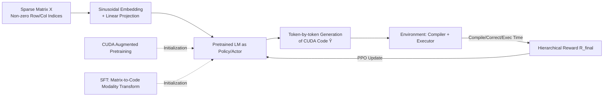

# Mastering Sparse CUDA Generation through Pretrained Models and Deep Reinforcement Learning

**Conference**: ICLR 2026  
**OpenReview**: [https://openreview.net/forum?id=VdLEaGPYWT](https://openreview.net/forum?id=VdLEaGPYWT)  
**Code**: [https://github.com/QiWu-NCIC/SparseRL](https://github.com/QiWu-NCIC/SparseRL)  
**Area**: Reinforcement Learning / High-Performance Code Generation  
**Keywords**: Sparse CUDA Code Generation, SpMV, Deep Reinforcement Learning, PPO, Hierarchical Reward, Sparse Matrix Embedding  

## TL;DR
SparseRL treats pretrained code LLMs as stochastic policies and the compiler+executor as the environment. It utilizes PPO with hierarchical rewards (compilation/correctness/execution efficiency) to end-to-end learn high-performance SpMV/SpMM CUDA code for dynamic sparse matrix inputs, achieving a ~20% increase in compilation rate and an average 30% speedup in generated code.

## Background & Motivation
**Background**: While code generation has achieved milestones in completion, translation, and program synthesis, most research prioritizes "functional correctness" while neglecting "execution performance." In low-latency scenarios like pruned LLM inference and GNN computation, SpMV (Sparse Matrix-Vector Multiplication) is a core operator whose optimal implementation is highly sensitive to the non-zero distribution of the input matrix—there is no single implementation that fits all cases.

**Limitations of Prior Work**: Three specific shortcomings are identified. ① Misaligned training objectives: Traditional supervised next-token prediction maximizes ground-truth likelihood, but multiple functionally correct SpMV implementations exist, and only a few reach peak performance; token-level matching cannot distinguish speed. ② Neglect of execution efficiency rewards: Existing methods ignore actual execution time during optimization and generation, decoupling from the ultimate goal of high-performance code. ③ Modality gap: Performance is determined by input sparse data, requiring customized programs for each matrix, yet LLMs struggle to ingest "sparse matrix structure" as a non-textual modality and convert it into useful generation signals.

**Key Challenge**: High-performance HPC code must be both syntactically and functionally correct (compilable and producing correct results) while being specifically optimized for particular hardware and sparse structures. Both are non-differentiable runtime metrics that supervised learning cannot optimize directly.

**Goal**: For each dynamic input sparse matrix $X$, generate code $\hat{Y}$ such that $\text{Compile}(\hat{Y})=\text{True}$, $\text{Correct}(\hat{Y},X)=\text{True}$, and execution time $E(\hat{Y}|X)\le E(Y_i|X)$ is superior to all known correct implementations.

**Core Idea**: **Model code generation as a sequence-decision MDP and use DRL to learn from non-differentiable feedback from the compiler/executor.** The pretrained LLM acts as the policy (actor), the compiler+executor serves as the environment, each generated token is an action, and correctness combined with execution time forms the reward.

## Method

### Overall Architecture
SparseRL follows a three-stage pipeline: "Pretraining → SFT → RL." In the pretraining stage, the model is augmented with vast CUDA code to master domain patterns in parallel computing and memory management. In the SFT stage, a critical **modality transformation** occurs: the input changes from natural language prompts to sparse matrix non-zero row/column indices (via sinusoidal embedding), with SpMV CUDA code as output. In the RL stage, the SFT model is initialized as both actor and critic, using PPO to optimize within the compiler+executor environment via hierarchical rewards, teaching the model to distinguish between "correct but slow" and "correct and fast" code.

### Key Designs

**1. Modeling Pretrained LLM as an MDP Stochastic Policy: Direct Alignment with Compiler/Executor.** Code generation is formalized as a finite-step MDP: the state $s_t=(\hat{y}_{1:t-1}, X)$ consists of the sparse matrix and partial code, the action $a_t=\hat{y}_t$ is the next token from vocabulary $V$, and policy $\pi_\theta(a_t|s_t)$ is initialized from the SFT model using top-k sampling. PPO is used, with both actor and critic starting from the same fine-tuned model. This approach incorporates **non-differentiable metrics** like execution time and compilation status into the optimization objective for the first time; the model learns to be "correct and fast" on real GPUs rather than just "looking like ground-truth."

**2. Sinusoidal Embedding for Sparse Matrices: Ingesting Matrix Structure as a New Modality.** During SFT/RL, language prompts are removed, and row/column indices of non-zero elements $X=\{(r_i,c_i)\}_{i=1}^N$ are used as input. Each index is normalized via Transformer-style sinusoidal encoding: $PE_{(ind,2j)}=\sin(ind/10000^{2j/d_{model}})$ and $PE_{(ind,2j+1)}=\cos(ind/10000^{2j/d_{model}})$. Row indices yield $e_{r_i}$ and column indices yield $e_{c_i}$, which are concatenated as $e_i=[e_{r_i}|e_{c_i}]$ and mapped to the language modality dimension via a linear layer. This allows the model to "read" sparse structures directly and generate customized code. Ablations show sinusoidal embedding (pass@1000 48.75 / CR 56.50) significantly outperforms Raw (40.75 / 49.50) and Max-Min normalization (43.25 / 51.75).

**3. Hierarchical Reward: Stratified and Gated Signals.** Final reward is defined as $R_{final}(\hat{Y},X)=R_{correctness}+R_{efficiency}-r_{penalty}\cdot I_{memory}$. Correctness rewards are stratified: +0.5 for successful compilation, -0.5 for failure; test rewards are only computed if compilation succeeds (passed +0.5, otherwise -0.5), i.e., $R_{correctness}=R_{compile}+I_{compile}\cdot R_{test}$. The efficiency reward activates only when code is both compilable and functionally correct, based on speedup relative to the cuSPARSE baseline: $R_{efficiency}=r_{eff}\times\big(\frac{t_{base}(X)}{t(\hat{Y},X)}-1\big)\cdot I_{test}$, where execution time is averaged over 1000 iterations to suppress noise. This "gated+stratified" structure ensures the model first learns to produce runnable code before optimizing performance.

**4. Dynamic Granular Early Stopping: On-the-fly Syntax Checks.** Dynamic syntax correctness checks are integrated into the autoregressive decoding process. Using tools similar to the QwenLM repository, generation is terminated early for obviously erroneous code to save rollout and compilation overhead.

## Key Experimental Results

### Main Results (pass@k and CR, k=1000, 400 Test Matrices)

| Model | Size | SpMV pass@1 | SpMV pass@1000 | SpMV CR |
|------|------|------|------|------|
| Qwen3 | 8B | 8.00 | – | – |
| DeepSeek-R1 | 671B | 15.00 | – | – |
| CodeT5 | 770M | 4.75 | 30.25 | 38.00 |
| CodeRL+CodeT5 | 770M | 5.25 | 36.50 | 39.50 |
| PPOCoder+CodeT5 | 770M | 5.75 | 35.50 | 40.75 |
| GPT-5 | - | 27.00 | - | - |
| Claude-sonnet-4 | - | 28.25 | - | - |
| **SparseRL+CodeT5** | 770M | 9.25 | 48.75 | 56.50 |
| **SparseRL+Qwen2.5** | 14B | 10.25 | **49.25** | **57.50** |

- Using CodeT5 (770M) achieves a pass@1000 of 48.75 and CR of 56.50, outperforming DeepSeek-R1 (671B) in terms of pass@1/5.
- Efficiency-wise (GFLOPS), SparseRL (Qwen2.5-14B) is on average 3.27×/3.42× faster than CodeRL/PPOCoder on V100, and more importantly, 1.42× faster than NVIDIA's cuSPARSE and 1.82× faster than TVM-S.
- SpMM Extension: On A100, it outperforms cuSPARSE by 6.39×/4.38× for 8/32 columns respectively, validating transferability.

### Ablation Study (Three Stages, SpMV, pass@1000 / CR / GFLOPS)

| Configuration | pass@1000 | CR | Avg GFLOPS |
|------|------|------|------|
| w/ Pretrain · SFT Only | 32.75 | 41.25 | 89.25 |
| w/ Pretrain · PPO Only | 15.25 | 22.50 | 50.36 |
| **w/ Pretrain · SFT+PPO** | **49.25** | **57.50** | **116.20** |
| w/o Pretrain · SFT Only | 12.00 | 13.25 | 30.83 |
| w/o Pretrain · SFT+PPO | 40.75 | 53.50 | 95.22 |

### Key Findings
- **Three stages are indispensable**: CUDA augmented pretraining provides knowledge of parallelism and memory; without it, SFT+PPO drops from 49.25 to 40.75. PPO without SFT (lacking modality transform) fails to learn correct code (pass@1000 only 15.25).
- **RL stage drives performance**: Adding PPO to SFT improves pass@1000 from 32.75 to 49.25 and GFLOPS from 89.25 to 116.20, proving that efficiency rewards push the model toward "faster" rather than just "more correct."
- **Embedding quality matters**: Sinusoidal > Max-Min > Raw. Discrete indices must be smoothed into continuous signals for the model to utilize them effectively.
- Closed-source models (GPT-5/Claude-sonnet-4) are more accurate at pass@1, but SparseRL wins in compilation rates and actual execution performance (vs cuSPARSE), which are the critical metrics for usability.

## Highlights & Insights
- **Authentic Problem Selection**: Moving code generation from "functional correctness" to "hardware performance + input adaptation" and beating cuSPARSE is far more convincing than HumanEval benchmarks.
- **Sparse Matrix as Input Modality**: Removing language prompts and feeding non-zero index embeddings (analogous to non-text modalities in AlphaFold) cleanly addresses the need for customization based on input data.
- **Hierarchical + Gated Reward**: This pragmatic design prevents the model from exploiting "fast but uncompilable" code, which is essential for integrating non-differentiable HPC metrics into RL.
- Small models (770M) can outperform massive models after domain alignment and RL feedback, suggesting that feedback is more efficient than mere parameter scaling.

## Limitations & Future Work
- **Narrow Task Scope**: Only SpMV and SpMM are verified. Generalization to more complex HPC kernels like convolution or attention remains to be seen.
- **High Training Cost**: 5 days on 16 V100/A100 GPUs. Reward calculation involving 1000 iterations for profiling is computationally heavy.
- **Low Absolute Correctness**: Peak pass@1 is ~10 (for open-source backbones), and pass@1000 is still under 50%, requiring high sampling budgets for practical use.
- **Hardware/Library Dependence**: Rewards are anchored to specific GPUs and cuSPARSE versions; generalizability across architectures needs further evaluation.

## Related Work & Insights
- **Code Pretrained Models**: CodeBERT, CodeT5, etc., established NL→code capabilities but ignored performance. SparseRL builds RL on top of these.
- **RL for Sequence Generation**: Evolves from BLEU/ROUGE optimization to RLHF and CodeRL. SparseRL pushes this towards HPC by replacing "human preference" with "compilation + execution time."
- **SpMV Optimization History**: SparseRL attempts to automate decades of manual optimization experience (CSR, CSR5, etc.) by generating implementations tailored to specific matrices.
- **Insight**: Treating the "compiler/executor/profiler" as a queryable environment and converting non-differentiable system metrics into hierarchical rewards is a paradigm applicable to any performance-oriented code generation task.

## Rating
- **Novelty**: ⭐⭐⭐⭐ Inputting sparse matrices as a modality and using efficiency rewards to drive RL for high-performance CUDA is a novel and effective combination.
- **Experimental Thoroughness**: ⭐⭐⭐⭐ Covers SpMV/SpMM, multiple backbones, closed-source comparisons, and extensive ablations across datasets; lower absolute accuracy is a slight drawback.
- **Writing Quality**: ⭐⭐⭐⭐ Strong alignment between motivations, methods, and experiments; clear diagrams.
- **Value**: ⭐⭐⭐⭐ Generating kernels that outperform industrial libraries has significant engineering value for low-latency inference and GNNs.

<!-- RELATED:START -->

## Related Papers

- [\[ICLR 2026\] CUDA-L1: Improving CUDA Optimization via Contrastive Reinforcement Learning](cuda-l1_improving_cuda_optimization_via_contrastive_reinforcement_learning.md)
- [\[ICLR 2026\] LongWriter-Zero: Mastering Ultra-Long Text Generation via Reinforcement Learning](longwriter-zero_mastering_ultra-long_text_generation_via_reinforcement_learning.md)
- [\[ICLR 2026\] Deep SPI: Safe Policy Improvement via World Models](deep_spi_safe_policy_improvement_via_world_models.md)
- [\[ICLR 2026\] Understanding and Improving Hyperbolic Deep Reinforcement Learning](understanding_and_improving_hyperbolic_deep_reinforcement_learning.md)
- [\[ICLR 2026\] Critique-RL: Training Language Models for Critiquing Through Two-Stage Reinforcement Learning](critique-rl_training_language_models_for_critiquing_through_two-stage_reinforcem.md)

<!-- RELATED:END -->
