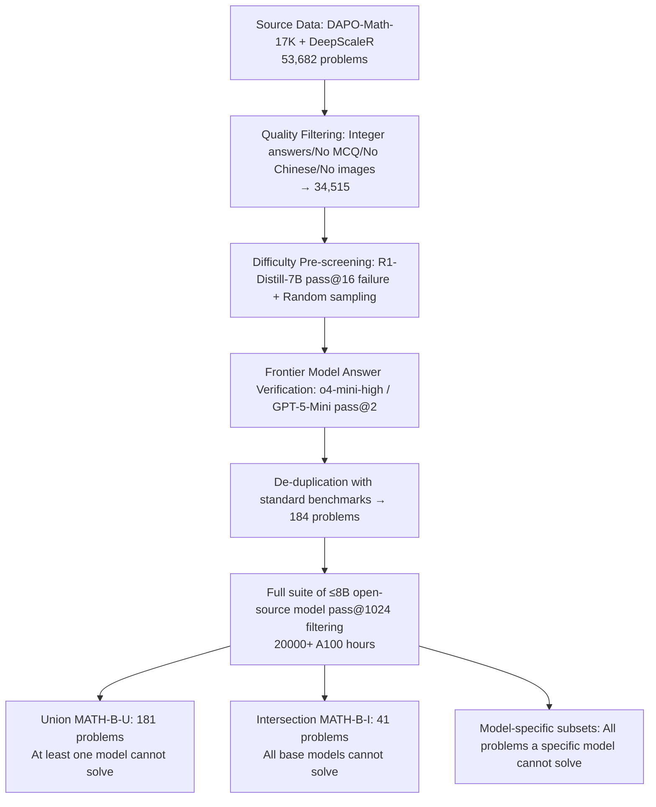

# MATH-Beyond: A Benchmark for RL to Expand Beyond the Base Model

**Conference**: ICLR 2026  
**OpenReview**: [https://openreview.net/forum?id=RNkErKpCAp](https://openreview.net/forum?id=RNkErKpCAp)  
**Code / Data**: [https://huggingface.co/datasets/brendel-group/MATH-Beyond](https://huggingface.co/datasets/brendel-group/MATH-Beyond)  
**Area**: Reinforcement Learning / LLM Mathematical Reasoning / Evaluation Benchmark  
**Keywords**: RL for Reasoning, Exploration, pass@k, Expansion Rate, Benchmark, Math Reasoning  

## TL;DR
The authors argue that popular mathematical reasoning benchmarks (MATH-500, AIME24) are already almost entirely solved by open-source base models under $pass@1024$. Consequently, RL fine-tuning merely "sharpens" existing solutions rather than "discovering" new capabilities. To address this, they constructed MATH-Beyond—a set of high school competition problems that $\le 8B$ open-source models consistently fail to solve even with $1024$ samples—shifting the evaluation focus from "improving $pass@k$" to "expanding the reasoning boundaries of base models."

## Background & Motivation
- **Background**: Since DeepSeek-R1, numerous RL methods claiming to "unlock mathematical reasoning" have emerged. The community generally uses $pass@1 / pass@k$ on benchmarks like MATH-500 and AIME24 to measure progress.
- **Limitations of Prior Work**: Works such as Yue et al. (2025) have discovered that many open-source base models can already solve almost **all** problems in these popular benchmarks within a $pass@1024$ budget. This implies that for problems where RL models succeed, the base models were already capable of solving them under reasonable sampling budgets—**benchmarks have become saturated** and fail to measure true progress where "RL solves what the base model could not."
- **Key Challenge**: The allure of deep RL in the 2010s (Atari, AlphaGo/AlphaZero) lay in **exploring and acquiring entirely new skills** from a random strategy. In contrast, current LLM reasoning RL has regressed into "sharpening" existing solution patterns, contradicting the promise of "exploration + learning new skills." $pass@k$ conflates "Consolidation" of existing solutions with "Expansion" into new ones.
- **Goal**: Provide a "diagnostic tool" that only validates methods that **truly expand reasoning boundaries**.
- **Core Idea**: **Construct a "zero-baseline" benchmark**—deliberately filtering for problems where base model $pass@1024 \approx 0$. In such a set, the reachable set of the base model is empty; thus, every problem solved by a post-trained model is **by definition an Expansion**. Here, $pass@1024$ directly equals the Expansion Rate, providing an unambiguous reading of "boundary expansion."

## Method

### Overall Architecture
The work consists of two parts: (1) A **measurement framework** that decomposes the capability changes of a post-trained policy $\pi$ relative to a base model $q$ into four metrics: Expansion, Shrinkage, Preservation, and Consolidation, proving that this decomposition collapses into a single Expansion Rate on zero-baseline benchmarks; (2) A **multi-stage filtering pipeline** that identifies problems from 53,682 candidates that are correct, unambiguous, novel, and collectively unsolved by a suite of open-source models at $pass@1024$. This results in two core subsets: a Union set (181 problems) and an Intersection set (41 problems).

### Key Designs

**1. A Framework for Boundary Expansion: Splitting $pass@k$ into "Consolidation" and "Expansion."** The authors adapt terms from Wu et al. (2025). Sampling $k$ samples for policy $p$ on problem $x$, $pass@k(p;x)=1$ if at least one sample is in the correct set $C(x)$. Defining the reachable set $R_k(p,D)=\{x: pass@k(p;x)=1\}$, the difference between $\pi$ and $q$ is split into: **Expansion** ($\pi$ solves what $q$ could not, $E_k=R_k(\pi)\setminus R_k(q)$), **Shrinkage** ($q$ solves what $\pi$ forgets), **Preservation** ($\pi$ maintains $q$'s ability), and **Consolidation** (whether preserved solutions become stable at $pass@1$). The total $pass@k$ of $\pi$ is $(|E_k|+|P_k|)/|D|$, distinguishing between "apparent gains through redistribution" and "true boundary expansion."

**2. Zero-baseline design simplifies measurement to a single clean reading.** MATH-B is deliberately constructed such that the base reachable set is empty, $R_k(q,D)=\varnothing$. In this framework, Shrinkage and Preservation drop to zero, and $E_k=R_k(\pi,D)$. Thus, $\text{Expansion Rate}=\frac{|R_k(\pi,D)|}{|D|}=pass@k(\pi)$. Any problem solved on this set is **guaranteed** to be a new capability the base model lacked, avoiding entanglement between consolidation and expansion on saturated benchmarks.

**3. Multi-stage filtering pipeline: Verifiable, Novel, and Truly Difficult.** Source data includes DAPO-Math-17K (post-R1, high difficulty) and DeepScaleR (AIME/AMC-based), avoiding sets like DeepMath103K or NuminaMath which might be contaminated or designed to be solvable. Quality filtering retains only integer answers and removes MCQs or problems with images/Chinese text. Most critically, frontier models like o4-mini-high and GPT-5-Mini perform **pass@2 answer verification** to ensure that "difficulty" stems from the problem itself rather than incorrect ground truth labels.

**4. Addressing RLVR Verification Traps: Hard is truly hard, not a parsing error.** The authors identify 7 types of Rule-based Verification (RLVR) failures in R1-Distill trajectories: F1 (reading only the first/last boxed answer), F2 (capturing intermediate values), F3 (late incorrect answers overwriting early correct ones), F4 (self-correction ignored), F5 (tuple order sensitivity), F6 (missing "Answer:" anchors), and F7 (MCQ format rejection). The pipeline preemptively avoids these hurdles by filtering for integer answers and uses robust verification logic during the $pass@1024$ phase to ensure "unsolvability" reflects reasoning failure, not formatting issues.

## Key Experimental Results

### Main Results: Expansion Rate of Post-trained Models on MATH-B ($pass@1024$)

| Base | Post-trained | Method | Unsolved Problems (Base) | Expansion Rate (%) | AIME24 (pass@1) |
|------|------|------|------|------|------|
| r1-1.5b | Nemotron-Reasoning-Qwen v1 | RL | 115 | 7.83 | 48.13 |
| r1-1.5b | Nemotron-Reasoning-Qwen v2 | RL | 115 | 9.57 | 49.58 |
| r1-1.5b | DeepScaleR-1.5B | RL | 115 | 5.22 | 40.21 |
| r1-7b | Skywork-OR1-7B | RL | 99 | **21.2** | 70.2 |
| Qwen3-4B-base | Qwen3-4B | Long CoT Distillation | 112 | **58.93** | 73.3 |
| Qwen3-8B-base | Qwen3-8B | Long CoT Distillation | 116 | **66.38** | 76.0 |

### Key Findings
- **RL methods show limited expansion capabilities**: All three RL models based on r1-1.5b have an Expansion Rate $< 10\%$. Increasing RL compute (Nemotron v1→v2) only yielded a marginal $1.5\%$ gain, indicating inefficient current exploration mechanisms.
- **Exploration-encouraging RL is more promising**: Skywork-OR1-7B reached $21.2\%$, which the authors attribute to its use of adaptive entropy control and higher temperatures, leaving more room for exploration. This suggests "explicitly encouraged exploration" may be the way forward.
- **Strong contrast between Distillation and RL**: Qwen3-4B/8B achieved high expansion rates ($58.93\% / 66.38\%$) via long CoT distillation. This proves that **base models have the capacity to learn**; the bottleneck is that RL exploration cannot find these valid reasoning paths on its own. Distillation benefits from the teacher model directly providing the correct distribution of reasoning steps.
- **Human Difficulty $\ne$ Model Difficulty**: The median human difficulty for MATH-B-U problems is only 4/10. Current models consistently fail on problems humans find moderately difficult, revealing a decoupling between model failure modes and human intuition.
- **Trade-off at $k=1024$**: $pass@k$ grows log-linearly with the budget but shows diminishing returns. Since the Expansion Rate for RL models plateaus near $1024$, it serves as a balanced point for "difficulty, stability, and computation."

## Highlights & Insights
- **Redefining "Progress"**: Shifting community focus from "grinding $pass@k$ on saturated benchmarks" to "demonstrably expanding reasoning boundaries" is a conceptual correction more valuable than just providing a new dataset.
- **Elegance of Zero-Baseline + Expansion Rate**: A simple construction (making base $pass=0$) collapses a complex four-way decomposition into a single clean metric, which is methodologically clever.
- **Topologically Equivalent Difficulty**: Problems are standard high school math. Difficulty arises not from obscure domains but from the fragility of model reasoning, highlighting real shortcomings in current RL.
- **Honest Comparisons**: Using distillation as "upper-bound evidence" honestly points out that the bottleneck for RL is exploration, not model capacity, rather than simply claiming RL is useless.
- **Useful By-products**: The systematic categorization of 7 RLVR verification failure modes provides significant value for improving training/evaluation pipelines across the community.

## Limitations & Future Work
- **Small Scale**: The Intersection set contains only 41 problems and the Union set has 181, leading to potential statistical noise. While the authors defend "smallness" as "efficiency," the high weight of single problems remains a risk.
- **Focus on $\le 8B$ Open-source Models**: Due to the $20,000+$ A100 hour cost, the zero-baseline status for larger models is not fully evaluated. Portability is argued via problem selection based on base capabilities rather than model quirks, but needs further validation.
- **A Diagnostic Tool, Not a Solution**: This paper provides a benchmark to measure expansion but does not propose a new RL method that wins on it. The real challenge is left for future work.
- **Reliance on Frontier Models**: If o4-mini-high or GPT-5-Mini make errors during verification, noise is introduced into the ground truth.
- **Future Work**: Catalyzing "teacher-less" exploratory RL (e.g., adaptive entropy, intrinsic rewards, reviving count-based / Go-Explore ideas for LLMs) so RL can discover new reasoning paths without relying on distillation.

## Related Work & Insights
- **Built upon Wu et al. (2025)**: This work instantiates the Expansion concept from a specific setting into a reusable zero-baseline benchmark and extends it to numerous open-source models—a transition from "concept to operational tool."
- **Following Yue et al. (2025)**: The latter revealed saturation in existing benchmarks at large $k$; this work constructs "anti-saturation" benchmarks based on those findings.
- **Classic RL Exploration**: References to Atari (Mnih 2013), count-based exploration (Bellemare 2016), Go-Explore (Ecoffet 2021), and AlphaGo/Zero (Silver 2016/2017) serve as benchmarks for "true skill discovery," contrasting the current regression in LLM RL.
- **Methodology from Omni-MATH (Gao 2024)**: Utilizing GPT-5 + contrastive prompting for domain and difficulty labeling.
- **Insights**: (1) Benchmarks should be purpose-built for the target capability rather than reusing existing sets. (2) Measurements for RL must separate "Consolidation" from "Expansion" to avoid deceptive $pass@k$ figures. (3) Distillation results suggest exploration is the true bottleneck of RL, hinting at the need for explicit exploration mechanisms.

## Rating
- **Novelty**: ⭐⭐⭐⭐ Transforms the "benchmark saturation" issue into a "Zero-baseline + Expansion Rate" paradigm. Clear conceptual correction and clever construction; points deducted as the framework is heavily inspired by Wu et al. (2025).
- **Experimental Thoroughness**: ⭐⭐⭐⭐ $20,000+$ A100 hours, $20+$ models across base/supplementary groups, convincing RL vs. distillation comparison. However, the final problem set is small and lacks coverage for larger models.
- **Writing Quality**: ⭐⭐⭐⭐ Logical flow from motivation to framework, construction, and experiments. Verification trap tables and formula decompositions are well-presented.
- **Value**: ⭐⭐⭐⭐⭐ Directly addresses the community blind spot where "RL is only sharpening, not exploring," providing an unambiguous signal that could steer the direction of exploratory RL research.

<!-- RELATED:START -->

## Related Papers

- [\[ICLR 2026\] Rubrics as Rewards: Reinforcement Learning Beyond Verifiable Domains](rubrics_as_rewards_reinforcement_learning_beyond_verifiable_domains.md)
- [\[ICLR 2026\] Beyond Pass@1: Self-Play with Variational Problem Synthesis Sustains RLVR](beyond_pass_1_self-play_with_variational_problem_synthesis_sustains_rlvr.md)
- [\[ICLR 2026\] Beyond Distributions: Geometric Action Control for Continuous Reinforcement Learning](beyond_distributions_geometric_action_control_for_continuous_reinforcement_learn.md)
- [\[ICLR 2026\] Virne: A Comprehensive Benchmark for RL-based Network Resource Allocation in NFV](virne_a_comprehensive_benchmark_for_rl-based_network_resource_allocation_in_nfv.md)
- [\[ICLR 2026\] Beyond Softmax and Entropy: Convergence Rates of Policy Gradients with $f$-SoftArgmax Parameterization & Coupled Regularization](beyond_softmax_and_entropy_convergence_rates_of_policy_gradients_with_boldsymbol.md)

<!-- RELATED:END -->
