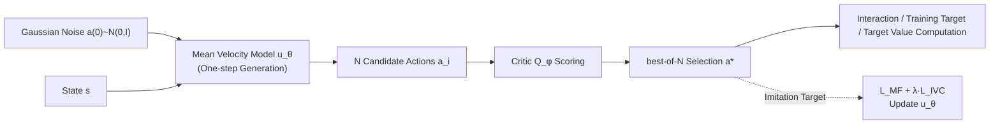

# Mean Flow Policy with Instantaneous Velocity Constraint for One-step Action Generation

**Conference**: ICLR 2026  
**OpenReview**: [https://openreview.net/forum?id=mIeKe74W43](https://openreview.net/forum?id=mIeKe74W43)  
**Code**: TBD  
**Area**: reinforcement learning  
**Keywords**: Generative Policy, Flow Matching, Mean Flow, One-step Action Generation, Offline-to-Online RL, Robot Manipulation  

## TL;DR
This paper introduces the "mean velocity field" into RL policies, enabling multi-modal optimal action generation from Gaussian noise via one-step sampling. A proposed Instantaneous Velocity Constraint (IVC) addresses the missing boundary conditions to ensure learning accuracy, maximizing training and inference speed while preserving the expressiveness of flow-based policies.

## Background & Motivation
**Background**: In reinforcement learning for complex control tasks with multi-modal action distributions, generative policies such as diffusion models and flow matching have become powerful alternatives to Gaussian/mixture policies, transforming simple base distributions into flexible action distributions.

**Limitations of Prior Work**: Existing generative policies rely on multi-step iterative refinement "from noise to action." This process incurs massive training overhead due to repetitive sampling in online RL, and high inference latency remains a primary bottleneck for real-time closed-loop control. A rigid trade-off exists between expressiveness and computational cost, controlled by "flow steps"—more steps mean higher expressiveness but lower speed, while fewer steps are faster but inaccurate.

**Key Challenge**: Is it possible to unify the expressiveness of generative policies with the efficiency of one-step action generation? Simply truncating flow to one step causes action quality to collapse (in the paper's experiments, one-step variants of FQL/BFN/QC failed almost completely on difficult tasks).

**Goal**: To design a generative RL policy that achieves true "one-step generation" without compromising expressiveness.

**Core Idea**: **[Modeling Mean Velocity Instead of Instantaneous Velocity]** Rather than learning the instantaneous velocity field $v$ (which requires integration along a trajectory and multi-step solving), the model directly learns the **mean velocity field** $u$ over any time interval $[t, r]$. This allows $a(1) = a(0) + u^*(a(0), 0, 1, s)$ in a single step. **[Boundary Conditioning via IVC]** While mean velocity training is governed by a first-order ODE, the solution is non-unique due to missing boundary conditions. The paper introduces IVC to explicitly fix these boundaries, theoretically ensuring the unique correct solution.

## Method

### Overall Architecture
The method, named **Mean Velocity Policy (MVP)**, operates within an offline-to-online RL framework. The policy uses a mean velocity model $u_\theta$ to map Gaussian noise to candidate actions in one step, followed by a Q-function-based best-of-N selection. This "generation + selection" process forms the unified policy $\pi_\theta$. Training involves a mean flow loss $\mathcal{L}_{MF}$ combined with an instantaneous velocity constraint $\mathcal{L}_{IVC}$, while the critic is trained using standard TD error.

### Key Designs

**1. Mean Velocity Policy (MVP): Collapsing Integration into One-step Mapping.** Standard flow policies compute $a(1) = a(0) + \int_0^1 v(a(\tau), \tau, s) \, d\tau$, requiring multi-step approximation like the Euler method as paths are typically curved. MVP directly models the interval mean velocity $u(a(t), t, r, s) \triangleq \frac{1}{r-t} \int_t^r v \, d\tau$. Once learned, inference simplifies to a single addition $a(1) = a(0) + u^*(a(0), 0, 1, s)$, eliminating iterative sampling. Differentiating the definition with respect to $t$ yields the **mean flow identity** $-u + (r-t) \frac{d}{dt} u = -v$. This leads to the imitation loss $\mathcal{L}_{MF} = \mathbb{E} \|u_\theta - \mathrm{sg}[v - (t-r) \frac{d}{dt} u_\theta]\|_2^2$, where the total derivative $\frac{d}{dt} u_\theta$ is computed efficiently via JVP with stop-gradient for stability.

**2. Generation-Selection Mechanism: Bootstrapping Imitation Targets.** Since RL lacks optimal labeled datasets, the paper uses the Q-function to progressively "create" improved imitation targets. For each state, $N$ diverse candidates $a_i = \epsilon_i + u_\theta(\epsilon_i, 0, 1, s)$ are generated, and the critic selects $a^\star = \arg\max_{a_i} Q_\phi(s, a_i)$. This $a^\star$ serves three roles: environmental interaction, imitation target for the policy, and target value calculation for the critic. **Theorem 1** proves this imitation-based update ensures policy improvement, where performance gain is lower-bounded by the "best-of-N advantage gain $\Delta_1$" minus the "fitting error term $\Delta_2$."

**3. Instantaneous Velocity Constraint (IVC): Solving the Ill-posed ODE.** The mean flow identity only describes the "dynamics" of a first-order ODE, lacking boundary conditions. Relying on samples where $r$ is extremely close to $t$ is insufficient. **Theorem 2** shows that solutions satisfying only $\mathcal{L}_{MF}$ contain an error $\Delta u = \frac{C(a, r)}{r-t}$ due to an unknown constant $C$. $\mathcal{L}_{MF}$ is "blind" to this boundary, leading to persistent bias in $u_\theta$. IVC explicitly fixes the boundary at $t$: the mean velocity on the interval $[t, t]$ is precisely the instantaneous velocity $v = a^* - a(0)$. Thus, $\mathcal{L}_{IVC} = \mathbb{E} \|u_\theta(a(t), t, t) - v\|_2^2$. **Theorem 3** proves that minimizing IVC forces $C(a, r) \to 0$, shrinking the solution space to the unique correct $u^*$.

**4. Mean Flow RL Training: Decoupling Imitation from Q-gradients.** The total policy loss is $\mathcal{L}_{policy} = \mathcal{L}_{MF} + \lambda \mathcal{L}_{IVC}$ (default $\lambda = 1.0$). The critic is trained via TD error. Crucially, the generative imitation training **does not directly consume Q-gradients**; policy improvement is guaranteed solely by best-of-N selection. This leverages the expressiveness of generative models while maintaining training stability.

## Key Experimental Results

### Main Results
Evaluation across 9 sparse-reward robot manipulation tasks (Robomimic and OGBench) using success rate (mean ± std) over 5 seeds compared to FQL, BFN, and QC:

| Task | FQL | BFN | QC | MVP (Ours) |
|---|---|---|---|---|
| Robomimic-square | 0.12 | 0.34 | 0.92 | **0.93** |
| Cube-double-task4 | 0.08 | 0.35 | 0.93 | **0.95** |
| Cube-triple-task2 | 0.01 | 0.08 | 0.82 | **0.88** |
| Cube-triple-task3 | 0.12 | 0.26 | 0.69 | **0.71** |
| Cube-triple-task4 | 0.00 | 0.02 | 0.46 | **0.52** |
| **Average (9 tasks)** | 0.44 | 0.52 | 0.86 | **0.88** |

MVP achieves or exceeds Prev. SOTA in 8 out of 9 tasks. The advantage is most pronounced in difficult, long-horizon tasks.

### Ablation Study
**IVC Coefficient $\lambda$ Ablation** (Cube-triple-task4 success rate):

| Configuration | Success Rate |
|---|---|
| $\lambda=0.0$ (No IVC) | 0.30 ± 0.21 |
| $\lambda=0.5$ | 0.45 ± 0.15 |
| $\lambda=1.0$ (Full IVC) | 0.52 ± 0.11 |

**Speed Comparison**:

| Metric | FQL | BFN | QC | MVP |
|---|---|---|---|---|
| Online Training Speed (iter/s) | 108.5 | 68.0 | 92.6 | **153.6** |
| Inference Time (ms, CPU) | 10.76 | 117.3 | 113.22 | **10.93** |

### Key Findings
- **One-step Variants Collapse**: Naive one-step versions of FQL/BFN/QC fail on complex tasks, whereas MVP maintains high success rates, highlighting the importance of mean flow modeling.
- **Superior Training Speed**: MVP is significantly faster to train (153.6 iter/s) due to the elimination of iterative sampling.
- **Efficient Inference**: MVP's inference time is comparable to FQL and much faster than multi-step models (BFN/QC), while offering significantly higher task success rates than FQL.

## Highlights & Insights
- **Clean Migration of MeanFlow**: Effectively ports the "one-step generation" concept from MeanFlow to RL while identifying and solving the ill-posed ODE boundary problem.
- **Elegant IVC Design**: A near-zero-cost auxiliary loss makes the problem well-posed, backed by rigorous theoretical proofs (Theorem 2/3).
- **Decoupled Improvement**: Improvement is driven by selection rather than direct gradients, which stabilizes training for generative architectures.
- **Deployment-Oriented**: Demonstrates competitive latency on CPU, highlighting feasibility for real-time robot hardware with limited compute.

## Limitations & Future Work
- Experiments are restricted to simulation environments (Robomimic, OGBench); real-world hardware deployment is not yet verified.
- The best-of-N mechanism introduces hyperparameter $N$; the trade-off between the number of candidates and compute is not fully explored.
- Theoretical guarantees assume bounded critic error and Lipschitz continuity, which may not always hold in practice.
- The performance in pure online-from-scratch or higher-dimensional action spaces remains for future investigation.

## Related Work & Insights
- **Generative Policies**: While Diffusion Policy and Flow Matching (FQL, QC) trade speed for expressiveness, MVP breaks this trade-off by modeling interval quantities.
- **MeanFlow (Geng et al., 2025)**: The direct progenitor of this work. MVP adapts it for decision-making by solving the lack of optimal labels and defining boundary conditions.
- **Insight**: When a generative quantity is defined as an integral over an interval, the training ODE is naturally deficient in boundary conditions. Explicitly constructing boundary losses using the quantity's limit as the interval collapses to a point is a generalizable technique for making such problems well-posed.

## Rating
- **Novelty**: ⭐⭐⭐⭐  
- **Experimental Thoroughness**: ⭐⭐⭐⭐  
- **Writing Quality**: ⭐⭐⭐⭐  
- **Value**: ⭐⭐⭐⭐  

<!-- RELATED:START -->

- **Diffusion Policy**: Visuomotor Policy Learning via Action Diffusion (CHI 2023)
- **FQL**: Flow-based Q-learning for Offline-to-Online Reinforcement Learning (ICLR 2024)
- **MeanFlow**: Training Flow Matching with Mean Velocity (ArXiv 2025)

<!-- RELATED:END -->

## Related Papers

- [\[ICLR 2026\] One-Step Flow Q-Learning: Addressing the Diffusion Policy Bottleneck in Offline RL](one-step_flow_q-learning_addressing_the_diffusion_policy_bottleneck_in_offline_r.md)
- [\[ICLR 2026\] Local Reinforcement Learning with Action-Conditioned Root Mean Squared Q-Functions](local_reinforcement_learning_with_action-conditioned_root_mean_squared_q-functio.md)
- [\[AAAI 2026\] One-Step Generative Policies with Q-Learning: A Reformulation of MeanFlow](../../AAAI2026/reinforcement_learning/one-step_generative_policies_with_q-learning_a_reformulation_of_meanflow.md)
- [\[ICLR 2026\] PolicyFlow: Policy Optimization with Continuous Normalizing Flow in Reinforcement Learning](policyflow_policy_optimization_with_continuous_normalizing_flow_in_reinforcement.md)
- [\[NeurIPS 2025\] CORE: Constraint-Aware One-Step Reinforcement Learning for Simulation-Guided Neural Network Accelerator Design](../../NeurIPS2025/reinforcement_learning/core_constraint-aware_one-step_reinforcement_learning_for_simulation-guided_neur.md)

<!-- RELATED:END -->
