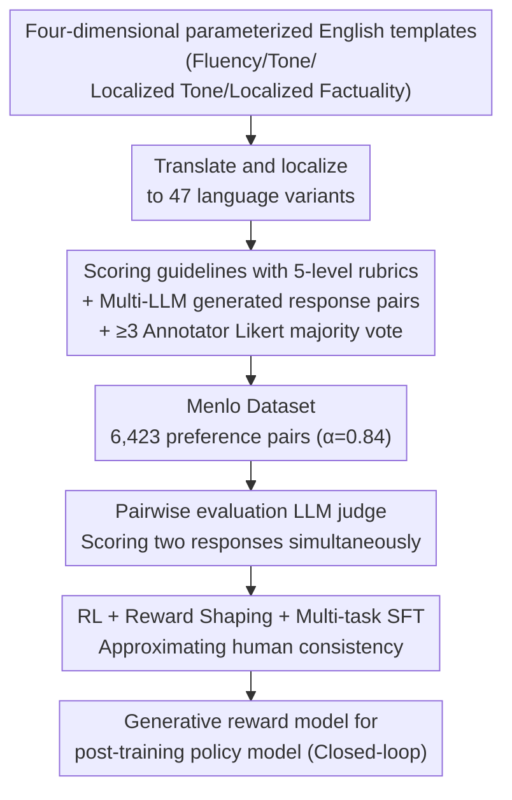

# Menlo: From Preferences to Proficiency – Evaluating and Modeling Native-like Quality Across 47 Languages

**Conference**: ICLR 2026  
**arXiv**: [2509.26601](https://arxiv.org/abs/2509.26601)  
**Code**: [https://huggingface.co/datasets/facebook/menlo](https://huggingface.co/datasets/facebook/menlo)  
**Area**: Reinforcement Learning  
**Keywords**: Multilingual Evaluation, Native-like Quality, LLM-as-Judge, Preference Learning, Audience Design

## TL;DR
The Menlo framework is proposed to decompose native-like response quality into four dimensions based on Audience Design theory. It constructs a dataset of 6,423 annotated preference pairs across 47 language variants and demonstrates that an LLM judge trained with pairwise evaluation and Reinforcement Learning (RL) can achieve performance nearing that of human annotators.

## Background & Motivation

**Background**: LLMs must provide high-quality responses across diverse global languages, yet systematic methods for evaluating "native-like quality" are lacking. Traditional evaluations like standardized tests are difficult to scale and do not reflect real-world conversations.

**Limitations of Prior Work**: Existing multilingual preference datasets cover few languages, lack localized prompts, exhibit low inter-annotator agreement, and fail to distinguish specific quality dimensions. Zero-shot LLM judges still show a significant gap compared to human evaluation in multilingual scenarios.

**Key Challenge**: Native-like quality is not a single fixed standard; it depends on the relationship between the speaker and the listener (the Style Axiom in sociolinguistics)—the same language has different "native" standards across different cultures, regions, and contexts.

**Goal**: 1) Operationalize native-like quality evaluation (decompose into measurable dimensions); 2) Construct a large-scale, high-quality multilingual preference dataset; 3) Train reliable LLM judges to replace expensive human evaluation.

**Key Insight**: Grounded in Audience Design theory, the model is guided to generate contextually appropriate "native" styles by defining target audiences and designing scoring guidelines that reduce annotator subjectivity.

**Core Idea**: Decompose native-like quality into four dimensions: fluency, tone, localized tone, and localized facts. Through pairwise RL training, the LLM judge reaches human-level performance across 47 languages.

## Method

### Overall Architecture
Menlo transforms "native-like quality" into a closed-loop pipeline from data to judge and back to training. It begins with English parameterized templates with placeholders written across four quality dimensions. Native speakers translate and localize these into 47 language variants. Following a 5-level rubric, they score multiple LLM-generated response pairs (1–5 Likert scale) via majority vote, resulting in 6,423 preference pairs (the Menlo dataset). This data is first used to fine-tune a **pairwise evaluation** LLM judge (SFT/RL + shaping + multi-task) to approximate human annotation levels. The trained judge then serves as a generative reward model to post-train policy models, improving their multilingual native proficiency—closing the loop from evaluation back to training.

### Key Designs

**1. Four-Dimensional Quality Decomposition and Parameterized Templates: Breaking down abstract "native feel" into independently scorable dimensions**

Asking "is this response native enough?" leads to highly subjective and inconsistent results. Menlo uses Audience Design theory to split quality into four dimensions: fluency (linguistic quality and coherence), tone (overall writing style and helpfulness), localized tone (consistency with specific cultural/linguistic traits), and localized factuality (factual correctness anchored in local knowledge). To provide a clear target for "native" style, prompts are generated from parameterized English templates with placeholders (e.g., `[locale_country]`, `[locale_holiday]`). By explicitly defining target audiences like recipients and reference groups, the language style converges toward a specific regional/cultural "native" expression rather than a generic average. With the 5-level rubric, inter-annotator agreement reached Krippendorff's $\alpha = 0.84$, significantly higher than previous multilingual preference datasets.

**2. Pairwise Evaluation vs. Pointwise Evaluation: Using comparative anchors for more accurate judgment**

When an LLM scores a single response (pointwise), it lacks a reference frame, leading to volatile scores. Menlo shifts to evaluating two responses side-by-side (pairwise), providing the model with an anchor. By directly comparing the quality difference between two candidates, judgments become much more stable. In zero-shot settings, this change improved Macro-F1 by up to +12.4% and preference accuracy by up to +17.9%, even outperforming few-shot pointwise evaluation (a gap of ~5.5%). This implies that even if pointwise scores are the ultimate goal, performing pairwise comparisons first is often more reliable.

**3. Multi-task Pairwise Judge with RL: Closing the gap between zero-shot judges and humans**

Zero-shot judges, even with pairwise comparison and rubrics, still lag behind human consistency. Menlo fine-tunes Qwen3-4B and Llama4-Scout as judges. Comparing two training methods: SFT uses standard cross-entropy; RL uses PPO, where the reward function evaluates both score accuracy and the quality of the explanation. Reward shaping is added to provide finer-grained feedback on intermediate quality levels, specifically strengthening the distinction between close scores. RL consistently outperformed SFT. The multi-task Llama4-Scout, trained jointly across four dimensions with reward shaping, achieved the highest performance across 47 languages, nearly matching human annotator consistency. The trained judge can then serve as a generative reward model to improve the policy model's multilingual performance.

## Key Experimental Results

### Main Results

| Model | Mode | Macro-F1 | Preference Accuracy |
|------|------|----------|-----------|
| Qwen3-4B | Zero-shot Pointwise | 23.06 | 40.54 |
| Qwen3-4B | Zero-shot Pairwise | 35.46 (+12.4) | 57.13 (+16.6) |
| GPT-4.1 | Zero-shot Pointwise | 32.23 | 41.73 |
| GPT-4.1 | Zero-shot Pairwise | 38.53 (+6.3) | 59.23 (+17.5) |
| Llama4-Scout | Zero-shot Pairwise | 36.11 | 56.25 |
| o3 | Zero-shot Pairwise | 35.35 | 58.72 |

### Ablation Study

| Configuration | Macro-F1 | Preference Accuracy | Note |
|------|----------|-----------|------|
| No Scoring Guidelines (Pointwise) | 16.00 | 33.52 | Qwen3-4B |
| With Scoring Guidelines (Pointwise) | 23.06 (+7.06) | 40.54 (+7.02) | Guidelines help significantly |
| With Scoring Guidelines (Pairwise) | 35.46 | 57.13 | Pairwise improves further |
| SFT Fine-tuning | ~38 | ~60 | Moderate improvement |
| RL Multi-task + Shaping | ~43 | ~65 | Approaches human consistency |

### Key Findings
- Pairwise evaluation consistently outperforms pointwise evaluation across all models, with gains often exceeding those from few-shot in-context learning.
- Detailed scoring guidelines benefit smaller models most (Qwen3-4B +7.06 F1), with diminishing returns for larger models.
- RL training consistently outperforms SFT, and reward shaping further improves the ability to distinguish medium-level quality.
- The trained RL judge can serve as a generative RM to improve policy models, though LLM evaluators tend to overestimate the magnitude of improvement (scoring +0.6 higher than human judgment).
- The Menlo dataset IAA (Krippendorff's $\alpha=0.84$) is significantly higher than existing multilingual preference datasets.

## Highlights & Insights
- **Unexpected Advantage of Pairwise Evaluation**: Even if the final goal is pointwise scoring, pairwise evaluation provides a more reliable signal—an insight applicable to all LLM-as-Judge applications.
- **Computational Application of Audience Design**: Translating sociolinguistic theory into an operational NLP evaluation framework provides a valuable interdisciplinary methodology.

## Limitations & Future Work
- The 47 language variants still do not cover many low-resource languages.
- Parameterized templates may not fully capture all cultural nuances.
- RL-trained judges still overestimate improvements (a +0.6 gap compared to human evaluation).
- It remains to be verified whether improvements from generative RMs translate effectively into real-world user experience.

## Related Work & Insights
- **vs Chatbot Arena / MT-Bench**: While those focus on general response rankings, Menlo focuses on "native-like" dimensions, specifically cultural and localized aspects.
- **vs RECON**: RECON also performs multilingual evaluation but covers fewer languages (9 vs 47) and lacks localized prompts and pairwise designs.

## Rating
- Novelty: ⭐⭐⭐⭐ Introducing Audience Design theory to NLP evaluation with a theoretically grounded four-dimensional decomposition.
- Experimental Thoroughness: ⭐⭐⭐⭐⭐ Large-scale annotation across 47 languages and systematic ablations.
- Writing Quality: ⭐⭐⭐⭐ Clear framework with natural transitions from theory to practice.
- Value: ⭐⭐⭐⭐⭐ High-quality multilingual preference dataset and methodology provide significant value to the community.

<!-- RELATED:START -->

## Related Papers

- [\[ICLR 2026\] Toward Conservative Planning from Human-AI Preferences in Reinforcement Learning](toward_conservative_planning_from_human-ai_preferences_in_reinforcement_learning.md)
- [\[ICLR 2026\] RM-R1: Reward Modeling as Reasoning](rm-r1_reward_modeling_as_reasoning.md)
- [\[ICLR 2026\] AutoQD: Automatic Discovery of Diverse Behaviors with Quality-Diversity Optimization](autoqd_automatic_discovery_of_diverse_behaviors_with_quality-diversity_optimizat.md)
- [\[ICLR 2026\] Post-training Large Language Models for Diverse High-Quality Responses](post-training_large_language_models_for_diverse_high-quality_responses.md)
- [\[ICLR 2026\] Chessformer: A Unified Architecture for Chess Modeling](chessformer_a_unified_architecture_for_chess_modeling.md)

<!-- RELATED:END -->
