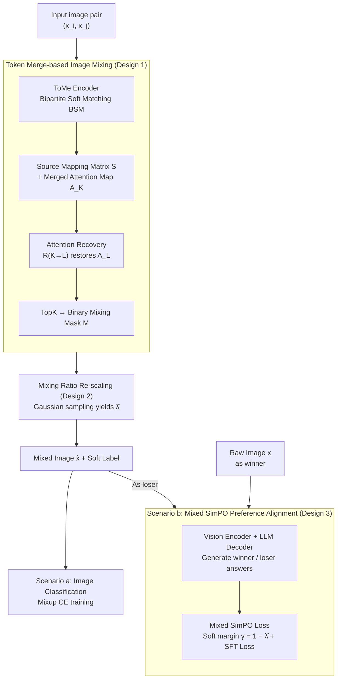

# MergeMix: A Unified Augmentation Paradigm for Visual and Multi-Modal Understanding

**Conference**: ICLR 2026  
**arXiv**: [2510.23479](https://arxiv.org/abs/2510.23479)  
**Code**: [https://github.com/JinXins/MergeMix](https://github.com/JinXins/MergeMix)  
**Area**: Reinforcement Learning  
**Keywords**: Mixup, Token Merging, Preference Alignment, MLLM, Data Augmentation

## TL;DR

MergeMix proposes a mixup data augmentation method based on token merging. It generates mixed images in the attention space through bipartite soft matching and uses the mixing ratio as a soft margin in preference optimization, unifying SFT and RL training paradigms for both image classification and Multi-modal Large Language Models (MLLMs).

## Background & Motivation

**Background**: The post-training stage of Multi-modal Large Language Models (MLLMs) mainly relies on two paradigms: Supervised Fine-Tuning (SFT), which is stable but requires high-quality annotations and lacks task generalization; and Reinforcement Learning-based (RL) preference optimization, which searches for better answers from reward signals but suffers from high computational overhead and training instability. Recent works (e.g., SeVa, SIMA) attempt to bridge the gap by constructing preference pairs.

**Limitations of Prior Work**: The core problem in constructing preference pairs lies in how to controllably generate high-quality "loser" samples. Methods like SeVa use classical augmentations such as RandomCrop to construct losers, but the augmentation is highly random, making the quality of the loser uncontrollable. Furthermore, the DPO loss is independent of the data itself, leading to "selecting" useful training data rather than "generating" effective preference pairs. In image classification, adaptive mixup methods (e.g., PuzzleMix, AutoMix) perform well but rely on extra forward passes to calculate saliency or gradient information, resulting in low efficiency.

**Key Challenge**: In mixup augmentation, there is a contradiction between efficiency and performance—static methods are fast but perform poorly, while adaptive methods perform well but are slow. In MLLM alignment, SFT is stable but lacks preference modeling, while RL provides preferences but is unstable. A method is needed to balance both dimensions simultaneously.

**Goal**: (1) How to design a mixup strategy that is both efficient and effective? (2) How to naturally extend mixup augmentation to MLLM preference alignment? (3) How to establish a direct link between the loss function and the augmented data?

**Key Insight**: The authors observe a natural connection between the merging ratio in token merging (ToMe) and the mixing ratio in mixup—merging itself is a form of information selection, and the attention maps recovered after merging can directly guide the generation of mixup masks. Simultaneously, the mixing ratio can serve as a soft margin in the SimPO preference loss: the more similar the data (larger $\lambda$), the harder the discrimination, and thus the smaller the margin.

**Core Idea**: Use Bipartite Soft Matching (BSM) from token merging to generate attention-guided mixed images and utilize the mixing ratio as a dynamic margin for preference loss, unifying classification augmentation and MLLM alignment training.

## Method

### Overall Architecture

The underlying layer of MergeMix consists of a single "mixing engine": the input image pair is encoded by a ToMeAttention encoder performing Bipartite Soft Matching (BSM). The attention map is recovered via the source mapping matrix, and a mixing mask is generated using TopK (Design 1). The mixing ratio is then re-scaled to $\hat{\lambda}$ (Design 2), producing the mixed image $\hat{x}$ and soft labels. This engine connects to two downstream scenarios: (a) image classification, where the mixed image is used directly for standard mixup training; (b) the MLLM scenario, where the original image is treated as the winner and the mixed image as the loser to form a preference pair, trained using the mixed SimPO loss (soft margin $\gamma = 1-\hat{\lambda}$, Design 3) combined with the SFT loss. A single $\hat{\lambda}$ links the three designs, serving as the pivot to unify SFT augmentation and RL alignment.

### Key Designs

**1. Token Merge-based Mixing Strategy: Using attention maps instead of extra forward computation to decide which regions to mix**

Previous adaptive mixup methods (PuzzleMix, AutoMix) rely on extra forward-backward passes to calculate saliency, which is slow. MergeMix takes a different approach: since token merging itself performs "information selection," its byproduct is reused. Given an initial token sequence $Z_L = f_\theta(\hat{x})$, ToMeAttention executes Bipartite Soft Matching (BSM) to merge $r$ similar tokens in pairs with $O(N)$ complexity, obtaining a compressed sequence $Z_K$ and a source mapping matrix $S$. $S$ records which original positions were merged, naturally encoding spatial similarity between tokens.

The key step is the attention recovery function $\hat{A_L} = \mathcal{R}_{K \to L}(A_K, S)$: it uses $S$ to expand the attention map $A_K$ from the compressed sequence back to the original length $A_L$. Once the recovered attention map is obtained, TopK is used to select $p = \lfloor \lambda \times L \rfloor$ high-attention positions to generate the binary mixing mask $\mathcal{M}$. Unlike vanilla TopK which discards low-attention tokens, BSM uses global pairing, preserving spatial topology and contextual continuity; attention recovery supplements information that would be lost in hard selection. Thus, the resulting mixed image saves computation without destroying semantic structures.

**2. Mixing Ratio Re-scaling Policy: Making $\hat{\lambda}$ reflect both spatial proportion and token aggregation degree**

The mask determines the "mixing area," but simple linear mapping $\lambda$ fails to capture how much information is aggregated after token merging. MergeMix employs Gaussian-based sampling to refine the ratio: mean $\mu = K/L$ (ratio of tokens after merging), standard deviation $\sigma = p / \sum_i^L \mathcal{M}$ (ratio of selected positions to total mask value), followed by sampling and normalized clipping:

$$\hat{\lambda} \sim \mathcal{N}(\mu, \sigma), \quad \hat{\lambda} = \text{clip}\left(\frac{\hat{\lambda} - \min(\hat{\lambda})}{\max(\hat{\lambda}) - \min(\hat{\lambda}) + \tau}, 0, 1\right)$$

Gaussian smoothing avoids abrupt ratio changes, making the augmentation more robust. The normalized $\hat{\lambda}$ carries both spatial ratio information and implicit feature aggregation levels within the model.

**3. Mixed SimPO Preference Loss: Treating the mixing ratio as a "soft margin" for preference optimization**

The first two designs address "how to mix images"; this step integrates it into MLLM preference alignment. The answer for the original image serves as the winner, and the answer for the mixed image serves as the loser, forming a preference pair. The key innovation is that the margin is no longer a fixed hyperparameter—the mixing ratio is mapped to a dynamic margin $\gamma = 1 - \hat{\lambda}$. The intuition is: a large $\lambda$ indicates the mixed image is very similar to the original, making the loser hard to discriminate; thus, $\gamma$ is reduced to avoid over-optimizing an ambiguous pair. A small $\lambda$ indicates a large difference, making the loser easy to discriminate, so $\gamma$ is increased to strengthen the constraint. Substituting into SimPO yields:

$$\mathcal{L}_{\text{SimPO}}^{\text{Mix}} = -\mathbb{E}\left[\log \sigma\left(\frac{\beta}{|y|}\log \pi_\theta(y|x) - \frac{\beta}{|y|}\log \pi_\theta(y|\hat{x}) - (1-\hat{\lambda})\right)\right]$$

Standard DPO margins are data-independent, allowing only the "selection" of useful samples rather than "generation" of preference pairs; MergeMix allows the margin to adapt to the degree of augmentation, automatically adjusting optimization intensity based on sample difficulty.

### Loss & Training

Total loss for image classification: $\mathcal{L}_{\text{Total}} = \underbrace{\mathcal{L}_{\text{CE}}(f_\theta(\hat{x}), y_i) \cdot \hat{\lambda} + \mathcal{L}_{\text{CE}}(f_\theta(\hat{x}), y_j) \cdot (1-\hat{\lambda})}_{\text{mixup CE}} + \underbrace{\mathcal{L}_{\text{CE}}(f_\theta(x), y)}_{\text{one-hot CE}}$

Total loss for MLLM: $\mathcal{L}_{\text{Total}} = \mathcal{L}_{\text{SFT}} + \mathcal{L}_{\text{SimPO}}^{\text{Mix}}$

## Key Experimental Results

### Main Results (Image Classification)

| Method | DeiT-T | DeiT-S | ViT-S | ViT-B | ViT-L |
|------|--------|--------|-------|-------|-------|
| Vanilla | 64.70 | 65.81 | 62.64 | 63.33 | 61.83 |
| CutMix | 75.98 | 74.21 | 69.67 | 72.18 | 68.97 |
| PuzzleMix | 73.40 | 73.60 | 70.92 | 71.13 | 69.77 |
| TransMix | 75.31 | 76.17 | 74.15 | 72.87 | 71.40 |
| MixPro | 74.78 | 75.26 | 73.49 | 73.18 | 72.28 |
| **MergeMix** | **77.46** | **78.68** | **77.02** | **75.75** | **76.19** |

CIFAR-100 for 200 epochs. MergeMix significantly leads across all model sizes, outperforming the strongest baseline TransMix by 2.5% on DeiT-S.

### MLLM Benchmarks

| Model | VQAv2 | GQA | SciVQA | TextVQA | MMBench | POPE | AVG | Gain |
|------|-------|-----|--------|---------|---------|------|-----|------|
| LLaVA-7B | 78.5 | 62.0 | 66.8 | 58.2 | 64.3 | 85.87 | 65.57 | - |
| + CutMix | 79.18 | 62.40 | 70.60 | 57.06 | 66.32 | 86.47 | 65.84 | +0.27 |
| + **MergeMix** | **79.24** | **62.44** | **69.86** | **57.56** | **66.58** | **86.10** | **66.40** | **+0.83** |

### Key Findings

- **Significant Efficiency Advantage**: Using ToMe, MergeMix reduces FLOPs by 16% (4.24G → 3.56G) and increases throughput by 16% (1375 → 1592 img/s) while achieving higher accuracy.
- **Efficiency-Performance Trade-off on ImageNet-1K**: On DeiT-Small, MergeMix reaches 80.71% top-1 accuracy, surpassing all methods that do not use dynamic forward passes, and is the only mixup method to achieve dynamic acceleration.
- **Stable Gains in MLLM Scenarios**: Compared to random augmentations (CutMix, ResizeMix), MergeMix is more consistent across all benchmarks. ResizeMix even led to negative gains (-2.24%), highlighting the importance of controllable augmentation.
- **Association Between Mixing Ratio and Preference Margin**: The design of $\gamma = 1 - \hat{\lambda}$ ensures that easily discriminable samples receive larger constraints while difficult ones receive milder constraints, improving calibration capability.

## Highlights & Insights

- **Ingenious Bridge between Token Merging and Mixup**: Token merging is essentially an information compression operation. The source mapping matrix $S$ naturally encodes similarity relationships between tokens, which can be used to generate semantic-aware mixing masks without extra saliency computation.
- **Aesthetic Unified Paradigm**: A single mixing ratio $\hat{\lambda}$ simultaneously performs three roles—controlling mask size, calibrating label ratios, and adjusting preference margins—linking all three through a single variable.
- **Transferable Idea for Bridging SFT and RL**: The concept of constructing preference pairs via data augmentation can be extended to other modalities, such as audio or video multi-modal models.

## Limitations & Future Work

- **Limited MLLM Experimental Scale**: Primarily validated on LLaVA-7B/13B and Qwen2.5-VL-7B; results for larger models (e.g., 70B) are not provided.
- **Restricted to Visual Token Mixup**: Text tokens in MLLMs are not involved in mixing. Whether pure visual augmentation can fully model multi-modal preferences remains to be explored.
- **Theoretical Guarantee of Preference Pair Quality**: While empirically effective, theoretical analysis on why mixed image answers serve as reasonable losers is lacking.
- **Lack of Comparison with Generative Augmentation**: No comparison was made with diffusion-based augmentation methods like DiffuseMix.

## Related Work & Insights

- **vs SeVa (Zhu et al., 2024)**: SeVa uses RandomCrop to construct losers, which is uncontrollable, and its DPO loss is data-independent. MergeMix generates controllable losers via attention-guided mixing and embeds the ratio into the preference loss.
- **vs PuzzleMix (Kim et al., 2020)**: PuzzleMix generates masks based on gradient information, requiring extra forward-backward passes. MergeMix obtains attention maps "for free" during the encoding process via ToMe's BSM.
- **vs TransMix (Chen et al., 2022)**: TransMix recalculates label ratios using original attention maps but does not change the mixing mask generation. MergeMix optimizes both the mask and labels starting from the token merging level.

## Rating

- Novelty: ⭐⭐⭐⭐ The idea of unifying token merging, mixup, and preference optimization is novel, though individual components are not entirely new.
- Experimental Thoroughness: ⭐⭐⭐⭐ Covers 5 classification datasets and 16 MLLM benchmarks, providing a comprehensive evaluation.
- Writing Quality: ⭐⭐⭐⭐ Clear logic, coherent description of both scenarios, and detailed derivation of formulas.
- Value: ⭐⭐⭐⭐ Practical significance for both image classification and MLLM scenarios; the unified paradigm is insightful.

<!-- RELATED:START -->

## Related Papers

- [\[ICLR 2026\] Controllable Exploration in Hybrid-Policy RLVR for Multi-Modal Reasoning](controllable_exploration_in_hybrid-policy_rlvr_for_multi-modal_reasoning.md)
- [\[NeurIPS 2025\] NoisyRollout: Reinforcing Visual Reasoning with Data Augmentation](../../NeurIPS2025/reinforcement_learning/noisyrollout_reinforcing_visual_reasoning_with_data_augmenta.md)
- [\[ICLR 2026\] Chain-of-Context Learning: Dynamic Constraint Understanding for Multi-Task VRPs](chain-of-context_learning_dynamic_constraint_understanding_for_multi-task_vrps.md)
- [\[ICLR 2026\] Understanding and Improving Hyperbolic Deep Reinforcement Learning](understanding_and_improving_hyperbolic_deep_reinforcement_learning.md)
- [\[ICLR 2026\] RewardMap: Tackling Sparse Rewards in Fine-grained Visual Reasoning via Multi-Stage Reinforcement Learning](rewardmap_tackling_sparse_rewards_in_fine-grained_visual_reasoning_via_multi-sta.md)

<!-- RELATED:END -->
