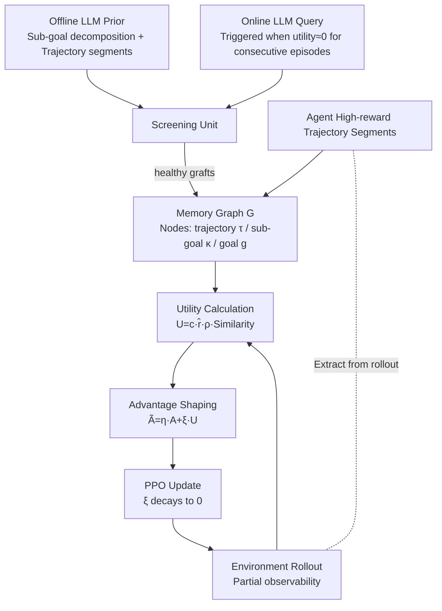

# MIRA: Memory-Integrated Reinforcement Learning Agent with Limited LLM Guidance

**Conference**: ICLR 2026  
**OpenReview**: [https://openreview.net/forum?id=oWagByDNPc](https://openreview.net/forum?id=oWagByDNPc)  
**Code**: [Project Page](https://narjesno.github.io/MIRA/)  
**Area**: Reinforcement Learning / LLM-guided RL  
**Keywords**: Sparse rewards, advantage shaping, memory graph, LLM priors, sample efficiency, PPO  

## TL;DR
MIRA **amortizes** LLM sub-goal decomposition and trajectory priors into a continuously evolving memory graph, from which utility signals are derived to **softly shape advantage estimation**. This accelerates learning during the early stages of sparse rewards and decays the shaping term over training to preserve PPO convergence—achieving performance close to "per-step LLM querying" methods with only a few dozen offline/online queries.

## Background & Motivation
**Background**: RL is powerful in robotics, scheduling, and planning, but these successes mostly rely on dense, easily accessible rewards. Once rewards are sparse or delayed (appearing only after reaching a goal or several steps after an action), combined with partial observability, credit assignment becomes difficult. Gradient signals are diluted, making agents extremely data-hungry and early exploration nearly a random walk.

**Goal**: Incorporate LLM guidance without **changing the reward function or PPO optimization dynamics**, reaping the benefits of priors while preserving RL autonomy and convergence.

**Limitations of Prior Work**: Existing works use LLMs as reward models, plan generators, or for sub-goal decomposition.

**Key Challenge**: These methods almost always require **frequent (often per-step) LLM supervision**. This leads to three difficulties: (1) Constant LLM signals can interfere with RL's own learning signals, weakening autonomous decision-making and generalization; (2) LLMs cannot interact directly with the environment for real-time feedback; (3) Hallucinations, prompt sensitivity, and lack of physical grounding make outputs unreliable, while high-frequency queries pose scalability issues regarding compute and latency.

**Core Idea**: **"Replace real-time supervision with persistent memory + decayable advantage shaping"**—instead of querying the LLM at every step, offline priors and a small number of online queries are crystallized into a memory graph. A utility, measuring how well the current rollout aligns with high-value memory trajectories, is calculated from the graph to compensate for weak, uncalibrated critic advantage signals in the early stages. As the policy improves, the utility term automatically exits, and the final policy converges according to the true reward $R$.

## Method

### Overall Architecture
MIRA adds three modules on top of standard policy-gradient (PPO): a **Memory Graph** (storing offline priors + high-return agent trajectory segments + screened online LLM suggestions), a **Screening Unit** (filtering hallucinations/low-confidence online outputs), and a **Utility Module** (calculating utility signals by comparing the current rollout with the memory graph). The utility is injected into the advantage estimation $\tilde{A}_t = \eta_t A_t + \xi_t U_t$, where the shaped advantage drives PPO updates. The shaping weight $\xi_t$ is annealed to 0 over training, returning control to the critic.

### Key Designs

**1. Co-evolving Memory Graph: Amortizing LLM Queries into Persistent Knowledge**  
The memory graph $G$ organizes decision-related information into three node types: trajectory nodes (storing partial observation $o_{\tau_j}$, action $a_{\tau_j}$, associated goal $\zeta_j$, estimated sub-goal reward $\hat r_j$, and confidence $c_j$), sub-goal nodes $\{\kappa_\ell\}$ from LLM environment decomposition, and goal nodes $\{g_\triangleright\}$ representing total objectives. Edges encode hierarchical "goal $\to$ sub-goal" decompositions. The graph is initialized by offline priors and evolves: new/updated nodes are added when the agent produces high-return segments or when internal experience reinforces low-confidence LLM nodes. Queries are **event-triggered**: an online query is only initiated if the utility of rollouts remains near zero for several episodes. To keep the graph compact, nodes are pruned if their access count remains unchanged within a fixed window.

**2. Offline/Online Dual Guidance + Soft Logit Injection**  
Offline outputs are generated via **full task descriptions** before training to initialize the graph. Online suggestions are subject to the same partial observability as the agent, returning plans or control signals to bias action preferences. Online outputs pass through the **Screening Unit**: if token-level likelihood is available, the geometric mean of per-token probabilities for the completion serves as confidence; otherwise, majority consensus from multiple completions is used. Screened "healthy grafts"—plans are grafted as new trajectory nodes, while control signals use **soft logit injection** (applying a bounded penalty to discouraged actions). This penalty creates a soft preference rather than collapsing the distribution, ensuring the injected bias is only a "light guidance" that the critic can override if necessary.

**3. Dual-Alignment Utility Signal: Scoring Behavior Similarity and Semantic Alignment**  
Utility is defined at the state-action level. For each pair $t$ in trajectory $\tau=\{(o_t,a_t)\}$, it is matched with $(o_{t'},a_{t'})$ in a memory trajectory $\tau_m$:

$$U_t \doteq c_m \cdot \hat r_m \cdot \rho(g_\triangleright, \zeta_m) \cdot \smallint\big((o_t,a_t),(o_{t'},a_{t'})_{\tau_m}\big)$$

The similarity function $\smallint(\cdot,\cdot)$ considers both action consistency and spatial consistency. The semantic factor $\rho$ calculates the **Jaccard similarity** between the token sets of the agent's goal and the memory entry. A transition only contributes utility if both **behavioral similarity and semantic alignment** are high, modulated by the node's confidence $c_m$ and estimated reward $\hat r_m$.

**4. Adaptive Advantage Shaping + Convergence Compatibility**  
Utility is injected into the PPO advantage: $\tilde A_t = \eta_t A_t + \xi_t U_t$, subject to $0 < \eta_t \le 1, \xi_t \le \delta \eta_t, \delta \in [0,1), \lim_{t \to \infty} \eta_t = 1, \lim_{t \to \infty} \xi_t = 0$. This compensates for flat gradients when the critic is uncalibrated. Theoretically, **Theorem 1 (Non-Vanishing Updates under Sparse Rewards)** shows that when $\mathbb{E}[|A_t|] \approx 0$, the shaped update norm $\|\nabla L_k^{\text{shaped}}\| \ge \xi_k \|\nabla L_k^U\| - O(\varepsilon_A)$, ensuring learning signals are maintained while preserving PPO's convergence properties.

## Key Experimental Results

### Main Results
Evaluated on six environments (FrozenLake, RedBall, LavaCrossing, DoorKey, RedBlueDoor, Distracted DoorKey). Baselines include pure PPO, HRL (pre-trained LLM options), LLM-RS (real-time reward shaping), and LLM4Teach (LLM as policy teacher).

| Environment | PPO | HRL | MIRA |
| :--- | :--- | :--- | :--- |
| RedBall | Early gains but below optimal | Eventually catches up | **Optimal in < half iterations** |
| LavaCrossing | Nearly 0% success (Exploration failure) | Slow steady gain | Faster convergence |
| DoorKey / RedBlueDoor | Low | — | **Success rate ~2x higher than HRL** |

All results were achieved with **fewer than 10 offline prompts** and minimal online queries.

### Query Efficiency (Distracted DoorKey)

| Method | Query Count | Final Performance |
| :--- | :--- | :--- |
| LLM4Teach | Once per (s,a,r) tuple, > 500 needed | Comparable to MIRA (high cost) |
| LLM-RS | Once per layout, > 50 | Plateau below MIRA |
| **MIRA** | **~30 per run (7 offline + 20±3 online)** | Matches LLM4Teach, **highest reward per query** |

### Ablation Study
- **Online Query Frequency**: Increasing the online budget accelerates learning; even 10 queries significantly outperform offline-only.
- **Unreliable LLM**: MIRA tolerates low-confidence or incorrect suggestions once memory is mature, maintaining stable performance.
- **LLM Reasoning Style**: Different LLMs (o4-mini, Gemini Pro, Claude) strongly influence RL performance. o4-mini’s "circuitous" memory proved most useful for high asymptotic returns despite slower starts.

## Highlights & Insights
- **Amortization Perspective**: Formulating "per-step supervision" as "few queries $\to$ persistent memory $\to$ repeated reuse" effectively addresses the inefficiency of LLM-guided RL.
- **Shaping over Reward Modification**: Injecting into advantage with $\xi_t \to 0$ annealing allows for early benefits without polluting asymptotic optimality.
- **Diagnostic Ablations**: Analyzing downstream RL performance based on LLM reasoning traces (e.g., Claude's cautious exploration) provides a concrete link between LLM style and RL quality.

## Limitations & Future Work
- **Grid-World Concentration**: Environments are discrete/tabular or pixel grids; similarity functions currently rely on grid coordinates and orientation.
- **Rule-based Utility**: Semantic alignment $\rho$ depends on rule-based parsing of "entity-action" tokens, which may lack robustness in complex natural language tasks.
- **Memory Scalability**: While pruning helps, large-scale state spaces may require hierarchical or clustered memory organization.

## Related Work & Insights
- Compared to **LLM-as-reward** (e.g., Eureka), MIRA avoids modifying the reward function and instead shapes the advantage.
- Compared to **LLM-as-teacher** (e.g., LLM4Teach), MIRA achieves similar performance with an order of magnitude fewer queries via event-triggered triggers and memory reuse.
- **Insight**: The paradigm of "amortizing expensive external supervision into evolvable memory + decaying guidance" is a generalizable framework for LLM-assisted exploration and task design.

## Rating
- **Novelty**: ⭐⭐⭐⭐ — Novel combination of memory graph amortization and decayable advantage shaping.
- **Experimental Thoroughness**: ⭐⭐⭐⭐ — Strong diagnostics across multiple environments and baselines, though limited to grid worlds.
- **Writing Quality**: ⭐⭐⭐⭐ — Clear motivation and logical structure.
- **Value**: ⭐⭐⭐⭐ — Significant reduction in query overhead while maintaining performance, offering a practical path for LLM-RL integration.

<!-- RELATED:START -->

## Related Papers

- [\[ICLR 2026\] Trajectory Generation with Conservative Value Guidance for Offline Reinforcement Learning](trajectory_generation_with_conservative_value_guidance_for_offline_reinforcement.md)
- [\[ICLR 2026\] Selective Expert Guidance for Effective and Diverse Exploration in Reinforcement Learning of LLMs](selective_expert_guidance_for_effective_and_diverse_exploration_in_reinforcement.md)
- [\[ICML 2026\] LLM-Guided Communication for Cooperative Multi-Agent Reinforcement Learning](../../ICML2026/reinforcement_learning/llm-guided_communication_for_cooperative_multi-agent_reinforcement_learning.md)
- [\[ICML 2026\] Learning Query-Aware Budget-Tier Routing for Runtime Agent Memory](../../ICML2026/reinforcement_learning/learning_query-aware_budget-tier_routing_for_runtime_agent_memory.md)
- [\[ICLR 2026\] J1: Incentivizing Thinking in LLM-as-a-Judge via Reinforcement Learning](j1_incentivizing_thinking_in_llm-as-a-judge_via_reinforcement_learning.md)

<!-- RELATED:END -->
