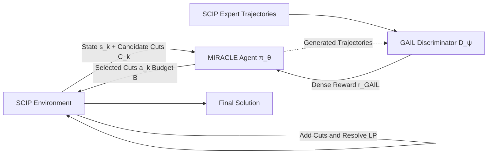

# MIRACLE: Model-free Imitation and Reinforcement Learning for Adaptive Cut-Selection

**Conference**: ICLR 2026  
**OpenReview**: [https://openreview.net/forum?id=zZyxHmId3w](https://openreview.net/forum?id=zZyxHmId3w)  
**Code**: To be confirmed  
**Area**: Reinforcement Learning / Combinatorial Optimization (MIP Cut Selection)  
**Keywords**: Cut Selection, Mixed-Integer Programming, PPO, GAIL, Curriculum Learning, Memory-Efficient Solving  

## TL;DR
Treating the Mixed-Integer Programming (MIP) solver SCIP as the environment and its default cut selection heuristic as the expert, this work utilizes GAIL to learn a dense reward function and PPO to train a lightweight cut selection policy. By selecting only a few high-value cuts within a budget per round, the approach compresses peak memory from GB-level to dozens of MBs (up to 98.5% reduction) while achieving 100% solving success rate and an average 3.78× speedup on MIPLIB.

## Background & Motivation
**Background**: Modern MIP solvers (e.g., SCIP) rely on the branch-and-cut algorithm, which iteratively adds cutting planes to Linear Programming (LP) relaxations to tighten bounds. An industrial-scale problem may generate over 100,000 candidate cuts, yet only 1-2% actually improve the objective bound. Machine learning for solver components has seen significant work: early efforts focused on imitation learning for variable branching (Gasse et al. 2019), while recent trends shifted to cut selection—Tang et al. (2020) used RL targeting immediate rewards, Paulus et al. (2022) imitated strong-branching, and Wang et al. (2024) used hierarchical sequence models.

**Limitations of Prior Work**: Most existing methods treat the solver as a black box and directly optimize for solving time. These suffer from three defects: (1) **Black-box Fallacy**: they fail to learn the internal dynamics of how LP states change after adding a cut; (2) **Myopic Planning**: without an environment model, they make short-sighted decisions and cannot reason about long-term interactions between cuts; (3) **Resource Efficiency as an Afterthought**: memory consumption is rarely treated as a first-class metric, despite being the true bottleneck in edge devices, cloud costs, and multi-tenant throughput.

**Key Challenge**: Explicitly modeling the complex LP transition function is computationally prohibitive, yet failing to model it leads to myopic decision-making. Furthermore, optimizing only for time can cause methods to fail in memory-constrained environments where solvers crash due to memory bloat.

**Goal**: To significantly reduce memory footprint (targeting a limited budget $B$) while maintaining competitive solving quality, specifically satisfying $|\text{obj}_{\text{SCIP}} - \text{obj}_{\text{MIRACLE}}| \le \epsilon$.

**Core Idea**: **[Behavioral Modeling instead of Dynamics Modeling]** Rather than building an LP transition function, cut selection is reformulated as an MDP. GAIL is used to learn a dense reward from SCIP expert trajectories, followed by PPO to train a lightweight policy with memory constraints. This policy imitates and surpasses SCIP's implicit selection strategy by embedding "memory-first" directly into the optimization objective.

## Method

### Overall Architecture
MIRACLE treats the SCIP solver as the environment: in each round $k$, SCIP generates a candidate cut pool $C_k$ and a feature vector $s_k$ representing the current optimization state. The agent (actor-critic policy $\pi_\theta$) outputs a binary selection vector $a_k \in \{0,1\}^{|C_k|}$, selecting a small subset of cuts to add back to the LP under the budget constraint $\sum_i a_k^{(i)} \le B$. Training is conducted offline in three stages: collecting expert trajectories from default SCIP, pre-training with a GAIL discriminator to learn rewards, and refining via PPO on a curriculum with a fixed discriminator. During deployment, an adaptive inference layer is added to dynamically allocate budgets.

### Key Designs

**1. Adversarial Reward Learning: Distilling Solver Engineering into Dense Signals** — The true reward for a cut is only observable after the problem is fully solved. Handcrafted rewards are often myopic or fail to encode memory goals. MIRACLE trains a discriminator $D_\psi: S\times A \to [0,1]$ (MLP + sigmoid) to distinguish between SCIP expert and agent state-action distributions using the standard adversarial cross-entropy: $\min_\psi \mathbb{E}_{\pi_E}[-\log D_\psi] + \mathbb{E}_{\pi_\theta}[-\log(1-D_\psi)]$. The expert policy is explicitly represented as the composition of SCIP's eight-step cut selection operators $\pi_E = T_8 \circ \cdots \circ T_1(s_k)$. According to GAN theory, the optimal discriminator converges to $D^*(s,a)=\frac{\pi_E}{\pi_E+\pi_\theta}$. The learned reward $r_{\text{GAIL}}(s,a)=-\log(1-D_\psi(s,a))$ provides a dense signal, allowing the agent to receive feedback on how "expert-like" its actions are at every step.

**2. PPO Actor-Critic for Stable Learning in High-Variance Spaces** — Cut selection is a high-variance decision space requiring an optimizer that balances policy improvement with stability. The Actor calculates logits via MLP and applies a sigmoid for each candidate cut $c_i$: $P(a_k^{(i)}=1|s_k)=\sigma(f_\theta^{(L)}\circ\cdots\circ f_\theta^{(1)}(x_{c_i},s_k))$. The Critic $V_\phi(s_k)$ shares feature extraction layers with the actor for efficiency. Training uses the GAE to compute advantages $\hat{A}_k^{\text{GAE}}$ based on the GAIL reward $r_k$, maximizing the PPO clipped objective $L^{\text{CLIP}}(\theta)$. This closed loop ensures that adversarially learned rewards drive advantages, which in turn drive policy updates.

**3. Four-Stage Curriculum Learning for Stable Convergence** — Training RL from scratch on diverse and difficult MIP instances is unstable. MIRACLE employs a progressive curriculum: the Foundation stage uses simple instances (200-500 constraints) to learn basic high-value cut patterns; the Scaling and Mastery stages gradually increase difficulty (up to 2000 constraints) to force the agent to develop non-myopic strategies; finally, the Integration stage fine-tunes on a mixed distribution to ensure generalization across the problem spectrum.

**4. Adaptive Inference: Dynamic Budget Allocation** — During deployment, a lightweight classifier first predicts instance difficulty (EASY/MEDIUM/HARD) based on static features. Parameters such as cut budget $B$ and early-stopping patience are adjusted accordingly (e.g., EASY uses $B=10\text{-}20$ and 1-2 iterations; HARD uses $B=30\text{-}50$ and 5-8 iterations). Early stopping occurs when marginal LP bound improvement falls below a difficulty-specific threshold. This allocates lean budgets for simple problems and generous budgets for difficult ones. The memory ratio upper bound is theoretically given by $\frac{M_{\text{MIRACLE}}}{M_{\text{SCIP}}} \le \frac{M'_{\text{base}}+B\cdot T}{M'_{\text{base}}+|C_{\text{total}}|}$, which tends toward $\frac{B\cdot T}{|C_{\text{total}}|}$ for large problems, explaining the 95-99% memory reduction analytically.

## Key Experimental Results

Settings: Trained on 1000 SetCover instances. Evaluated on 150 SetCover + 150 diverse MIPLIB instances (50 per difficulty). Baselines: SCIP 8.0 Default and SCIP Aggressive (maxrounds=5, maxcuts=5000), single-threaded, 600s time limit, 12GB memory limit, PySCIPOpt interface.

### Main Results: Memory and Reliability

| Benchmark | SCIP Memory | MIRACLE Memory | Reduction | Instances |
|---|---|---|---|---|
| SetCover-Easy | 1,970.3 MB | 45.4 MB | 97.7% | 50 |
| SetCover-Medium | 2,437.7 MB | 46.1 MB | 98.1% | 50 |
| SetCover-Hard | 3,033.9 MB | 46.2 MB | 98.5% | 50 |
| MIPLIB-Small | 1,343.9 MB | 415.8 MB | 69.1% | 50 |
| MIPLIB-Medium | 1,347.3 MB | 418.2 MB | 69.0% | 50 |
| MIPLIB-Large | 2,312.3 MB | 737.4 MB | 68.1% | 50 |
| **Average** | **2,073.9 MB** | **284.7 MB** | **86.3%** | 300 |

| Solver | Category | Success Rate | Median Time | Speedup |
|---|---|---|---|---|
| SCIP-Baseline | Large | 53.3% | 577.5s | 1.00× |
| SCIP-Aggressive | Large | 46.7% | 600.0s | 0.96× |
| **MIRACLE** | Large | **100.0%** | **125.7s** | **4.59×** |

### Ablation Study (SetCover, 30 instances per config)

| Configuration | Avg. Speedup | Std. Dev. | Cut Reduction | Avg. Iterations |
|---|---|---|---|---|
| Cut Budget 10 | 1.170 | 0.452 | 99.1% | 1.1 |
| Cut Budget 30 | 1.164 | 0.442 | 99.1% | 1.1 |
| Cut Budget 50 | 1.157 | 0.427 | 99.1% | 1.1 |
| Max Iterations 1 | 1.163 | 0.443 | 99.1% | 1.0 |
| Max Iterations 10 | 1.166 | 0.447 | 99.1% | 1.1 |
| Aggressive Early Stop| 1.166 | 0.445 | 99.1% | 1.0 |

### Key Findings
- **Memory as a First-Class Citizen Improves Reliability**: MIRACLE's peak memory remains constant at 45-46 MB on SetCover, while SCIP scales from 1.97GB to 3.03GB. Across 300 instances, it saves 86.3% on average and up to 98.5% on the hardest ones ($p < 0.001$).
- **Success Rate Recovery**: On MIPLIB, SCIP fails on 40-53% of instances due to memory or time bloat, whereas MIRACLE achieves a 100% success rate (gap 0.1%).
- **Concurrent Speedup**: Median speedups in MIPLIB range from 2.50× to 4.79×, with a 3.78× average across 300 instances, all statistically significant.
- **Robustness**: Performance gains remain stable across various budgets and iteration limits, suggesting the benefits stem from algorithmic design rather than parameter tuning.

## Highlights & Insights
- **Smart Perspective Shift**: Instead of modeling the non-differentiable and complex transition of "how adding cuts changes the LP," the method clones the behavior of the SCIP cut selection module. SCIP represents decades of engineering; imitating it provides a strong baseline, while RL allows for further optimization.
- **Memory in the Objective**: While prior works focus on solving time, this paper proves that a "memory-first" approach enables solving problems that others cannot, as memory bloat is often the root cause of solver crashes. 
- **GAIL for Sparse Rewards**: Real rewards are sparse in cut selection. Using an adversarial discriminator to transform these into dense per-step signals is a robust framework for sequence decision tasks with sparse final rewards.

## Limitations & Future Work
- **Discrepancy in Speedup Metrics**: While the main table reports a 4.59× speedup for "Large" instances, the ablation table on SetCover shows only 1.15-1.17×, with confidence intervals sometimes falling below 1. This suggests speed gains are primarily realized by preventing crashes on difficult instances.
- **MIPLIB Memory Reduction**: Memory savings on MIPLIB (68-69%) are significantly lower than on SetCover (97-98%), indicating a narrowing advantage when generalizing to diverse real-world structures.
- **Expert Ceiling**: The policy essentially imitates SCIP. "Surpassing the expert" is manifested more in memory efficiency than in the novelty of the selection strategy itself. 
- **Training Diversity**: Training was primarily conducted on SetCover; while cross-problem generalization is shown, the diversity of the training set remains limited.

## Related Work & Insights
- **Cut Selection RL Taxonomy**: Tang et al. (2020) first applied RL but focused on immediate rewards; Paulus et al. (2022) focused on strong-branching imitation; Wang et al. (2024) used hierarchical models. MIRACLE differentiates by explicitly modeling the memory-performance trade-off using lightweight budget policies.
- **Imitation Learning Foundations**: Theoretical support is drawn from GAIL (Ho & Ermon 2016) and DAgger-style complexity bounds (Ross et al. 2011). 
- **Insight**: For any system optimization task with expensive/non-differentiable transitions and sparse rewards, the paradigm of "GAIL reward distillation + PPO lightweight policy + explicit resource constraints" serves as a reusable template.

## Rating
- **Novelty**: ⭐⭐⭐ — While components (PPO, GAIL) are established, the combination of "memory as first-class objective" and "distilling SCIP engineering knowledge" is novel.
- **Experimental Thoroughness**: ⭐⭐⭐ — Covers 300 instances across benchmarks with significance testing, though direct main-table comparisons with other learning-based baselines (like Wang et al. 2024) are missing.
- **Writing Quality**: ⭐⭐ — Logical flow is clear, though some sections (like the contributions) appear to have minor editing artifacts.
- **Value**: ⭐⭐⭐⭐ — High potential for deployment in resource-constrained environments (edge/cloud), transforming unsolvable instances into solvable ones via memory management.

<!-- RELATED:START -->

## Related Papers

- [\[ICLR 2026\] Model Predictive Adversarial Imitation Learning for Planning from Observation](model_predictive_adversarial_imitation_learning_for_planning_from_observation.md)
- [\[ICLR 2026\] Near-Optimal Second-Order Guarantees for Model-Based Adversarial Imitation Learning](near-optimal_second-order_guarantees_for_model-based_adversarial_imitation_learn.md)
- [\[ICLR 2026\] Instance-wise Adaptive Scheduling via Derivative-Free Meta-Learning](instance-wise_adaptive_scheduling_via_derivative-free_meta-learning.md)
- [\[ICLR 2026\] ROMI: Model-based Offline RL via Robust Value-Aware Model Learning with Implicitly Differentiable Adaptive Weighting](model-based_offline_rl_via_robust_value-aware_model_learning_with_implicitly_dif.md)
- [\[ICLR 2026\] On Discovering Algorithms for Adversarial Imitation Learning](on_discovering_algorithms_for_adversarial_imitation_learning.md)

<!-- RELATED:END -->
