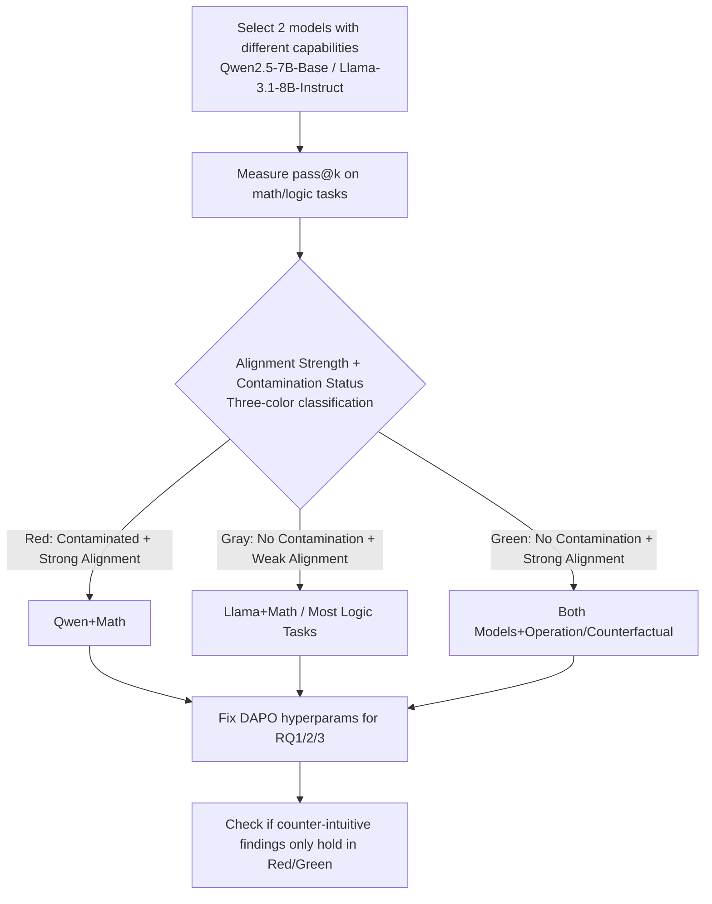

# Mirage or Method? How Model–Task Alignment Induces Divergent RL Conclusions

**Conference**: ICLR 2026  
**OpenReview**: [https://openreview.net/forum?id=5wmetrh9cn](https://openreview.net/forum?id=5wmetrh9cn)  
**Code**: [https://github.com/hkust-nlp/model-task-align-rl](https://github.com/hkust-nlp/model-task-align-rl)  
**Area**: Reinforcement Learning / LLM Reasoning / RLVR  
**Keywords**: RLVR, model-task alignment, pass@k, spurious reward, one-shot RL, negative sample training, test-time RL  

## TL;DR
This paper argues that a series of recent "counter-intuitive" reinforcement learning (RL) conclusions for LLMs—such as the effectiveness of spurious rewards, one-shot RL matching full datasets, and sufficiency of pure negative sample training—are not universal laws of RL. Instead, they hold only when the **model itself is already proficient in the task (strong model-task alignment, measured by pass@k)**. Once a task exceeds the model's capabilities, these techniques fail, and only standard RL with correct rewards remains robust.

## Background & Motivation
**Background**: Reinforcement Learning with Verifiable Rewards (RLVR) has significantly enhanced the mathematical and logical reasoning capabilities of LLMs, giving rise to models like o1 and DeepSeek-R1. Concurrently, several exciting yet counter-intuitive phenomena have been reported: (a) reward signals can be highly inaccurate or even random while still yielding gains (spurious reward), and reward-free entropy minimization can achieve comparable results; (b) training on a single selected sample can match the performance of full dataset training (one-shot RL); (c) training solely with negative samples (NSR) can approximate standard RL.

**Limitations of Prior Work**: These surprising conclusions are almost entirely built on a narrow experimental setup—**Qwen models + mathematical tasks**. There is a lack of systematic clarification regarding the conditions under which these findings hold or fail. Treating these conclusions as universal principles for practice (e.g., discarding precise reward modeling or focusing solely on data selection) carries significant risks.

**Key Challenge**: Concurrent work (Wu et al. 2025) attributes the effectiveness of spurious rewards to **data contamination** of Qwen on test sets. However, the explanation that "Qwen+Math is a special case" is superficial—it fails to clarify the underlying factor that makes this combination unique.

**Goal**: To identify a quantifiable factor that can unify these discrepancies and verify it through controlled experiments across different models and tasks.

**Core Idea**: The authors propose the **"Model-Task Alignment Dependency" hypothesis**. Whether these counter-intuitive techniques succeed depends fundamentally on the **degree of alignment between the pre-trained model's inherent capabilities and the task requirements**, rather than just contamination. This alignment is directly measured by **pass@k**: a task where the model has a high pass@k is strongly aligned, while a low pass@k indicates weak alignment. In strong alignment, these techniques merely "activate" existing capabilities; in weak alignment, they are ineffective, and only standard RL enables genuine learning.

## Method

### Overall Architecture
The paper does not propose a new algorithm but designs a **controlled diagnostic framework** to test the hypothesis. First, several "model × task" combinations are categorized as strongly or weakly aligned using pass@k (with contamination status added for a three-color classification). Then, using a fixed set of hyperparameters (DAPO algorithm), the authors reproduce those counter-intuitive conclusions across three research questions (RQ1: reward signals, RQ2: one-shot RL, RQ3: negative samples) to observe if their success or failure splits strictly along the lines of "alignment strength."

### Key Designs

**1. Quantifying "Model-Task Alignment" via pass@k: Transforming vague "proficiency" into a measurable axis.** The authors use pass@k as the core metric for alignment. It represents the probability that a model finds at least one correct solution in $k$ independent samples for a given problem, directly reflecting the fit between the model's existing knowledge and task demands. For a problem $x_i$ in dataset $D$, with $n \ge k$ samples and $c_i$ correct responses, the unbiased estimate is $\text{pass@}k := \mathbb{E}_{x_i\sim D}\big[1-\binom{n-c_i}{k}/\binom{n}{k}\big]$. Empirically, Qwen's pass@k on AIME quickly saturates near 1 (strong alignment), while Llama on math and both models on KOR-Bench Puzzle/Logic subsets maintain very low pass@k (weak alignment), cleanly dividing the combinations into two categories.

**2. Decoupling "Contamination" from "Alignment" with a three-color experimental partition: Proving contamination is not a necessary condition.** Addressing the contamination hypothesis, the authors use existing methods (prompt truncation for model completion, calculating EM and ROUGE-L) and map the settings into three groups: **Red** (potential contamination + strong alignment, e.g., Qwen+Math), **Gray** (no contamination + weak alignment, e.g., Llama+Math, most logic tasks), and **Green** (no contamination + strong alignment, e.g., both models on Operation/Counterfactual subsets). The Green zone is crucial: these subsets show **no contamination** via EM/ROUGE detection, yet pass@k is high and counter-intuitive techniques still work. This cleanly separates "alignment" from "contamination," directly countering the explanation that results rely solely on data leakage.

**3. Fixed Hyperparameters + Unified DAPO Base: Ensuring differences reflect alignment rather than tuning.** To ensure comparability across settings, all experiments default to DAPO (group size 16, $\epsilon_{\text{low}}=0.2$, $\epsilon_{\text{high}}=0.28$, max gen length 8192). For logic tasks, dynamic sampling is used to address cases where a batch might have near-zero reward variance. Key hyperparameters like learning rate and batch size are **frozen throughout**, emphasizing that observed differences in success are due to model-task alignment. A revealed mechanistic detail is that GRPO/DAPO uses within-group normalization to calculate advantage; thus, **samples with 0% initial rollout accuracy provide no gradient signal**, explaining why one-shot RL fails to learn in weak alignment scenarios where the model cannot solve the task even once.

## Key Experimental Results

### Main Results: Reward Signal Quality (RQ1, Excerpt)
Scores represent post-training accuracy; subscripts show changes relative to the base. Red = Qwen+Math (contaminated + strong alignment), Green = Operation/Counterfactual (no contamination + strong alignment), Gray = Logic tasks, etc. (no contamination + weak alignment).

| Setting | AIME24 | MATH500 | SynLogic (Gray) | OP (Green) | Cipher (Gray) |
|---|---|---|---|---|---|
| Qwen base | 3.3 | 40.8 | 1.5 | 27.2 | 4.8 |
| + Correct Reward | **14.2** | **71.0** | **42.6** | **82.4** | **20.4** |
| + Random Reward | 10.0 | 57.5 | 10.2 | 53.6 | 3.6 (−1.2) |
| + Incorrect Reward | 6.7 | 57.0 | 0.0 (−1.5) | 60.8 | 3.2 (−1.6) |
| Llama base | 3.3 | 32.5 | 0.8 | 60.4 | 8.4 |
| Llama+Random Reward | 3.3 (0.0) | 26.8 (−5.7) | 0.0 (−0.8) | 69.2 | 4.4 (−4.0) |

**Interpretation**: Under Qwen Math (Red) and Operation (Green), random/incorrect rewards still lead to significant improvements. However, under Llama Math and all Gray logic tasks, spurious rewards result in zero gain or regression—while correct rewards are strongest in all settings.

### Reproduction of Other Counter-intuitive Conclusions

| Technique | Strong Alignment (Red/Green) | Weak Alignment (Gray) |
|---|---|---|
| TTRL (Test-time RL) | Qwen+OP: 27.2→55.6; Qwen+MATH: 40.8→62.1 | Qwen/Llama+SynLogic: Almost no change (1.5→1.8) |
| One-shot RL | Qwen+MATH500 one-shot 65.2 ≈ full 71.0; Llama+OP: 60.4→69.2 | No improvement in logic tasks; selected sample ≈ random sample |
| NSR (Pure Negative) | Qwen+MATH500: NSR 68.7 ≈ DAPO 71.0 (~95%) | SynLogic: NSR 1.5 (no gain) vs PSR 24.8 |

### Key Findings
- **Standard RL (correct rewards) is robust across all settings**, serving as the only "universal solution."
- All counter-intuitive techniques (spurious rewards, TTRL, one-shot RL, NSR) **only work under strong alignment** and fail under weak alignment.
- **Contamination is not a necessary condition**: Techniques remain effective in the Green zone (no contamination), disproving the "all-data-leakage" explanation.
- **Two metarules hold across settings**: ① One-shot RL exhibits in-distribution generalization for sub-tasks of the training sample but **does not generalize across sub-task types** (it activates existing abilities rather than teaching new skills). ② NSR slows entropy collapse and maintains exploration, but in logic tasks, a "larger exploration space" corresponds to worse final accuracy.
- Under weak alignment, **PSR (Pure Positive Samples) > NSR**; on SynLogic, PSR still yields gains while NSR remains stagnant.
- Conclusions also hold for code-generation tasks (Appendix G).

## Highlights & Insights
- **Unifies a set of seemingly unrelated counter-intuitive phenomena using a single measurable variable (pass@k)**, upgrading the descriptive "Qwen+Math is special" claim to a predictive mechanistic hypothesis.
- **The design of the Green partition is exceptionally elegant**: By constructing "no contamination but strong alignment" counterexamples, it cleanly separates "alignment vs. contamination," which have been long conflated. This serves as the most persuasive experimental lever in the paper.
- The practical implications are direct: these "reward-saving/data-saving" techniques are essentially **activators rather than teachers**—they can awaken existing capabilities but cannot teach new ones. Therefore, resources should be allocated to strengthening domain capabilities during mid-training (where RL can then be efficient and coarse) or focusing on standard RL with precise rewards for difficult tasks.
- Revealed an overlooked algorithmic mechanism: The within-group normalization of GRPO/DAPO results in zero gradients for "all-wrong batches," fundamentally explaining the failure of one-shot/spurious methods in weak alignment scenarios.

## Limitations & Future Work
- Primarily validated on Qwen2.5-7B and Llama-3.1-8B (~7-8B models); how the **alignment threshold shifts for larger-scale models** was not explored in depth.
- While pass@k is a useful metric for alignment, it is an **aggregate scalar** and lacks a fine-grained causal breakdown of *why* a model is strongly aligned (e.g., pre-training data composition, format familiarity).
- "Strong alignment" and "weak alignment" are currently treated as empirical discrete bins; there is no continuous, quantitative threshold to predict the success or failure of specific techniques.
- The suggestion for "jointly optimizing mid-training + RL" is a directional proposal without a specific "recipe" or experimental validation.

## Related Work & Insights
- **Direct Dialogue**: The paper reassesses the work of Shao et al. (spurious reward), Wang et al. (one-shot RL), Zhu et al. (NSR), Zuo et al. (TTRL), and Agarwal et al. (entropy minimization) within a single framework.
- **Confrontation with the contamination hypothesis (Wu et al. 2025)** is a central argument, with the Green partition acting as the decisive evidence.
- **Inspiration for Future Research**: Any work reporting "counter-intuitive" LLM-RL conclusions should first report the pass@k / model-task alignment of its setup. Otherwise, the conclusion might merely be the illusion of "activating what the model already knows." This establishes a standard for **reproducibility and comparability** in RLVR experiments.

## Rating
- **Novelty**: ⭐⭐⭐⭐ — Does not propose a new algorithm, but proposes and rigorously validates a predictive unified hypothesis, consolidating fragmented findings into a single measurable factor.
- **Experimental Thoroughness**: ⭐⭐⭐⭐⭐ — Covers two model families, three task types (math/logic/code), four counter-intuitive techniques, and three-color controlled partitions. Fixed hyperparameters and dual evidence (contamination detection + pass@k) make it robust.
- **Writing Quality**: ⭐⭐⭐⭐ — Clear structure (hypothesis-partition-verification); the three-color scheme is intuitive, though dense tables require careful attention to the color coding.
- **Value**: ⭐⭐⭐⭐⭐ — Corrects several potentially misleading "reward-saving/data-saving" conclusions. Establishes a methodological standard for RLVR and provides practical guidance for resource allocation.

<!-- RELATED:START -->

## Related Papers

- [\[ICLR 2026\] Spectral Bellman Method: Unifying Representation and Exploration in RL](spectral_bellman_method_unifying_representation_and_exploration_in_rl.md)
- [\[ICLR 2026\] RL Grokking Recipe: How Does RL Unlock and Transfer New Algorithms in LLMs?](rl_grokking_recipe_how_does_rl_unlock_and_transfer_new_algorithms_in_llms.md)
- [\[ICLR 2026\] Prosperity before Collapse: How Far Can Off-Policy RL Reach with Stale Data on LLMs?](prosperity_before_collapse_how_far_can_off-policy_rl_reach_with_stale_data_on_ll.md)
- [\[ICLR 2026\] MATH-Beyond: A Benchmark for RL to Expand Beyond the Base Model](math-beyond_a_benchmark_for_rl_to_expand_beyond_the_base_model.md)
- [\[ICLR 2026\] Scalable Offline Model-Based RL with Action Chunks](scalable_offline_model-based_rl_with_action_chunks.md)

<!-- RELATED:END -->
