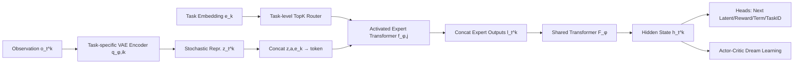

# Mixture-of-World Models: Scaling Multi-Task Reinforcement Learning with Modular Latent Dynamics

**Conference**: ICLR 2026  
**OpenReview**: [https://openreview.net/forum?id=qUQARlAx5y](https://openreview.net/forum?id=qUQARlAx5y)  
**Code**: To be confirmed  
**Area**: Reinforcement Learning / World Models / Multi-Task Learning  
**Keywords**: Multi-task reinforcement learning, world models, Mixture-of-Experts, modular latent dynamics, sample efficiency  

## TL;DR
By integrating task-specific VAEs, a mixture of Transformer experts, and a shared backbone into a "Mixture-of-World models" (MoW) architecture—augmented with gradient clustering and harmony loss—the authors train a single agent to simultaneously master 26 Atari games and 50 Meta-World tasks. The performance approaches that of an ensemble of 26 single-task models while reducing parameters by half.

## Background & Motivation
- **Background**: World model-based MBRL (e.g., Dreamer, STORM, IRIS) achieves high sample efficiency in single-task visual control through "imagination in latent space." However, these successes are largely limited to single-task settings.
- **Limitations of Prior Work**: When scaling world models to multi-task visual domains, tasks are highly heterogeneous in both **observation appearance** and **dynamics**. A monolithic world model must simultaneously encode diverse visual features and accurately predict task-specific dynamics. In practice, these objectives often conflict and exceed the capacity of a single architecture. Furthermore, visual MBRL requires high-fidelity reconstruction for latent space policy training, a challenge rarely addressed in MTRL.
- **Key Challenge**: Simply utilizing a "shared model + task ID conditioning" often fails without massive amounts of expert data. Conversely, training a separate world model for every task (e.g., an ensemble of 26 STORM models) is effective but causes parameters to scale linearly with the number of tasks, hindering scalability.
- **Goal**: Construct a **parameter-efficient and sample-efficient** multi-task visual world model where a single agent covers the entire task set in one training run, achieving performance comparable to single-task ensembles with significant parameter compression.
- **Key Insight**: **Modularity + Sparse Experts**. The perception end uses task-adaptive modular VAEs to ensure reconstruction fidelity, while the dynamics end employs a mixture of "task-conditioned Transformer experts + shared backbone" to capture heterogeneous dynamics. Modules for similar tasks are merged based on gradient similarity clustering to save parameters.

## Method

### Overall Architecture
MoW decomposes the world model into two hierarchical modules: The **perception module** uses a set of categorical VAEs to compress high-dimensional images into compact latent representations, with each task (or task cluster) assigned a specific encoder-decoder pair. The **temporal module** models dynamics in the latent space, consisting of a "Mixture-of-Expert Transformers + a shared Transformer." Experts handle task-specific dynamics, while the shared backbone captures cross-task commonalities. Experts are selected via **task-level routing** (based on a learnable task embedding $e_k$). The entire world model is trained using end-to-end self-supervision, and the agent learns policies entirely within imagined trajectories.

### Key Designs

**1. Modular VAE Perception: Using task-specific encoder-decoders for reconstruction fidelity.** In visual MTRL, a single VAE struggles to compress images across tasks with vast appearance differences, leading to blurry reconstructions and distorted latent imagination. MoW assigns a specific encoder-decoder pair $(q_{\phi,i_k}, p_{\phi,i_k})$ to each task cluster. The posterior $z_t^k \sim q_{\phi,i_k}(z_t^k \mid o_t^k, e_k)$ samples from a categorical distribution (32 groups × 32 classes) with straight-through gradients. Reconstruction $\hat o_t^k \sim p_{\phi,i_k}(\hat o_t^k \mid z_t^k, e_k)$ is conditioned on the learnable task embedding $e_k$ ($\|e_k\|_2=1$). This allows each VAE to specialize in the visuals of its respective task cluster, maintaining high-fidelity reconstruction—a critical factor for latent policy learning.

**2. Mixture-of-Transformer Dynamics with Task-level Routing: Decoupling MoE from FFN.** The authors intentionally choose **task-level routing instead of token-level routing**. The router consumes only the task embedding $e_k$, where $S_k = \mathrm{Softmax}(\mathrm{MLP}(e_k))$, and $W_k, J_k = \mathrm{TopK}(S_k, n_k)$ select the activated experts. There are two reasons: first, standard MoE in Transformers resides in the FFN and only models sparse transformations of features without capturing temporal dependencies; MoW moves the MoE outside the Transformer blocks to let the mixture backbone directly learn different task dynamics. Second, with token-level routing, different tokens in the same task trajectory might activate different experts, causing each expert to see only fragments and learn "fragmented dynamics." Task-level routing ensures consistent expert activation within a task, allowing experts to learn coherent temporal structures. The output of activated experts $l_t^k$ is fed into the shared Transformer $F_\phi$ to produce the hidden state $h_t^k$. Softmax temperature is annealed to approach 1, ensuring early-stage stochasticity for balanced utilization and late-stage determinism for stable optimization.

**3. Task Prediction Head + Balance Loss: Ensuring discriminative latent states and preventing expert collapse.** The hidden state $h_t^k$ is processed by four prediction heads (next latent distribution, reward, termination, and task ID). The **task prediction loss** $\mathcal L^{task}_{t,k} = \mathrm{CrossEnt}(\hat k, k)$ explicitly forces the hidden state to contain sufficient task-discriminative information, improving imagination accuracy. To prevent expert collapse, a **balance loss** $\mathcal L_{bal} = \|\sum_k W_k - \frac{KN_k}{N_e}\mathbf 1_{N_e}\|_2^2$ is applied. Since MoW concatenates expert features rather than using weighted sums, this loss primarily encourages all experts to be activated rather than enforcing identical activation distributions across tasks. The total world model loss combines six terms: reconstruction, reward, termination, task, dynamics, and representation ($\beta_1=0.5, \beta_2=0.1$).

**4. Harmony Loss for Gradient Conflict + Gradient Clustering for Parameter Efficiency.** Two major challenges in MTRL are cross-task gradient conflicts and task weight tuning. MoW uses **harmony weights** $\mathcal L_H = \sum_k \frac{1}{\sigma_k}\mathcal L_k + \ln(1+\sigma_k)$ to automatically adjust weights against conflicts without requiring explicit gradient projection. Parameter efficiency stems from a **warmup stage with gradient clustering**. The agent first trains a single VAE set and its predictors for a few steps with a fixed replay buffer to initialize dynamics representations, then copies parameters to other modules. After warmup, gradient vectors for each task are extracted (averaged per layer for efficiency) and clustered by similarity to determine which tasks share the $i$-th VAE, predictor, or critic (similar to HarmoDT). This allows similar tasks to share modules, reducing the number of modules $N_m$ to be much smaller than the number of tasks, achieving sub-linear parameter growth.

## Key Experimental Results

### Main Results

| Benchmark | Method | Input | Metric | Steps | Parameters |
|---|---|---|---|---|---|
| Atari 100K (26 games) | STORM (26 single-task ensemble) | Image | 114.2% HNR | 100K/game | 1977.5 MB |
| Atari 100K (26 games) | **MoW (Single unified model)** | Image | **110.4% HNR** | 100K/game | **972.5 MB (↓50%)** |
| Meta-World MT50 | MOORE | State | 72.9 ± 3.3 | 100M | — |
| Meta-World MT50 | **MoW (Ours)** | **Image** | **74.5 ± 1.1** | **15M (300K/task)** | — |

The single MoW model nearly matches the performance of the 26-task STORM ensemble on Atari 100K with half the parameters. On Meta-World MT50, MoW uses visual input and only 15M steps to outperform MOORE (which uses states and 100M steps), setting a new visual SOTA.

### Ablation Study

| Configuration | Result |
|---|---|
| Vanilla STORM + Task Embedding (Multi-task baseline) | **Training failed**; failed to adapt to multi-task settings |
| Vanilla STORM + Multiple VAEs | Underperformed MoW; dynamics loss significantly higher, impaired imagination |
| Experts 3 → 12 (Fixed cluster count) | Performance improved significantly with more experts; 12 experts sufficient for 26 tasks |
| VAE Clusters 3 → 12 (Fixed expert count) | Some improvement, but with diminishing returns |

### Key Findings
- Simple addition of task IDs to a shared Transformer fails in the multi-task visual domain, proving that modular mixture architectures are a necessity rather than a minor enhancement.
- Increasing the number of **expert Transformers** yields higher performance gains than increasing VAEs, as experts directly handle task-specific dynamics. VAEs primarily improve reconstruction; once fidelity is sufficient, their impact plateaus.
- Visualization of imagined reconstructions shows that MoW produces clearer 16-step imaginations compared to multi-task vanilla STORM, without cross-task confusion.

## Highlights & Insights
- **Decoupling "Reconstruction Fidelity" and "Dynamics Heterogeneity"**: Perception uses modular VAEs for reconstruction while the temporal end uses mixture experts for dynamics, addressing the core contradiction of visual world models in MTRL.
- **Task-level Routing as a Critical Choice**: Using task embeddings instead of token-level routing ensures consistent expert activation within a task, allowing the model to learn complete temporal structures rather than fragmented dynamics.
- **Sub-linear Parameter Growth**: Using gradient similarity clustering during warmup to decide module sharing is the primary driver for halving parameters, rather than simply stacking experts.

## Limitations & Future Work
- The number of task clusters $N_m$ and experts $N_e$ remain critical hyperparameters that must be pre-set. Clustering is determined once during warmup and stays fixed, lacking a mechanism for dynamic task re-clustering during training.
- Evaluations are limited to Atari (26 games) and Meta-World (50 tasks). Scalability to open-world, real-robot, or larger orders of task magnitudes remains unverified.
- Total training overhead and hardware dependence (e.g., 4090 DDP) are not fully discussed, though 100K steps per game take approximately 3.5 hours.
- Routing is solely conditioned on task embeddings, meaning a task always uses the same expert combination. Whether fine-grained routing is needed for intra-task stage transitions (e.g., pick → place) remains an open question.

## Related Work & Insights
- **World Models**: Dreamer series (RSSM long-range imagination), STORM (Custom Transformer, Atari SOTA, primary baseline), IRIS (VQ-VAE discrete tokens)—Ours extends this line from single-task to multi-task visual domains.
- **MTRL & MoE**: MOORE and D2R incorporate MoE into SAC to improve knowledge sharing but only evaluate in low-dimensional state spaces and suffer from model-free sample inefficiency. TD-MPC2 performs multi-task MBRL but relies on state inputs and expert data. MoW differs as the first multi-task world model for **high-dimensional vision + online interaction**.
- **Insights**: Decoupling MoE from internal FFNs to an external backbone level and using gradient clustering for module sharing are valuable strategies for any multi-task architecture (not just RL) needing to balance sharing and specialization across heterogeneous tasks.

## Rating
- **Novelty**: ⭐⭐⭐⭐ — First multi-task world model for high-dimensional vision. The combination of task-level routing, modular VAEs, and gradient clustering is well-motivated and targeted.
- **Experimental Thoroughness**: ⭐⭐⭐⭐ — Dual benchmarks (Atari 100K + Meta-World), including parameter scalability, ablation of module counts, and comparison with single-task ensembles. Solid, though larger task sets would further strengthen the claims.
- **Writing Quality**: ⭐⭐⭐⭐ — Method description is clear. Motives for routing design and individual loss terms are well-articulated. Visualizations (arch-diagram + imagination comparisons) are intuitive.
- **Value**: ⭐⭐⭐⭐ — Provides a parameter-efficient and sample-efficient scalable template for "generalist world models," bringing practical significance to the development of generalist agents.

<!-- RELATED:START -->

## Related Papers

- [\[ICLR 2026\] From Observations to Events: Event-Aware World Models for Reinforcement Learning](from_observations_to_events_event-aware_world_models_for_reinforcement_learning.md)
- [\[ICLR 2026\] Learning Massively Multitask World Models for Continuous Control](learning_massively_multitask_world_models_for_continuous_control.md)
- [\[ICML 2025\] Mastering Massive Multi-Task Reinforcement Learning via Mixture-of-Expert Decision Transformer](../../ICML2025/reinforcement_learning/mastering_massive_multi-task_reinforcement_learning_via_mixture-of-expert_decisi.md)
- [\[ICLR 2026\] One Model for All Tasks: Leveraging Efficient World Models in Multi-Task Planning](one_model_for_all_tasks_leveraging_efficient_world_models_in_multi-task_planning.md)
- [\[ICLR 2026\] On Predictability of Reinforcement Learning Dynamics for Large Language Models](on_predictability_of_reinforcement_learning_dynamics_for_large_language_models.md)

<!-- RELATED:END -->
