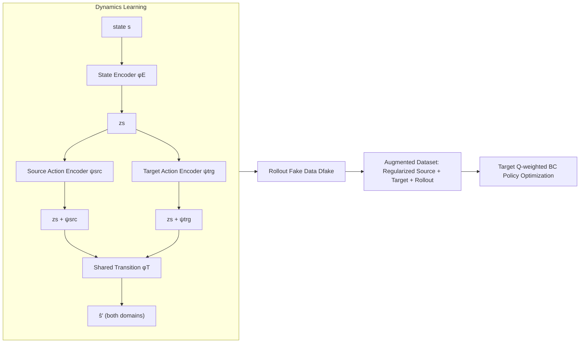

# MOBODY: Model-Based Off-Dynamics Offline Reinforcement Learning

**Conference**: ICLR 2026  
**OpenReview**: [https://openreview.net/forum?id=7c0YS3cuno](https://openreview.net/forum?id=7c0YS3cuno)  
**Code**: To be confirmed  
**Area**: Reinforcement Learning / Offline RL / Domain Adaptation  
**Keywords**: Offline Reinforcement Learning, Dynamics Mismatch, Model-based RL, Representation Learning, Behavior Cloning  

## TL;DR
MOBODY shifts focus in "off-dynamics offline RL" from "filtering/penalizing high-offset source data" to "directly learning an accurate target domain dynamics model for rollout exploration." It employs dual action encoders with shared state/transition functions to learn target dynamics, combined with target Q-weighted behavior cloning for policy optimization, achieving average improvements of 25%–44% on MuJoCo/Adroit.

## Background & Motivation
- **Background**: Off-dynamics offline RL assumes a large amount of source domain (simulator) offline data and a very small amount of target domain (real/deployment) data. Both share the same reward function, but transition dynamics differ: $p_{src}(s'|s,a)\neq p_{trg}(s'|s,a)$. The goal is to learn a policy that performs well in the target domain using only offline data. Typical ratios of $|D_{src}|/|D_{trg}|$ reach up to 200.
- **Limitations of Prior Work**: Mainstream methods fall into two categories: **reward regularization** (e.g., DARA uses domain classifiers to estimate dynamics gaps to penalize source rewards) and **data filtering** (discarding high-offset source transitions). Both essentially train policies using only data from "low-offset regions."
- **Key Challenge**: When dynamics offsets are large, or when high-reward trajectories in the target domain happen to fall in high-offset regions, these states are missing from low-offset data. Consequently, policies cannot be guided to explore them, causing such methods to fail.
- **Goal**: Can we **directly use target domain transitions** to optimize policies instead of being restricted to low-offset areas, thereby exploring high-reward, high-offset regions?
- **Core Idea**: **[Model-based Paradigm]** Instead of filtering data, **learn an accurate target domain dynamics model** to perform rollouts and generate target domain transitions for exploration. The difficulty lies in the scarcity of target data: dynamics learned directly on merged data are dominated by the source domain, while pretrain-finetune approaches fail to capture domain differences. The **Key Insight** of MOBODY is that **to reach the same next state, the two domains require different actions**. Thus, it uses **separate action encoders** to absorb domain differences, while **sharing state representations and transition functions** to borrow structural knowledge from the source data.

## Method

### Overall Architecture
MOBODY consists of two stages: first, representational learning to simultaneously learn dynamics for both domains (via "separate action encoders + shared state encoder + shared transition function"); second, model-based offline RL—using the learned target dynamics to rollout "fake data," combining this with regularized source data and original target data to form an augmented dataset for policy optimization via target Q-weighted behavior cloning.

### Key Designs

**1. Dynamics Decomposition: Separate action encoders + shared state/transition to supplement structural knowledge from source data.** This is the core implementation of the paper's main observation. Although transitions differ, the domains share structural knowledge (e.g., high-level robot movement). Differences manifest in "the actions required to reach the same next state." MOBODY decomposes dynamics into three parts: shared state encoder $z_s=\phi_E(s)$, **two separate action encoders** $\psi_{src}/\psi_{trg}$, and a shared transition function $\phi_T$. The domains are modeled as:
$$\hat{s}'_{src}=\phi_T\big(z_s+\psi_{src}(z_s,a)\big),\quad \hat{s}'_{trg}=\phi_T\big(z_s+\psi_{trg}(z_s,a)\big),$$
where the "additive" form $z_s+\psi(z_s,a)$ corresponds to the $s'=s+f(s,a)$ structure common in model-based RL. In this way, 1M source transitions help train the shared $\phi_E, \phi_T$, while domain differences are compressed into respective action encoders, allowing the target dynamics to be learned accurately with minimal data.

**2. Collaborative Dynamics Training with Three Losses: Transition + Encoder + Cycle Transition.** Transition MSE loss $\mathcal{L}_{dyn}=\frac1N\sum\|s'-\phi_T(z_s+\psi(z_s,a))\|^2$ alone is insufficient for the action encoder to absorb domain gaps. MOBODY adds two representation learning losses: **Encoder loss** forces state-action representations to approach next-state representations $\mathcal{L}_{rep}=\frac1N\sum\||z_{s'}|_{\times}-(z_s+\psi(z_s,a))\|^2$ ($|\cdot|_\times$ denotes stop-gradient), forcing $\psi$ to encode transition information; **Cycle transition loss** adopts a VAE-like approach: setting $\psi$ to 0 should recover the original state via $\hat s=\phi_T(\phi_E(s))$, treating $\phi_E$ as an encoder and $\phi_T$ as a decoder:
$$\mathcal{L}_{cycle}=\tfrac{1}{2N}\sum\sum_j(\mu^2+\sigma^2-\log\sigma^2-1)+\tfrac1N\sum\|s-\hat s\|^2.$$
The cycle loss improves state representation quality and **mitigates mode collapse** observed when using only the encoder loss.

**3. Reward Learning + Uncertainty Penalty.** Since rewards are functions of $(s,a,s')$ and consistent across domains, a reward model $\hat r(s,a,s')$ is trained on merged data using both **true next states and predicted next states**. Uncertainty quantification is performed in MOPO style: $\tilde r=\hat r-\beta\,u(s,a)$, where $u$ is the next-state prediction uncertainty, ensuring conservative rewards to avoid over-optimism in regions with high model error.

**4. Target Q-weighted Behavior Cloning for Policy Optimization.** A core challenge in offline RL is exploration error from OOD actions, worsened in off-dynamics settings. Standard behavior cloning (TD3-BC) pulls the policy toward source actions, which might be suboptimal in the target domain. Inspired by AWR/IQL, MOBODY weights BC using **target Q-values**—learned from $D_{enhanced}=D_{src\_aug}\cup D_{trg}\cup D_{fake}$:
$$\pi=\arg\min_\pi -\mathbb{E}\big[\lambda Q(s,\pi(s))\big]+\mathbb{E}_{D_{src\_aug}\cup D_{trg}}\Big[\exp\!\big(\tfrac{Q(s,\pi(s))}{\frac1N\sum|Q|}\big)(\pi(s)-a)^2\Big].$$
This **upweights actions with high target Q-values**, pushing the policy toward actions that perform well under target dynamics rather than those with high source Q-values or blindly mimicking all offline actions.

## Key Experimental Results

### Main Results (MuJoCo gravity/friction offset, medium data, normalized scores over 3 seeds)
32 settings across four environments × {gravity, friction} × {0.1, 0.5, 2.0, 5.0}; representative "large-offset" cases are listed below:

| Env/Offset | Level | DARA | REAG | MOPO | TD3-BC | MOBODY |
|---|---|---|---|---|---|---|
| HalfCheetah Friction | 0.1 | 23.69 | 9.74 | 28.32 | 8.95 | **57.53** |
| Ant Gravity | 5.0 | 31.01 | 49.36 | 28.97 | 6.37 | **65.45** |
| Ant Friction | 5.0 | 7.80 | 9.53 | 13.89 | 10.06 | **31.17** |
| Walker2d Gravity | 0.1 | 20.12 | 26.56 | 41.98 | 36.48 | **65.85** |
| Walker2d Gravity | 5.0 | 5.44 | 4.61 | 5.65 | 5.12 | **46.05** |

- Overall, MOBODY achieves a **44% improvement** over the second-best baseline REAG, ranking first or second in 28 out of 32 settings.

### Key Findings
- **Most Significant Advantage in Large-Offset Scenarios**: Under extreme offsets (e.g., gravity×5.0), all baselines collapse to near-random levels (~5 points), while MOBODY maintains 27–65 points—validating that "model-based exploration is necessary when low-offset data is insufficient."
- **Kinematic/Morphology offsets** also show an average **25% improvement**, covering Adroit Pen/Door tasks.
- **MOPO fails when learning dynamics on merged data directly** (Figure 1), as source transitions dominate, resulting in models that mimic source dynamics. This confirms the necessity of separate action encoders.

### Ablation Study

| Removed Component | Expected Impact |
|---|---|
| Separate Action Encoders → Single Encoder | Degenerates to merged dynamics; inaccurate target dynamics. |
| Removing Cycle Transition Loss | Representation mode collapse; dynamics quality decreases. |
| Target Q-weighted BC → Standard BC | Clones source domain actions; target performance drops. |
| Target Q-weighted → AWR style | Target Q-weighting verified as superior in this paper. |

## Highlights & Insights
- **Paradigm Shift**: Re-frames off-dynamics offline RL from "data selection/reward punishment" to "accurate target dynamics learning plus exploration," providing the first viable model-based solution for this setting.
- **Clean Insight**: The observation "same next state requires different actions" leads to an elegant decoupling of cross-domain sharing and domain specificity via "shared state/transition + separate action encoders."
- **Target Q-weighted BC**: A lightweight and general regularizer that adapts AWR's "advantage weighting" to "target Q-weighting" for off-dynamics settings.

## Limitations & Future Work
- Learning dynamics with minimal target data (5000 transitions) still relies on the assumption of structural similarity between domains; benefits may decrease if shared structure (reward/state semantics) is weak.
- Assumes the reward function is identical across domains and is a function of $(s,a,s')$, whereas rewards themselves might shift in reality.
- Multiple components (VAE representation, dual encoders, UQ) result in more hyperparameters ($\beta, \alpha, \lambda_{rep}$) and heavier engineering implementation than model-free baselines.
- Validated only in simulation (MuJoCo/Adroit); performance in real sim-to-real deployment remains to be investigated.

## Related Work & Insights
- **Off-dynamics Offline RL**: Reward regularization/data filtering methods like DARA, BOSA, SRPO, and REAG are the primary baselines.
- **Model-Based Offline RL**: MOPO provides the "rollout + uncertainty penalty" paradigm; MOBODY replaces the core dynamics learning within this framework.
- **Representation Learning for Dynamics**: The "state-action representation approximating next-state representation" from the TD-MPC series is utilized as the encoder loss, while VAE (Kingma) concepts are adapted for the cycle transition loss.
- **Behavior Cloning/AWR**: Mergence of BC regularization from TD3-BC and advantage weighting from IQL/AWR into target Q-weighted BC.
- **Insight**: In transfer problems with large OOD source data and minimal target data, explicitly building distribution differences into a lightweight module (action encoder) to enable active exploration of the target domain is a strategy that can generalize to broader offline domain adaptation scenarios.

## Rating
- **Novelty**: ⭐⭐⭐⭐ First viable model-based paradigm for off-dynamics offline RL; the "same next state → different actions" entry point is clean and insightful.
- **Experimental Thoroughness**: ⭐⭐⭐⭐ Covers 4 environments × 4 offset levels + kinematic/morphology + Adroit; clear advantage in large offsets; 3 seeds is slightly low.
- **Writing Quality**: ⭐⭐⭐⭐ Clear logic from motivation to observation to method; losses and architecture diagrams are well-coordinated.
- **Value**: ⭐⭐⭐⭐ Provides substantial improvements for sim-to-real/domain adaptation RL; components (Target Q-weighted BC, Separate Action Encoders) are reusable for future work.

<!-- RELATED:START -->

## Related Papers

- [\[ICLR 2026\] Dual-Robust Cross-Domain Offline Reinforcement Learning Against Dynamics Shifts](dual-robust_cross-domain_offline_reinforcement_learning_against_dynamics_shifts.md)
- [\[ICLR 2026\] Masked Skill Token Training for Hierarchical Off-Dynamics Transfer](masked_skill_token_training_for_hierarchical_off-dynamics_transfer.md)
- [\[ICLR 2026\] Scalable Offline Model-Based RL with Action Chunks](scalable_offline_model-based_rl_with_action_chunks.md)
- [\[ICLR 2026\] ADM-v2: Pursuing Full-Horizon Roll-out in Dynamics Models for Offline Policy Learning and Evaluation](adm-v2_pursuing_full-horizon_roll-out_in_dynamics_models_for_offline_policy_lear.md)
- [\[ICLR 2026\] Squeeze the Soaked Sponge: Efficient Off-Policy RFT for Large Language Model](squeeze_the_soaked_sponge_efficient_off-policy_rft_for_large_language_model.md)

<!-- RELATED:END -->
