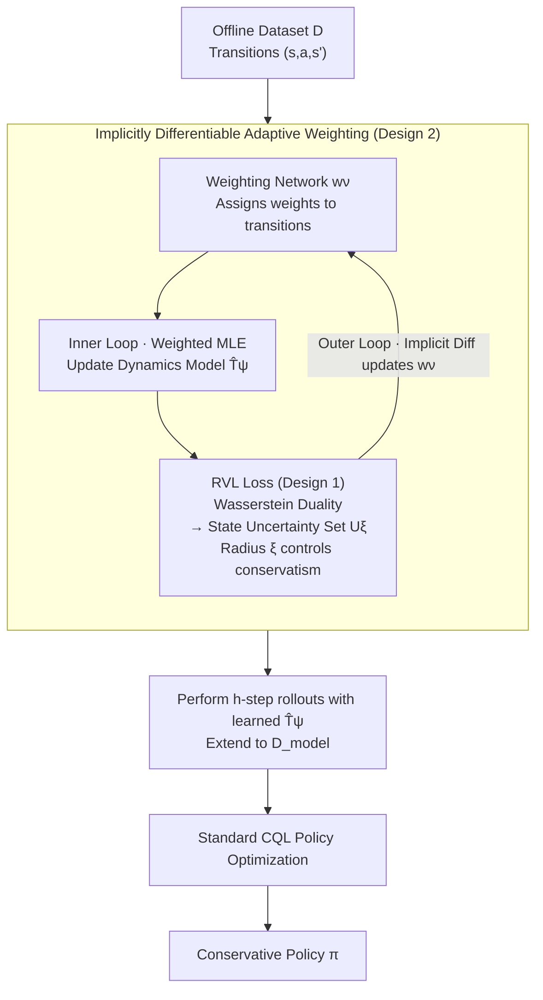

# ROMI: Model-based Offline RL via Robust Value-Aware Model Learning with Implicitly Differentiable Adaptive Weighting

**Conference**: ICLR 2026  
**arXiv**: [2603.08118](https://arxiv.org/abs/2603.08118)  
**Code**: None  
**Area**: Reinforcement Learning  
**Keywords**: Offline RL, Model-based Method, Adversarial Model Learning, Wasserstein Duality, Bi-level Optimization  

## TL;DR
ROMI achieves robust value-aware model learning by transforming the dynamics uncertainty set into a state uncertainty set via Wasserstein duality. It utilizes an implicitly differentiable adaptive weighting mechanism to balance dynamics accuracy and value awareness, effectively solving the Q-value underestimation and gradient explosion issues inherited from RAMBO, and reaches SOTA performance for model-based offline RL on D4RL and NeoRL.

## Background & Motivation

**Background**: Model-based offline RL enhances datasets by learning environmental dynamics models and expanding training data with simulated rollouts. RAMBO is a representative adversarial model learning method that generates conservative value estimates by optimizing the dynamics model in a minimax fashion.

**Limitations of Prior Work**: RAMBO has a critical flaw—its trade-off coefficient $\lambda$ must be kept extremely small (3e-4). A slight increase (0.05-0.1) leads to severe Q-value underestimation and gradient explosion, causing training to collapse. This makes the conservatism in RAMBO inherently uncontrollable.

**Key Challenge**: Model learning must simultaneously satisfy two objectives: (a) dynamics accuracy (fitting data) and (b) value awareness (being conservative toward inaccurate regions likely to be exploited by the policy). RAMBO balances these through direct gradient competition on the model, but mismatched gradient scales between the two objectives lead to instability.

**Key Insight**: By utilizing Wasserstein duality, "adversarial optimization in the model space" is transformed into an "uncertainty set in the state space," allowing conservatism to be smoothly controlled via the uncertainty set radius $\xi$.

**Core Idea**: Instead of applying adversarial perturbations to the dynamics model itself, conservatism is achieved by perturbing the predicted states.

## Method

### Overall Architecture
Ours addresses a classic conflict in model-based offline RL: the dynamics model must fit the data while remaining conservative in inaccurate regions that the policy might exploit. The key shift is moving conservatism from "perturbing the dynamics model" to "perturbing the predicted states." The overall process consists of inner and outer loops: the inner loop learns a dynamics model $\hat{T}_\psi$ via weighted MLE; the outer loop uses a weighting network to determine the importance of each transition in the MLE, updated by the Robust Value-aware Loss (RVL). Gradients between the two layers are propagated via implicit differentiation. The learned model is then used for rollouts to expand the dataset, followed by standard CQL for policy optimization.

### Key Designs

**1. Robust Value-aware Model Learning (RVL): Replacing Model-Space Adversaries with State-Space Perturbations**

RAMBO performs direct gradient adversarial optimization on the dynamics model; since the gradient scales of dynamics accuracy and value conservatism do not match, slight increases in $\lambda$ lead to collapse. RVL adopts an equivalent but stable approach: instead of perturbing the model, it applies a Wasserstein ball constraint to the next-state predicted by the model. The core is the duality provided in Proposition 4.1—taking the worst-case value over the dynamics uncertainty set $\mathcal{M}_\xi$ is equivalent to taking the worst-case value in the neighborhood $U_\xi(s')$ of the state predicted by the MLE model:

$$\min_{\hat{T} \in \mathcal{M}_\xi} \mathbb{E}_{s' \sim \hat{T}}\hat{V}(s') = \mathbb{E}_{s' \sim \hat{T}_{\text{MLE}}}\Big[\min_{\hat{s} \in U_\xi(s')}\hat{V}(\hat{s})\Big]$$

This yields the RVL loss $\mathcal{L}_{\text{RVL}} = (\mathbb{E}_{\hat{s}' \sim \hat{T}}\hat{V}(\hat{s}') - \min_{\tilde{s}' \in U_\xi(s')}\hat{V}(\tilde{s}'))^2$. Consequently, the level of conservatism is entirely determined by the uncertainty set radius $\xi$. Conservatism is stable across a wide range of $\xi \in \{0.01, 0.1, 1.0, 10\}$, unlike RAMBO's volatile $\lambda$. Proposition 4.2 further ensures that the resulting Q-values are bounded: $Q_{\text{true}} - \frac{\gamma(\epsilon_1 + \epsilon_2)}{1-\gamma} \leq \hat{Q} \leq Q_{\text{true}} + \frac{\gamma\epsilon_1}{1-\gamma}$. This absence of infinite underestimation or explosion is the root of $\xi$'s controllability.

**2. Implicitly Differentiable Adaptive Weighting: Prioritizing Accuracy in Value-Sensitive Regions**

Uniform MLE assigns equal effort to all transitions, but only a few value-sensitive state-action pairs are truly exploited by the policy during rollouts; wasting accuracy elsewhere degrades the precision of multi-step rollouts. ROMI uses bi-level optimization to distribute accuracy: the inner loop updates the dynamics model $\psi$ via weighted MLE, $\min_\psi \mathbb{E}[w_\nu(s,a,s')\log\hat{T}_\psi(s'|s,a)]$; the outer loop updates the weighting network $\nu$ to minimize the aforementioned $\mathcal{L}_{\text{RVL}}$. The challenge lies in passing outer-loop gradients through the "converged inner-loop solution $\psi^*(\nu)$"—Ours uses the Implicit Function Theorem to compute this gradient directly without storing the inner optimization path, ensuring memory efficiency and stability. Effectively, the weighting network concentrates weight on value-relevant transitions where the model becomes more accurate, thereby reducing model exploitation in rollouts. Proposition 4.3 provides a convergence rate of $\mathcal{O}(1/\sqrt{K})$ for this bi-level optimization.

### Loss & Training
- Outer Loop: $\min_\nu \mathcal{L}_{\text{RVL}}(\psi^*(\nu), \nu)$
- Inner Loop: $\min_\psi \mathcal{L}_{\text{WSL}}(\psi, \nu) = \mathbb{E}[w_\nu \log\hat{T}_\psi]$
- Policy Optimization: Perform rollouts with the learned model, train with standard CQL.

## Key Experimental Results

### Main Results
D4RL MuJoCo (Total score across 12 tasks):

| Method | Total Score ↑ | Category |
|------|------|------|
| RAMBO | 804.1 | Model-based Adversarial |
| MOBILE | 857.7 | Model-based |
| Count-MORL | 927.5 | Model-based |
| **ROMI (Ours)** | **953.5** | Model-based |

Highlights: hopper-mr 102.0 (vs RAMBO 77.2), walker2d-me 113.3 (vs RAMBO 73.7).

NeoRL (Total score across 9 tasks): **472.2** (vs RAMBO 382.8, vs CQL 466.3).

### Ablation Study

| Configuration | Effect | Explanation |
|------|------|------|
| Remove Adaptive Weighting | Increased error in multi-step rollouts, performance drop | Proves importance of dynamics awareness |
| $\xi$ Sensitivity | Stable in range 0.01-10 | RAMBO collapses when $\lambda \geq 0.05$ |
| Large $\xi$ | Lower Q-values but no explosion | Controllable conservatism |

### Key Findings
- ROMI outperforms RAMBO in 11 out of 12 D4RL tasks (+18.6% total score).
- The controllability of $\xi$ is the core differentiator from RAMBO—Q-values do not explode or collapse.
- Adaptive weighting is crucial for multi-step rollouts—reducing model exploitation in OOD regions.

## Highlights & Insights
- **Transformation via Wasserstein Duality** is elegant: it converts unstable "model-space adversarial optimization" into stable "state-space perturbation," simplifying conservatism into a single radius parameter $\xi$. This approach could be transferred to other robust control scenarios.
- **Bi-level Optimization for Value-Dynamics Synergy**: The outer loop drives the model to focus on value-sensitive areas, while the inner loop ensures dynamics accuracy—two inherently conflicting goals are decoupled through layering.
- In hyperparameter intervals where RAMBO fails completely ($\lambda \geq 0.05$), ROMI continues to function stably, significantly improving practical utility.

## Limitations & Future Work
- Bi-level optimization increases computational overhead (requires implicit differentiation at each step).
- $\xi$ still needs to be pre-specified without runtime adaptive adjustment.
- Verified only on standard benchmarks like MuJoCo/NeoRL; lacks testing in more complex environments.

## Related Work & Insights
- **vs RAMBO**: ROMI completely resolves RAMBO's sensitivity to $\lambda$, with an 18.6% improvement in total score.
- **vs MOBILE**: MOBILE uses ensemble disagreement for uncertainty estimation; ROMI uses value-aware Wasserstein robustness, achieving better results.
- **vs Count-MORL**: Count-MORL uses count-based exploration rewards; ROMI achieves a similar effect through adaptive weighting but in a more principled manner.

## Rating
- Novelty: ⭐⭐⭐⭐ The combination of Wasserstein duality and implicitly differentiable adaptive weighting is novel, though individual components have prior work.
- Experimental Thoroughness: ⭐⭐⭐⭐ Comprehensive coverage of D4RL + NeoRL with thorough stability analysis.
- Writing Quality: ⭐⭐⭐⭐ Rigorous theoretical derivation and deep analysis of why RAMBO fails.
- Value: ⭐⭐⭐⭐ Provides a stable and reliable solution for conservatism control in model-based offline RL.

<!-- RELATED:START -->

## Related Papers

- [\[ICLR 2026\] BA-MCTS: Bayes Adaptive Monte Carlo Tree Search for Offline Model-based RL](bayes_adaptive_monte_carlo_tree_search_for_offline_model-based_reinforcement_lea.md)
- [\[ICLR 2026\] MOBODY: Model-Based Off-Dynamics Offline Reinforcement Learning](mobody_model-based_off-dynamics_offline_reinforcement_learning.md)
- [\[ICLR 2026\] Transitive RL: Value Learning via Divide and Conquer](transitive_rl_value_learning_via_divide_and_conquer.md)
- [\[ICLR 2026\] Offline Reinforcement Learning with Adaptive Feature Fusion](offline_reinforcement_learning_with_adaptive_feature_fusion.md)
- [\[ICLR 2026\] GAS: Enhancing Reward-Cost Balance of Generative Model-assisted Offline Safe RL](gas_enhancing_reward-cost_balance_of_generative_model-assisted_offline_safe_rl.md)

<!-- RELATED:END -->
