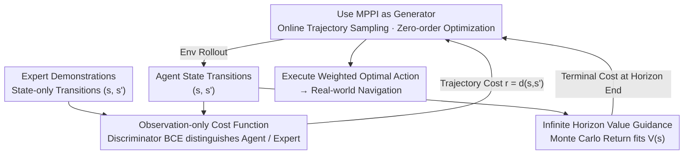

# Model Predictive Adversarial Imitation Learning for Planning from Observation

**Conference**: ICLR 2026  
**arXiv**: [2507.21533](https://arxiv.org/abs/2507.21533)  
**Code**: None  
**Area**: Imitation Learning / Robotic Planning  
**Keywords**: Adversarial Imitation Learning, Model Predictive Control, Inverse Reinforcement Learning, Learning-from-Observation, MPPI  

## TL;DR
The authors propose MPAIL (Model Predictive Adversarial Imitation Learning), which embeds an MPPI planner into the adversarial imitation learning loop. This represents the first end-to-end Planning-from-Observation framework that significantly outperforms policy-based AIL methods in generalization, robustness, interpretability, and sample efficiency, while successfully deploying in real-world robot navigation from a single observation-only demonstration.

## Background & Motivation

- **Background**: Inverse Reinforcement Learning (IRL) implements imitation learning by inferring reward functions from expert behavior and has been widely applied in areas such as autonomous driving, social navigation, and path planning. In high-dimensional continuous control, learned IRL rewards are typically deployed in real-time using Model Predictive Control (MPC)—a "IRL-then-MPC" paradigm where RL solves the IRL problem offline and MPC plans online. Meanwhile, Adversarial Imitation Learning (AIL, e.g., GAIL) has made significant progress in algorithmic complexity and sample efficiency.

- **Limitations of Prior Work**: (1) IRL-then-MPC is a disjoint two-step process: the inner-loop policy solved by RL during training is completely independent of the MPC planner used during deployment, leading to rewards that are not optimized for MPC; (2) Policy-based AIL (e.g., GAIL, AIRL) relies on black-box RL policy networks, making it difficult to impose safety constraints and lacking interpretability, which results in fragility in partially observable real-world scenarios; (3) Learned rewards and value functions are severely underutilized in policy-based AIL—only the policy network is used during deployment, discarding the reward function entirely.

- **Key Challenge**: There is a fundamental disconnect between the theoretical advantages of AIL (unified reward learning and policy optimization) and the practical requirements of robot deployment (safety, interpretability, and online optimization capabilities of MPC).

- **Goal**: To natively embed planning (MPC) into the AIL loop to achieve an end-to-end "learning planner" that simultaneously learns rewards and improves the planning-based agent using only state observations (without expert actions).

- **Key Insight**: The objective function of the MPPI (Model Predictive Path Integral) controller is naturally a KL-constrained cost minimization problem, which is mathematically equivalent to the maximum entropy RL objective in the AIL inner loop. This implies that MPPI can directly replace the RL policy as the "generator" in AIL.

- **Core Idea**: Replace the RL policy in AIL with an MPPI planner. The planner solves for a new policy online at each time step (a "deconstructed policy"), while a discriminator is learned as the cost function and a value function is learned for reasoning beyond the planning horizon. No persistent policy network is required; instead, the reward function is expected to possess generalization capabilities.

## Method

### Overall Architecture
MPAIL preserves the adversarial loop of GAIL essentially intact, modifying only the "generator": whereas the original generator was an RL-trained policy network, it is now an MPPI planner that solves online at each step. During one training iteration, the MPPI rolls out a batch of action sequences in the environment, uses the discriminator to assign costs to each trajectory, and calculates/executes the current optimal action via weighted averaging. The discriminator uses a BCE loss to distinguish between agent state transitions and expert state transitions. A value network fits the terminal cost using Monte Carlo returns, connecting to the end of the MPPI rollout to allow the short-sighted planner to reason beyond its horizon. The key difference from GAIL is the absence of a "policy update step"—the policy is computed on-the-fly by the MPPI at each state.

### Key Designs

**1. MPPI as the AIL Generator: Making the Planner the Subject of Adversity**

This is the theoretical pivot of the paper. The AIL inner loop is essentially a KL-constrained maximum entropy RL problem $\min_\pi \mathbb{E}_\pi[c(s,s')] + \beta \text{KL}(\pi \| \bar{\pi})$, which has a closed-form solution based on exponential weighting of a reference policy: $\pi^*(a|s) \propto \bar{\pi}(a|s)\, e^{-\frac{1}{\beta}\bar{c}(s,a)}$. The authors note that MPPI solves exactly the same problem at the trajectory level: $\min_\pi \mathbb{E}_{\tau \sim \pi}[C(\tau) + \beta \text{KL}(\pi(\tau)\|\bar{\pi}(\tau))]$. Under the condition of a uniformly ergodic MDP, the two are strictly equivalent. This means the RL policy can be removed and replaced with an MPPI planner without breaking the mathematical structure of AIL. This substitution works because MPPI is a zero-order optimizer: it does not backpropagate gradients into a policy network but instead samples trajectories to average actions at each time step. Consequently, the burden of generalization shifts from "the policy network must generalize to unseen states" to "the reward function must generalize," and rewards typically possess more structural priors and simplicity, leading to more stable OOD performance.

**2. Observation-only State-transition Cost Function: Learning from Action-free Demos**

The cost function is defined over state transitions $(s,s')$ rather than state-action pairs $(s,a)$, which directly enables the framework to perform "Learning from Observation." The discriminator is defined as $D(s,s') = \sigma \circ d_\theta(s,s')$, and the reward is taken as its logit: $r(s,s') = \log D(s,s') - \log(1-D(s,s')) = d_\theta(s,s')$. This is an AIRL-style definition that is more stable when coupled with a value function. This design is chosen because expert actions are often unavailable in real robot scenarios (e.g., only video is available), making state-only observations the most general setting. Furthermore, under partial observability, $(s,s')$ can encode information such as motion direction that a single $s$ cannot express.

**3. Infinite Horizon Value Guidance: Seeing Beyond the Short-sighted Horizon**

Pure MPPI has a limited rollout length (only 3 meters in experiments), but navigation goals may be 40 meters away, making short-sighted planning insufficient. The solution is to use the learned value function $V_\phi(s)$ as the terminal cost of the MPPI rollout. The value function estimates $G_t = \mathbb{E}_\pi[R_{t+1} + \gamma R_{t+2} + \dots \mid S_t = s_t]$ and is updated using the TD target $\nabla_\phi \mathbb{E}[(G_t - V_\phi(s))^2]$. By adding $V_\phi$ to the cost of the state at the end of the planning horizon, the planner gains global awareness of future outcomes despite its short look-ahead. This allows the task horizon to be more than ten times the planning horizon.

### Loss & Training
The discriminator uses standard BCE $\nabla_\theta [\mathbb{E}_{d^\pi}[\log D_\theta(s,s')] + \mathbb{E}_{d^{\pi_E}}[\log(1 - D_\theta(s,s'))]]$ with Spectral Normalization to stabilize adversarial training. The value function minimizes the MSE of Monte Carlo returns $\nabla_\phi \mathbb{E}[(G_t - V_\phi(s))^2]$, with all methods using GAE-$\lambda$ for return estimation. Unlike GAIL/AIRL, the updated networks are used directly by the MPPI for online solving, with no additional policy gradient steps. The MPPI temperature $\lambda$ decays during training to prevent early distribution collapse. All hyperparameters are kept consistent across all experiments.

## Key Experimental Results

### Main Results

**Real-world Navigation (Real-Sim-Real, learning from a single observation trajectory)**:

| Method | Max CTE (m) | Avg CTE (m) | Avg Speed (m/s) |
|------|-------------|-------------|---------------|
| Expert | - | - | 1.0 |
| GAIL | 1.29 | 0.56 | 0.37 |
| IRL-MPC | 1.28 | 0.37 | 0.30 |
| **MPAIL** | **0.76** | **0.17** | **0.70** |

MPAIL's average Cross-Track Error (CTE) is only 0.17m, 70% lower than GAIL. It maintains a speed of 0.70 m/s, nearly double that of GAIL and closest to the expert's 1.0 m/s. GAIL consistently deviated or became stuck in place across various initial configurations in real deployment.

### Ablation Study

**OOD Generalization (Navigation Task, initial positions expanded from 1×1 to 40×40 m)**:

| Method | ID Performance | Near OOD | Far OOD | Extreme OOD |
|------|--------|--------|--------|---------|
| GAIL (Policy-based) | Good | Poor | Very Poor | Random |
| BC (Requires Action) | Fair | Poor | Very Poor | Random |
| MPAIL (Prior Model) | Good | Good | Good | Navigable |
| MPAIL (Online Model) | Good | Good | Medium | Longer but Reachable |

MPAIL's planning horizon is only 3 meters, yet its task horizon reaches 15 times that length. This demonstrates that the learned cost and value functions successfully generalize to OOD states. In contrast, policy networks fail even when initially facing the goal but slightly offset from the data distribution, exhibiting extremely fragile representations.

**Efficiency Comparison (Navigation Task + CartPole)**:

| Method | Nav-4 demos | Nav-Convergence Speed | CartPole |
|------|-----------|-------------|----------|
| GAIL | Converged | Slow (2x interactions) | Fastest |
| AIRL | Not Converged | - | Comparable to MPAIL |
| MPAIL | Converged | Fast (<50% interactions) | Comparable |

### Key Findings
- **Reward Deployment is Crucial**: Policy-based AIL learns rewards but discards them during deployment—a fundamental limitation. MPAIL reintroduces rewards online, shifting the generalization burden from the policy to the reward function.
- **End-to-end Training over Disjoint Deployment**: IRL-MPC uses the exact same rewards and values as GAIL but simply switches to MPPI for deployment. While it outperforms GAIL, it still lags behind MPAIL because end-to-end training in MPAIL "pushes" the discriminator to a higher performance level.
- **Policy-based AIL is Highly Fragile in the Real World**: The performance gap for GAIL between simulation and reality is larger than expected. Partial observability leads to extremely weak reward signals (cost scale $(-0.022, -0.018)$ vs $(-3, 3)$ in simulation), which policy networks fail to process.
- **MPPI Zero-order Efficiency**: Despite the lack of gradient backpropagation to a policy, MPAIL converges more than twice as fast as GAIL on navigation tasks, verifying its sample efficiency advantages as a model-based method.
- **Wall Clock Time**: MPPI with 2 iterations is approximately 10% faster than GAIL (PPO), while 5 iterations is roughly 10% slower, indicating manageable computational overhead.

## Highlights & Insights
- **Mathematical Unification of IRL and MPC**: The mathematical equivalence between the KL-constrained trajectory optimization of MPPI and the Max-Ent RL objective of AIL under certain conditions is a profound insight. This unification merges previously disjoint training and deployment phases.
- **Philosophy of "Deconstructing the Policy"**: MPAIL deconstructs the policy into fundamental components (cost + value + model + online optimizer), each of which can be independently inspected and modified. This transparency is vital for safety-critical systems.
- **Generalization Paradigm Shift**: Instead of requiring a policy network to generalize, MPAIL requires the reward function to generalize. Since rewards encode "intent" rather than "execution," they are typically more structured and easier to generalize.

## Limitations & Future Work
- **Lack of Latent Space Planning**: MPAIL currently performs MPPI rollouts in the state space. In high-dimensional spaces (e.g., image inputs), sampling efficiency will drop sharply, necessitating extensions like TD-MPC2 for latent state planning.
- **Heuristic Temperature Decay**: The authors admit the temperature decay strategy is currently heuristic and lacks theoretical analysis despite its effectiveness.
- **Efficiency on CartPole**: MPAIL(OM) using an online learned dynamics model is less efficient than GAIL on CartPole, likely due to the cumulative effects of sparse rewards, model bias, and additional exploration needs.
- **Simple Task Validation**: Experiments were limited to RC car navigation; more complex manipulation tasks (e.g., grasping, dual-arm collaboration) are yet to be evaluated.
- **No Policy Prior**: MPAIL currently lacks a policy-like sampling prior, which may limit its scalability in high-dimensional action spaces.

## Related Work & Insights
- **vs GAIL**: GAIL uses a PPO policy as its generator and discards the reward at deployment. MPAIL demonstrates that this waste of reward information results in poor OOD generalization and failure in real-world settings where MPAIL succeeds.
- **vs IRL-MPC**: IRL-MPC follows the standard paradigm of disjoint training and deployment. MPAIL proves that end-to-end training is superior, as the rewards in IRL-MPC are never "challenged" by the MPPI planner during training.
- **vs TD-MPC2**: TD-MPC2 is a SOTA model-based RL method using latent planning. MPAIL operates in the state space but is fundamentally compatible with latent dynamics extensions.

## Rating
- Novelty: ⭐⭐⭐⭐⭐ The mathematical equivalence and end-to-end PfO framework are significant new contributions.
- Experimental Thoroughness: ⭐⭐⭐⭐ Includes simulation, real-world RC car, OOD evaluation, and efficiency/timing, though needs more complex tasks.
- Writing Quality: ⭐⭐⭐⭐ Clear theoretical derivation and a solid logical link between motivation and conclusions.
- Value: ⭐⭐⭐⭐⭐ High practical value for imitation learning in safety-critical systems; open-sourcing lowers the barrier to entry.

<!-- RELATED:START -->

## Related Papers

- [\[ICLR 2026\] Near-Optimal Second-Order Guarantees for Model-Based Adversarial Imitation Learning](near-optimal_second-order_guarantees_for_model-based_adversarial_imitation_learn.md)
- [\[ICLR 2026\] Latent Wasserstein Adversarial Imitation Learning](latent_wasserstein_adversarial_imitation_learning.md)
- [\[ICLR 2026\] On Discovering Algorithms for Adversarial Imitation Learning](on_discovering_algorithms_for_adversarial_imitation_learning.md)
- [\[ICLR 2026\] Predictive CVaR Q-Learning](predictive_cvar_q-learning.md)
- [\[ICLR 2026\] MIRACLE: Model-free Imitation and Reinforcement Learning for Adaptive Cut-Selection](miracle_model-free_imitation_and_reinforcement_learning_for_adaptive_cut-selecti.md)

<!-- RELATED:END -->
