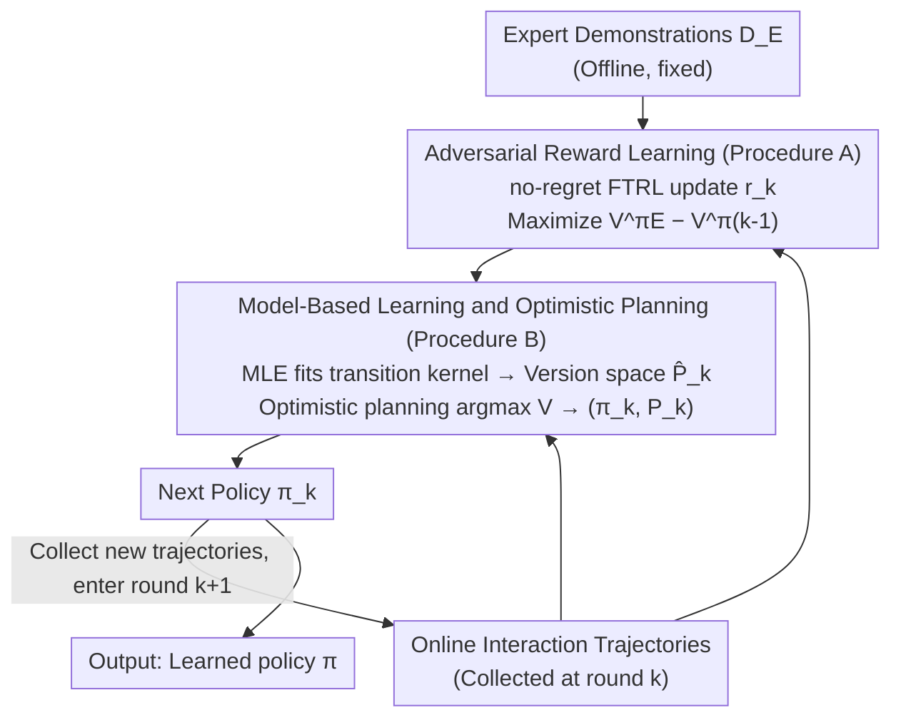

# Near-Optimal Second-Order Guarantees for Model-Based Adversarial Imitation Learning

**Conference**: ICLR 2026  
**arXiv**: [2510.09487](https://arxiv.org/abs/2510.09487)  
**Code**: None  
**Area**: Reinforcement Learning / Imitation Learning  
**Keywords**: Adversarial Imitation Learning, Model-Based Methods, Second-Order Bounds, Sample Complexity, Information-Theoretic Lower Bounds

## TL;DR

This paper proposes the MB-AIL (Model-Based Adversarial Imitation Learning) algorithm and establishes horizon-free second-order sample complexity upper bounds under general function approximation. Combined with newly constructed information-theoretic lower bounds on difficult instances, it proves that MB-AIL achieves minimax optimality (up to logarithmic factors) in online interaction sample complexity.

## Background & Motivation

Imitation Learning (IL) aims to learn policies from expert demonstrations without access to reward signals. Its main methods are categorized into two types:

**Behavioral Cloning (BC)**: Directly fits the expert policy using supervised learning.

**Adversarial Imitation Learning (AIL)**: Aligns the state-action distributions of the expert and the learner through an adversarial framework.

### Core Problem

Empirically, AIL often outperforms BC when expert demonstrations are limited, but its theoretical understanding remains incomplete. This paper focuses on two key questions:

**Precise benefits of online interaction**: Exactly how much sample efficiency gain does online interaction bring to imitation learning?

**Impact of stochasticity**: How do the stochasticity of the expert policy and environment dynamics affect sample complexity?

### Limitations of Prior Work

| Prior Work | Limitations |
|---------|------|
| Xu et al. (2023) | Limited to tabular MDPs, deterministic experts. |
| Viano et al. (2024) | Limited to linear MDPs. |
| Xu et al. (2024) OPT-AIL | General function approximation, but not model-based; no second-order bounds, high online interaction complexity. |
| Foster et al. (2024) | BC theory only, no lower bounds for online interaction. |

No prior work has simultaneously provided: (1) results under general function approximation, (2) second-order (variance-dependent) bounds, and (3) information-theoretic lower bounds for online interaction.

## Method

### Overall Architecture

The starting point of MB-AIL is a structural hypothesis: the policy space $\Pi$ of imitation learning can be decomposed into a combination of a reward class $\mathcal{R}$ and a model class $\mathcal{P}$. Consequently, in each interaction round, the algorithm performs two estimation tasks in parallel to synthesize the next policy—adversarially estimating the reward that currently best distinguishes the expert from the learner (adversarial reward learning) using expert demonstrations, and fitting the transition kernel using Maximum Likelihood Estimation (MLE) with environment interaction data while performing optimistic planning within a version space (model-based learning and optimistic planning). The new policy then collects trajectories in the environment, and this iterates for $K$ rounds until convergence. Estimating rewards and models separately is key to the subsequent second-order analysis, allowing the bound to be expressed in terms of variance and providing advantages when $\mathcal{R}$ or $\mathcal{P}$ is simple.

> The framework diagram depicts the **algorithmic loop per round** of MB-AIL (Designs 1, 2); Design 3 "Second-order Analysis" is a proof technique applied over the entire loop and contains no corresponding algorithmic node.

### Key Designs

**1. Adversarial Reward Learning (Procedure A): Turning "expert alignment" into an online optimization objective without true rewards**

The difficulty of AIL lies in the unknown reward, making it impossible to evaluate policy quality directly. MB-AIL formulates reward learning as a minimax game: the reward function seeks to maximize the value gap between the expert policy $\pi_E$ and the current learner policy $\pi_{k-1}$, while the policy seeks to minimize this gap. Specifically, in round $k$, an empirical loss $\mathcal{L}_{k-1}(r) = \hat{V}_{1,P^*,r}^{\pi_{k-1}}(s_1) - \hat{V}_{1,P^*,r}^{\pi_E}(s_1)$ is constructed using online trajectories and offline expert data. This is then updated over the reward class $\mathcal{R}$ using Follow-the-Regularized-Leader (FTRL), a no-regret online algorithm. The no-regret property of FTRL controls reward estimation error to $O(1/\sqrt{K})$, which allows the total error to depend on $\log\mathcal{N_R}$ (covering number of the reward class) rather than the complexity of the entire policy space.

**2. Model-Based Learning and Optimistic Planning (Procedure B): Feeding the model environment data separately to gain structural dividends**

If rewards and dynamics were estimated together as in model-free methods, the complexity would follow the entire $\Pi$. MB-AIL instead performs MLE separately on the transition kernel and constructs a version space $\hat{\mathcal{P}}_k = \{P \in \mathcal{P}: \sum_{(s,a,s') \in \mathcal{D}_k} \log P(s'|s,a) \geq \max_{\tilde{P}} \sum \log \tilde{P}(s'|s,a) - \beta\}$ for models where the log-likelihood difference does not exceed $\beta$. All models sufficiently consistent with the data are retained. Subsequently, optimistic planning $(\pi_k, P_k) = \arg\max_{\pi, P \in \hat{\mathcal{P}}_k} V_{1,P,r_k}^\pi(s_1)$ is performed, selecting the most optimistic model and policy for the current reward $r_k$ to drive exploration. This step ensures the cost of model learning is only tied to the model class covering number $\log\mathcal{N_P}$ and its Eluder dimension $d_E$, enabling substantial sample savings when $\mathcal{R}$ or $\mathcal{P}$ is simple.

**3. Second-Order Analysis: Explicitly incorporating variance into bounds to unify determinism and stochasticity**

First-order bounds treat all problems equally with a cost of $O(1/\epsilon^2)$, failing to explain why near-deterministic systems are easier to learn. MB-AIL decomposes regret into reward error and policy error: reward error uses Bernstein-type concentration inequalities to obtain bounds related to variance $\sigma^2$, while policy error utilizes Eluder dimensions coupled with the Variance Conversion Lemma to similarly provide second-order bounds. Combining these, the final upper bound is proportional to $\sigma^2$ and has only a logarithmic dependence on the horizon $H$ (horizon-free). As $\sigma^2 \to 0$ and the system becomes deterministic, the complexity naturally tightens from $O(1/\epsilon^2)$ to $O(1/\epsilon)$ without requiring separate case-by-case discussions.

### Loss & Training

Theoretically, the three components fulfill distinct roles: rewards are optimized adversarially using FTRL to self-supervise the gap between expert and learner values; models use MLE; and policies use version-space-based optimistic exploration. In the practical implementation in Section 6, these are replaced with standard deep learning components: the reward network uses a Wasserstein GAN-style discriminator with gradient penalty, the model part uses an ensemble of 7 world models for MLE training (ensemble variance approximates optimism/uncertainty in the version space), and policy optimization is handled by SAC (Soft Actor-Critic).

## Key Experimental Results

### Main Results

| Method | Expert Sample Complexity | Online Interaction Complexity | Second-Order? |
|------|-------------|-------------|--------|
| MB-TAIL (Xu, 2023) | $\tilde{O}(H^{3/2}|S|/\epsilon)$ | $\tilde{O}(H^3|S|^2|A|/\epsilon)$ | No |
| OPT-AIL (Xu, 2024) | $\tilde{O}(H^2 \log\mathcal{N_R}/\epsilon^2)$ | $\tilde{O}(H^4 d_{GEC} \log(\mathcal{N_R}\mathcal{N_Q})/\epsilon^2)$ | No |
| **MB-AIL (Ours)** | $\tilde{O}(\sigma^2 \log\mathcal{N_R}/\epsilon^2)$ | $\tilde{O}(\sigma^2 (d_E \log\mathcal{N_P} + \log\mathcal{N_R})/\epsilon^2)$ | **Yes** |
| **Lower Bound (Ours)** | $\Omega(\sigma^2/\epsilon^2)$ | $\Omega(\sigma^2 \log^2|\mathcal{P}| e^{-N}/\epsilon^2)$ | **Yes** |

### GridWorld Results

| Setting | Finding |
|---------|------|
| Varying Reward Space Size | AIL significantly outperforms BC when the reward space is small. |
| Varying Env Stochasticity | Both improve in more deterministic environments; AIL consistently outperforms BC. |

### Main Results (MuJoCo)

| Environment | Expert | BC | GAIL | OPT-AIL | **MB-AIL** |
|------|--------|-----|------|---------|-----------|
| Hopper | 3609 | 2857 | 3212 | 3439 | **3451** |
| Walker2d | 4637 | 2697 | 3777 | 4238 | 4170 |
| Humanoid | 5885 | 343 | 1614 | 2014 | **5816** |

### Interaction Efficiency

| Environment | OPT-AIL | **MB-AIL** | Gain |
|------|---------|-----------|------|
| Hopper | 210K | **60K** | 3.5x |
| Walker2d | 320K | **120K** | 2.7x |
| Humanoid | 220K | **90K** | 2.4x |

### Key Findings

1. **Significance of Second-Order Bounds**: When the system is near-deterministic ($\sigma^2 \to 0$), sample complexity can improve from $O(1/\epsilon^2)$ to $O(1/\epsilon)$, quantitatively characterizing the impact of stochasticity.
2. **Horizon-free**: Unlike prior work, the upper bound in this paper has only a logarithmic dependence on $H$, eliminating exponential penalties for long-horizon problems.
3. **Minimax Optimality of Online Interaction**: When expert data is limited ($N \ll \log^2|\mathcal{P}|$), MB-AIL's online interaction complexity matches the lower bound $\Omega(\sigma^2 \log^2|\mathcal{P}|/\epsilon^2)$ up to logarithmic factors.
4. **Precise Separation of BC vs AIL**:
    - AIL is superior: When the reward class $\mathcal{R}$ has a simple structure (small $\log\mathcal{N_R}$).
    - BC is superior: When the expert policy is deterministic but the environment is highly stochastic.
5. **Breakthrough in Humanoid Environment**: MB-AIL achieves performance nearly equal to the expert on high-dimensional Humanoid tasks (5816 vs 5885), far exceeding other baselines.

## Highlights & Insights

1. **Power of Decomposition**: Decomposing the policy space as $\Pi = \mathcal{R} \times \mathcal{P}$ is the core insight of this paper. When the complexity of $\mathcal{R}$ or $\mathcal{P}$ is much lower than $\Pi$, model-based methods can obtain essential statistical advantages.
2. **Naturalness of Second-Order Analysis**: Variance-dependent bounds unify deterministic and stochastic cases, avoiding artificial distinctions.
3. **Theory-Practice Consistency**: GridWorld experiments accurately verify theoretical predictions (small reward space → AIL advantage; deterministic environment → both improve).
4. **Clever Hard Instance Construction**: By combining two scenarios (policy hard to learn vs. model hard to learn), the paper distinguishes what expert demonstrations and online interaction are respectively responsible for estimating.
5. **Simplicity of Practical Algorithm**: The actual implementation requires only standard components (world model ensemble + SAC + GAN discriminator).

## Limitations & Future Work

1. **Logarithmic Gap in Expert Complexity**: The upper bound is $\tilde{O}(\sigma^2 \log\mathcal{N_R}/\epsilon^2)$, while the lower bound is $\Omega(\sigma^2/\epsilon^2)$, leaving a $\log|\mathcal{R}|$ gap. The authors speculate this gap might be fundamental.
2. **Time-Homogeneity Assumption**: Theoretical analysis assumes transition kernels and rewards do not change over time, limiting applicability to more general MDPs.
3. **Approximations in Implementation**: Optimistic planning in the practical algorithm is approximated via model ensembles, reducing the rigor of theoretical guarantees.
4. **MuJoCo Experimental Constraints**: Only 3 environments and 64 expert trajectories were used, which is relatively small in scale.
5. **Fair Comparison with Offline BC**: BC does not require online interaction; thus, the comparison between the two is not entirely equivalent.

## Related Work & Insights

### Theoretical

- **Foster et al. (2024)**: Second-order bounds and information-theoretic lower bounds for BC; this paper provides the counterpart for AIL.
- **Wang et al. (2024)**: A second-order analysis framework for model-based RL; this paper's analysis techniques are primarily based on this work.
- **Xu et al. (2024) OPT-AIL**: AIL upper bounds under general function approximation, but not model-based.

### Practical

- **GAIL (Ho & Ermon, 2016)**: Classic adversarial imitation learning method.
- **SAC (Haarnoja et al., 2018)**: Policy optimization method used in the practical algorithm.
- **World Model Ensembles**: Method for quantifying model uncertainty in the actual implementation.

### Insights

1. Model-based methods have fundamental theoretical advantages in sample efficiency.
2. Second-order analysis is the correct framework for understanding the impact of stochasticity.
3. Simultaneous establishment of upper and lower bounds is crucial for understanding the inherent difficulty of a problem.

## Rating

- Novelty: ⭐⭐⭐⭐⭐ — First to provide second-order upper and lower bounds for AIL under general function approximation; first information-theoretic lower bound for AIL online interaction.
- Experimental Thoroughness: ⭐⭐⭐ — GridWorld verifies the theory, and MuJoCo demonstrates practicality, though the number and scale of environments are limited.
- Writing Quality: ⭐⭐⭐⭐ — Rigorous theory with 39 pages of detailed content, though the density is high.
- Value: ⭐⭐⭐⭐⭐ — Makes a significant contribution to the theoretical foundations of imitation learning, clearly answering the core question regarding the "value of online interaction."

<!-- RELATED:START -->

## Related Papers

- [\[ICLR 2026\] Model Predictive Adversarial Imitation Learning for Planning from Observation](model_predictive_adversarial_imitation_learning_for_planning_from_observation.md)
- [\[ICLR 2026\] On Discovering Algorithms for Adversarial Imitation Learning](on_discovering_algorithms_for_adversarial_imitation_learning.md)
- [\[ICLR 2026\] Latent Wasserstein Adversarial Imitation Learning](latent_wasserstein_adversarial_imitation_learning.md)
- [\[ICLR 2026\] Minimax Optimal Adversarial Reinforcement Learning](minimax_optimal_adversarial_reinforcement_learning.md)
- [\[ICLR 2026\] MIRACLE: Model-free Imitation and Reinforcement Learning for Adaptive Cut-Selection](miracle_model-free_imitation_and_reinforcement_learning_for_adaptive_cut-selecti.md)

<!-- RELATED:END -->
