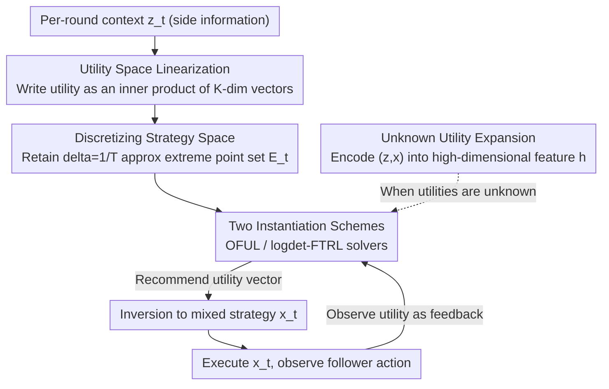

# Nearly-Optimal Bandit Learning in Stackelberg Games with Side Information

**Conference**: ICLR 2026  
**arXiv**: [2502.00204](https://arxiv.org/abs/2502.00204)  
**Code**: None  
**Area**: Reinforcement Learning  
**Keywords**: Stackelberg games, Online learning, Contextual bandits, Side information, Regret bound

## TL;DR

By linearizing the leader's utility space in Stackelberg games, this paper proposes a reduction framework to linear contextual bandit problems, improving the regret bound from $\tilde{O}(T^{2/3})$ to a near-optimal $\tilde{O}(T^{1/2})$ under the bandit feedback setting with side information.

## Background & Motivation

Stackelberg games represent a widespread class of sequential decision-making games (e.g., airport security, wildlife protection), where a leader commits to a mixed strategy first, and the follower subsequently performs an optimal response. In real-world scenarios, game payoffs often depend on time-varying **side information** (e.g., weather, airport congestion), making the problem more challenging.

Harris et al. (2024) first formalized the online learning problem for contextual Stackelberg games with side information. While an $\tilde{O}(T^{1/2})$ regret bound has been achieved under full feedback, the best known regret bound under the more realistic **bandit feedback** (observing only the follower's action) remains $\tilde{O}(T^{2/3})$, leaving a significant gap with the lower bound.

The **Key Challenge** is that the leader's utility is a **nonlinear function** of their mixed strategy (because the follower chooses an optimal response), making it difficult to directly apply standard bandit algorithms. The **Key Insight** of this paper is that although the utility is nonlinear in the strategy space, it possesses a linear structure in the **utility space**, which can be exploited to achieve nearly-optimal learning.

## Method

### Overall Architecture

This paper addresses online learning in Stackelberg games with side information under bandit feedback—where the leader only observes the follower's action and not the full payoff, which caused prior methods to hit a bottleneck of $\tilde{O}(T^{2/3})$. The core approach is a reduction framework (Algorithm 1) that translates this nonlinear game learning problem into a **linear contextual bandit** problem. In each round, the framework first **linearizes** the game structure under the current context $\mathbf{z}_t$ into a utility space and **discretizes** the continuous mixed strategy space into a finite set of candidate actions. A base linear bandit solver recommends a utility vector from this set, which the framework **inverts** back to the actual mixed strategy for the leader to execute. Follower actions observed after execution are translated into feedback for the solver. The difficulty is concentrated on "how to encode the game structure into a linear form" and "how to prune the continuous strategy space into a finite action set."

### Key Designs

**1. Utility Space Linearization: Rewriting nonlinear leader utility as an inner product**

The reason leader utility is a nonlinear function of the mixed strategy is that followers switch their optimal responses as strategies change. This paper bypasses this by changing the representation space: for a given context, it defines a utility vector
$$\mathbf{u}(\mathbf{z},\mathbf{x}) = [u(\mathbf{z},\mathbf{x},b_1(\mathbf{z},\mathbf{x})),\dots,u(\mathbf{z},\mathbf{x},b_K(\mathbf{z},\mathbf{x}))]^\top,$$
which lists the "leader's utility for each of the $K$ follower types." Consequently, the utility actually realized in a round can be written as an inner product $u(\mathbf{z}_t,\mathbf{x}_t,b_{f_t}(\mathbf{z}_t,\mathbf{x}_t)) = \langle \mathbf{u}(\mathbf{z}_t,\mathbf{x}_t), \mathbf{1}_{f_t} \rangle$, where $\mathbf{1}_{f_t}$ is the indicator vector of the current true follower type. By exploiting the structure of a **finite number of follower types $K$**, the nonlinearity is absorbed into the discrete choice of types, while the remaining part is precisely linear, allowing the direct application of mature linear contextual bandit machinery without redesigning estimators specifically for the game.

**2. Discretizing Strategy Space: Pruning the infinite mixed strategies into finite approximate extreme points**

Linear bandit algorithms require finite action sets, but the leader's mixed strategy space is continuous. For each context $\mathbf{z}_t$, this paper retains only the $\delta$-approximate extreme points of all "contextual optimal response regions," forming a finite set $\mathcal{E}_{\mathbf{z}_t}(1/T)$ as candidate actions. The intuition is that since the leader's utility is linear within each optimal response region, the optimal solution must lie on the extreme points of these regions. Setting the discretization precision to $\delta = 1/T$ ensures that the bias contributes only $O(1)$ to the total regret, which does not affect the overall $\sqrt{T}$ rate.

**3. Two Instantiation Schemes: Using different linear bandit solvers for two types of adversaries**

Since the reduction framework is decoupled from the underlying solver, different linear bandit algorithms can be used based on the nature of the adversary. Under **adversarial context + stochastic follower**, applying OFUL (Abbasi-Yadkori et al., 2011) yields a regret of $\tilde{O}(K\sqrt{T})$ by estimating the follower type distribution $\mathbf{p}^*$ via the optimism principle. Under the more difficult setting of **stochastic context + adversarial follower**, switching to logdet-FTRL (Liu et al., 2023) utilizes log-determinant regularization to handle follower non-stochasticity, achieving $\tilde{O}(K^{2.5}\sqrt{T})$ regret. Both results close the gap from $\tilde{O}(T^{2/3})$ back to $\tilde{O}(T^{1/2})$.

**4. Unknown Utility Expansion: Maintaining $\sqrt{T}$ even with unknown utility functions**

The previous points assume known leader utility functions. When utilities are unknown but satisfy a linear assumption $u(\mathbf{z},a_l,a_f) = \langle \mathbf{z}, U(a_l,a_f) \rangle$, this paper encodes contexts and actions into a high-dimensional feature vector $\mathbf{h}(\mathbf{z},\mathbf{x}) \in \mathbb{R}^{d \times K \times A_l \times A_f}$. This allows "unknown utilities" to be absorbed and estimated within the same linear bandit framework, maintaining $\tilde{O}(\sqrt{T})$ regret at the cost of an additional polynomial dimension factor in the bound.

## Key Experimental Results

### Main Results

| Setting | Metric | Alg1-OFUL | Random Baseline | Optimal Policy |
|------|------|-----------|----------|----------|
| 4 Types/4 Actions/d=2 | Cumulative Utility (T=200) | Near Optimal | Much Lower | Highest |
| Same as above | Cumulative Regret (T=200) | Sublinear Growth | Linear Growth | 0 |

### Ablation Study

| Configuration | Key Metric | Description |
|------|---------|------|
| Alg1-OFUL vs Harris Alg 3 | Cumulative Utility | Ours significantly outperforms prior methods |
| Follower utility context-dep | Applicability | Prior methods inapplicable, Ours applicable |

### Key Findings
- The algorithm empirically outperforms previous methods in synthetic experiments.
- The linearization reduction significantly simplifies algorithm design, removing the need to apply Carathéodory's Theorem every round.
- The results are applicable to scenarios such as second-price auctions and Bayesian persuasion (information design).

## Highlights & Insights

- **Elegant Reduction**: Perfectly linearizes a nonlinear problem by operating in the utility space rather than the strategy space.
- **Closing the Theoretical Gap**: Improves the bandit feedback regret from $\tilde{O}(T^{2/3})$ to $\tilde{O}(T^{1/2})$, matching the lower bound.
- **Broad Applicability**: The framework can be applied to various Stackelberg-structured problems, including auctions and information design.

## Limitations & Future Work

- Worst-case per-round runtime is exponential (inheriting the NP-hardness of Stackelberg games).
- Requires known follower utility functions (though leader utility functions can be unknown).
- Experimental scale is small (T=200, 4 types), lacking large-scale validation.

## Related Work & Insights

- Conceptually related to Bernasconi et al. (2023), but handles more complex contextual settings.
- Discretization techniques could inspire other online learning problems with continuous action spaces.
- The linear assumption for the unknown utility expansion could potentially be further relaxed.

## Rating
- Novelty: ⭐⭐⭐⭐ The reduction idea is simple yet effective, though base tools (OFUL, etc.) are existing.
- Experimental Thoroughness: ⭐⭐⭐ Primarily a theoretical contribution; experiments are relatively simple.
- Writing Quality: ⭐⭐⭐⭐⭐ Clear arguments and rigorous theory.
- Value: ⭐⭐⭐⭐ Completely resolves an open theoretical problem.

<!-- RELATED:START -->

## Related Papers

- [\[ICLR 2026\] Learning to Play Multi-Follower Bayesian Stackelberg Games](learning_to_play_multi-follower_bayesian_stackelberg_games.md)
- [\[ICML 2026\] Learning in Structured Stackelberg Games](../../ICML2026/reinforcement_learning/learning_in_structured_stackelberg_games.md)
- [\[ICLR 2026\] Reevaluating Policy Gradient Methods for Imperfect-Information Games](reevaluating_policy_gradient_methods_for_imperfect-information_games.md)
- [\[ICLR 2026\] Look-ahead Reasoning with a Learned Model in Imperfect Information Games](look-ahead_reasoning_with_a_learned_model_in_imperfect_information_games.md)
- [\[ICLR 2026\] Solving Football by Exploiting Equilibrium Structure of 2p0s Differential Games with One-Sided Information](solving_football_by_exploiting_equilibrium_structure_of_2p0s_differential_games_.md)

<!-- RELATED:END -->
