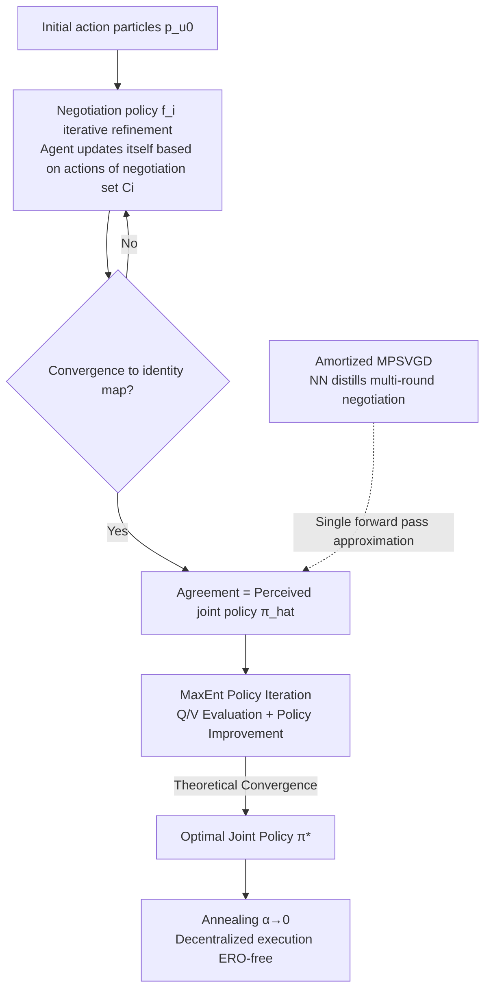

# Negotiated Reasoning: On Provably Addressing Relative Over-Generalization

**Conference**: ICLR 2026  
**OpenReview**: [https://openreview.net/forum?id=FmvBrKubtw](https://openreview.net/forum?id=FmvBrKubtw)  
**Code**: To be confirmed  
**Area**: Multi-Agent Reinforcement Learning / Cooperative Games  
**Keywords**: relative over-generalization, MARL, negotiated reasoning, Stein variational gradient descent, maximum entropy RL, CTDE  

## TL;DR
This paper formally defines the "Relative Over-generalization (RO)" problem in MARL for the first time and proves that RO can be avoided if the "consistent reasoning" condition is satisfied. It further proposes SVNR, a negotiated reasoning algorithm based on Stein Variational Gradient Descent, which is the first MARL method capable of provably eliminating RO.

## Background & Motivation

**Background**: In fully cooperative Multi-Agent Reinforcement Learning (MARL), agents aim to maximize team rewards but often fall into suboptimal cooperative equilibria. This phenomenon is known as Relative Over-generalization (RO): agents overfit their policies to the "random behavior of teammates during exploration" and become overly conservative. A typical example is Particle Gather, where two particles must reach a landmark simultaneously to receive a reward, but reaching it alone results in a penalty, leading agents to learn a safe but suboptimal strategy of collectively staying away from the landmark.

**Limitations of Prior Work**: Existing literature follows two main routes to address RO: credit assignment (lenient learning, value decomposition, reward shaping) and endowing agents with reasoning capabilities (recursive reasoning, etc.). While both routes show experimental success, **they lack solid theoretical foundations**: few works prove algorithm convergence or optimality in matrix games, but **no work has provided a formal definition of RO**.

**Key Challenge**: Current RO definitions are based on the "joint policy after empirical convergence," meaning one can only judge if a method is stuck in RO post-hoc, but cannot analyze it before or during training. This leads to two key questions: **(1) Can RO be provably avoided? (2) If so, how to design a method that provably avoids RO?**

**Goal**: To answer these two questions by providing both sufficient conditions for avoiding RO and a practical algorithm that satisfies these conditions.

**Core Idea**: **① Decomposing RO** — RO is split into "Perceptual RO (PRO)" during training and "Executional RO (ERO)" during execution, proving that RO is eliminated if both are resolved at convergence; **② Consistent Reasoning Condition** — Proving that RO can be avoided when each agent's modeling of others matches their actual optimal strategy (during training) and their actual executed actions (during execution); **③ Negotiated Reasoning Framework** — Inspired by human negotiation and message passing in graphical models, agents iteratively refine their actions through a "negotiation policy" until agreement is reached, instantiated as SVNR using Stein Variational Gradient Descent.

## Method

### Overall Architecture
The logic chain of SVNR spans theory, algorithm, and efficient approximation. At the theoretical level, RO is decomposed into PRO (training-time perceptual bias) and ERO (execution-time decomposition loss), proving that "consistent reasoning" is a sufficient condition to eliminate both. At the framework level, Negotiated Reasoning (NR) is proposed, where agents start from a set of initial action particles and iteratively refine them via negotiation policies until reaching an "agreement." It is proven that if this agreement equals the optimal joint policy, the PRO-free condition is met. At the algorithmic level, (MP)SVGD is used to derive closed-form updates for negotiation policies, combined with strictly nested negotiation sets and maximum entropy policy iteration to prove convergence to the optimal joint policy. At the engineering level, the negotiation process is amortized via neural networks, distilling multi-round negotiations into network weights for decentralized, communication-free execution with a single forward pass.

### Key Designs

**1. Decomposing RO into PRO and ERO: Making "pre-training analysis" possible.** The theoretical starting point is splitting the vague RO concept into two verifiable sub-concepts. Executional RO (ERO) is defined as: if utility improved when an agent knows its teammates' actions, i.e., $\max_{\pi_i}\{U^{\pi_i(u_i|s,u_{-i})}\prod_{j\neq i}\bar\pi_j^*\} > U^{\prod_j \bar\pi_j^*}$, then ERO exists—it characterizes the coordination loss due to not knowing teammates' actions during decentralized execution. Perceptual RO (PRO) is defined as: if an agent's perceived joint policy gets closer to the optimal joint policy after knowing the optimal opponent strategy, i.e., $\min_{\pi_i}D_{KL}(\pi_i\rho_i\|\pi_\alpha^*) > \min_{\pi_i}D_{KL}(\pi_i\pi_\alpha^*(u_{-i})\|\pi_\alpha^*)$, then PRO exists—it characterizes the estimation error due to biased modeling $\rho_i$ during training. Crucially, **if all agents overcome ERO at convergence, they will not suffer from RO**.

**2. Consistent Reasoning Condition: A provable sufficient condition to avoid RO.** Based on this decomposition, "consistent reasoning" is defined: during training, each agent's model of others matches their optimal strategy ($\rho_i = \pi_\alpha^*(u_{-i})$); during execution, their model matches the actual executed actions. When $\rho_i$ aligns with the true optimal opponent policy, teammate exploration randomness does not contaminate policy updates, avoiding PRO. By annealing $\alpha\to 0$ for deterministic execution, ERO is also avoided. The paper illustrates why existing methods fail: MADDPG falls into PRO by modeling others with historical behavior; MASQL avoids PRO but falls into ERO by averaging actions during execution.

**3. Negotiated Reasoning + (MP)SVGD: A practical mechanism for consistent reasoning.** To satisfy the condition, agents represent the initial joint policy with $M$ action particles and hold negotiation (perturbation) policies $f_i(u_i\mid u_{C_i},s)$. They update themselves after knowing actions in the negotiation set $C_i$: $u_i^{\ell,k}=f_i^k(u_i\mid s, u_{C_i}^{\ell,k-1})$. When all $f_i^k$ converge to identity maps and the agreement equals the optimal joint policy, the PRO-free condition is satisfied. (MP)SVGD is used to solve for the negotiation policy. The closed-form optimal direction is $\phi_i^*(u_{C_i}) = \mathbb{E}_{y\sim p}[k_i(u_{C_i},y_{C_i})\nabla_{y_i}\log\pi^*(y_i|y_{C_i}) + \nabla_{y_i}k_i(u_{C_i},y_{C_i\setminus\{i\}})]$.

**4. Strictly Nested Negotiation Sets + Max-Ent Policy Iteration: Upgrading "approximation" to "provable convergence."** Convergence depends on the design of negotiation sets $\{C_i\}$. The paper proves that when $\{C_i\}$ are strictly nested (e.g., $C_i=\{1,\dots,i\}$, an autoregressive decomposition), the negotiation process converges and the agreement strictly equals the optimal joint policy. SVNR is built on Max-Ent Policy Iteration: it proves joint policy evaluation convergence (Lemma 4.1), monotonic policy improvement under strict nesting (Lemma 4.2), and eventual convergence to the optimal joint policy $\pi^*$ (Theorem 4.3).

**5. Amortized MPSVGD: Distilling negotiation dynamics for decentralized execution.** To avoid the high cost of multi-round negotiation, neural networks parameterize policies as stochastic mappings $u_i=f_{\psi_i}(\cdot|\xi_i,\xi_{C_i},s)$. The network directly approximates the negotiation equilibrium (fixed point) using incremental updates derived from MPSVGD. This allows the network to distill multi-round negotiation into its weights, enabling **a single forward pass ($K=1$) to approximate the equilibrium distribution** during inference, achieving decentralized, communication-free execution.

## Key Experimental Results

The environment covers two differential games (Two Modalities for PRO, Max of Three for ERO), Particle Gather, and 4 MaMuJoCo tasks. SVNR is compared against reasoning methods (MADDPG, MASQL, PR2, ROMMEO, MMQ) and general baselines (MAPPO, QMIX, FACMAC).

### Main Results (MaMuJoCo Test Returns, 5 seeds)

| Method | HalfCheetah-2x3 | HalfCheetah-1p1 | Ant-2x4 | Walker2d-2x3 |
|------|---|---|---|---|
| **SVNR (Ours)** | **8853 ± 212** | **423 ± 89** | **536 ± 31** | **1678 ± 275** |
| PR2 | 8662 ± 45 | 381 ± 11 | 354 ± 58 | 1422 ± 79 |
| ROMMEO | 8305 ± 127 | 296 ± 62 | 424 ± 60 | 1399 ± 32 |
| QMIX | 8263 ± 618 | 3 ± 27 | 212 ± 209 | 495 ± 243 |
| FACMAC | 8210 ± 584 | 131 ± 72 | 398 ± 36 | 536 ± 205 |
| MAPPO | 6087 ± 1177 | 15 ± 138 | 87 ± 135 | 672 ± 59 |
| MADDPG | 112 ± 135 | −561 ± 67 | 108 ± 26 | 529 ± 33 |
| MASQL | 56 ± 65 | −490 ± 86 | 225 ± 34 | 332 ± 18 |
| MMQ | −134 ± 16 | −524 ± 37 | 116 ± 53 | 487 ± 72 |

### Key Findings
1. **Stress Tests**: SVNR is the only method that passes both PRO (multi-modal capture) and ERO (jumping out of local optima) stress tests.
2. **Performance**: SVNR achieves SOTA on all 4 MaMuJoCo tasks, outperforming both general baselines and specialized reasoning methods.
3. **Ablation**: Performance is robust across particle sizes $M \in [32, 40]$. The strictly nested topology yields the best returns, while sparse negotiation topologies offer a controllable trade-off between accuracy and computation.

## Highlights & Insights
- **Theoretical Filling**: It provides the first formal definition of RO (PRO/ERO) that allows for pre-training analysis, transforming the goal of "eliminating RO" into a design constraint.
- **Mechanism Perspective**: It interprets "negotiation" as a Stein variational gradient flow in RKHS for equilibrium selection in the space of probability measures, distinct from state estimation in communication-based MARL.
- **Theory-Engineering Closed Loop**: It bridges the gap from particle-level SVGD convergence to decentralized, single-forward-pass inference via amortized distillation.

## Limitations & Future Work
- **Theoretical Assumptions**: The core convergence proof assumes discrete action spaces for fixed-point theorems, extended via measure theory in the appendix.
- **Approximation Errors**: Amortized implementation introduces approximation errors for the soft Bellman operator.
- **Scalability**: Experiments focus on teams of 2–4; extending to larger systems or more complex real-world tasks is a future direction.
- **Topology Automation**: Negotiation set topologies currently require manual specification; automated learning of these structures is an open area.

## Related Work & Insights
- **Comparison with Traditional Routes**: Credit assignment and reasoning methods (PR2, etc.) lacked theoretical roots; this work provides the first provably RO-free method.
- **Autoregressive Decomposition**: Strictly nested sets can be seen as an optimal form of autoregressive factorization, but whereas previous works suggested autoregressive models are sensitive to order, this work proves the optimality of any strictly nested set.
- **Tool Pedigree**: It builds on Maximum Entropy RL (Soft Q-learning/SAC) and Stein Variational Gradient Descent, migrating these tools to equilibrium selection in cooperative games.

## Rating
- **Novelty**: ⭐⭐⭐⭐⭐ First formalization of RO + Consistent Reasoning condition + First provably RO-free MARL method.
- **Experimental Thoroughness**: ⭐⭐⭐⭐ Solid validation from differential games to MuJoCo, though team sizes are relatively small.
- **Writing Quality**: ⭐⭐⭐⭐ Clear theoretical chain with helpful intuitive explanations.
- **Value**: ⭐⭐⭐⭐⭐ Provides a long-sought theoretical foundation and practical solution for RO in cooperative MARL.

<!-- RELATED:START -->

## Related Papers

- [\[ICLR 2026\] Generalization of RLVR Using Causal Reasoning as a Testbed](generalization_of_rlvr_using_causal_reasoning_as_a_testbed.md)
- [\[ICLR 2026\] Relative Value Learning](relative_value_learning.md)
- [\[ICLR 2026\] Relative Entropy Pathwise Policy Optimization](relative_entropy_pathwise_policy_optimization.md)
- [\[ICLR 2026\] One-Step Flow Q-Learning: Addressing the Diffusion Policy Bottleneck in Offline RL](one-step_flow_q-learning_addressing_the_diffusion_policy_bottleneck_in_offline_r.md)
- [\[ICLR 2026\] Inter-Agent Relative Representations for Multi-Agent Option Discovery](inter-agent_relative_representations_for_multi-agent_option_discovery.md)

<!-- RELATED:END -->
