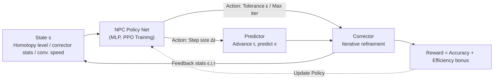

# Neural Predictor-Corrector: Solving Homotopy Problems with Reinforcement Learning

**Conference**: ICLR 2026  
**OpenReview**: [https://openreview.net/forum?id=x6iodYWNty](https://openreview.net/forum?id=x6iodYWNty)  
**Code**: To be confirmed  
**Area**: Reinforcement Learning / Learned Numerical Solvers  
**Keywords**: Homotopy, Predictor-Corrector, Reinforcement Learning, Amortized Training, Robust Optimization, Polynomial Root-finding, Sampling  

## TL;DR
This paper unifies four seemingly unrelated challenges—robust optimization, global optimization, polynomial root-finding, and sampling—into a "homotopy" paradigm. It demonstrates that their solvers share a "predictor-corrector (PC)" structure and introduces NPC, a universal neural solver that replaces hand-designed step-size and termination heuristics with reinforcement learning to achieve cross-instance generalization and plug-and-play capability.

## Background & Motivation
**Background**: The homotopy paradigm is a general methodology for solving difficult problems. It constructs a continuous interpolation path $H(x,t)$ from a "simple source problem" to a "complex target problem" (where $H(x,0)=f(x)$ has a known solution and $H(x,1)=g(x)$ is the target), then evolves the source solution toward the target solution along this path. This approach appears in various fields under different names: Graduated Non-Convexity (GNC) in robust optimization, Gaussian Homotopy in global optimization, homotopy continuation in polynomial root-finding, and annealed Langevin dynamics in sampling. In practice, these solvers almost exclusively adopt a PC structure: a predictor advances along the outer interpolation path, while a corrector iteratively pulls the prediction back to the true solution trajectory.

**Limitations of Prior Work**: The step-size scheduling (how far the predictor advances) and termination rules (how many corrector iterations or what convergence tolerance to use) in PC solvers rely entirely on **hand-crafted heuristics**. These rules are tightly coupled to specific tasks, require per-instance parameter tuning, and are often sub-optimal—small steps waste computation when the trajectory is smooth, while large steps lose track when the trajectory changes drastically.

**Key Challenge**: These four domains have developed independently for decades. No prior work has unified them under a single framework, resulting in "per-problem" solvers that cannot be reused or benefit from general policy optimization via learning methods.

**Goal**: To reveal the shared PC structure across these problems from a unified perspective and design a **single universal neural solver** that automatically learns adaptive predictor/corrector policies, enabling generalization to unseen instances without per-instance tuning.

**Core Idea**: **[Unified Abstraction]** Reduce the four problem types to a single homotopy + PC template; **[Sequential Decision Making]** Model "step-size selection + termination condition selection" as a Markov Decision Process (MDP) and use RL to learn policies that replace heuristics; **[Amortized Training]** Perform offline training once on an instance distribution within a problem class to obtain a policy that can be deployed directly to new instances without fine-tuning.

## Method

### Overall Architecture
NPC reformulates the classic PC solver loop as a closed-loop sequential decision process. At each homotopy level, a neural network (policy) observes the current state and outputs the predictor's step size and the corrector's termination condition. The predictor advances the level and predicts the solution, the corrector refines it until conditions are met, and the resulting statistics are fed back to the network for the next step. Since the PC process is non-differentiable and early decisions impact the entire trajectory, supervised or self-supervised learning fails to evaluate the long-term contribution of a single step. Therefore, RL (PPO) is used to train the policy based on cumulative rewards, with amortized training enabling cross-instance generalization.

### Key Designs

**1. Unified Abstraction of Homotopy + PC: Unifying Four Challenges**
The core insight is identifying shared mechanisms across different domains: GNC uses $H(x,t)=\sum_i \frac{\bar c^2 r(x,y_i)^2}{\bar c^2 + t\, r(x,y_i)^2}$ to transition from convex quadratic loss to non-convex Geman-McClure loss; Gaussian Homotopy uses Gaussian kernel convolution $H(x,t)=g(x)\star \mathcal N(0,t\sigma^2)$ for gradual smoothing; polynomial root-finding uses linear homotopy $H(x,t)=(1-t)f(x)+t g(x)$; and sampling uses $H(x,t)\propto \exp(-(1-t)f(x)-t g(x))$ to interpolate between distributions. Although specific implementations of predictors and correctors vary (e.g., Levenberg-Marquardt for GNC, Gauss-Newton for HC, Langevin dynamics for sampling), they all share the "outer predictor advancing the level + inner corrector pulling back to the trajectory" skeleton.

**2. MDP State Design: Allowing the Policy to "See" Geometry and Convergence Dynamics**
The state $s$ encodes three types of information: **homotopy level** (current position on the path $t\in[0,1]$), **corrector statistics** (iterations and attained tolerance from the previous step, reflecting both convergence efficiency and deviation from the trajectory), and **convergence speed** $\tau$ (relative change in optimality indicators, such as objective values for optimization or Kernelized Stein Discrepancy for sampling). Ablation studies show that corrector statistics are the most informative part, enabling the policy to judge whether to advance aggressively or refine cautiously.

**3. Dual-part Action + Accuracy-Efficiency Reward: Balancing Objectives via Adaptation**
The policy outputs two actions: **step size** $\Delta t$ at the predictor level and the **corrector termination condition** (tolerance $\epsilon$ or max iterations) to balance accuracy and efficiency. The reward encourages both: a step-wise accuracy reward $r_t^{acc}$ based on convergence speed or relative error change, and a terminal efficiency bonus $r^{eff}=T_{max}-T$ where $T$ is the total corrector iterations. The cumulative reward $R=\big(\sum_{t=1}^T \lambda_1 r_t^{acc}\big)+\lambda_2 r^{eff}$ is used for training. RL evaluates actions based on cumulative results, avoiding the need for assumptions like "local geometric consistency across instances," which self-supervised methods rely on but often fail.

**4. Amortized Training: Offline Training with Zero-shot Deployment**
NPC is trained offline once on an **instance distribution** of a specific problem class (e.g., training on the Aquarius sequence for point cloud registration). The learned policy is then deployed to unseen instances of the same class without per-instance fine-tuning. This transforms "solving per-instance from scratch" into "train once, infer everywhere."

## Key Experimental Results
NPC was evaluated on four representative homotopy problems, using corrector iterations (Iter) and runtime (Time, ms) as efficiency metrics (averaged over 50 trials). The policy/value networks are simple 2-layer MLPs with 16 units.

### Main Results

**Problem 1 — GNC Robust Optimization (Point Cloud Registration, 95% Outliers)**:

| Sequence | Method | log(E_R)↓ | log(E_t)↓ | Iter↓ | Time↓ |
|----------|--------|-----------|-----------|-------|-------|
| bunny | Classic GNC | -0.85 | -2.76 | 783 | 161.00 |
| bunny | IRLS GNC | -0.85 | -2.75 | 309 | 61.59 |
| bunny | **Ours+GNC** | -0.85 | -2.71 | **169** | **19.15** |
| cube | Classic GNC | -1.12 | -2.89 | 486 | 89.34 |
| cube | **Ours+GNC** | -1.11 | -2.86 | **86** | **7.86** |

Accuracy remains comparable to Classic GNC, while iterations are reduced by 70-80% and runtime by 80-90%. On multi-view triangulation, task-specific IRLS fails to generalize (log(E_p) up to +1.74), while NPC maintains -4.72 accuracy with iterations dropping from 142 to 21.

**Problem 2 — GH Global Optimization (2D Non-convex Benchmarks)**:

| Problem | Method | f(x*)↓ | Iter | Time |
|---------|--------|--------|------|------|
| Ackley | Classic GH | 0.07 | 501 | 16.25 |
| Ackley | CPL | 0.01 | - | 1701.61 |
| Ackley | **Ours+GH** | 0.05 | **359** | **12.31** |
| Himmelblau | **Ours+GH** | **0.00** | 345 | 8.91 |
| Rastrigin | **Ours+GH** | **0.00** | 247 | 11.84 |

Learning-based CPL is disadvantaged when accounting for training time (>1700ms), offsetting its efficiency gains.

**Problem 3 — HC Polynomial Root-finding** & **Problem 4 — ALD Sampling**:

| Task | Method | Quality Metric | Iter | Time |
|------|--------|---------|------|------|
| katsura10 (HC) | Classic HC | Succ 100% | 39 | 2.22 |
| katsura10 (HC) | **Ours+HC** | Succ 100% | **7** | **0.65** |
| UPnP (HC) | **Ours+HC** | Succ 100% | **29** | **3.86** |
| 40-mode GMM (ALD) | Classic ALD | W2 11.57 | 410 | 1353.16 |
| 40-mode GMM (ALD) | **Ours+ALD** | W2 11.91 | **110** | **772.34** |

In HC, iterations are reduced to 1/5 of the baseline while maintaining 100% success rate. In ALD, iterations drop from 410 to approximately 110 with comparable W2/KSD metrics.

### Ablation Study
Removing RL state components (GNC point cloud registration):

| Removed Component | ΔIter |
|-----------|-------|
| None (Full State) | 0 |
| Homotopy Level | +21 |
| Corrector Tolerance | +64 |
| Corrector Iterations | +52 |
| Convergence Speed | +38 |

Removing any component leads to more conservative policies (smaller steps/stricter tolerances). **Corrector statistics are the most critical information.**

### Key Findings
- **Dual Advantage**: NPC consistently outperforms classic and specialized baselines in efficiency while exhibiting superior numerical stability where specialized methods (IRLS/SLGHd) often fail.
- **Efficiency-Accuracy Trade-off**: NPC learned policies sit at optimal operating points below the hand-tuned curves of classic methods.
- **Generalization as Training-free Deployment**: Policies trained on one distribution migrate directly to unseen instances, demonstrating the value of amortized training.

## Highlights & Insights
- **The Unified Perspective is a Contribution**: Reducing four independent fields to a shared homotopy+PC skeleton is a systematic insight that paves the way for universal solvers.
- **Appropriate Learning Paradigm**: The authors correctly identified that RL's cumulative reward evaluation bypasses the limitations of self-supervised methods.
- **Minimalist Model + Plug-and-Play**: A simple 2-layer MLP accelerates solvers by 5-10x and can be embedded into existing PC frameworks with low engineering overhead.

## Limitations & Future Work
- **Per-class Training**: A separate policy is still needed for each problem class (e.g., GNC vs. ALD); universal cross-class generalization is not yet verified.
- **Hyperparameter Sensitivity**: Reward weights ($\lambda_1, \lambda_2$) and scaling still require task-specific adjustment.
- **Dependency on Classic Operators**: Acceleration is limited if the underlying classic operators (LM, Gauss-Newton) are the primary bottleneck.
- **Experimental Scale**: Most benchmarks are low-dimensional; scalability to high-dimensional, large-scale real-world problems remains to be tested.

## Related Work & Insights
- **Classic PC Algorithms**: These provided the target for unification; NPC replaces their manual heuristics.
- **Learning-based Homotopy Improvements**: Prior works (CPL, Simulator HC) either learned single components or were instance-specific; NPC uses RL + amortized training for full control and cross-instance transfer.
- **Insight**: "Abstracting a family of unrelated iterative algorithms into a unified sequential decision template and using RL to learn the scheduling policy" is a generalizable paradigm for any numerical method with an "outer-advance + inner-refine" structure.

## Rating
- **Novelty**: ⭐⭐⭐⭐⭐ Unifying four domains and using RL for universal scheduling is pioneering.
- **Experimental Thoroughness**: ⭐⭐⭐⭐ Solid across four domains with ablation; however, benchmarks are relatively small-scale.
- **Writing Quality**: ⭐⭐⭐⭐⭐ Clear abstraction and coherent logic supported by effective visualizations.
- **Value**: ⭐⭐⭐⭐ Plug-and-play and amortized training offer immediate utility to robust optimization and sampling fields.

<!-- RELATED:START -->

## Related Papers

- [\[ICLR 2026\] Solving Parameter-Robust Avoid Problems with Unknown Feasibility using Reinforcement Learning](solving_parameter-robust_avoid_problems_with_unknown_feasibility_using_reinforce.md)
- [\[ICLR 2026\] Helix: Evolutionary Reinforcement Learning for Open-Ended Scientific Problem Solving](helix_evolutionary_reinforcement_learning_for_open-ended_scientific_problem_solv.md)
- [\[ICLR 2026\] Flowing Through States: Neural ODE Regularization for Reinforcement Learning](flowing_through_states_neural_ode_regularization_for_reinforcement_learning.md)
- [\[ICLR 2026\] Neural+Symbolic Approaches for Interpretable Actor-Critic Reinforcement Learning](neuralsymbolic_approaches_for_interpretable_actor-critic_reinforcement_learning.md)
- [\[ICLR 2026\] From Ticks to Flows: Dynamics of Neural Reinforcement Learning in Continuous Environments](from_ticks_to_flows_dynamics_of_neural_reinforcement_learning_in_continuous_envi.md)

<!-- RELATED:END -->
