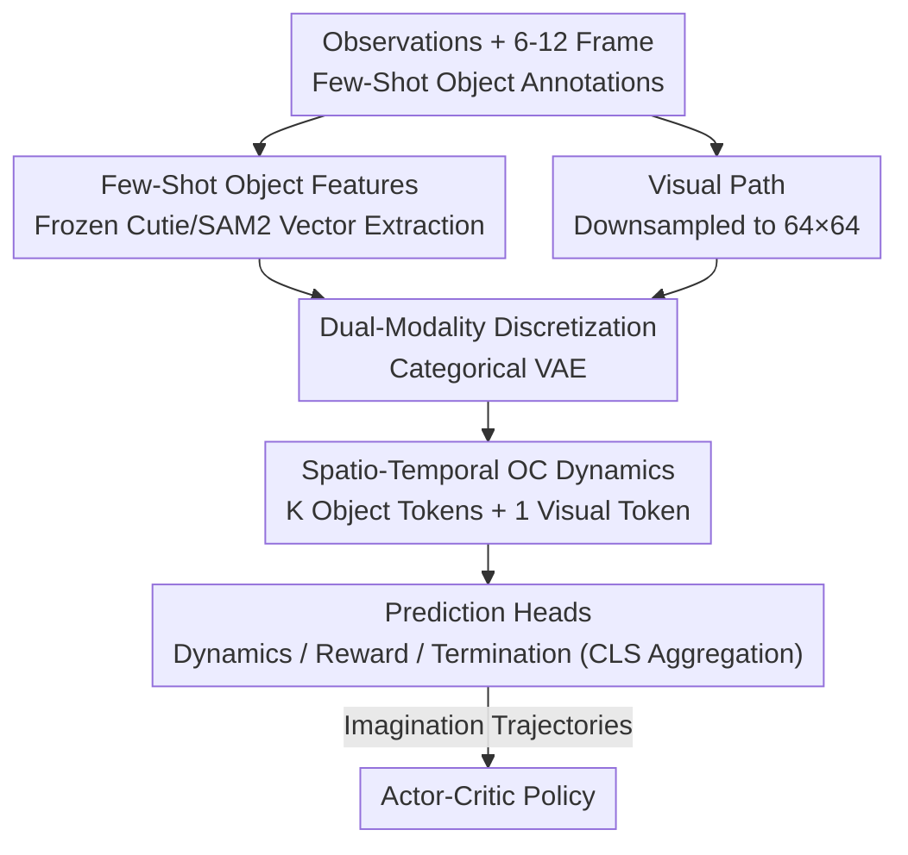

# Object-Centric World Models from Few-Shot Annotations for Sample-Efficient Reinforcement Learning

**Conference**: ICLR 2026  
**OpenReview**: [https://openreview.net/forum?id=qmEyJadwHA](https://openreview.net/forum?id=qmEyJadwHA)  
**Project Page**: [https://oc-storm.weipuzhang.com](https://oc-storm.weipuzhang.com)  
**Code**: See project page  
**Area**: Reinforcement Learning / World Models / Sample-Efficient RL  
**Keywords**: Object-centric representation, world models, model-based RL, few-shot annotation, video segmentation

## TL;DR
OC-STORM utilizes frozen video segmentation foundation models (Cutie/SAM2) to extract compact vector features of decision-critical objects from minimal annotations (6–12 frames). By feeding these into a world model, it focuses modeling capacity on small but crucial objects, significantly outperforming the STORM baseline on Atari 100k and visually complex *Hollow Knight* boss fights, achieving SOTA-level sample efficiency.

## Background & Motivation

**Background**: Deep RL learning from pixels has achieved milestones in games and robotics but suffers from poor sample efficiency—agents often require orders of magnitude more interactions than humans. Model-Based RL (MBRL) is a major path to alleviate this: first, a world model is trained via self-supervised learning to predict environment dynamics, followed by policy training within "imagined" trajectories. Modern methods like Dreamer, STORM, and IRIS primarily rely on pixel-level reconstruction loss ($\ell_2$) for self-supervision.

**Limitations of Prior Work**: Pixel reconstruction objectives are dominated by **large, static background** regions, often **ignoring small, sparse, but decision-critical objects**. The paper uses *Hollow Knight* as a clear example: a trained STORM model accurately reconstructs the complex background but fails to "see" the Boss character (the Boss appears blurred in the reconstruction), leading to poor policy performance.

**Key Challenge**: Reconstruction loss measures "average pixel error," while RL rewards depend on the "states of a few key objects"—there is a goal misalignment. Spending capacity on the background effectively misplaces the world model's attention.

**Goal**: Enable the world model to explicitly represent and predict **discrete, interactable object entities** without relying on internal game state (privileged information) or massive annotations.

**Key Insight**: The maturity of open-set segmentation/tracking foundation models like SAM, SAM2, Cutie, and GroundingDINO makes it possible to obtain high-quality object segmentation in new domains using only a few annotated frames. Historically, Object-Centric RL (OCRL) required extensive task-specific annotations; this barrier is now removed by foundation models.

**Core Idea**: Use frozen, pre-trained video segmentation models to extract compact **vector features** of critical objects from few-shot annotations. These object features, alongside downsampled pixels, are fed into the world model, allowing it to reason about object dynamics and interactions, thereby "directing" modeling capacity toward semantically important entities.

## Method

### Overall Architecture
OC-STORM is a two-stage MBRL framework: **Stage 1** learns an object-centric (OC) world model self-superpervisedly to capture dynamics, and **Stage 2** trains a policy using actor-critic on imagined trajectories. The key innovation lies in the "additional object feature path": key objects are manually annotated in 6–12 frames, and a **frozen** pre-trained video segmentation model (Cutie or SAM2) extracts compact vectors for each object. These features and pixels (downsampled to $64\times64$) are fed into the world model via discretized spatio-temporal dynamics modeling. Finally, prediction heads output the next latent state, reward, and termination signal for imagination-based learning.

### Key Designs

**1. Few-shot vectorized object features: Extracting critical objects via frozen foundation models**

This design directly addresses the "reconstruction ignoring small objects" issue. Instead of retraining an object detector, the authors reuse the internal **object-attention output** of video segmentation models like Cutie/SAM2. Formally, for each observation $o_t \in \mathbb{R}^{3\times H\times W}$, the segmentation model provides features $s^{obj}_t = \text{SegModel}(o_t) \in \mathbb{R}^{K\times \text{obj\_dim}}$ (e.g., SAM2 obj\_dim is 256, Cutie is 2048), where $K$ is the number of objects specified by the user. The segmentation model maintains internal state across frames to ensure tracking consistency.

These models were chosen for four key properties: **temporal consistency** at the video level, real-time high-resolution processing on a single GPU, effective use of few-shot annotations via **memory bank retrieval**, and **cross-domain generalization** without prior exposure to Atari or *Hollow Knight*. Notably, the authors chose **vectors** over masks; experiments show mask representations (the FOCUS approach) lose detail at $64\times64$ resolution and are noisy to predict, while vectors provide semantically summarized information from high-resolution inputs.

**2. Dual-modality discretized latent variables: Allocating capacity via categorical VAEs**

Since autoregressive sequence models accumulate errors on high-dimensional inputs, the authors use categorical VAEs to encode inputs into discrete latents: encoder $z_t \sim q_\phi(z_t|s_t)$, decoder $\hat{s}_t = p_\phi(z_t)$, with differentiable sampling via the straight-through estimator. Crucially, **different architectures and capacities are used for each modality**: object features use an MLP-based encoder/decoder ($\mathbb{R}^{K\times d_{obj}} \leftrightarrow \mathbb{R}^{K\times 16\times 16}$) discretized into 16 distributions of 16 categories each. Visual observations use a CNN-based encoder/decoder ($\mathbb{R}^{3\times 64\times 64} \leftrightarrow \mathbb{R}^{32\times 32}$) with 32 distributions of 32 categories. The lower dimensionality for objects reflects that individual object information is significantly smaller than the entire scene, ensuring the world model is no longer dominated by background reconstruction.

**3. Spatio-temporal object-centric dynamics: Modeling interactions via alternating attention**

This central innovation models interactions "between objects and between objects and the scene" alongside their temporal dynamics. Using STORM as a backbone, the authors employ **alternating spatial and temporal attention**: spatial attention is applied at each time $t$ across $K$ object tokens and 1 visual token $(z^1_t,\dots,z^K_t,z^{vis}_t)$. Temporal attention is applied independently along the sequence $(z^i_1,\dots,z^i_L)$ for each token type. The sequence model is $h_{1:L} = f_\phi(z^{obj}_{1:L}, z^{vis}_{1:L}, a_{1:L}) \in \mathbb{R}^{(K+1)\times L\times d_h}$ ($d_h=256$).

The backbone is also compatible with RNNs: for DreamerV3, spatial attention is added to the RNN at each timestep. For prediction, reward $\hat{r}_t$ and termination $\hat{\tau}_t$ use a **special query token** (similar to BERT [CLS]) that attends to all object and visual tokens in $h_t$, ensuring predictions aggregate comprehensive scene information.

### Loss & Training
The world model is trained end-to-end to maximize the likelihood of observed data (reconstruction + reward + termination). The policy $\pi_\theta$ and value function $V_\psi$ are trained on imagined trajectories using the DreamerV3 actor-critic algorithm. The problem is modeled as a finite-horizon MDP $\mathcal{M}=\langle S,A,p,r,\gamma\rangle$, with the goal to maximize expected return $\mathbb{E}_{\pi_\theta,p}\big[\sum_{t=0}^{T-1}\gamma^t r_t\big]$.

## Key Experimental Results

### Main Results
On Atari 100k (limited to 100,000 environment frames), the authors compared DreamerV3 and STORM backbones with SAM2 and Cutie extractors. **Cutie-OC-STORM** emerged as the best configuration.

| Configuration | Mean HNS | Median HNS | Notes |
|------|---------|-----------|------|
| STORM (Baseline) | 107.2% | 35.5% | Pure visual reconstruction |
| Mask FOCUS (STORM) | 114.2% | 42.5% | Mask-based, on par with baseline |
| SAM2-OC-STORM | 124.6% | 35.0% | Vectorized, SAM2 features |
| **Cutie-OC-STORM** | **134.8%** | **43.8%** | Vectorized, Cutie features (Final) |
| Cutie-OC-DreamerV3 | 119.4% | 42.6% | Effective with DreamerV3 backbone |

In visually complex *Hollow Knight* boss fights, OC-STORM **converged significantly faster and achieved higher performance** than STORM, with substantial leads in difficult bosses like Mage Lord and Pure Vessel. Furthermore, in Meta-world continuous control tasks, OC-STORM generally exhibited higher sample efficiency than STORM.

### Ablation Study
The 26 Atari games were grouped by whether critical objects could be reliably identified by SAM2/Cutie:

| Group | STORM Baseline | Cutie-OC-STORM | Notes |
|------|-----------|----------------|------|
| Obj-detectable | 142.4% | **186.2%** | Large gains from OC representation |
| Otherwise | 72.0% | 83.4% | Robust even with incomplete detection |

### Key Findings
- **Vector > Mask**: Mask representations (FOCUS approach) performed similarly to the baseline. Low-resolution ($64\times64$) inputs lose object details, while high-resolution masks incur quadratic computational cost. Vector captures high-resolution semantics more efficiently.
- **Cutie > SAM2**: OC agents benefit more from Cutie features. While SAM2 is strong in segmentation benchmarks, it outputs classification-oriented prototype vectors that lose positional and global context, providing weaker guidance for policy learning.
- **Position information in vectors**: By training a 4-layer decoder on Boxing, the authors proved that object vectors (e.g., white/black players) alone could reconstruct observations, confirming that information is preserved.
- **Robustness to detection failure**: Randomly zeroing object vectors showed that while performance scales with detection accuracy, the model remains functional even under unstable detection.

## Highlights & Insights
- **Frozen Foundation Models as Feature Extractors**: Using object-attention outputs without fine-tuning avoids the historical need for heavy task-specific re-annotation in OCRL.
- **Modeling Budget Allocation**: Assigning lower discrete dimensionality for object latents (16×16 vs 32×32 for vision) structurally corrects the misalignment of the reconstruction objective.
- **Vector vs. Mask Comparison**: Demonstrates that for auto-regressive low-resolution world models, "semantically compact vectors" are more effective and efficient than "spatially dense masks."
- **Backbone Agnostic**: The OC approach works across both Transformer (STORM) and RNN (DreamerV3) architectures.

## Limitations & Future Work
- **Duplicate Instances**: Current segmentation models are designed for individual tracking; multiple identical objects may not be segmented correctly into separate instances.
- **Geometric Map Representation**: Object vectors are not ideal for encoding walls or boundaries; the pipeline still requires raw visual input to capture geometric structures.
- **Dependence on Manual $K$ and Annotations**: While only 6–12 frames are needed, $K$ remains a hyperparameter. Automated object discovery and zero-shot initiation are future steps.
- **Benchmarking**: The lack of a unified benchmark for *Hollow Knight* (varying rewards, Boss selections) makes cross-paper comparisons difficult beyond internal baselines.

## Related Work & Insights
- **vs STORM / DreamerV3**: These rely on $\ell_2$ pixel reconstruction, where capacity is background-dominated. Ours incorporates object vectors to direct capacity toward decision-critical entities.
- **vs FOCUS**: FOCUS uses binary masks with DreamerV2 in simple robot tasks. This work uses **vectors** and proves their superiority over masks in complex visual environments like Atari and *Hollow Knight*.
- **vs End-to-end Slot-based OCRL**: Those methods use unsupervised slot attention which often fails in noisy, real-world scenes. This work leverages pre-trained foundation models to bypass unsupervised detection quality bottlenecks.

## Rating
- Novelty: ⭐⭐⭐⭐ First to successfully integrate few-shot pre-trained segmentation models into world models for Atari and *Hollow Knight*.
- Experimental Thoroughness: ⭐⭐⭐⭐⭐ Covers multiple backbones, extractors, and representations, plus robustness and continuous control.
- Writing Quality: ⭐⭐⭐⭐ Clear motivation on reconstruction goal misalignment; convincing comparison of vectors vs. masks.
- Value: ⭐⭐⭐⭐ Provides a practical, low-annotation cost pathway for bringing CV foundation model benefits into sample-efficient RL.

<!-- RELATED:START -->

## Related Papers

- [\[AAAI 2026\] Object-Centric World Models for Causality-Aware Reinforcement Learning](../../AAAI2026/reinforcement_learning/object-centric_world_models_for_causality-aware_reinforcement_learning.md)
- [\[ICLR 2026\] WIMLE: Uncertainty-Aware World Models with IMLE for Sample-Efficient Continuous Control](wimle_uncertainty-aware_world_models_with_imle_for_sample-efficient_continuous_c.md)
- [\[ICLR 2026\] From Observations to Events: Event-Aware World Models for Reinforcement Learning](from_observations_to_events_event-aware_world_models_for_reinforcement_learning.md)
- [\[ICLR 2026\] Mixture-of-World Models: Scaling Multi-Task Reinforcement Learning with Modular Latent Dynamics](mixture-of-world_models_scaling_multi-task_reinforcement_learning_with_modular_l.md)
- [\[ICLR 2026\] DVLA-RL: Dual-Level Vision-Language Alignment with Reinforcement Learning Gating for Few-Shot Learning](dvla-rl_dual-level_vision-language_alignment_with_reinforcement_learning_gating_.md)

<!-- RELATED:END -->
