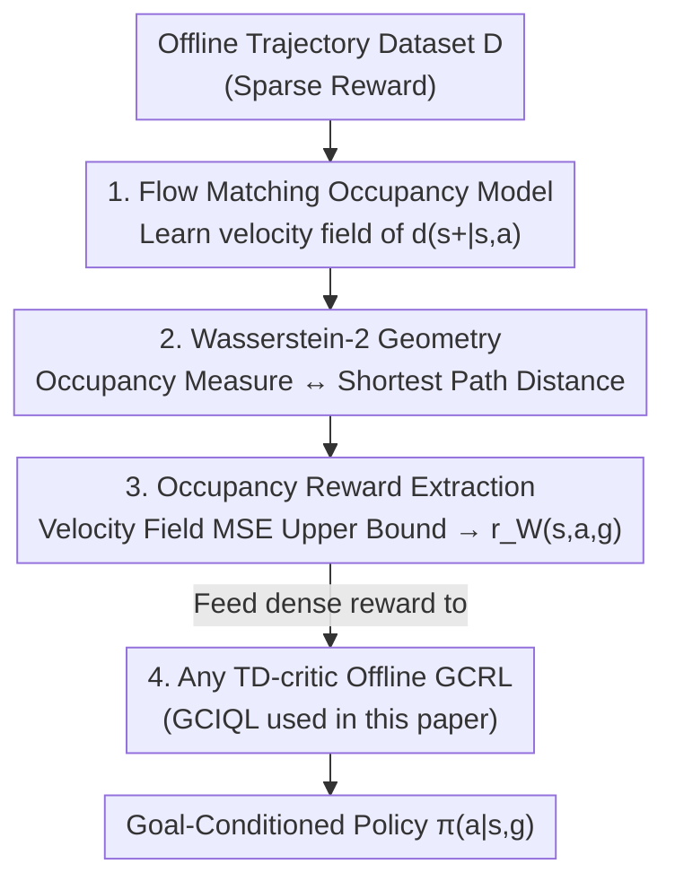

# Occupancy Reward Shaping: Improving Credit Assignment for Offline Goal-Conditioned Reinforcement Learning

**Conference**: ICLR 2026  
**OpenReview**: [https://openreview.net/forum?id=EW8DskWQ1K](https://openreview.net/forum?id=EW8DskWQ1K)  
**Code**: https://github.com/aravindvenu7/occupancy_reward_shaping (Available)  
**Area**: Reinforcement Learning / Offline Goal-Conditioned RL  
**Keywords**: Offline GCRL, Credit Assignment, Reward Shaping, Occupancy Measure, Flow Matching, Optimal Transport

## TL;DR
This paper proposes Occupancy Reward Shaping (ORS), which first learns a generative model of "occupancy measures" (future state distributions) using flow matching, and then extracts the world geometry implicit in this model (shortest-path distances from states to goals) via optimal transport into a dense reward. This significantly alleviates the credit assignment challenge in sparse-reward offline GCRL—achieving an average 2.2× improvement across 13 long-horizon tasks, while provably preserving the optimal policy.

## Background & Motivation
**Background**: Goal-Conditioned Reinforcement Learning (GCRL) is a simple, domain-agnostic, and scalable framework for learning "how to reach any goal from any state" from large-scale offline data. However, it typically relies on sparse rewards—providing a +1 only upon reaching the goal and 0 otherwise.

**Limitations of Prior Work**: Under sparse rewards, a massive temporal lag exists between an action and its long-term consequences, making credit assignment extremely difficult. The authors pinpoint the root cause through quantitative analysis: theoretically, the optimal value function $V^*(s,g)$ should be monotonic along an optimal trajectory (higher value closer to the goal), but in practice, due to sampling and approximation errors, estimated $\hat V(s,g)$ exhibits significant "non-monotonicity." The authors use $\delta_V$ to denote the proportion of states along expert trajectories where $\hat V(s_{t+1},g) < \hat V(s_t,g)$. Experiments show that even with low noise, $\delta_V$ remains high and worsens with task horizon, causing policies to get stuck in sub-optimal regions.

**Key Challenge**: Manually designing rewards for every goal is impractical. Existing reward shaping methods rely on learning "local temporal distance estimators" and stitching them into semi-parametric/non-parametric graphs (e.g., shortest-path search) to infer global temporal information. This "local-to-global" approach accumulates compounding errors as task complexity grows, leading to poor scalability.

**Key Insight**: The authors observe that generative world models can effectively characterize the multi-modal distribution of "which states an agent will visit in the future," i.e., the occupancy measure $d^\pi(s_+|s,a)$. Since it encodes the future, it implicitly encodes the environment's geometric structure. The question follows: can this temporal geometric information be directly extracted as a reward?

**Core Idea**: Use optimal transport to take the negative Wasserstein-2 distance between the "learned occupancy measure and the goal" as a reward. This metric directly and globally encodes "how much further to the goal," providing a dense credit assignment signal in one step rather than relying on local stitching.

## Method

### Overall Architecture
ORS deconstructs the reward generation process into a three-step serial pipeline: first, learn an occupancy measure model capable of describing future state distributions (trained via flow matching); second, extract the "geometric distance to the goal" from this model as a scalar reward function; third, feed this dense reward into any offline GCRL algorithm with a TD-critic to train the policy. The core theory is supported by two propositions and one theorem: the Wasserstein-2 distance from the occupancy measure to the goal increases monotonically with the shortest-path hierarchy (geometry is encoded, Prop. 1); this distance can be estimated by the mean squared error upper bound of the flow matching velocity field (computable, Prop. 2); and the greedy policy learned with this reward is consistent with the optimal policy of the original sparse reward (preserving the optimal solution, Theorem 1).

### Key Designs

**1. Learning Occupancy Measures with Flow Matching: Turning "Future Distributions" into Differentiable Generative Models**

The root of credit assignment difficulty is the lack of characterization of the long-term future. The first step reflects learning the distribution $d^{\pi_D}(s_+|s,a)$—which states will be visited in the future starting from $(s,a)$ under the data policy $\pi_D$. It satisfies a recursive form similar to TD learning: $d^{\pi_D}_\theta(s_+|s,a)=(1-\gamma)\,p(s'|s,a)+\gamma\, d^{\pi_D}_{\theta^-}(s_+|s',a')$. This "occupancy measure = next step transition + discounted subsequent occupancy" naturally "stitches" future states of intersecting trajectories in the data through bootstrapping. Since future state distributions are multi-modal, the authors use flow matching to model them, with the loss split into two terms: $L_{\text{flow}}=(1-\gamma)L_{\text{next}}+\gamma L_{\text{future}}$. $L_{\text{next}}$ is the standard flow matching loss (transforming noise into the next state $s'$); $L_{\text{future}}$ regresses the current velocity field $v_\theta(t,s,a,x_t)$ toward a bootstrap velocity field target provided by delayed parameters $\theta^-$ (with stop-gradient). Flow matching is chosen over other generative models because its velocity field allows the subsequent reward calculation to bypass multi-step ODE solving, significantly saving computation.

**2. Translating Occupancy Measures to "Geometric Goal Distance" via Wasserstein-2 Distance (Prop. 1)**

An occupancy measure alone is not a reward; a precise link between "occupancy measure ↔ state space geometry" must be established. The authors define the shortest-path hierarchy $S_k=\{s:\text{step}^*(s,g)=k\}$ ($S_0=\{g\}$), and prove: the mean squared Wasserstein-2 distance $W_2^2(\delta_g, d^{\pi_D}(s_+|s))$ increases monotonically with the hierarchy level $k$. This implies that the further a state is from the goal (the more steps required), the larger the optimal transport distance between its future state distribution and the goal Dirac distribution $\delta_g$. Crucially, it measures not just how far the "center of mass" of future states is from the goal, but also how "spread out" the future states are. Thus, defining the reward as $r_W(s,a,g)=-W_2^2\big(\delta_g, d^{\pi_D}(s_+|s,a)\big)$ encodes global, long-range goal information into a scalar—a "directly global" approach that graph-based methods cannot achieve.

**3. Making Rewards Computable via Velocity Field MSE Upper Bounds (Prop. 2)**

$W_2^2$ involves an intractable integral and cannot be calculated directly. The authors prove it can be upper-bounded by the mean squared error of the flow matching velocity field (up to a positive multiplicative constant $C$): $W_2^2(\delta_g, d^{\pi_D}(s_+|s,a))\le C\,\mathbb{E}_{x_1\sim\delta_g,\,x_0\sim N(0,I),\,t}\,\|v(t,s,a,x_t)-(x_1-x_0)\|_2^2$. This step converts "calculating optimal transport distance" into "calculating regression error of the velocity field toward goal $g$," which does not require running an ODE solver. A reward network $\psi$ is trained to fit this upper bound: $L_{\text{rew}}(\psi)=\mathbb{E}_{s,a,g\sim D}\big[\hat r_{W\psi}(s,a,g)-(-\mathbb{E}_{x_1=g,x_0,t}\|v_\theta(t,s,a,x_t)-(x_1-x_0)\|_2^2)\big]^2$, yielding a dense, queryable reward.

**4. Proof that ORS Preserves Optimal Policy (Theorem 1)**

The greatest risk of reward shaping is altering the optimal policy. This paper proves that under assumptions of goal reachability, dynamics, and data coverage, the greedy policy $\pi_{\text{greedy}}=\arg\max_a Q^*(s,a,g)$ induced by $r_W(s,a,g)$ is identical to the optimal shortest-path policy $\pi^*(a|s,g)$ under the original sparse reward. This allows ORS to safely integrate rich dense signals into any offline GCRL algorithm, accelerating learning without biasing the solution or requiring re-estimation of occupancy measures during policy improvement.

### Loss & Training
Three-stage independent training (Alg. 1): ① Pretrain with $L_{\text{pretrain}}$ + train the occupancy model $d^{\pi_D}_\theta$ with $L_{\text{flow}}$ (Eq. 3); ② Train the reward function $r_W^\psi$ with $L_{\text{rew}}$ (Eq. 5); ③ Train the goal-conditioned policy using the learned dense reward with any TD-critic offline GCRL algorithm (primarily GCIQL + Gaussian policy). All algorithms use hindsight relabeling. The GCIQL expectile parameter $\kappa$ is a key hyperparameter closely related to reward density.

## Key Experimental Results

### Main Results
On 12 datasets from OGBench (maze navigation / cube manipulation / puzzles / scenes, with horizons up to 2000 steps), averaged over 8 seeds (binary success rate %):

| Method | antmaze-giant-navigate | cube-triple-play | scene-play | 12-task Avg |
|------|------|------|------|------|
| GCBC | 0 | 0 | 5 | 2.5 |
| GC-IVL | 0 | 1 | 42 | 15.9 |
| QRL | 9 | 0 | 5 | 6.9 |
| CRL | 39 | 6 | 19 | 13.7 |
| GC-IQL (base) | 0 | 7 | 51 | 20.0 |
| Go-Fresh | 30 | 18 | 56 | 35.8 |
| **ORS (Ours)** | **56** | **37** | **80** | **44.2** |

ORS achieves an average **2.2×** improvement over its sparse-reward baseline GCIQL and a **24%** improvement over the runner-up Go-Fresh (a graph method), with particularly pronounced advantages in long-horizon complex tasks.

### Comparison with Long-range Sparse Reward Specialists / Tokamak Real-world Tasks

| Method | OGBench 12-task Avg | Description |
|------|------|------|
| SMORE | 2.8 | Occupancy matching / Dual RL; generally fails |
| n-step GCIQL | 12.7 | n-step TD to shorten horizon |
| HIQL | 20.0 | Hierarchical RL |
| GCIQL-OTA | 23.2 | n-step + option-aware |
| SAW | 25.8 | Subgoal advantage weighting |
| Go-Fresh | 35.8 | Graph + Local + Global rewards |
| **ORS** | **44.2** | 2.2× higher than HIQL, 1.9× higher than GCIQL-OTA |

In 3 real nuclear fusion Tokamak control tasks (DIII-D sensor/actuator data, controlling $\beta_N$ / electron density / ion rotation), ORS achieved the highest cumulative returns across all tasks. The authors note Go-Fresh performs poorly here due to the failure of graph methods under stochastic dynamics.

### Ablation Study

| Config | Key Metric | Description |
|------|---------|------|
| ORS (full) | 56 / 37 | Full model |
| L2 Reward | 3 / 3 | Shaping with L2 distance to goal; worse than sparse GCIQL |
| ORS-s (State-only reward $r_W(s,g)$) | < ORS | Removing action dimension degrades performance |
| ORS-r (Directly using $r_W$ as Q) | Worst | Q is no longer a cumulative sum; high estimation noise |

### Key Findings
- **Geometry is effectively encoded and smooth**: Plotting ORS rewards for a fixed goal across 5000 state-action pairs shows potential smoothly decaying with temporal distance to the goal, validating Prop. 1.
- **ORS directly improves value monotonicity**: Compared to sparse rewards, the non-monotonicity error $\delta_V$ of $\hat V(s,g)$ induced by ORS is an order of magnitude smaller under low noise and remains smoother over long horizons.
- **Learning cumulative Q is essential**: ORS-r performed worst, indicating that passing the dense reward to a TD-critic for accumulation (stitching trajectories) is the critical factor.
- **$\kappa$ is task-dependent**: Lower $\kappa$ (e.g., 0.6) is better for locomotion tasks (rich dense signals), while the optimal $\kappa$ increases with complexity in manipulation tasks.

## Highlights & Insights
- **"World models contain geometry that can be extracted as rewards" is a compelling perspective**: Strictly linking generative occupancy measures with optimal transport/shortest-path geometry (Prop. 1) upgrades reward shaping from "local-to-global stitching" to "one-step global signaling," avoiding cumulative errors in graph methods.
- **Reasoned choice of Flow Matching**: Flow matching was selected not for its popularity, but because its velocity field MSE conveniently upper-bounds $W_2^2$ (Prop. 2), enabling instantaneous reward calculation without multi-step ODEs.
- **Practical theoretical guarantees**: Theorem 1 proves that dense rewards do not destroy the optimal policy, making ORS a "plug-and-play" module for any TD-critic offline GCRL algorithm, which is highly engineering-friendly.
- **Transferable logic**: The principle of using "optimal transport distance from future distributions to goals" as a dense progress signal can theoretically be transferred to any sparse-reward long-horizon task where occupancy measures/world models can be learned (e.g., exploration rewards, subgoal scoring).

## Limitations & Future Work
- **Acknowledged Limitations**: Reward shaping is inherently sample-based. In highly combinatorial tasks with extremely few successful paths (e.g., large multi-step puzzles), the Wasserstein distance from nearly all states to the goal remains large, weakening the ORS signal. The authors suggest learning occupancy measures over "filtered useful future states" and layering local rewards to capture short-range dependencies.
- **Observed Potential Limitations**: The method relies on strong theoretical assumptions (shortest-path hierarchy under deterministic dynamics, goal reachability, data coverage). While it performs well on stochastic Tokamak tasks, the strictness of geometric monotonicity under stochasticity is not fully discussed.
- **Three-stage Pipeline**: The serial training (Occupancy Model → Reward → Policy) introduces additional training overhead and hyperparameters (e.g., task-specific $\kappa$). The possibility of end-to-end joint training is unexplored.

## Related Work & Insights
- **vs Go-Fresh (Mezghani et al., 2023)**: Go-Fresh uses local temporal distance classifiers + graph shortest-path search to stitch together global rewards; ORS uses a single reward function to directly encode global long-range information. ORS avoids "local-to-global" cumulative errors, showing significant advantages in complex/stochastic tasks.
- **vs PBRS (Ng et al., 1999)**: Classic potential-based reward shaping guarantees preserving the optimal policy but requires manual/heuristic potential functions; ORS automatically extracts rewards from occupancy measures with the same optimal policy guarantee (Theorem 1).
- **vs Hierarchical RL (HIQL) / n-step (GCIQL-OTA)**: These methods shorten effective horizons via subgoals or n-step returns; ORS improves credit assignment via reward shaping and is complementary to these approaches, outperforming them with a simple non-hierarchical policy (44.2 vs 20.0 / 23.2).
- **vs SMORE (Occupancy Matching / Dual RL)**: Also uses occupancy measures but follows dual RL for unnormalized density; ORS follows optimal transport + flow matching velocity fields. SMORE's near-failure (2.8) highlights the importance of the extraction methodology.

## Rating
- Novelty: ⭐⭐⭐⭐⭐ Synthesizes generative occupancy measures, optimal transport geometry, and reward shaping with rigorous theory; highly novel and self-consistent.
- Experimental Thoroughness: ⭐⭐⭐⭐⭐ 13 long-horizon tasks + 3 real Tokamak tasks, 8 seeds with CI, and comprehensive ablations.
- Writing Quality: ⭐⭐⭐⭐ Uses $\delta_V$ to quantify the pain point; clear theoretical layout, though dense with appendix-heavy proofs.
- Value: ⭐⭐⭐⭐⭐ Plug-and-play, provably policy-preserving, and validated on real nuclear fusion control; high practical value.

<!-- RELATED:START -->

## Related Papers

- [\[ICLR 2026\] TIPS: Turn-Level Information-Potential Reward Shaping for Search-Augmented LLMs](tips_turn-level_information-potential_reward_shaping_for_search-augmented_llms.md)
- [\[ICML 2026\] Latent Representation Alignment for Offline Goal-Conditioned Reinforcement Learning](../../ICML2026/reinforcement_learning/latent_representation_alignment_for_offline_goal-conditioned_reinforcement_learn.md)
- [\[ICLR 2026\] Multistep Quasimetric Learning for Scalable Goal-Conditioned Reinforcement Learning](scaling_goal-conditioned_reinforcement_learning_with_multistep_quasimetric_dista.md)
- [\[ICLR 2026\] SSVPO: Toward Effective Step-level Credit Assignment for Language Model RL Training](ssvpo_effective_step-level_credit_assignment_for_rl_training_of_language_models.md)
- [\[ICML 2026\] Compositional Transduction with Latent Analogies for Offline Goal-Conditioned Reinforcement Learning](../../ICML2026/reinforcement_learning/compositional_transduction_with_latent_analogies_for_offline_goal-conditioned_re.md)

<!-- RELATED:END -->
