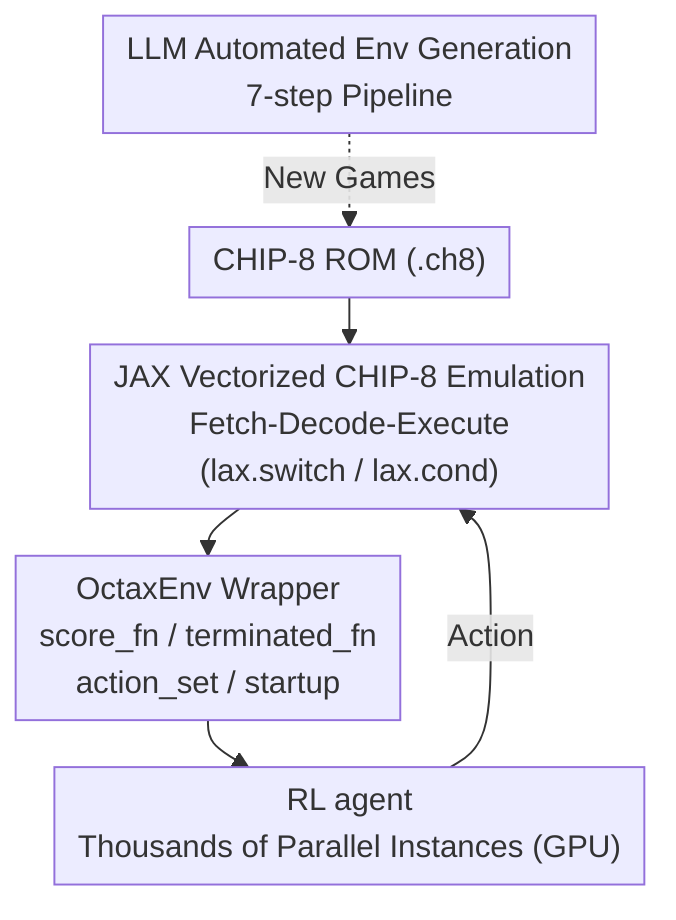

# OCTAX: Accelerated CHIP-8 Arcade Environments for Reinforcement Learning in JAX

**Conference**: ICLR 2026  
**OpenReview**: [https://openreview.net/forum?id=BdeUsYlyIf](https://openreview.net/forum?id=BdeUsYlyIf)  
**Code**: https://github.com/riiswa/octax/ (Available)  
**Area**: Reinforcement Learning / RL Environment Benchmark / JAX Acceleration  
**Keywords**: CHIP-8 emulation, GPU vectorized environment, Arcade games, End-to-end JAX, LLM environment generation

## TL;DR
OCTAX uses JAX to port the 1970s CHIP-8 virtual machine to GPUs for end-to-end vectorized simulation, providing 21 classic arcade games with image observations as RL environments. It achieves 350,000 env-steps/s (1.4 million frames/s) on consumer-grade GPUs, outperforming the CPU-based EnvPool by 14×, and features a pipeline for automated generation of new CHIP-8 environments via LLMs.

## Background & Motivation
**Background**: Modern RL research requires a large number of repeated experiments to achieve statistical significance, and classic arcade games (such as the Atari Learning Environment, ALE) have long been the gold standard benchmark. While deep learning has fully embraced end-to-end GPU acceleration, the environment execution phase in RL remains predominantly CPU-bound.

**Limitations of Prior Work**: Environment simulation has become the bottleneck of the entire training pipeline. The paper notes that obtaining results for Rainbow originally required 34,200 GPU hours (~1,425 days), an expense prohibitive for small laboratories. Due to high computational costs, many RL papers only report results for fewer than 5 random seeds, compromising statistical reliability. Existing acceleration solutions have respective drawbacks: EnvPool and PufferLib optimize CPU execution via C/C++ but are still limited by CPU saturation and incur expensive CPU↔GPU data transfer costs during training; CuLE and Isaac Gym utilize CUDA/GPU but are locked to NVIDIA hardware and require high engineering effort for environment migration.

**Key Challenge**: The JAX ecosystem is an ideal candidate for "portable + end-to-end GPU acceleration" (Brax for physics, Gymnax for classic control, Pgx for board games), yet it lacks **classic arcade environments with real visual complexity**. MinAtar is merely a simplified Atari version that discards original graphics and mechanics, while integrating a full Atari emulator into JAX is overly complex.

**Goal**: To complete the puzzle of "image-observation classic arcade environments" within JAX, ensuring massive parallelism, high-fidelity restoration of original mechanics, and hardware agnosticism.

**Key Insight**: Instead of tackling the Atari 2600 directly, the authors select its predecessor—the CHIP-8 virtual machine. Created in the 1970s, CHIP-8 features minimalist specifications (64×32 monochromatic screen, 16 registers, 4KB RAM, 35 instructions) yet spawned numerous classic games across puzzle, action, and strategy genres with cognitive challenges comparable to Atari. This constraint-driven minimalist design makes vectorized simulation highly efficient: a 4KB memory footprint allows thousands of game instances to reside simultaneously on a GPU.

**Core Idea**: Rewrite the entire CHIP-8 "fetch-decode-execute" CPU cycle into vectorized, GPU-executable functional operations using JAX, then wrap them in a standard RL interface to transform classic arcade games into end-to-end environments capable of massive GPU parallelism.

## Method

### Overall Architecture
OCTAX converts a `.ch8` game ROM through three stages: "CHIP-8 Simulation Core → RL Environment Wrapper → Standard Interaction Loop," turning it into an environment for large-scale parallel sampling by RL agents. The system consists of three layers: the bottom layer is the CHIP-8 emulator rewritten in JAX (executing instructions faithfully); the middle layer is the `OctaxEnv` wrapper (translating internal states into observation/reward/done signals); and the top layer handles interaction between the agent and thousands of parallel instances. The entire data path remains on the GPU, avoiding CPU↔GPU roundtrips, which is the fundamental reason for its order-of-magnitude speedup over EnvPool.

### Key Designs

**1. JAX Vectorized CHIP-8 Simulation Core: Rewriting a CPU Emulator as a GPU-friendly Functional Pipeline**

Classic CPU emulators rely on branch jumps and in-place memory modification to run the "fetch-decode-execute" loop, a control flow that is neither parallelizable nor `jit`-friendly on GPUs. OCTAX rewrites the processor cycle using JAX primitives as side-effect-free pure functions: `fetch()` retrieves 16-bit instructions and advances the program counter (PC); `decode()` uses bitwise operations to extract opcodes, register indices, and immediates; `execute()` uses `lax.switch` for GPU-compatible instruction dispatching. All handlers follow a functional model—treating state as immutable and returning updated copies: ALU operations handle arithmetic/logic and flags, control flow (jumps, calls) uses `lax.cond`, and screen drawing uses vectorized operations to plot sprites onto the 64×32 framebuffer. because states are immutable and control flow is compiled into `lax` primitives, the simulation code can be distributed across thousands of instances via `vmap`.

**2. Transforming Games into RL Environments: Standardization via Configuration**

CHIP-8 games were written independently without unified conventions for scores or end conditions. OCTAX uses a configurable "four-component" set to align each game to a standard interface. First is **score_fn**: Brix stores scores in V5 (incrementing per brick), while Pong uses BCD encoding in V14, requiring `score = (V[14] // 10) - (V[14] % 10)` to calculate player advantage. Second is **terminated_fn**: Brix ends when lives in V14 reach zero, whereas Tetris uses a state register V1==2 for game over. Third is **action_set**: Most games use only a subset of the 16 keys (e.g., Pong uses keys 1 and 4 for paddles). Truncating the action space to relevant keys plus a no-op speeds up learning. Fourth is **startup_instructions**: Many games have menu screens that interfere with training; the wrapper automatically executes a startup sequence to skip to the gameplay. Observations consist of (4, 64, 32) boolean arrays from 4-frame stacking.

**3. LLM-Assisted Automated Environment Generation: Growing the Environment Library**

Manually reverse-engineering rewards/termination for every game is labor-intensive. The authors use an LLM as a generator with a seven-step pipeline to produce new CHIP-8 games. Step 1 builds a corpus of CHIP-8 tutorials and examples; Step 2 uses prompts to guide the LLM to produce syntactically correct programs; Step 3 provides high-level game mechanics and constraints; Step 4 involves the LLM generating initial CHIP-8 code; Step 5 establishes a feedback loop between the LLM and a CHIP-8 compiler to fix errors; Step 6 automatically generates Python `score_fn` / `terminated_fn`; Step 7 augments descriptions to increase difficulty. A feasibility study with GPT-4o-mini showed the model is reliable for single-register scores (57% match) but struggles with termination logic involving multiple registers or encoded states (19% match).

## Key Experimental Results

### Main Results
The authors trained agents using PPO and PQN on 16 games and compared OCTAX throughput with the CPU-based EnvPool.

| Dimension | OCTAX | EnvPool (ALE Pong) | Comparison |
|--------|------|----------|------|
| Peak Throughput | 350,000 env-steps/s (1.4M frames/s, 8192 parallel) | ~25,000 steps/s (CPU saturation plateau) | **14×** more efficient at high parallelism |
| Scalability | Near-linear until VRAM limit | Stagnates after CPU core saturation | — |
| VRAM Overhead | ~2 MB / environment (linear scaling) | — | — |
| Hardware | Consumer RTX 3090 (24GB) | All CPU cores (i7, 20 cores) | — |

Training: On a single A100, 24 training sessions were run simultaneously, averaging 65 minutes per experiment with ~30,800 steps/s across all sessions. Each game was trained for 5 million timesteps across 12 random seeds.

### Ablation Study

| Analysis | Key Phenomenon | Description |
|------|---------|------|
| Learning Curve Patterns | Fast Plateau / Progressive / Limited | Games like Airplane and Brix converge quickly; Pong shows steady improvement; Tetris and Worm are difficult to learn. |
| LLM Function Reconstruction | 57% score match, 19% termination match | Single-register rewards are reliable; complex termination logic is difficult. |
| LLM Difficulty Gradients | Level 1: 10.0 / Level 2: 9.0 / Level 3: 8.0 | Target Shooter suggests difficulty increases lead to lower final performance and sample efficiency. |

### Key Findings
- The 16 games exhibit diverse learning dynamics (temporal complexity ranging from reaction to planning), indicating the suite systematically tests different RL capabilities.
- Speedup stems from architecture: moving execution to the GPU and eliminating CPU↔GPU overhead is the root cause of the 14× gain.
- LLM-generated difficulty levels in Target Shooter produce meaningful performance gradients, proving "automated environment creation" is a viable path for curriculum learning.

## Highlights & Insights
- **Bypassing Atari Complexity via CHIP-8**: Choosing CHIP-8 over Atari 2600 is the most clever design choice—retaining image observations and real mechanics while making GPU vectorization cheap and feasible due to the 4KB/35-instruction spec.
- **Simulators as Pure Functions**: Rewriting the CPU cycle and handlers using immutable states and `lax` primitives provides a template for JAX-ifying other legacy emulators.
- **Self-Expanding Environment Library**: Using LLMs to produce CHIP-8 assembly and RL wrappers allows the environment set to scale beyond a fixed benchmark.

## Limitations & Future Work
- OCTAX is **not a drop-in replacement for ALE**: Modular reward designs are incompatible with ALE's human-normalized scoring, so results cannot be compared directly.
- LLM reverse-engineering of rewards/termination is still somewhat unreliable (termination logic only 19% correct), often requiring manual supervision.
- LLM environment generation is currently a proof-of-concept; stable, large-scale production of diverse new games remains a challenge.
- The 64×32 monochromatic screen has lower visual complexity than Atari, and its sufficiency for algorithms requiring rich perception remains to be fully verified.

## Related Work & Insights
- **vs EnvPool / PufferLib (CPU Path)**: These optimize C++ for million-frame throughput but are limited by CPU saturation and data transfer; OCTAX outperforms them by 14× at high parallelism.
- **vs CuLE / Isaac Gym (CUDA Path)**: Both achieve massive speedups but are hardware-locked; OCTAX is portable via JAX and reduces engineering costs via the simplicity of CHIP-8.
- **vs MinAtar / Gymnax (Simplified JAX Arcade)**: MinAtar simplifies Atari and loses fidelity; OCTAX is the first to implement complete classic arcade mechanics end-to-end in JAX.

## Rating
- Novelty: ⭐⭐⭐⭐ (Clever use of CHIP-8, imaginative LLM extension)
- Experimental Thoroughness: ⭐⭐⭐⭐ (Extensive seeds and throughput comparisons)
- Writing Quality: ⭐⭐⭐⭐ (Clear motivation and structural clarity)
- Value: ⭐⭐⭐⭐⭐ (Practical GPU-native arcade environments for resource-constrained researchers)

<!-- RELATED:START -->

## Related Papers

- [\[ICLR 2026\] Accelerated Learning with Linear Temporal Logic using Differentiable Simulation](accelerated_learning_with_linear_temporal_logic_using_differentiable_simulation.md)
- [\[ICLR 2026\] From Ticks to Flows: Dynamics of Neural Reinforcement Learning in Continuous Environments](from_ticks_to_flows_dynamics_of_neural_reinforcement_learning_in_continuous_envi.md)
- [\[ICLR 2026\] GRL-SNAM: Geometric Reinforcement Learning with Differential Hamiltonians for Navigation and Mapping in Unknown Environments](grl-snam_geometric_reinforcement_learning_with_differential_hamiltonians_for_nav.md)
- [\[ICLR 2026\] Distributional value gradients for stochastic environments](distributional_value_gradients_for_stochastic_environments.md)
- [\[CVPR 2026\] PanoEnv: Exploring 3D Spatial Intelligence in Panoramic Environments with Reinforcement Learning](../../CVPR2026/reinforcement_learning/panoenv_exploring_3d_spatial_intelligence_in_panoramic_environments_with_reinfor.md)

<!-- RELATED:END -->
