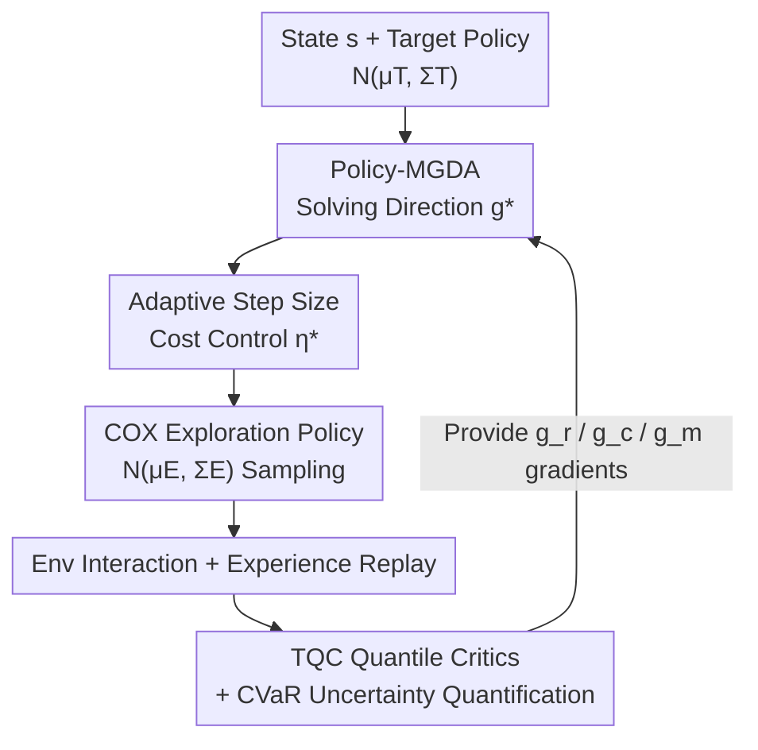

# Off-Policy Safe Reinforcement Learning with Constrained Optimistic Exploration

**Conference**: ICLR 2026  
**OpenReview**: [https://openreview.net/forum?id=EHs3tSukHC](https://openreview.net/forum?id=EHs3tSukHC)  
**Code**: https://github.com/RomainLITUD/COXQ  
**Area**: Reinforcement Learning / Safe Reinforcement Learning  
**Keywords**: Safe RL, off-policy, optimistic exploration, gradient conflict, quantile critics

## TL;DR
This paper proposes COX-Q, an off-policy safe reinforcement learning algorithm. In the online exploration phase, it utilizes Policy-MGDA to resolve gradient conflicts between rewards and costs in the action space and employs an adaptive step size to keep data collection costs within thresholds. In the offline learning phase, it uses Truncated Quantile Critics (TQC) to stabilize cost value estimation and quantify epistemic uncertainty, achieving high sample efficiency while ensuring cost constraints are met during both training and testing phases.

## Background & Motivation
**Background**: Safe RL typically models problems as Constrained Markov Decision Processes (CMDPs), aiming to maximize returns $Q_r^\pi(s,a)$ under the constraint that cumulative costs $Q_c^\pi(s,a)\le d$. The mainstream approach is the primal-dual (Lagrangian) framework, which iteratively updates the policy $\pi$ and the multiplier $\lambda$.

**Limitations of Prior Work**: Most existing safe RL methods are on-policy because the behavioral policy matches the target policy, allowing cost satisfaction to be enforced directly through gradient adjustment or trust region techniques during each update. However, on-policy methods suffer from low sample efficiency. Conversely, while off-policy methods achieve high sample efficiency via experience replay and active exploration, they struggle with safe RL: first, cumulative costs suffer from **underestimation bias**, leading to the learning of unsafe policies; second, the exploration process lacks **cost constraints**, where optimistic exploration can induce the agent into dangerous regions, causing data collection costs to spiral out of control.

**Key Challenge**: The high efficiency of off-policy RL stems from "aggressive offline exploration + experience replay," but safe RL requires cost constraints to be **satisfied even during the data collection phase** (this is inherently true for on-policy but not for off-policy). Prior off-policy attempts (e.g., ORAC) achieve safety during testing but explicitly do not constrain costs during the collection phase—"how to achieve cost-compliant exploration" remains an open problem.

**Goal**: To enable off-policy safe RL to simultaneously achieve (1) high data efficiency and (2) robust satisfaction of cost constraints during both training collection and deployment testing through cost-constrained exploration and reliable value learning.

**Key Insight**: Safe RL essentially involves two objectives (reward, cost) and a boundary $d$. The authors observe that in unsafe regions, the reward gradient $g_r$ and the cost gradient $g_c$ **conflict**—if $g_r$ dominates exploration, the agent is pushed deeper into the dangerous side. By explicitly resolving this conflict in the **action space** and combining it with step size control sensitive to both single-step and global training progress, exploration can be "sufficient without overstepping."

**Core Idea**: Use Policy-MGDA to solve for an aligned exploration direction $g^*$ in the action space that improves rewards while reducing costs, then use an adaptive step size $\eta^*$ to pin the expected cost of a single-step exploration within the threshold, and finally drive the exploration process using TQC to provide conservative, low-variance value estimates with uncertainty—these three components are integrated into COX-Q.

## Method

### Overall Architecture
COX-Q is built upon SAC and is an off-policy primal-dual safe RL algorithm. Its name reflects its two halves: **COX** (Cost-Constrained Optimistic eXploration) + **Q** (Offline value learning based on Quantile critics). The original single-objective optimistic exploration, OAC, estimates an optimistic upper bound $\hat Q_{UB}$ from a critic ensemble and takes a step in that direction under a KL trust region constraint. The displacement of the exploration mean is written as $\mu_\Delta=\eta\Sigma_T g_t$, where $\eta=\sqrt{2\delta/(g_t^\top\Sigma_T g_t)}$. COX extends this mechanism to dual-objective safe RL: it sequentially determines (1) an effective exploration direction $g^*$ to replace $g_t$, and (2) a safe exploration step size $\eta^*$ to replace $\eta$, which are then substituted back to obtain the final exploration policy $N(\mu_E,\Sigma_E)$.

The entire pipeline is a closed loop: TQC critics provide the reward upper bound gradient $g_r$, the cost lower bound gradient $g_c$, and the cost mean gradient $g_m$ → Policy-MGDA solves for the aligned direction $g^*$ based on these → Adaptive step size solves for $\eta^*$ → The synthesized COX exploration policy samples from the environment → Data enters the replay buffer → TQC critics are updated.

### Key Designs

**1. Policy-MGDA: Resolving Reward-Cost Exploration Gradient Conflict in Action Space**

Addressing the pain point where $g_r$ dominance in unsafe regions pushes the agent deeper into danger. In safe regions ($Q_c^\pi\le d$), the constraint is inactive, and exploration follows rewards ($g^*=g_r$); the primary challenge lies in unsafe regions. The overall gradient for the dual objective is $g_r-\lambda g_c$, but using this simple weighted sum for exploration is insufficient. The authors require exploration to simultaneously improve reward and reduce cost, meaning $g_c^\top\mu_\Delta\le 0$ and $g_r^\top\mu_\Delta\ge 0$ must both hold; otherwise, it is identified as a "gradient conflict."

The key is that the conflict is not measured by a standard inner product in the parameter space, but by a **$\Sigma$-metric** $\langle g_i,g_j\rangle_{\Sigma_T}\equiv g_i^\top\Sigma_T g_j$ (since exploration occurs in the action space, the policy's covariance matrix must be included). This fundamentally differs from gradient manipulation in model parameter spaces used in multi-task learning. The authors extend MGDA (Multiple Gradient Descent Algorithm) to the action space by defining a "hypercone" $K:=\{g:\langle g_r,g\rangle_{\Sigma_T}\ge 0,\ \langle -g_c,g\rangle_{\Sigma_T}\ge 0\}$ that satisfies both improvement conditions, and then searching for the solution in $K$ closest to the original direction: $g^*=\arg\min_{u\in K}\lVert u-(g_r-\lambda g_c)\rVert^2_{\Sigma_T}$. Lemma 1 provides a closed-form solution: if the original direction is already in the cone, use $g_{raw}=g_r-\lambda g_c$; otherwise, project $g_{raw}$ onto the cone boundary based on the signs of $v_r,v_c$. The fundamental difference is that Policy-MGDA operates in the **action space during online collection**, whereas previous gradient manipulation methods operated during offline model updates.

**2. Adaptive Step Size: Pinning Exploration Cost within Thresholds**

Addressing the issue where original OAC lacks cost constraints, causing exploration to overstep boundaries. Given the direction $g^*$, the authors explicitly constrain the expected cost of a single exploration step: the amount by which cost exceeds the limit along this direction is the hinge function $\phi(\eta)=[\eta\langle g_m,g^*\rangle_{\Sigma_T}-(d-\hat Q_c^{mean})]_+$. They then solve a bilevel optimization—taking the **maximum** step size $\eta^*$ within the trust region while ensuring $\phi$ is zero or minimized. Lemma 2 gives the solution: when cost decreases along the exploration direction ($s<0$), the full step $\eta$ is used; when already over the limit with no margin, take 0; when margin exists, take $\min(\eta, r/s)$, where $r=d-\hat Q_c^{mean}$. Intuitively, this "releases exploration in safe zones and tightens steps in unsafe zones."

However, this solution fails near the optimum: as $g^*\to 0$ and $s\to 0$, sign oscillations cause $\eta^*$ to jump between $\pm\eta$, degenerating into pure action noise. The authors add a **macro-adaptation** layer: $\delta$ (and thus the maximum step $\eta$) is adjusted based on the near on-policy costs in the recent replay buffer $B_{recent}$, solving $\arg\min_{0<\delta\le\bar\delta}\delta\times(d-\mathbb{E}_{c_i\in B_{recent}}c_i)$. Consequently, total exploration cost is governed by $d$: safe zones tend to use the full budget, while unsafe zones remain conservative. The combination of micro-level single-step constraints and macro-level training progress adjustment effectively controls collection costs.

**3. TQC Quantile Critics + CVaR: Conservative, Low-Variance Value Learning with Quantifiable Uncertainty**

Addressing the difficulty of learning tail distributions when costs or target rewards are sparse, and the natural "reward overestimation, cost underestimation" bias in Bellman updates. The authors employ Truncated Quantile Critics (TQC): each independent critic learns a distribution via a set of uniform quantiles. After the quantiles of all critics are merged and sorted, they are **truncated**—dropping the top $k_r$ atoms for rewards to suppress overestimation and dropping the bottom $k_c$ atoms for costs to suppress underestimation. Merged quantiles provide low-variance gradients for stable learning, while the number of truncated atoms flexibly controls bias direction.

Another benefit of TQC is the natural quantification of distribution-level epistemic uncertainty. With $N$ cost critics and $N$ reward critics each predicting $M$ quantiles, confidence bounds are calculated per quantile and aggregated via CVaR: the cost lower bound $\hat Q^{LB}_c$ takes only the top $\alpha$ quantiles ($\alpha$ smaller implies higher risk aversion, similar to WCSAC), and the reward upper bound $\hat Q^{UB}_r$ uses the full distribution for an optimistic bound, with $\beta_r,\beta_c$ tuning exploration aggressiveness. These bounds provide the gradients $g_r,g_c,g_m$ for designs 1 and 2—coupling value learning and exploration in a closed loop. Notably, in "Safe Navigation" with sparse costs, truncating too many atoms suppresses learning, so merged quantiles are kept **without truncation**, and the CVaR upper bound is used to update the actor and multiplier.

### Loss & Training
The implementation is based on SAC and uses ALM (Augmented Lagrangian Method from CAL/ORAC, essentially an enhanced penalty for constraint violation). It remains primal-dual: the policy minimizes $Q_r-\lambda(Q_c-d)$, and the multiplier is updated based on the degree of constraint violation. Safe Velocity / Safe Navigation are run with 10 random seeds; Autonomous Driving, due to long training times, is run once with a single seed.

## Key Experimental Results

Off-policy and on-policy baselines are compared across three safe RL benchmarks: Safe Velocity (dense reward locomotion with speed limits), Safe Navigation (navigation and obstacle avoidance with sparse costs), and SMARTS Autonomous Driving (closed-loop vehicle interaction).

### Main Results
SMARTS Autonomous Driving safety performance (512K training steps, 2000 random runs); COX-Q is overall optimal in collisions and timeouts:

| Scenario | Metric | CPPOPID | SACLag | CAL | TQC-ORAC | COX-Q |
|------|------|---------|--------|-----|----------|-------|
| Overtaking | Collisions | 331 | 194 | 186 | 97 | 99 |
| Intersection | Collisions | 183 | 33 | 23 | 18 | **12** |
| Intersection | Timeout | 0 | 0 | 1 | 12 | **0** |
| T-junction | Collisions | 195 | 55 | 36 | 28 | **21** |
| T-junction | Timeout | 0 | 0 | 17 | 86 | 5 |

Key comparison with ORAC: COX-Q reduces Intersection collisions from 18 to 12 and T-junction collisions from 28 to 21, with significantly fewer timeouts (ORAC had 887 timeouts in Overtaking, 12 in Intersection, and 86 in T-junction due to being "too scared to move"). This indicates that resolving conflicts in directions that simultaneously reduce cost and increase reward maintains safety without excessive conservatism. Unsafe events during the data collection phase were also significantly lower for COX-Q than ORAC (e.g., 1123 vs 3589 for Intersection).

### Ablation Study
Two variants (TQC only without exploration; TQC + ORAC-style exploration) were compared on Safe Velocity / Safe Navigation:

| Configuration | Observation | Explanation |
|------|------|------|
| TQC only, no exploration | Returns already higher than baselines | TQC primarily contributes to return improvement |
| TQC + ORAC exploration | Safe Velocity training cost spikes | ORAC exploration does not constrain collection cost |
| COX-Q (Full) | Training cost smoothly tracks threshold | Cost-constrained exploration + step adaptation effectively controls collection cost |

### Key Findings
- TQC is the main driver for return improvement—all ablation variants performed better than baselines, and returns did not drop when exploration was removed.
- The value of cost-constrained exploration is highly task-dependent: in Safe Velocity, where reward-cost gradient conflict is strong, COX-Q's step size mechanism keeps training costs within budget (smooth curve), whereas ORAC spikes. in Safe Navigation, obstacles are sparse, and the proportion of triggered gradient conflicts in the first 200K steps is below 10% (even <2% in PointPush1), making COX-Q and ORAC nearly equivalent.
- A counterintuitive but important conclusion: in sparse-cost tasks, the bottleneck is not the exploration mechanism but the **underestimation bias of cumulative costs**—sparse signals lead to severe early underestimation, triggering constraint violations in both training and testing. COX-Q's merged quantiles allow cost estimation bias to converge stably to 0, whereas all baselines either become overly conservative or unstable.
- Safety performance for all methods was relatively poor in the Overtaking scenario because SMARTS uses SUMO's instantaneous lane-changing model without turn signal warnings, making collision avoidance inherently difficult—this is a property of the environment rather than the algorithm.

## Highlights & Insights
- **Resolving gradient conflicts in action space using the $\Sigma$-metric**: This is the most clever point. Multi-task gradient manipulation typically uses standard inner products in parameter space; this paper realizes exploration occurs in the action space and must incorporate the policy covariance $\Sigma_T$ to correctly judge if "exploration truly improves both reward and cost."
- **Micro-step + Macro-progress dual-layer step control**: Recognizing that the closed-form step size in Lemma 2 would degenerate into noise near the optimum, the authors added macro-adaptation of $\delta$ using near on-policy costs, demonstrating a detailed caveat for when theoretical solutions fail.
- **Closed-loop coupling of value learning and exploration**: TQC isn't just for stable cost estimation; its CVaR bounds directly serve as the gradient sources for the exploration direction. A single set of quantile critics serves the seemingly contradictory needs of "conservative estimation" and "optimistic exploration."
- **Transferability**: The strategy of resolving conflicts in the action space via $\Sigma$-metrics can be generalized to any multi-objective continuous control problem (beyond safe RL) where objectives conflict at the action level.

## Limitations & Future Work
- **Ours Acknowledges**: The reliability of epistemic uncertainty quantification is a major limitation—TQC merges all critics to learn the full distribution, which might suppress diversity as gradients for near-OOD samples become highly correlated; diverse ensemble projection or random priors could improve this.
- **Ours Acknowledges**: In sparse-cost tasks (Safe Navigation), COX's exploration mechanism has little effect because the cost critic fails to learn accurately; HER or prioritized experience replay is needed to robustify cost estimation.
- **Self-Observed**: The autonomous driving experiment used only a single seed for training to save time, making the statistical robustness of the conclusion weaker than the 10-seed benchmarks; also, macro-adaptation (Eq. 19) was disabled for driving to prevent step size convergence to 0, implying that full COX-Q requires manual trade-offs in extreme tasks that remain unsafe throughout.
- **Method Dependency**: The theoretical framework assumes Gaussian policies and accurate value estimation (especially for cost). If data is insufficient during early training, collection cost control may fail; as the authors noted, this could be mitigated by integrating reachability analysis or model-based RL.

## Related Work & Insights
- **vs ORAC (McCarthy et al., 2025)**: ORAC also introduces optimistic actor-critic into off-policy safe RL for low-cost exploration, but it explicitly **does not constrain cost during the data collection phase**. COX-Q fills this gap with Policy-MGDA + adaptive step sizes and, according to experiments, avoids the side effect of "excessive timeouts due to over-conservatism" seen in ORAC while significantly reducing collection-phase unsafe events.
- **vs CAL (Wu et al., 2024)**: CAL uses conservative cost learning + local policy convexification + ALM to achieve strong safety and sample efficiency with high UTD ratios, but it relies on point value estimates. COX-Q uses distributional TQC, and experiments show distributional RL offers better sample efficiency than point-value baselines.
- **vs WCSAC (Yang et al., 2021/2023)**: WCSAC uses CVaR to penalize underestimated costs for a risk-averse actor. COX-Q borrows the CVaR upper bound idea (and reuses it directly in Safe Navigation) but adds the contribution of an active cost-constrained exploration mechanism.
- **vs MGDA (Désidéri, 2012) / Multi-task Gradient Manipulation**: Traditional MGDA finds Pareto descent directions in parameter space using standard inner products. Policy-MGDA moves this to the action space, utilizes the $\Sigma$-metric, and occurs during online collection rather than offline updates, representing a fundamental shift in positioning.

## Rating
- Novelty: ⭐⭐⭐⭐⭐ Resolving gradient conflicts in the action space with the $\Sigma$-metric and dual-layer step control for collection costs is a rare original combination in off-policy safe RL.
- Experimental Thoroughness: ⭐⭐⭐⭐ Three hierarchically progressive benchmarks + thorough ablation, though the single seed for autonomous driving and limited effectiveness in sparse-cost tasks are notable shortcomings.
- Writing Quality: ⭐⭐⭐⭐ Clear theoretical derivations (closed-form solutions for two Lemmas) and honest reporting of failure scenarios, though formulas are quite dense.
- Value: ⭐⭐⭐⭐⭐ Directly addresses the critical deployment pain point of "out-of-control collection costs in off-policy safe RL," holding practical significance for safety-critical applications.

<!-- RELATED:START -->

## Related Papers

- [\[ICLR 2026\] Safe Exploration via Policy Priors](safe_exploration_via_policy_priors.md)
- [\[ICLR 2026\] SHAPO: Sharpness-Aware Policy Optimization for Safe Exploration](shapo_sharpness-aware_policy_optimization_for_safe_exploration.md)
- [\[ICML 2025\] Controlling Underestimation Bias in Constrained Reinforcement Learning for Safe Exploration](../../ICML2025/reinforcement_learning/controlling_underestimation_bias_in_constrained_reinforcement_learning_for_safe_.md)
- [\[ICLR 2026\] BAPO: Stabilizing Off-Policy Reinforcement Learning for LLMs via Balanced Policy Optimization with Adaptive Clipping](bapo_stabilizing_off-policy_reinforcement_learning_for_llms_via_balanced_policy_.md)
- [\[ICLR 2026\] Revisiting Group Relative Policy Optimization: Insights into On-Policy and Off-Policy Training](revisiting_group_relative_policy_optimization_insights_into_on-policy_and_off-po.md)

<!-- RELATED:END -->
