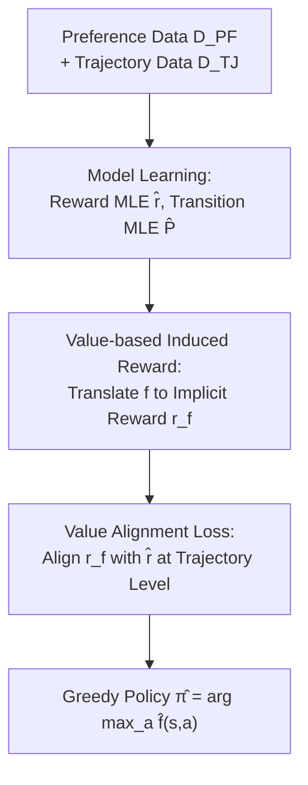

# Offline Preference-based Value Optimization

**Conference**: ICLR 2026  
**OpenReview**: [https://openreview.net/forum?id=9cUdn8GKId](https://openreview.net/forum?id=9cUdn8GKId)  
**Code**: See supplementary material  
**Area**: Reinforcement Learning / Offline Preference-based RL  
**Keywords**: Offline PbRL, Preference Learning, Value Alignment Loss, Induced Reward Function, Sample Complexity

## TL;DR
This paper proposes PVO (Preference-based Value Optimization), which directly optimizes the value function using a novel "value alignment loss" to ensure consistency with preference feedback. While achieving the optimal sample complexity of $O(\varepsilon^{-2})$, it stably outperforms multiple strong baselines on continuous control benchmarks without requiring additional preference learning hyper-parameters.

## Background & Motivation
**Background**: Preference-based Reinforcement Learning (PbRL) infers reward signals by comparing preferences between trajectory pairs, bypassing the challenges of designing reward functions in real-world tasks and the need for expensive equipment like motion capture. This approach has been validated in robotics, gaming, and Large Language Model alignment (RLHF). This paper focuses on the **offline** setting: learning solely from pre-collected trajectories and preference annotations without real-time environment interaction—which is particularly crucial for PbRL as collecting human preferences interactively is often prohibitively expensive or infeasible.

**Limitations of Prior Work**: Existing theoretical algorithms for offline PbRL often force a choice between being "provable" or "usable." Zhu et al. (2023) only support linear function approximation. FREEHAND by Zhan et al. (2024a) formulates PbRL as a distributionally robust optimization (DRO) problem, requiring a minimization search over confidence sets of rewards and transitions, making it **computationally infeasible**. APPO by Kang & Oh (2025) relaxes this into a solvable regularized optimization using actor-critic, but the sample complexity degrades to $O(\varepsilon^{-4})$, and in practice, it suffers from **unstable training and high performance variance**, often failing to learn effective policies even with hyper-parameter tuning.

**Key Challenge**: The reward concentration guarantee for PbRL only holds at the level of **trajectory pairs** $(\tau^0, \tau^1) \sim \mu$, rather than being state-wise or transition-wise. This means the step-by-step squared Bellman error (TD loss) used in standard RL is structurally **incompatible** with PbRL. Fitting reward models estimated from preferences using TD loss allows reward estimation errors to be amplified layer-by-layer through Bellman backups, leading to instability.

**Goal**: To find an offline PbRL algorithm that simultaneously achieves rate-optimal sample complexity, remains training-stable, and introduces no additional hyper-parameters.

**Key Insight**: Since concentration is trajectory-level, the loss function should also be established at the **trajectory-pair level**. Furthermore, instead of following the iterative actor-critic path (which is the source of instability in APPO), the authors draw inspiration from the **Bellman optimality equation** to optimize the value function directly.

**Core Idea**: Defining a "value-based induced reward function" translates the value function $f$ into its implicit step-wise reward. A trajectory-level "value alignment loss" then forces this implicit reward to align with the MLE-estimated reward model $\hat r$, thereby learning a value function consistent with preferences in a single optimization step.

## Method

### Overall Architecture
PVO addresses the problem of learning an $\varepsilon$-optimal policy offline given a preference dataset $D_{PF}=\{(\tau^{m,0},\tau^{m,1},y_m)\}$ and a trajectory dataset $D_{TJ}=\{(\tau^{n,0},\tau^{n,1})\}$. The pipeline consists of two phases: first, **Model Learning** (estimating reward model $\hat r$ and transition model $\hat P$ via MLE), followed by **Value Optimization** (minimizing the value alignment loss to obtain the value function $\hat f$ and outputting the greedy policy). Its elegance lies not in complexity but in the trajectory-level loss of the second phase—it ensures the value function aligns with preferences without the need for repeated actor-critic iterations, making it inherently more stable.

### Key Designs

**1. Value-based Induced Reward Function: Directly "Translating" the Value Function**

The difficulty in PbRL is the lack of step-wise reward observations, making standard TD loss unusable. The authors bypass the actor-critic route of "learning policy first, then calculating value" and define the **implicit step-wise reward** for any value function $f$:

$$r_{h,f} = f_h - P^\star_h V_{h+1,f}$$

where $V_{h+1,f}(s)=f_{h+1}(s,\pi_f(s))$ is the greedy value of $f$. This differs from the "policy-based induced reward" used in actor-critic analysis—the latter is rooted in the Bellman equation for a specific policy $\pi$ ($Q^\pi_h=r^\star_h+P^\star_h V^\pi_{h+1}$), whereas this "value-based" definition is inspired by the **Bellman optimality equation** $Q^{\pi^\star}_h(s,a)=r^\star_h(s,a)+\mathbb{E}_{s'}[\max_{a'}Q^{\pi^\star}_{h+1}(s',a')]$. This max-form allows the authors to **directly optimize the value function itself**, eliminating the alternating policy/value iterations of APPO and removing the source of instability.

**2. Value Alignment Loss: Aligning at the Trajectory Level to Match PbRL Structure**

With the induced reward, the authors propose the value alignment loss:

$$\hat L_{VA}(r_f,\hat r)=\sum_{n=1}^{N}\big(r_f(\tau^{n,0})-r_f(\tau^{n,1})-\hat r(\tau^{n,0})+\hat r(\tau^{n,1})\big)^2$$

While it appears as a trajectory-level squared error between induced reward $r_f$ and reward model $\hat r$, expanding the definition reveals it is equivalent to the square of the **difference in cumulative Bellman errors** between a pair of trajectories. Minimizing $\hat L_{VA}$ forces $f$ to be Bellman-consistent relative to $\hat r$. Its superiority over TD loss stems from **spreading the error across the entire trajectory**: whereas TD loss amplifies reward model errors through step-wise backups, the value alignment loss smooths errors across the trajectory scale, fitting the structural fact that concentration in PbRL only holds for trajectory pairs.

**3. Unified Framework: Supporting Both Value Optimization and Actor-Critic**

Re-examining APPO, the authors found that its value update term $\hat E(f)$ is essentially an $\ell_1$ error between policy-based induced rewards and $\hat r$, acting as an $\ell_1$ variant of the value alignment loss. This leads to a natural question: can substituting $\hat E(f)$ with $\hat L_{VA}$ in APPO preserve sample complexity? Theorem B.1 confirms this. This suggests that the "value-based induced reward + value alignment loss" is not just for PVO but represents a **unified principle for provably efficient PbRL**, applicable to both value-based and actor-critic methods.

**4. Practical Deep Implementation: Expectile Regression + AWR without Transition Models**

Theoretical PVO requires a transition model $\hat P$ to compute induced rewards, which is expensive to train in deep RL. The authors adapt PVO to the standard discounted deep PbRL setting (using segments of length $L$), parameterizing $Q$ and $V$ separately: $V$ is trained via expectile regression $L_V=\mathbb{E}[L_2^\tau(Q(s,a)-V(s))]$, and $Q$ via the value alignment loss $L_Q=\mathbb{E}[(r_{Q,V}(\tau^0)-r_{Q,V}(\tau^1)-\hat r(\tau^0)+\hat r(\tau^1))^2]$, where $r_{Q,V}(\tau)=\sum_{l=1}^{L}(Q(s_l,a_l)-\gamma V(s_{l+1}))$. Replacing $\hat P V(s_l,a_l)$ with $V(s_{l+1})$ **eliminates the need for a transition model**, and experiments show this approximation performs well. The policy is extracted via Advantage Weighted Regression (AWR). Notably, the implementation shares identical hyper-parameters with IQL, **introducing no new hyper-parameters for preference learning**.

### Loss & Training
- **Reward Model**: Negative log-likelihood $\hat L_{RW}(r)=-\sum_{m=1}^{M}\log\Phi\big((2y_m-1)(r(\tau^{m,1})-r(\tau^{m,0}))\big)$. For BTL models, $\Phi=\sigma$. Training takes less than a minute for 1000 samples.
- **Value Function**: Minimizing the unconstrained value alignment loss using standard gradient optimizers. Learning takes roughly 2 hours.
- **Policy Extraction**: Advantage Weighted Regression (AWR).

## Key Experimental Results

### Main Results
Benchmarks include Meta-World (Success Rate) and DMControl (Episode Return), with data from Choi et al. (2024). Preference pairs are length-25 random segments labeled by ground-truth returns. Baselines include IQL (with learned reward), APPO, Preference Transformer (PT), DPPO, and IPL.

| Method | Sample Complexity | Extra Pref. Hyper-params | Computationally Feasible | Empirical Stability |
| :--- | :--- | :--- | :--- | :--- |
| FREEHAND | $O(\varepsilon^{-2})$ (Tighter) | — | Infeasible (DRO oracle) | — |
| APPO | $O(\varepsilon^{-4})$ | Conservatism | Feasible | High variance/Collapses |
| DPPO / IPL | — | Smoothing/Regularization | Feasible | Unstable across tasks |
| **PVO (Ours)** | $O(\varepsilon^{-2})$ | **None (Same as IQL)** | Feasible (No model) | **Stable & Robust** |

Overall results (Figure 1/2): PVO leads consistently across Meta-World medium-replay and medium-expert. Baselines show high variance across datasets; for instance, while IQL matches PVO on some tasks, it fails completely on `button-press-topdown`, whereas PVO remains stable, demonstrating robustness to reward model errors.

### Ablation Study

| Configuration | Trend | Description |
| :--- | :--- | :--- |
| IQL (Standard TD loss) | Baseline, high variance | Same architecture/expectile regression as PVO, differs only in loss. |
| IQL + VA = PVO | Significant gain & stable | Replacing loss with VA loss yields PVO. |
| XQL → XQL + VA | Significant gain | Value-based algorithms benefit from VA loss. |
| TD3+BC → TD3+BC + VA | Significant gain | Actor-critic algorithms benefit from VA loss. |

### Key Findings
- **Value Alignment Loss is the core driver**: Replacing standard TD loss with VA loss in IQL, XQL, and TD3+BC leads to significant improvements (IQM over 8 tasks), proving it provides more reliable learning signals.
- **Extreme preference data efficiency**: PVO learns effectively with only ~100 preference samples, showing minimal performance degradation.
- **Robustness to data quality**: In `dial-turn`, mixing expert and random trajectories at various ratios shows that while all methods degrade as the ratio $r$ of experts decreases, PVO maintains its lead across all mixtures.

## Highlights & Insights
- **Aligning at the correct level**: Recognizing that PbRL concentration holds at the trajectory level led to the design of trajectory-level value alignment loss over step-wise TD loss—this is the fundamental reason for PVO's stability.
- **Avoiding iteration via Bellman optimality**: Using the value-based induced reward (inspired by the max-form) directly optimizes the value function, simplifying the implementation and removing instability sources.
- **A unified loss for two paths**: The same value alignment loss powers PVO (value-based) and improves APPO (actor-critic) while maintaining theoretical guarantees.
- **Zero extra hyper-parameters**: Using the same hyper-parameters as IQL makes the engineering cost of migration near zero, a rarity in PbRL which usually requires many regularization tuning parameters.

## Limitations & Future Work
- **Looser sample complexity bound**: PVO's bound depends on a stronger "uniform concentration" $C_\mu(F)$ compared to the single-policy concentration in FREEHAND/APPO; the authors acknowledge this as a trade-off for practicality and stability.
- **Approximation in deep implementation**: Replacing $\hat P V$ with $V(s_{l+1})$ lacks a rigorous quantitative theoretical explanation beyond the assumption that errors are smoothed at the trajectory level.
- **MLE Dependency**: Optimization is anchored to $\hat r$. If preferences are extremely noisy or non-BTL, $\hat r$ bias may propagate; more robust preference learners could replace MLE.
- **Evaluation Range**: Primarily validated on Meta-World/DMControl (continuous control). Its performance in high-dimensional discrete scenarios like LLM alignment remains to be explored.

## Related Work & Insights
- **vs. FREEHAND (Zhan et al., 2024a)**: Both achieve $O(\varepsilon^{-2})$, but PVO avoids the infeasible DRO oracle by using an unconstrained loss.
- **vs. APPO (Kang & Oh, 2025)**: PVO improves sample complexity from $O(\varepsilon^{-4})$ to $O(\varepsilon^{-2})$ and provides superior training stability without extra hyper-parameters, albeit with a stronger concentration assumption.
- **vs. IQL + learned reward**: PVO's stability gains over IQL (which uses TD loss) demonstrate that the VA loss is a more robust alternative for preference signals.
- **vs. IPL / DPPO**: These methods often require additional regularization/conservatism hyper-parameters and show instability across tasks, whereas PVO's explicit alignment is more stable and parameter-free.

## Rating
- Novelty: ⭐⭐⭐⭐⭐ Value-based induced reward + Trajectory-level value alignment loss provides fundamental insight into PbRL structure.
- Experimental Thoroughness: ⭐⭐⭐⭐ Extensive benchmarks and ablations, though main results are mostly visualized as bar charts without precise numerical tables.
- Writing Quality: ⭐⭐⭐⭐⭐ Strong logical flow from motivation to theory and implementation; honest about trade-offs.
- Value: ⭐⭐⭐⭐⭐ Simple, stable, zero extra hyper-parameters with rate-optimal guarantees; very practical for offline PbRL.

<!-- RELATED:START -->

## Related Papers

- [\[ICLR 2026\] Preference-based Policy Optimization from Sparse-reward Offline Dataset](preference-based_policy_optimization_from_sparse-reward_offline_dataset.md)
- [\[ICLR 2026\] DuPO: Enabling Reliable Self-Verification via Dual Preference Optimization](dupo_enabling_reliable_self-verification_via_dual_preference_optimization.md)
- [\[ICLR 2026\] Peng's Q($\lambda$) for Conservative Value Estimation in Offline Reinforcement Learning](pengs_qlambda_for_conservative_value_estimation_in_offline_reinforcement_learnin.md)
- [\[ICLR 2026\] Trajectory Generation with Conservative Value Guidance for Offline Reinforcement Learning](trajectory_generation_with_conservative_value_guidance_for_offline_reinforcement.md)
- [\[ICLR 2026\] Causally Robust Reward Learning from Reason-Augmented Preference Feedback](causally_robust_reward_learning_from_reason-augmented_preference_feedback.md)

<!-- RELATED:END -->
