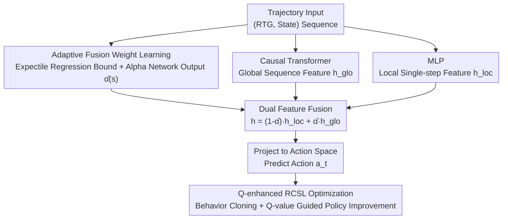

# Offline Reinforcement Learning with Adaptive Feature Fusion

**Conference**: ICLR 2026  
**OpenReview**: [https://openreview.net/forum?id=uD9UT0gHLH](https://openreview.net/forum?id=uD9UT0gHLH)  
**Code**: https://github.com/wangtieru2/QDFFDT (Available)  
**Area**: Offline Reinforcement Learning / Sequence Modeling / Decision Transformer  
**Keywords**: Offline RL, RCSL, Decision Transformer, Feature Fusion, Trajectory Stitching

## TL;DR
Addressing the issue where Decision Transformer-style "RL as sequence modeling" methods overfit historical sub-optimal sub-trajectories and fail to stitch superior trajectories, this paper proposes QDFFDT. It utilizes a learnable, state-dependent fusion coefficient to adaptively weight and fuse "global sequence features" and "local single-step Markov features," combined with a Q-learning module for value guidance, achieving SOTA on D4RL benchmarks.

## Background & Motivation

**Background**: Offline reinforcement learning learns policies from a fixed, pre-collected dataset without environment interaction. Recently, the introduction of Transformers has led to the Return-Conditioned Supervised Learning (RCSL) paradigm—represented by the Decision Transformer (DT)—which models trajectories as sequences of `(return-to-go, state, action)`. By predicting actions based on historical context and target returns, it transforms RL into a supervised learning problem, offering stable training and high data efficiency.

**Limitations of Prior Work**: Treating RL purely as sequence modeling has a fundamental flaw: the model tends to overfit the specific, often sub-optimal, actions present in historical sub-trajectories. Consequently, even when the target return is set high during evaluation, the model fails to synthesize the corresponding high-quality action sequences. The paper provides an intuitive example (Figure 2): in a simple grid, two training trajectories `ABCDK` and `AIJDE` exist. DT finds the optimal segment `ABCD` initially, but upon reaching state D, the historical context misleads it back toward the trajectory leading to K in the training data, missing the true optimal `ABCDE`. A single-step version (SSDT) with a sequence length of 1 100% finds the optimal solution, whereas standard DT (K=3) has a 0% success rate.

**Key Challenge**: There is an inherent misalignment between the goal of sequence modeling (reliably reproducing observed trajectories) and the goal of RL (stitching optimal segments from multiple trajectories to discover policies exceeding any single one). Some works have recognized the issues with long-sequence dependence, but they either lack the flexibility to balance global/local information or require tedious per-dataset hyperparameter tuning. Even works like QT, which introduce Q-functions for value guidance, struggle to suppress the influence of previous sub-optimal sub-trajectories because the behavior cloning term in the policy objective constrains the policy to remain close to the behavior distribution.

**Goal**: Design an offline RL architecture capable of adaptively choosing between "utilizing long-range context" and "prioritizing single-step optimal decisions" without relying on per-dataset tuning.

**Key Insight**: Explicitly **separate** global sequence features and local Markov features into two paths, then adaptively combine them using a **state-dependent** learnable fusion weight. When the training return of a state is significantly lower than its reachable optimal return, reliance on sequence features is reduced in favor of single-step features; meanwhile, a Q-learning module is integrated to provide explicit value guidance.

## Method

### Overall Architecture

The core of QDFFDT is a Decision Transformer with dual-path feature fusion. The input is a trajectory segment $\tau_t = (\hat{R}_{t-K+1}, s_{t-K+1}, \dots, \hat{R}_t, s_t)$ (with action tokens removed), and the output is the current action $a_t$. The process consists of three steps: first, an "Alpha network" calculates a fusion coefficient $\hat{\alpha}(s)$ based on the state; second, the same input is sent to a Causal Transformer (for global sequence features) and a lightweight MLP (for local single-step features). These are combined via a weighted fusion using $\hat{\alpha}$ and projected into the action space. Finally, a Q-learning module is added to provide value-guided policy improvement alongside the supervised behavior cloning loss. The first two steps constitute DFFDT, and with the Q module, it becomes the complete QDFFDT.

### Key Designs

**1. Dual Feature Fusion Architecture: Explicitly separating and fusing global and local inductive biases**

The limitation is clear: pure sequence modeling prioritizes "continuing" historically observed sub-trajectories even if better actions exist; pure single-step modeling, while facilitating trajectory stitching by picking high-return actions, suffers from insufficient information in compressed state representations (e.g., in pixel environments like Atari), necessitating temporal context. Since both have weaknesses, the paper implements them as parallel branches. Specifically, each "return-state" pair $(\hat{R}_t, s_t)$ produces a local representation $h^{\text{loc}}_t$ via a lightweight MLP and a global representation $h^{\text{glo}}_t$ capturing long-range dependencies via self-attention (as in DT). These are linearly combined:

$$h = (1 - \hat{\alpha}(s_t)) \cdot h^{\text{loc}}_t + \hat{\alpha}(s_t) \cdot h^{\text{glo}}_t$$

Layer Normalization is applied to both paths before fusion to align scales and prevent one path from dominating due to magnitude differences. This structure introduces a structural bias that "prioritizes single-step dynamics without discarding long-range information."

**2. Adaptive Fusion Weight: Using expectile regression to identify sub-optimal data and determine trust**

The key is determining "which path to trust in which state." The paper uses **expectile regression** to estimate the empirical upper bound of the return-to-go for a Given state. For $\sigma \in (0,1)$, expectile regression is solved via asymmetric least squares $L^\sigma_2(u) = |\sigma - \mathbb{1}(u<0)| u^2$, where higher weights are given to larger samples when $\sigma > 0.5$. A state value function $V_\psi(s)$ is trained to approximate the reachable return upper bound: $L_V(\psi) = \mathbb{E}_{(s,\hat{R})\sim D}[L^\sigma_2(\hat{R} - V_\psi(s))]$. Unlike IQL which approximates optimal Q-values, $V_\psi(s)$ here serves as a **sub-optimality detector**—if $V_\psi(s)$ is significantly greater than the observed return $\hat{R}(s)$, the subsequent trajectory is likely sub-optimal.

An Alpha network then produces the fusion coefficient. Its loss uses the "degree of sub-optimality" as a penalty:

$$L_\alpha(\omega) = \mathbb{E}_{(s,\hat{R})\sim D}\left[\frac{\alpha_\omega(s) \cdot \max(V_\psi(s) - \hat{R}, 0)}{T}\right]$$

Where $T$ is temperature. $\alpha_\omega(s) \in (0,1)$ is output via Sigmoid, with the final coefficient $\hat{\alpha}(s) = \alpha_{\min} + (1-\alpha_{\min})\cdot \alpha_\omega(s)$, using $\alpha_{\min}$ as a floor. The last layer of the Alpha network is initialized with zero weights and a large positive bias (e.g., 5) so that $\alpha_\omega(s) \approx 1$ initially, relying fully on sequence modeling. As training progresses, if $V_\psi(s) > \hat{R}$ (sub-optimal data), the loss reduces $\alpha_\omega(s)$, shifting weight to local features. If $V_\psi(s) \le \hat{R}$ (high-quality trajectories), the penalty disappears, maintaining the contribution of sequence modeling. This makes the decision of "whether to trust history" data-driven and state-adaptive.

**3. Q-enhanced RCSL Optimization: Explicit policy improvement via dynamic programming value guidance**

RTG signals in RCSL often fail to accurately reflect the true value of state-action pairs; mismatch between target and optimal RTG prevents RCSL from converging to theoretical optimality. Thus, a Q-learning module is added: using five networks (two Q-networks $Q_{\phi_1}, Q_{\phi_2}$, two target Q-networks, and one target policy network), TD learning is performed based on the QT implementation. The target value $\hat{Q}_m$ supports n-step or 1-step Bellman forms (chosen manually). The final policy loss is a weighted sum of the BC term and the value guidance term:

$$L_\pi(\theta) = \lambda \cdot L_{\text{DFFDT}}(\theta) - \mathbb{E}_{\tau_t \sim D}\mathbb{E}_{s_i \sim \tau_t} Q_\phi(s_i, \pi_\theta(\tau_t)_i)$$

Where $\lambda$ balances supervised learning and value improvement, and $L_{\text{DFFDT}}$ is the MSE between predicted and ground-truth actions. Following TD3+BC, the Q-function is normalized to mitigate scale mismatch across offline datasets and gradient imbalance. This forces the policy toward high-value regions rather than just mimicking the data.

### Loss & Training
Overall optimization coordinates three loss types: the expectile regression loss $L_V$ for $V_\psi$, the sub-optimality penalty loss $L_\alpha$ for the Alpha network, and the policy loss $L_\pi$ (BC MSE + Q-guidance). The Q-network follows standard TD update rules. For convergence, the authors argue that the DFFDT (RCSL) part inherits properties from QT, while the Q-enhancement follows dynamic programming; their combination is theoretically grounded and empirically validated.

## Key Experimental Results

### Main Results
Evaluated on D4RL benchmarks (Gym-MuJoCo, Maze2D, AntMaze, Kitchen, Adroit) against various value-based, RCSL, and diffusion/VAE methods. Average normalized scores are reported:

| Task Domain | Metric | QDFFDT | Prev. SOTA (Baseline) | Gain |
|--------|------|--------|------------------|------|
| Gym MuJoCo (Avg of 9) | Norm. Score | **94.3** | 90.3 (QCS) | +4.0 |
| Maze2D (Avg of 3) | Norm. Score | **159.8** | 154.4 (QT) | +5.4 |
| AntMaze (Avg of 6) | Norm. Score | **88.3** | 80.4 (QCS) | +7.9 |
| Kitchen (Avg of 2) | Norm. Score | **64.9** | 61.6 (D-QL) | +3.3 |
| Adroit (Avg of 2) | Norm. Score | **94.5** | 90.1 (QCS) | +4.4 |

Improvements over QT are particularly significant on Markovian sub-optimal datasets (medium, medium-replay), such as halfcheetah-m increasing from 51.4 to 65.7 and hopper-m from 96.9 to 101.4. It also leads in Maze2D / AntMaze requiring long-range reasoning, without necessitating explicit goal conditioning like LSDT or QCS.

### Ablation Study

**Feature Branch Ablation** (Figure 4, qualitative conclusions):

| Config | Performance | Description |
|------|------|------|
| Pure Sequence (DT / QRC-Transformer) | Weak on fully observable tasks | Dragged down by historical sub-optimal segments; stitching and local feature extraction impaired. |
| Pure Step-wise (RC-MLP / QRC-MLP) | Stronger on Gym, AntMaze | Emphasizes immediate info; facilitates trajectory stitching. |
| Fusion (DFFDT / QDFFDT) | Consistently optimal across benchmarks | Relies on sequence for info in Atari (POMDP), relies on local to avoid sub-optimality in Gym. |

Notably, in Atari (high-dimensional pixel environments where compression causes partial observability), sequence modeling is superior (recovering info from temporal context), confirming that the importance of each path varies by environment, justifying adaptive fusion.

**Dynamic vs. Static Fusion Coefficient** (Table 3, Avg of Maze2D + AntMaze):

| Config | Avg. Score | Description |
|------|--------|------|
| $\hat{\alpha}=0$ (Pure Local) | 86.9 | Reliant solely on step-wise info |
| $\hat{\alpha}=0.25$ | 80.4 | Fixed low sequence weight |
| $\hat{\alpha}=0.5$ | 85.0 | Fixed balanced |
| $\hat{\alpha}=0.75$ | 94.9 | Fixed high sequence weight |
| $\hat{\alpha}=1$ (Pure Sequence) | 101.2 | Reliant solely on sequence |
| **QDFFDT (Dynamic Learning)** | **105.3** | Adaptive coefficient |

### Key Findings
- The dynamically learned fusion coefficient (105.3) outperforms any fixed value. Furthermore, reaching high scores with fixed coefficients requires per-dataset tuning, which has poor generalization—validating the adaptive mechanism.
- Environment observability determines which path is critical: local features are more reliable in fully observable tasks, while sequence features are more important in partially observable (Atari pixel) tasks.
- Integrating Q-value learning into pure return-conditioned models yields significant gains in sparse reward environments (AntMaze), highlighting the importance of value guidance.

## Highlights & Insights
- **Expectile Regression as a "Sub-optimality Detector" instead of an "Optimal Q-estimator"**: While IQL uses it to approximate $Q^*$, this paper uses the gap between $V_\psi(s)$ and actual return to judge data quality and schedule features—a clever transfer of an existing tool to a new purpose.
- **Alpha Network Initialization (Zero Weight + Large Bias)**: This practical trick ensures training starts by trusting sequence modeling and then gradually decays based on data, providing a smooth "global-to-local" curriculum.
- **Learnable Continuous Weighting for Inductive Bias**: Compared to EDT's dynamic context window adjustment or simple truncation, this provides fine-grained, state-level control and avoids brittle per-dataset hyperparameter tuning.

## Limitations & Future Work
- The combined approach (DFFDT + Q-enhancement) lacks a formal convergence proof, relying on separate theoretical grounds and empirical results.
- Choosing between n-step and 1-step Bellman still requires manual selection, indicating the value estimation component is not entirely tuning-free.
- Parameters like $\sigma$ for expectile regression, temperature $T$, $\alpha_{\min}$, and $\lambda$ remain hyperparameters; their sensitivity is not fully explored in the main text.
- Portability to more complex scenarios like online or real-robotics remains unverified, as experiments focused on D4RL and Atari simulators.

## Related Work & Insights
- **vs. DT / DC / EDT (Pure RCSL)**: These treat RL as pure sequence modeling. While DC uses convolutional backbones and EDT adjusts context length, they do not resolve the fundamental contradiction of "overfitting historical sub-optimal sub-trajectories." This paper explicitly extracts a local step-wise branch and adaptively reduces weights to address stitching.
- **vs. QT / QCS (RCSL + Value)**: QT combines trajectory modeling with Q-prediction, and QCS adaptively injects Q-guidance. However, the BC term in QT's policy objective cannot overcome sub-optimal historical influence. Ours first weakens sub-optimal sequence features at the **feature level** via fusion weights, then applies Q-guidance, attacking the problem from two levels.
- **vs. IQL**: Both use expectile regression, but IQL uses it to approximate optimal Q-values for policy improvement, while this paper uses it to estimate return upper bounds to identify sub-optimal data for feature scheduling.

## Rating
- Novelty: ⭐⭐⭐⭐ The combination of learnable state-level global/local feature fusion and expectile regression as a sub-optimality detector is clear and well-motivated, though individual components are existing building blocks.
- Experimental Thoroughness: ⭐⭐⭐⭐ Covers five D4RL domains plus Atari with extensive baselines. Ablations for dynamic vs. static coefficients are provided, though some are qualitative.
- Writing Quality: ⭐⭐⭐⭐ Motivated clearly with the grid-world example; formulas are complete.
- Value: ⭐⭐⭐⭐ The elimination of per-dataset tuning and stable lead in sub-optimal/sparse reward data makes it practically significant for offline RL applications.

<!-- RELATED:START -->

## Related Papers

- [\[ICLR 2026\] Adaptive Scaling of Policy Constraints for Offline Reinforcement Learning](adaptive_scaling_of_policy_constraints_for_offline_reinforcement_learning.md)
- [\[ICLR 2026\] ROMI: Model-based Offline RL via Robust Value-Aware Model Learning with Implicitly Differentiable Adaptive Weighting](model-based_offline_rl_via_robust_value-aware_model_learning_with_implicitly_dif.md)
- [\[ICLR 2026\] BA-MCTS: Bayes Adaptive Monte Carlo Tree Search for Offline Model-based RL](bayes_adaptive_monte_carlo_tree_search_for_offline_model-based_reinforcement_lea.md)
- [\[NeurIPS 2025\] Adaptive Neighborhood-Constrained Q Learning for Offline Reinforcement Learning](../../NeurIPS2025/reinforcement_learning/adaptive_neighborhoodconstrained_q_learning_for_offline_rein.md)
- [\[ICLR 2026\] Flow Actor-Critic for Offline Reinforcement Learning (FAC)](flow_actor-critic_for_offline_reinforcement_learning.md)

<!-- RELATED:END -->
