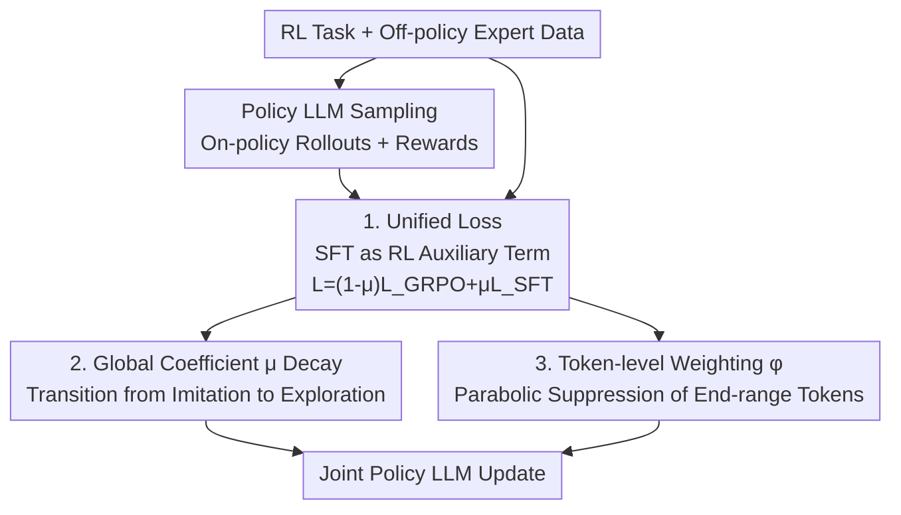

# On-Policy RL Meets Off-Policy Experts: Harmonizing Supervised Fine-Tuning and Reinforcement Learning via Dynamic Weighting

**Conference**: ICLR 2026  
**OpenReview**: [https://openreview.net/forum?id=dCm9bBrk5d](https://openreview.net/forum?id=dCm9bBrk5d)  
**Code**: Available (The paper claims open-source implementation)  
**Area**: Alignment RLHF / LLM Reasoning  
**Keywords**: SFT and RL fusion, on-policy/off-policy, dynamic weighting, GRPO, token-level weighting

## TL;DR
This paper proposes CHORD, which reformulates SFT from an independent training stage into a **dynamically weighted auxiliary objective** within the on-policy RL process. Using a dual-control mechanism—a "global coefficient $\mu$ + token-level weighting function $\phi(\cdot)$"—it smoothly integrates expert data, consistently outperforming baselines like SFT-then-RL on mathematical reasoning and tool-calling tasks.

## Background & Motivation

**Background**: Post-training for Large Language Models primarily follows two paths: SFT, which uses high-quality expert trajectories to imitate response patterns, and RL (e.g., GRPO), which allows models to explore their own on-policy trajectories and generalize from reward feedback. To leverage the strengths of both, the industry standard is the sequential **SFT-then-RL** paradigm: using expert data for SFT first to guide the model past local optima, followed by RL to mitigate the exposure bias and overfitting of SFT.

**Limitations of Prior Work**: The authors empirically challenge the intuition that "SFT followed by RL is always better." Figure 1 shows that SFT-then-RL does not consistently outperform pure RL and can sometimes be worse. Crucially, when applying SFT to Qwen2.5-7B-Instruct using expert data generated by DeepSeek-R1, the MATH-500 accuracy follows a three-stage **"shift-readapt-overfit"** curve: an initial drop in performance (policy shift) due to forced imitation of significantly different expert patterns, followed by a slow recovery (readapt), and finally overfitting on limited expert data, leading to a loss of output diversity and exploration capability.

**Key Challenge**: Expert data can introduce new capabilities but may also **disrupt the model's existing response patterns**. SFT-then-RL relies on the fragile timing of "when to switch from SFT to RL"—switching too early results in insufficient learning, while switching too late leads to overfitting. The optimal timing is also highly task-dependent (e.g., math benefits from SFT-best starting points, whereas tool-calling favors SFT-light). This inherent fragmentation makes the two-stage approach difficult to tune.

**Core Idea**: Treat SFT not as an independent stage, but as a **dynamically weighted auxiliary loss term within on-policy RL**. Use coarse-grained (global) + fine-grained (token-level) controls to precisely manage the impact of expert data—absorbing knowledge without suppressing the model's own exploration.

## Method

### Overall Architecture

CHORD (Controllable Harmonization of On- and Off-Policy RL via Dynamic Weighting) takes RL task data and off-policy expert data as input to jointly optimize a policy model $\pi_\theta$. The core modification is centralizing the loss as a weighted sum of RL and SFT losses: $L = (1-\mu)L_{\text{GRPO}} + \mu L_{\text{SFT}}$. This allows SFT and RL to be updated **simultaneously** rather than in separate stages.

On top of this unified loss, CHORD implements a **dual-control mechanism**: first, a **global coefficient $\mu$** that decays over training to holistically control the overall weight of expert data, transitioning from "imitating off-policy experts" to "on-policy exploration." Second, a **token-level weighting function $\phi(\cdot)$** granularly determines whether each token in an expert trajectory is worth learning, suppressing tokens that might disrupt the existing policy. The workflow is as follows:

### Key Designs

**1. Unified Perspective: Reformulating SFT as a Dynamically Weighted RL Auxiliary Objective**

This step addresses the fragmentation and timing sensitivity of SFT-then-RL. Instead of sequential stages, CHORD defines a hybrid loss:

$$L_{\text{Hybrid}}(\theta) = (1-\mu)L_{\text{GRPO}}(\theta) + \mu L_{\text{SFT}}(\theta),$$

where $L_{\text{GRPO}}$ is the GRPO loss without the KL term, $L_{\text{SFT}}$ is the negative log-likelihood of expert data, and $\mu\in[0,1]$ modulates their weights. This unified perspective treats previous methods as special cases: SFT-then-RL is a binary $\mu$ schedule (1 to 0), and alternating SFT/RL is a periodic $\mu$ schedule. This framework allows for smoother control over expert data influence.

**2. Global Coefficient $\mu$ Decay Schedule: Transitioning from Imitation to Exploration**

The authors demonstrate that a fixed $\mu$ is ineffective—regardless of value, a fixed $\mu$ underperforms compared to pure RL or shows minimal gain, as the model is forced to reconcile two potentially conflicting reasoning patterns. CHORD employs a **decay schedule**: $\mu$ starts high (e.g., 0.9) to encourage learning from experts and decays to a lower value (e.g., 0.05) as training progresses, shifting the focus to on-policy exploration. This anneals the impact of expert data **before** overfitting occurs. This approach bridges the distributional gap between off-policy training and on-policy rollouts. However, $\mu$ alone still leaves some "shift-readapt" issues and lacks the granularity to handle specific response styles.

**3. Token-level Weighting Function $\phi(\cdot)$: Selective Knowledge Acquisition**

To address the coarse granularity of $\mu$, CHORD introduces per-token weights. While Importance Sampling (IS) is a candidate (weighting by $\pi_\theta/\pi_{\text{sample}}$), the authors found it leads to **drastic entropy collapse**—it over-reinforces high-probability tokens while ignoring novel low-probability ones. Consequently, this paper proposes a parabolic weight function:

$$\phi(y^*_t;\pi_\theta) = p_t(1-p_t), \quad p_t=\pi_\theta(y^*_t\mid x,y^*_{<t}),$$

which peaks at $p_t=0.5$ and decays to 0 as $p_t\to 0$ or $1$. This **simultaneously suppresses both extremes**: high-probability tokens (to prevent entropy collapse) and extremely low-probability tokens (to prevent policy disruption) are down-weighted. The final SFT term becomes $L_{\text{SFT-}\phi}=-\mathbb{E}[\sum_t \phi(y^*_t;\pi_\theta)\log\pi_\theta(y^*_t\mid x,y^*_{<t})]$. From an information-theoretic view, $p_t(1-p_t)$ represents the policy's uncertainty regarding token generation, biasing learning toward the "sweet spot" where tokens are novel enough to provide information but not so alien as to destroy existing strategies.

### Loss & Training
The final objective replaces the static $L_{\text{SFT}}$ with $L_{\text{SFT-}\phi}$ in the hybrid loss. The global $\mu$ controls the overall impact, while $\phi(\cdot)$ ensures token-level stability. The paper presents two implementations: **CHORD-$\mu$** (decaying $\mu$ without $\phi$) and **CHORD-$\phi$** (fixed $\mu=0.1$ with $\phi$ for dual-control). GRPO excludes the KL term to avoid performance constraints.

## Key Experimental Results

### Main Results
Evaluations used Qwen2.5-7B-Instruct (Expert: DeepSeek-R1, SFT 5k / RL 20k) for math and LLaMA3.2-3B-Instruct for tool-calling (BFCL).

| Method | AMC | AIME24 | AIME25 | MMLU-Pro | BFCL Overall |
|------|------|--------|--------|----------|--------------|
| Original Model | 43.8 | 11.7 | 6.66 | 24.7 | 46.2 |
| SFT-best | 55.9 | 15.8 | 15.2 | 38.4 | 69.8 |
| GRPO (Pure RL) | 52.1 | 13.2 | 8.54 | 45.8 | 77.1 |
| SFT-best + RL | 58.4 | 17.1 | 16.3 | 51.3 | 76.1 |
| LUFFY | 52.8 | 16.6 | 14.3 | 44.0 | 76.1 |
| SASR | 54.0 | 12.7 | 11.1 | 45.1 | 74.7 |
| **CHORD-$\mu$** | 60.8 | 18.1 | 17.9 | 43.3 | 77.6 |
| **CHORD-$\phi$** | **62.5** | **18.2** | 17.2 | **56.2** | **78.5** |

CHORD-$\mu$ consistently outperforms the strong SFT-best+RL baseline. CHORD-$\phi$ delivers the best performance, particularly on MMLU-Pro, jumping from 51.3 to 56.2, indicating that dual-control better preserves general reasoning capabilities.

### Ablation Study

| Configuration | Phenomenon | Explanation |
|------|------|------|
| Fixed $\mu$ (0.1/0.5) | Significantly worse than dynamic $\mu$ | Conflict between two patterns prevents convergence |
| Fixed $\mu$ (0.02) | Mitigates performance drop but ≈ Pure RL | Small weight alone cannot achieve both absorption and exploration |
| Dynamic $\mu$ Decay | Superior to all fixed $\mu$ | Smooth transition resolves conflicts |
| Off-policy without IS | Entropy spikes | Raw expert data rapidly disrupts existing patterns |
| With IS | Severe entropy collapse | Over-reinforcement of high-prob tokens; loss of variety |
| $\phi=p_t(1-p_t)$ | Stable entropy | Balanced exploration and utilization |

### Key Findings
- **Token-level $\phi$ is critical for general reasoning**: Compared to CHORD-$\mu$, CHORD-$\phi$ gains ~13 points on MMLU-Pro, suggesting coarse $\mu$ sacrifices generalization while fine-grained weighting allows selective absorption.
- **Selective absorption via response length**: Experts provide long mathematical responses (6132 tokens). CHORD-$\mu$ imitates this (6081), but CHORD-$\phi$ converges to a more reasonable 2444. In tool-calling, CHORD-$\phi$ remains concise (120 tokens), adapting to the task rather than blindly imitating.
- **Optimal SFT/RL balance is task-dependent**: Math benefits from SFT-best+RL, while tool-calling favors SFT-light+RL. CHORD covers both with a single mechanism, reducing tuning costs.

## Highlights & Insights
- **"Shift-Readapt-Overfit" Diagnosis**: The paper provides a solid analysis of why SFT-then-RL fails (expert vs. existing pattern discrepancy) before presenting the unified framework.
- **Elegant Parabolic Weight $p_t(1-p_t)$**: This parameter-free function addresses both entropy collapse (from IS) and entropy explosion (from no weighting). It has an information-theoretic basis as the uncertainty of a binary event.
- **Synthesis of Existing Methods**: By viewing SFT-then-RL as a binary $\mu$ schedule, the paper provides an "aha" moment—many different approaches are simply different forms of $\mu$ scheduling within a unified framework.

## Limitations & Future Work
- Experiments focused on math reasoning and single-turn tool-calling with DeepSeek-R1 as the sole expert. Robustness across more tasks and diverse expert quality remains to be verified.
- The $\phi=p_t(1-p_t)$ form is fixed (peaking at $p_t=0.5$), which may not be optimal for all distributions. Reward-aware adaptive $\mu$ (e.g., $\mu=\max(0,\tau-\text{reward\_mean})$) still requires significant tuning.
- Whether a combination of "decaying $\mu$ + $\phi$" would yield even better results remains an open question.

## Related Work & Insights
- **vs. SFT-then-RL**: Sequential stages rely on manual switching; ours uses single-stage dynamic weighting to avoid the fragile timing of transitions.
- **vs. LUFFY**: LUFFY inserts expert demonstrations into GRPO rollout groups and reshapes IS ratios; ours uses $\mu+\phi$ at the loss level without altering rollout composition and prevents entropy collapse.
- **vs. SASR**: SASR alternates SFT/RL based on output similarity; ours utilizes continuous weighting for smoother and more fine-grained control.

## Rating
- Novelty: ⭐⭐⭐⭐⭐ Unified on/off-policy perspective + parabolic token weighting; cohesive approach.
- Experimental Thoroughness: ⭐⭐⭐⭐ Covers math and tool-calling with complete baselines, though task variety and expert sources are somewhat narrow.
- Writing Quality: ⭐⭐⭐⭐⭐ Clear chain of reasoning from diagnosis to method with strong empirical support.
- Value: ⭐⭐⭐⭐⭐ Provides a plug-and-play, interpretable unified framework for SFT+RL fusion.

<!-- RELATED:START -->

## Related Papers

- [\[ICLR 2026\] Proximal Supervised Fine-Tuning](proximal_supervised_fine-tuning.md)
- [\[ICLR 2026\] SRFT: A Single-Stage Method with Supervised and Reinforcement Fine-Tuning for Reasoning](srft_a_single-stage_method_with_supervised_and_reinforcement_fine-tuning_for_rea.md)
- [\[ICLR 2026\] BAPO: Stabilizing Off-Policy Reinforcement Learning for LLMs via Balanced Policy Optimization with Adaptive Clipping](bapo_stabilizing_off-policy_reinforcement_learning_for_llms_via_balanced_policy_.md)
- [\[ICLR 2026\] Revisiting Group Relative Policy Optimization: Insights into On-Policy and Off-Policy Training](revisiting_group_relative_policy_optimization_insights_into_on-policy_and_off-po.md)
- [\[ICLR 2026\] Off-Policy Safe Reinforcement Learning with Constrained Optimistic Exploration](off-policy_safe_reinforcement_learning_with_cost-constrained_optimistic_explorat.md)

<!-- RELATED:END -->
