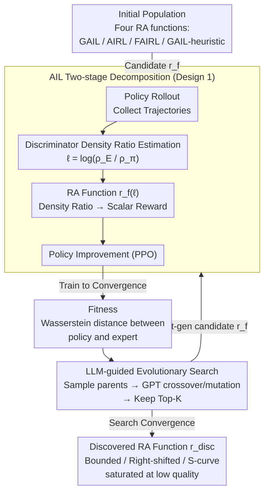

# On Discovering Algorithms for Adversarial Imitation Learning

**Conference**: ICLR 2026  
**arXiv**: [2510.00922](https://arxiv.org/abs/2510.00922)  
**Code**: None  
**Area**: Imitation Learning / Meta-Learning  
**Keywords**: Adversarial Imitation Learning, Reward Assignment Functions, LLM-guided Evolution, Meta-learning, Training Stability

## TL;DR

Proposes DAIL—the first meta-learning algorithm for Adversarial Imitation Learning (AIL). It decomposes AIL into two stages: density ratio estimation and reward assignment (RA). Using LLM-guided evolutionary search, it automatically discovers the optimal RA function $r_{\text{disc}}$, which generalizes across unseen environments and policy optimizers while outperforming all human-designed baselines.

## Background & Motivation

**Background**: Adversarial Imitation Learning (AIL) is the most effective imitation learning paradigm under limited expert demonstrations. Inspired by GANs, AIL formalizes the learning process as an adversarial game between a discriminator (distinguishing between expert and policy trajectories) and a policy (generating trajectories close to those of the expert). From a divergence minimization perspective, AIL naturally decomposes into two stages: (1) **Density Ratio Estimation** (DR)—the discriminator estimates the occupancy ratio of state-action pairs between the expert and the policy $\frac{\rho_E}{\rho_\pi}$; (2) **Reward Assignment** (RA)—mapping the density ratio to a scalar reward signal for policy optimization.

**Limitations of Prior Work**:
- AIL training is unstable, sharing the difficulties of GAN training—the quality of the gradient signal directly affects the efficacy of policy improvement.
- Extensive research has focused on improving stage (1), discriminator training (e.g., C-GAIL, Diffusion-Reward), while the RA function (stage 2) has been largely neglected.
- Existing RA functions (GAIL's softplus, AIRL's log-ratio, FAIRL's exponential decay) are all manually derived from $f$-divergence theory, relying on human intuition and potentially being suboptimal.

**Key Challenge**: A fundamental conflict exists between the theoretical elegance and practical training stability of human-designed RA functions—GAIL over-rewards low-quality state-action pairs, FAIRL's exponential decay leads to instability, and AIRL's negative rewards induce early termination.

**Goal**: To move beyond the manual design paradigm by using LLM-guided evolutionary search to directly discover the optimal RA function driven by performance, achieving meta-learning for AIL algorithms.

## Method

### Overall Architecture

DAIL treats "designing an AIL algorithm" as a searchable optimization problem. The outer loop uses LLM-guided evolutionary search to optimize the reward assignment (RA) function $r_f$, while the inner loop executes a standard AIL cycle (policy rollout $\to$ discriminator training for density ratio estimation $\to$ reward assignment with $r_f \to$ policy improvement) for a given $r_f$. The quality of $r_f$ is measured by the Wasserstein distance between the trained policy and the expert. The overall process can be formulated as a bilevel optimization: $\min_f \mathcal{W}(\rho_E, \rho_{\pi^*}; f)$, subject to $\pi^* = \arg\max_\pi r_f(\rho_E \| \rho_\pi)$.

### Key Designs

**1. AIL Two-stage Decomposition: Isolating the Neglected Reward Assignment**

The first step of DAIL is to decouple the reward signal generation in AIL into two independent stages—Density Ratio Estimation (DR) and Reward Assignment (RA). This exposes the RA function, which was previously conflated with the discriminator and overlooked, as an object for individual optimization. The discriminator first estimates the log density ratio $\ell = \log \frac{\rho_E(s,a)}{\rho_\pi(s,a)}$, and the RA function $r_f(\ell)$ maps this ratio into a scalar reward for the policy. Different manual RA functions are essentially derivations of various $f$-divergences, but their response curves to the density ratio vary significantly, directly determining the informativeness of the gradient and training stability.

| Divergence Type | Algorithm | RA Function $r_f(\ell)$ | Characteristics |
|---------|------|---------------------|------|
| Forward KL | FAIRL | $-\ell \cdot e^{\ell}$ | Exponential unbounded decay, unstable training |
| Backward KL | AIRL | $\ell$ | Linear, high negative rewards induce early termination |
| Jensen-Shannon | GAIL | $\text{softplus}(\ell)$ | Over-rewards low-quality samples |
| Unnamed $f$-div | GAIL-heuristic | $-\text{softplus}(-\ell)$ | Primarily negative rewards, only encourages matching |

**2. LLM-guided Evolutionary Search: Bypassing Infeasible Bilevel Backpropagation**

Bilevel optimization theoretically requires backpropagation through the entire AIL training loop, which is computationally infeasible. Consequently, DAIL employs black-box evolutionary search to discover the RA function. It initializes the population with four RA functions: GAIL, AIRL, FAIRL, and GAIL-heuristic. Each candidate $r_f$ is used to train a policy to convergence, using the Wasserstein distance to the expert as the fitness metric. Mutation and crossover are performed by an LLM: a pair of parents $\{r_{f_1}, r_{f_2}\}$ and their fitness values are fed into GPT-4.1-mini, which is prompted to fuse their strengths into an offspring $r_{f_3}$. Each generation evaluates $M \times N$ candidates and retains the Top-$K$. Using Python code to represent RA functions ensures both interpretability and expressivity.

**3. Discovered RA Function $r_{\text{disc}}$: A Bounded, Right-shifted, Low-quality Saturated S-curve**

The evolutionary search converges to an optimal RA function: $r_{\text{disc}}(x) = 0.5 \cdot \text{sigmoid}(x) \cdot [\tanh(x) + 1]$. Its properties address the flaws of previous baselines. It restricts rewards to the bounded interval $[0,1]$, which is known to stabilize deep RL. It follows an S-curve but features a steeper gradient than a standard sigmoid and is shifted to the right, providing informative gradients in the critical $x \in [-1,0]$ range. Crucially, it saturates to zero for $x \lesssim -1.8$ (representing near-random behavior), effectively filtering noisy rewards from low-quality samples, whereas GAIL continues to provide high positive rewards at $x=-2$.

## Key Experimental Results

### Main Results: Cross-Environment Generalization

Evaluations were conducted on Brax (MuJoCo) and Minatar benchmarks outside the search environment. All methods shared hyper-parameters, varying only the RA function:

| Method | Brax Mean ↑ | Brax Median ↑ | Minatar Mean ↑ | Minatar Median ↑ |
|------|------------|--------------|----------------|-----------------|
| GAIL | ~0.65 | ~0.70 | ~0.55 | ~0.60 |
| AIRL | ~0.70 | ~0.75 | ~0.30 | ~0.25 |
| FAIRL | ~0.40 | ~0.35 | ~0.35 | ~0.30 |
| GAIL-heuristic | ~0.55 | ~0.60 | ~0.25 | ~0.20 |
| **Ours (DAIL)** | **~0.75** | **~0.72** | **~0.85** | **~0.90** |

**Key Findings**:
- DAIL significantly outperforms all baselines on Minatar.
- On Brax, DAIL achieves the best results across most metrics, with the Mean being statistically superior to all baselines.
- AIRL and GAIL-heuristic perform poorly on Minatar due to negative rewards encouraging early termination.

### Ablation Study

| Dimension | Key Insight | Metric |
|---------|------|---------|
| Search Generalization | Search on SpaceInvaders $\to$ Generalize to others | 20% lower $\mathcal{W}$ distance, 12.5% higher return |
| Optimizer Generalization | Search with PPO $\to$ Evaluate on A2C | DAIL significantly outperforms GAIL on A2C |
| Regularization Robustness | 5 strategies (none/w-decay/entropy/spectral/grad-pen) | DAIL outperforms GAIL in 3/5 settings |
| Policy Entropy | DAIL policy converges to lower entropy | Matches entropy levels of ground-truth reward PPO |
| Component Ablation | $r_{\text{disc}}$ vs sigmoid vs $0.5[\tanh+1]$ | $r_{\text{disc}}$ > $0.5[\tanh+1]$ > sigmoid |

Policy entropy analysis reveals that DAIL's stability stems from $r_{\text{disc}}$ saturating to zero for $x \lesssim -1.8$, filtering out noisy rewards from random actions. GAIL's high positive rewards for low-quality behavior result in a noisier reward signal.

### Main Results: Performance Under Different Regularizations

| Algorithm | Environment | None | W-Decay | Entropy | Spectral | Grad-Pen |
|------|------|------|---------|---------|----------|----------|
| DAIL | Asterix | 0.88±0.03 | 1.33±0.03 | 0.12±0.01 | 0.92±0.03 | 0.66±0.03 |
| DAIL | Breakout | 0.81±0.07 | 0.74±0.08 | 0.91±0.02 | 0.77±0.07 | 1.01±0.00 |
| DAIL | SpaceInv | 0.71±0.07 | 0.81±0.01 | 0.80±0.01 | 0.70±0.09 | 0.90±0.00 |
| DAIL | **Overall** | **0.80±0.03** | **0.96±0.03** | 0.61±0.01 | **0.80±0.04** | **0.85±0.01** |
| GAIL | Asterix | 1.18±0.03 | 1.44±0.03 | 0.48±0.03 | 0.22±0.03 | 0.52±0.04 |
| GAIL | Breakout | 0.76±0.07 | 0.52±0.10 | 0.89±0.01 | 0.33±0.10 | 0.85±0.07 |
| GAIL | SpaceInv | 0.61±0.09 | 0.34±0.09 | 0.81±0.00 | 0.42±0.08 | 0.81±0.03 |
| GAIL | **Overall** | 0.85±0.04 | 0.76±0.04 | **0.73±0.01** | 0.32±0.05 | 0.73±0.03 |

## Highlights & Insights

### Highlights
- **Precise Problem Identification**: Systematically reveals the critical impact of RA functions on AIL training stability, addressing a gap in the field.
- **Methodological Innovation**: Introduces meta-learning for RA function discovery in AIL, shifting the paradigm from manual design to data-driven discovery.
- **In-depth Analysis**: Clearly explains the advantages of DAIL through density ratio distributions, policy entropy, and component ablations.
- **Strong Generalization**: Demonstrates consistent performance across environments, optimizers, and regularization strategies.

### Limitations & Future Work
- The discovered $r_{\text{disc}}$ does not correspond to a valid $f$-divergence, lacking theoretical convergence guarantees.
- The RA function remains static during training and does not adapt to training states (e.g., remaining steps, observed density ratio distributions).
- Search was conducted on a single environment (SpaceInvaders); searching on a larger set of environments might yield more robust functions.
- Performance remains to be validated on more complex benchmarks (Atari-57/Procgen).

## Rating
⭐⭐⭐⭐ — Precise problem identification, novel methodology, and deep analysis, though it lacks theoretical guarantees and search scale is limited.

<!-- RELATED:START -->

## Related Papers

- [\[ICLR 2026\] Latent Wasserstein Adversarial Imitation Learning](latent_wasserstein_adversarial_imitation_learning.md)
- [\[ICLR 2026\] Model Predictive Adversarial Imitation Learning for Planning from Observation](model_predictive_adversarial_imitation_learning_for_planning_from_observation.md)
- [\[ICLR 2026\] Near-Optimal Second-Order Guarantees for Model-Based Adversarial Imitation Learning](near-optimal_second-order_guarantees_for_model-based_adversarial_imitation_learn.md)
- [\[ICLR 2026\] Minimax Optimal Adversarial Reinforcement Learning](minimax_optimal_adversarial_reinforcement_learning.md)
- [\[ICLR 2026\] Learning to Generate Unit Test via Adversarial Reinforcement Learning](learning_to_generate_unit_test_via_adversarial_reinforcement_learning.md)

<!-- RELATED:END -->
