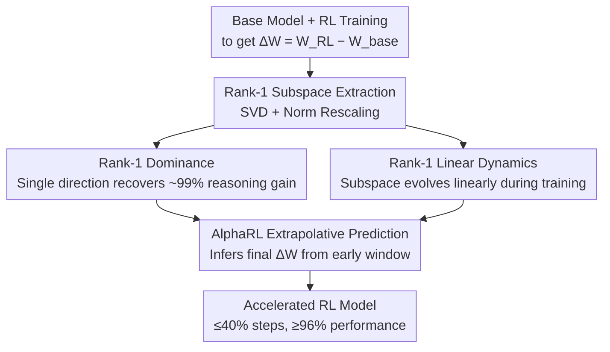

# On Predictability of Reinforcement Learning Dynamics for Large Language Models

**Conference**: ICLR 2026  
**OpenReview**: [https://openreview.net/forum?id=SdHmA6BYVJ](https://openreview.net/forum?id=SdHmA6BYVJ)  
**Code**: https://github.com/caiyuchenustc/Alpha-RL  
**Area**: LLM Reasoning / Reinforcement Learning / Interpretability  
**Keywords**: RL Training Dynamics, Parameter Updates, Low-rank Structure, SVD, Training Acceleration

## TL;DR
This paper discovers that the parameter update matrix $\Delta W$ of LLMs during RL training is almost entirely dominated by its Rank-1 subspace (a single direction can recover over 99% of reasoning gains). Furthermore, this subspace evolves approximately linearly during training and can be extrapolated from early checkpoints. Based on these findings, the authors propose AlphaRL, a parameter-free acceleration framework that extrapolates final updates using the first 40% of training steps, achieving up to 2.5× acceleration while preserving $>96\%$ of reasoning performance.

## Background & Motivation

**Background**: The significant improvement in the reasoning capabilities of current LLMs primarily relies on RL (e.g., RLVR, GRPO, DAPO). Extensive interpretability research exists for RL-trained models, such as neuron attribution, circuit analysis, and sparse autoencoders.

**Limitations of Prior Work**: Most existing studies provide **post-hoc explanations**, focusing solely on the training endpoint (the state of the final model). There is a lack of characterization regarding the **RL training process itself**—how parameters evolve through step-by-step updates. It remains unknown whether RL-guided parameter updates follow consistent patterns or how these patterns give rise to reasoning capabilities.

**Key Challenge**: RL training is a complex, multi-step, and noisy optimization process. Intuitively, parameters might move erratically through a high-dimensional space, appearing as an unpredictable black box. However, if this process is governed by a low-dimensional, simple core mechanism, the assumption of "procedural agnosticism" would be invalid. The problem is that no one has systematically quantified the extent to which RL updates are "concentrated."

**Goal**: To answer two fundamental questions: (1) Are RL-guided parameter updates governed by consistent principles? (2) How do these principles translate into reasoning performance? Ultimately, the goal is to clarify the predictability of the process and convert these insights into functional engineering tools.

**Key Insight**: The authors directly analyze the parameter update matrix $\Delta W$ (the difference between the RL model and the base model parameters). By performing Singular Value Decomposition (SVD), they examine the energy distribution of the singular spectrum. This approach is promising because any "low-rank concentration" would be immediately evident in the spectrum.

**Core Idea**: In short: **The reasoning gains from RL are almost entirely compressed into the Rank-1 direction of $\Delta W$. Since this direction grows linearly during training, final updates can be extrapolated from early checkpoints, allowing for the skipping of full training**.

## Method

### Overall Architecture

Rather than proposing a new network architecture, this paper **first identifies a mechanism and then builds an accelerator based on it**. The research revolves around the parameter update matrix $\Delta W = W_{\text{RL}} - W_{\text{base}}$. SVD is performed on $\Delta W$ for each module to extract the Rank-1 subspace corresponding to the largest singular value. The authors first prove that this subspace accounts for nearly all reasoning gains (Property 1: Rank-1 Dominance) and then prove that it evolves approximately linearly during training (Property 2: Rank-1 Linear Dynamics). The combination of these two properties implies that final updates can be extrapolated from an early training window—this is the AlphaRL acceleration framework.

### Key Designs

**1. Rank-1 Subspace Extraction and Norm Rescaling: Quantifying Effective Updates**

To study update concentration, the authors perform SVD on the $\Delta W$ of each module: $\Delta W = \sum_{i=1}^{r}\sigma_i \boldsymbol{u}_i \boldsymbol{v}_i^\top$. By keeping only the term with the largest singular value, they obtain the Rank-1 update $\Delta W^{(1)} = \sigma_1 \boldsymbol{u}_1 \boldsymbol{v}_1^\top$. Adding this directly back to the base model would result in under-updating due to its small norm. Therefore, a norm rescaling is applied: $\Delta\hat{W}^{(1)} = \alpha\,\Delta W^{(1)}$, where $\alpha = \|\Delta W\|_2 / \|\Delta W^{(1)}\|_2$, ensuring the "intensity" of the Rank-1 update matches the full update. The evaluation model = Base + $\Delta\hat{W}^{(1)}$, which cleanly measures the capacity recovered by a single direction. This is also extended to Rank-$k\%$ subspaces to observe synergy.

**2. Rank-1 Dominance: A Single Direction Determines Reasoning Gains**

This is Property 1. Experimentally, adding the rescaled Rank-1 update back to the base model across 8 models and 5 RL algorithms (PPO/RLOO/GRPO/Dr.GRPO/DAPO) recovers **99.17%** of reasoning capability on average. For RLOO, GRPO, and DAPO, it even exceeds the fully trained model. In contrast, SFT and distillation (DIST) strongly depend on the subspace rank and require many more directions to show gains. Crucially, this property holds at any **intermediate step** of training. While the Rank-1 direction is slightly weaker in early stages (as gradients are noisy), it eventually matches the full model. The authors explain that RL updates are 1–2 orders of magnitude smaller than SFT/DIST and involve minimal global shift in token embeddings. Reasoning improvements come from high-level information flow adjustments rather than low-level representation changes—a phenomenon specific to the "approximate low-rank" structure of RL.

**3. Rank-1 Linear Dynamics: Predictable Leading Directions**

This is Property 2, bridging "interpretability" and "extrapolability." The authors collect the $\boldsymbol{u}_1$ trajectories $U_1 = \{\boldsymbol{u}_1^{(t)}\}_{t=1}^{T}$ across $T$ checkpoints for each module. PCA and t-SNE visualizations show smooth, nearly linear paths. Using Partial Least Squares (PLS) regression, they fit the Rank-1 trajectories (independent variable) against the reasoning accuracy of the checkpoints (dependent variable). The average $R^2$ is 0.914, with some modules near 1. Linearity correlates with module function: mid-to-high level MLPs have higher $R^2$ (closer to reward signals, retaining stable reasoning directions), while self-attention modules are generally lower (noisier and redundant signals). Injecting updates via a sliding window sorted by $R^2$ shows that performance drops monotonically as the minimum $R^2$ in the window decreases, confirming $R^2$ as a reliable measure of module contribution.

**4. AlphaRL Extrapolative Prediction: Parameter-free Acceleration**

Based on the dominance and linearity properties, acceleration is achieved by using **scaled Rank-1 vectors**. Each vector $\boldsymbol{u}_1^{(t)}$ is multiplied by $\alpha^{(t)}\sigma_1^{(t)}$ to represent a column of the update matrix. These scaled vectors are fitted against relative accuracy using single-component PLS. Given a target relative accuracy $y^*$ (set to $y^*=1$ on MATH-500), the corresponding update vector is solved via **inversion** and combined with the right singular vector $\boldsymbol{v}_1$. This process requires only a small early training window to calculate the initial Rank-1 subspace and its growth rate, requiring no full training schedule, additional modules, or hyperparameters. It is orthogonal to and stackable with existing acceleration methods.

### Example: Extrapolating to Full Performance from 40% Steps

Using DAPO on Qwen3-8B-Base, the fully trained model achieves an average of 53.38% across six reasoning benchmarks. At 40% training steps, it only reaches 46.30%. Applying AlphaRL to these 40% checkpoints (fitting and extrapolating based on the Rank-1 vectors and accuracy) boosts the performance to **53.31%**, nearly matching the full training result. On GPQA, it even achieves 102% of the full model's relative accuracy. Essentially, 100% of the effect is obtained in 40% of the time, a 2.5× acceleration.

## Key Experimental Results

### Main Results

Properties were verified across 8–13 models (7B–32B, including Qwen3 / Llama3 / GLM4) and 5–10 algorithms. AlphaRL was validated on Qwen3-8B-Base (RLOO/GRPO/DAPO, 6 benchmarks, 32 samples, $T=0.6$).

| Setting (Qwen3-8B-Base) | Avg Accuracy | Rel. to Full | Description |
|-------------------------|--------------|--------------|-------------|
| DAPO Full Training      | 53.38        | 100%         | Full schedule |
| DAPO 40% Steps          | 46.30        | 86.7%        | Baseline without acceleration |
| DAPO 40% + AlphaRL      | 53.31        | ~99.9%       | Matches full performance, ~2.5× speedup |
| GRPO 40% + AlphaRL      | 49.42        | 95.9%        | MATH-500 exceeds full model |
| RLOO 40% + AlphaRL      | 48.52        | 95.5%        | Preserves >96% reasoning performance |

Property quantification: Rank-1 recovers **99.17%** of reasoning capability on average; evolution linearity average $R^2 = 0.914$; early-to-late prediction error average **<5%**.

### Ablation Study

| Analysis | Key Findings | Description |
|----------|--------------|-------------|
| Single Subspace Contribution | Rank-1 is significantly stronger than others, decreasing with singular values | Confirms dominance |
| Scaling factor $\alpha$ | Peaks at $\lambda \approx 0.7$ and then saturates | Magnitude determines the core effect |
| RL vs SFT/DIST Norms | SFT/DIST norms are 1–2 orders of magnitude larger; RL has higher Rank-1% ratio | RL updates are more concentrated |
| Embedding Drift | SFT/DIST show large global drifts; RL barely moves | RL modifies high-level flow, not representations |
| $R^2$ Sliding Window | Performance drops monotonically with lower $R^2$ | $R^2$ quantifies module contribution |

### Key Findings
- **Rank-1 dominance is unique to RL**: SFT and distillation on the same models do not exhibit these properties, suggesting low-rank concentration is a unique "fingerprint" of the RL process rather than a general property of post-training.
- **Amplitude is more critical than direction**: Scaling experiments show the core effect of Rank-1 is determined by the update magnitude; once the direction is established early, further gains diminish—meaning the direction is identified very early.
- **Linearity indicates functional importance**: Modules with high $R^2$ and smooth trajectories (mostly mid-to-high level MLPs) are where RL allocates effective capacity. Low $R^2$ modules are primarily driven by noise.

## Highlights & Insights
- **Predictability of the Black Box**: While RL optimization is often viewed as unpredictable, this paper uses SVD and PLS to reveal a "single direction + linear evolution" mechanism, challenging the black-box view of RL.
- **Converting Interpretability to Tools**: The two properties are not just theoretical; they lead directly to AlphaRL—a plugin that is parameter-free, requires no extra modules, and is orthogonal to other acceleration methods.
- **The Importance of Norm Rescaling**: Simply truncating to Rank-1 causes under-updating. The rescaling trick $\alpha$ is essential for revealing that a single direction is sufficient, a design that can be applied to other "update importance" analyses.
- **Transferability**: The trajectory prediction framework could theoretically monitor training dynamics or act as a reward signal for optimization, potentially applicable to large-scale agents or multimodal scenarios.

## Limitations & Future Work
- **Lack of Formal Theory**: Conclusions are based on large-scale empirical observations. The authors acknowledge the "laws" lack rigorous theoretical backing and intend to combine neuron attribution with causal tracing in the future.
- **Reliance on Stability**: AlphaRL's extrapolation depends on the stability of the RL algorithm. In modules with low $R^2$ (noise), linear extrapolation may fail, necessitating non-linear prediction models.
- **Self-evaluation Risks**: Target accuracy is fitted using a single dataset (MATH-500, $y^*=1$). The robustness of extrapolating to benchmarks with varying difficulties requires further verification.
- **Improvement Ideas**: Combining the Rank-1 law with high-rank corrections for flexible low-rank control or using Rank-1 dynamics as a training monitoring signal.

## Related Work & Insights
- **vs. Post-hoc Interpretability**: Unlike studies explaining static endpoints, this work characterizes the parameter dynamics of the **training process** and builds a predictive tool.
- **vs. SFT / Distillation**: SFT and DIST have larger norms, global embedding drifts, and rely on high-rank subspaces. The authors argue that low-rank concentration is unique to RL and may explain why RL avoids catastrophic forgetting.
- **vs. LoRA**: While LoRA constrains the subspace dimension *a priori*, this paper shows that even in **full-parameter** RL, the updates are captured by very few directions *a posteriori*.
- **vs. Existing RL Algorithms**: AlphaRL is orthogonal to goal/sampling optimizations (like GRPO or DAPO) and can serve as a multiplicative acceleration plugin.

## Rating
- Novelty: ⭐⭐⭐⭐⭐ First to systematically reveal Rank-1 dominance and linear evolution in RL, successfully creating an acceleration tool.
- Experimental Thoroughness: ⭐⭐⭐⭐ Extensive verification across models and algorithms, though main results are focused on Qwen3-8B.
- Writing Quality: ⭐⭐⭐⭐ Logical progression from discovery to method; clear diagrams.
- Value: ⭐⭐⭐⭐⭐ Practical 2.5× acceleration with deep insights into RL mechanisms.

<!-- RELATED:START -->

## Related Papers

- [\[ICLR 2026\] Revolutionizing Reinforcement Learning Framework for Diffusion Large Language Models](revolutionizing_reinforcement_learning_framework_for_diffusion_large_language_mo.md)
- [\[ICLR 2026\] Using Reinforcement Learning to Train Large Language Models to Explain Human Decisions](using_reinforcement_learning_to_train_large_language_models_to_explain_human_dec.md)
- [\[ICLR 2026\] TROLL: Trust Regions improve Reinforcement Learning for Large Language Models](troll_trust_regions_improve_reinforcement_learning_for_large_language_models.md)
- [\[ICLR 2026\] VerifyBench: Benchmarking Reference-based Reward Systems for Large Language Models](verifybench_benchmarking_reference-based_reward_systems_for_large_language_model.md)
- [\[ICLR 2026\] AWM: Accurate Weight-Matrix Fingerprint for Large Language Models](awm_accurate_weight-matrix_fingerprint_for_large_language_models.md)

<!-- RELATED:END -->
