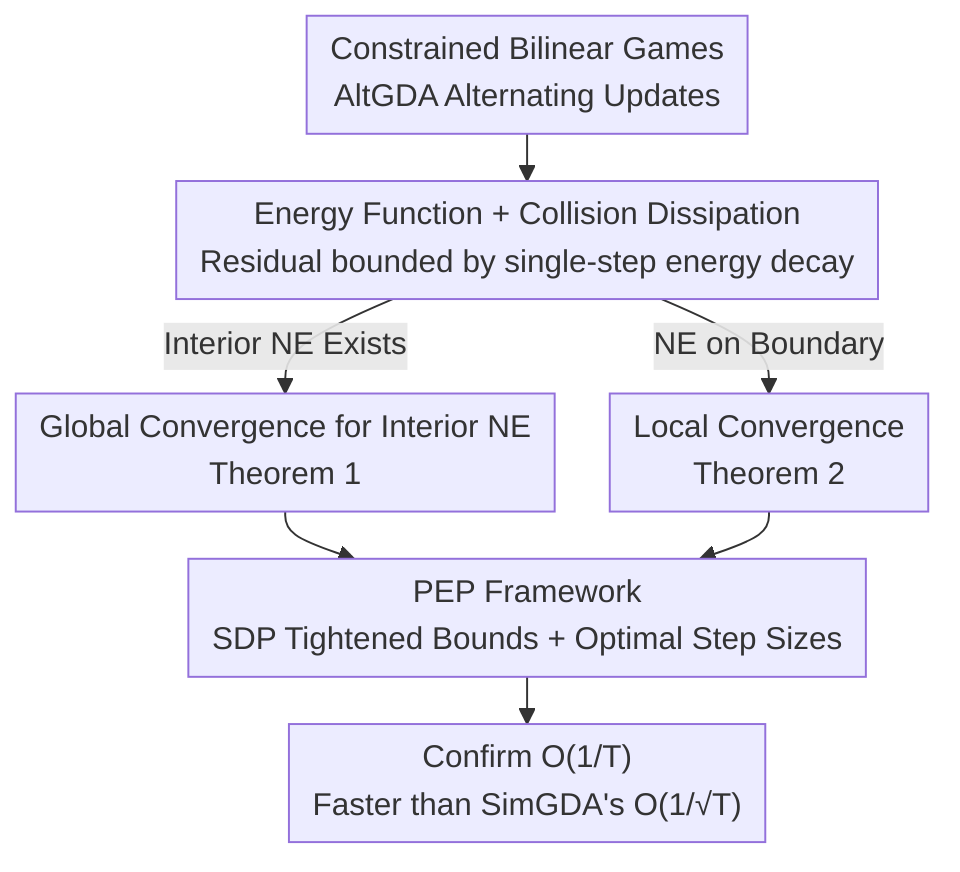

# On the $O(1/T)$ Convergence of Alternating Gradient Descent-Ascent in Bilinear Games

**Conference**: ICLR 2026  
**arXiv**: [2510.03855](https://arxiv.org/abs/2510.03855)  
**Code**: None  
**Area**: Reinforcement Learning / Game Theory / Optimization  
**Keywords**: Alternating Gradient Descent-Ascent, Bilinear Games, Nash Equilibrium, Convergence Rate, Performance Estimation Programming

## TL;DR
This paper provides the first proof that Alternating Gradient Descent-Ascent (AltGDA) converges to the Nash Equilibrium (NE) at an $O(1/T)$ rate in constrained bilinear zero-sum games (when an interior NE exists). This is faster than the $O(1/\sqrt{T})$ rate of Simultaneous GDA. The study characterizes the "friction" effect during boundary collisions using energy function decay and further optimizes step sizes via Performance Estimation Programming (PEP).

## Background & Motivation

**Background**: No-regret learning is a primary method for computing game equilibria, utilized in superhuman poker AI, Stratego, and Diplomacy. Theoretically, optimistic methods (e.g., OGDA) can achieve $O(1/T)$, but in practice, CFR+ and alternating strategies are more frequently used. Alternation (where players take turns updating) serves as a numerical trick that significantly improves practical performance.

**Limitations of Prior Work**: While alternation performs much better than simultaneous updates in practice, theoretical understanding is extremely limited. Although AltGDA has been proven to achieve $O(1/T)$ in unconstrained settings, the **constrained case (corresponding to the standard definition of Nash Equilibrium) has lacked theoretical support**—this remained a long-standing open problem.

**Key Challenge**: Simultaneous GDA only achieves $O(1/\sqrt{T})$ in constrained bilinear games. Optimistic methods reach $O(1/T)$ but require additional structure. Empirical evidence suggests AltGDA follows $O(1/T)$ behavior, but no proof existed.

**Goal**: To prove the $O(1/T)$ convergence rate of AltGDA in constrained settings.

**Key Insight**: The trajectory of AltGDA exhibits two-phase behavior: it first "bounces" off the simplex boundaries and then cycles internally. Collisions cause energy function decay, and this decay amount exactly bounds the additivity of the regret residual terms.

**Core Idea**: The "energy dissipation" generated when AltGDA trajectories collide with constraint boundaries makes the residual terms summable, thereby extending the unconstrained $O(1/T)$ result to the constrained setting.

## Method

### Overall Architecture
The paper addresses a purely theoretical question: How fast does Alternating Gradient Descent-Ascent (AltGDA) converge in **constrained** bilinear zero-sum games $\min_{\mathbf{x}\in\mathcal{X}}\max_{\mathbf{y}\in\mathcal{Y}}\ \mathbf{y}^\top A\mathbf{x}$. The algorithm is simple: update $\mathbf{x}^{t+1} = \Pi_\mathcal{X}(\mathbf{x}^t - \eta A^\top \mathbf{y}^t)$, then use the **new value** of $\mathbf{x}$ to update $\mathbf{y}^{t+1} = \Pi_\mathcal{Y}(\mathbf{y}^t + \eta A \mathbf{x}^{t+1})$, where both players take turns and project back onto the simplex. Convergence is measured by the Duality Gap of the ergodic average strategies $(\bar{\mathbf{x}}^T, \bar{\mathbf{y}}^T)$. The proof follows this logic: construct an energy function to quantify "energy loss during boundary collisions," convert this loss into a bound for regret residuals under "interior NE" and "boundary NE" cases, and finally use PEP to tighten these bounds numerically and derive optimal step sizes.

### Key Designs

**1. Energy Function and "Collision Dissipation" Mechanism: Converting boundary projection loss into additive residual bounds**

In unconstrained scenarios, $O(1/T)$ for AltGDA is already established. The difficulty lies in the projection—once strategies are constrained to the simplex, residual terms in standard analysis are no longer zero. The breakthrough is constructing an energy function:

$$\mathcal{E}(\mathbf{x}^t, \mathbf{y}^t) = \|\mathbf{x}^t - \mathbf{x}^*\|^2 + \|\mathbf{y}^t - \mathbf{y}^*\|^2 - \eta(\mathbf{y}^t)^\top A \mathbf{x}^t$$

and monitoring the regret residual $r_t$ at each step. In the unconstrained case, $r_t \equiv 0$; in the constrained case, the first-order optimality condition of projection only ensures $r_t \geq 0$. The paper proves $r_t \leq \mathcal{E}^t - \mathcal{E}^{t+1}$, meaning the residual is bounded by the single-step decay of energy. Intuitively, once the trajectory hits the simplex boundary, the projection "bounces" it back, dissipating energy. Since energy decreases monotonically, $\sum_t r_t$ is bounded by the difference between initial and final energy, ensuring the Duality Gap of the ergodic average decays at $O(1/T)$.

**2. Global $O(1/T)$ Convergence for Interior NE (Theorem 1): Global acceleration when the equilibrium is interior**

The first theorem handles cases where a **strict interior** Nash Equilibrium exists (all components of the optimal strategy are strictly greater than 0). If the step size satisfies:

$$\eta \leq \frac{1}{\|A\|_2} \min\{\min_i x_i^*, \min_j y_j^*\},$$

the energy dissipation argument applies globally, yielding:

$$\text{DualityGap}(\bar{\mathbf{x}}^T, \bar{\mathbf{y}}^T) \leq \frac{9 + 4\eta\|A\|_2}{\eta T}.$$

This is the **first result to rigorously prove that alternating updates are faster than simultaneous updates in constrained minimax settings**. Simultaneous GDA only achieves $O(1/\sqrt{T})$, whereas alternation reaches $O(1/T)$ via the collision dissipation mechanism. The trade-off is that the step size upper bound depends on the minimum support probability of the equilibrium.

**3. Local $O(1/T)$ Convergence (Theorem 2): Convergence when NE is on the boundary without dependence on game parameters**

Since most matrix game equilibria are not interior, Theorem 1's step size condition may fail. Theorem 2 provides a local conclusion by defining an NE neighborhood $S_0$. Within this region, the trajectory stops hitting non-supporting boundary faces. Although energy may rise locally, the cumulative increase is bounded within $\delta^2/128$, maintaining the dissipation argument. The resulting bound is:

$$\frac{9 + 7\eta\|A\|_2 + \delta^2/128}{\eta T},$$

which remains $O(1/T)$. The step size requirement $\eta \leq \frac{1}{2\|A\|_2}$ is **independent of game parameters**, making it more practical than Theorem 1, though it only guarantees convergence starting from within the neighborhood.

**4. Performance Estimation Programming (PEP) Framework: Using SDP to tighten numerical bounds and derive optimal step sizes**

Analytical proofs provide upper bounds that may not be tight. The paper uses PEP to empirically estimate the true rate. The "worst-case performance over $T$ steps" is modeled as a Semidefinite Program (SDP). By solving for the worst-case Duality Gap and performing a grid search over step sizes, the results show that the optimal step size exhibits a periodic, slow-decay pattern ($\approx O(1/(\log T)^\alpha)$), and the Duality Gap confirms an $O(1/T)$ trend. Meanwhile, SimGDA remains at $O(1/\sqrt{T})$ even with optimized step sizes.

### Loss & Training
This is an optimization algorithm with no training loss. The step size $\eta$ is the core hyperparameter, and its upper bound distinguishes the two theorems.

## Key Experimental Results

### Main Results (10×20 Random Matrix Games, 6 Distributions)

| Algorithm | Convergence Behavior | Step Size | $T=10^6$ |
| :--- | :--- | :--- | :--- |
| AltGDA | $O(1/T)$ | Constant $\eta=0.01$ | Gap → 0 |
| SimGDA | Non-convergent (constant step) | Constant $\eta=0.01$ | Gap Oscillation |

### PEP Numerical Results ($T=5$ to $T=50$)

| Algorithm | Convergence Rate (Optimized Step) |
| :--- | :--- |
| AltGDA | **$O(1/T)$** |
| SimGDA | $O(1/\sqrt{T})$ |

### Key Findings
- AltGDA **consistently** exhibits $O(1/T)$ convergence across 6 distributions (uniform, integer, binary, normal, lognormal, exponential) and 3 scales.
- The initial "slow convergence" phase corresponds to energy dissipation, followed by rapid $O(1/T)$ convergence.
- SimGDA fails to converge with a constant step size; it requires a $T$-dependent decaying step size to achieve $O(1/\sqrt{T})$.
- Empirical convergence rates scale linearly with $1/\eta$, consistent with Theorems 1 and 2.

## Highlights & Insights
- **The "Collision Dissipation" intuition is elegant**: Comparing projection algorithm properties to energy loss during particle-boundary collisions provides clear intuition and inspired the proof technique.
- **Constant Step Size + Alternation = Implicit Optimism**: The alternating structure provides an implicit "optimistic" effect, where the y-update "sees" the latest x-value, similar to extrapolation. This explains the practical efficiency of alternation.
- **Methodological Contribution of the PEP Framework**: This is the first application of PEP for step-size optimization in primal-dual algorithms containing linear operators.

## Limitations & Future Work
- Theorem 1 requires an interior NE, which most matrix games lack.
- Theorem 2's local result requires the initial point to be in an NE neighborhood and does not guarantee how to reach that neighborhood.
- **Limited to bilinear games**; more general convex-concave games are not covered.
- PEP results suggest global $O(1/T)$ may hold, but analytical proof is yet to be completed.

## Related Work & Insights
- **vs. Bailey et al. (2020)**: Unconstrained AltGDA was already $O(1/T)$; this paper extends it to constrained settings where projection breaks energy conservation.
- **vs. Wibisono et al. (2022)**: They proved $O(1/T^{2/3})$ for alternating mirror descent, but did not cover Euclidean projection/GDA.
- **vs. Optimistic Methods**: OGDA/Mirror-Prox achieve $O(1/T)$ but require extra structure; AltGDA is a simpler pure gradient method.

## Rating
- Novelty: ⭐⭐⭐⭐⭐ First proof of accelerated AltGDA convergence in constrained settings; energy dissipation is a new tool.
- Experimental Thoroughness: ⭐⭐⭐⭐ Multiple distributions and scales plus PEP validation, though lacks large-scale game applications.
- Writing Quality: ⭐⭐⭐⭐⭐ Strong three-fold argument (intuition-proof-numerical).
- Value: ⭐⭐⭐⭐⭐ Answers a long-standing open question in the game theory/optimization community.

<!-- RELATED:START -->

## Related Papers

- [\[ICLR 2026\] Reevaluating Policy Gradient Methods for Imperfect-Information Games](reevaluating_policy_gradient_methods_for_imperfect-information_games.md)
- [\[ICML 2026\] Convergence of Steepest Descent and Adam under Non-Uniform Smoothness](../../ICML2026/reinforcement_learning/convergence_of_steepest_descent_and_adam_under_non-uniform_smoothness.md)
- [\[ICLR 2026\] Convergence of an actor-critic gradient flow for entropy regularised MDPs in general spaces](convergence_of_an_actor-critic_gradient_flow_for_entropy_regularised_mdps_in_gen.md)
- [\[ICLR 2026\] Reinforcement Learning via Value Gradient Flow](reinforcement_learning_via_value_gradient_flow.md)
- [\[ICLR 2026\] Solving Football by Exploiting Equilibrium Structure of 2p0s Differential Games with One-Sided Information](solving_football_by_exploiting_equilibrium_structure_of_2p0s_differential_games_.md)

<!-- RELATED:END -->
