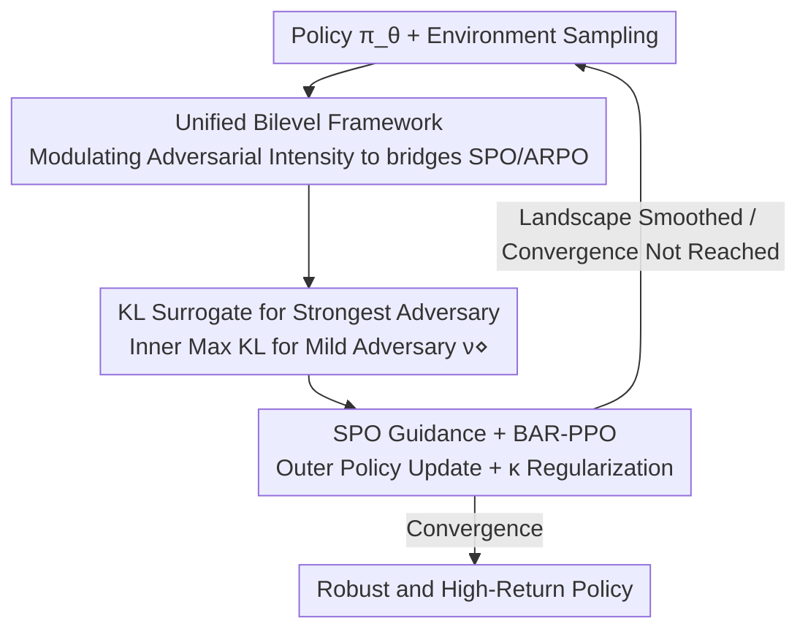

# On the Tension Between Optimality and Adversarial Robustness in Policy Optimization

**Conference**: ICLR 2026  
**OpenReview**: [https://openreview.net/forum?id=ion4VYJWvo](https://openreview.net/forum?id=ion4VYJWvo)  
**Code**: https://github.com/RyanHaoranLi/BARPO  
**Area**: Reinforcement Learning / Adversarial Robustness / Policy Optimization  
**Keywords**: Adversarial Robust RL, Policy Gradient, First-Order Stationary Policy, Bilevel Optimization, Optimal-Robust Tension

## TL;DR
This paper reveals from an optimization perspective that although "optimal policies" and "robust optimal policies" can theoretically align, standard policy optimization (SPO) and adversarial robust policy optimization (ARPO) converge to different first-order stationary policies (FOSPs) in practice, creating a tension between "robustness vs. natural return." The root cause is that the strongest adversary reshapes the optimization landscape into a rugged terrain, creating numerous "sticky" suboptimal stable points. Accordingly, the authors propose a bilevel framework, BARPO, which smooths the landscape by modulating adversarial intensity, achieving both high natural rewards and strong robustness on MuJoCo.

## Background & Motivation
**Background**: Deep Reinforcement Learning (DRL) is extremely fragile to small perturbations in state observations; an imperceptible perturbation can lead to agent performance collapse. Consequently, Zhang et al. proposed the SA-MDP framework to study adversarial robustness but pointed out that a "robust optimal policy (ORP) might not exist," suggesting that optimality and robustness are conflicting objectives. Recently, Li et al. (CAR / ISA-MDP, 2024-2025) theoretically proved that an ORP exists in most practical tasks and is exactly the Bellman optimal policy—meaning **optimality and robustness are aligned in principle**.

**Limitations of Prior Work**: Although theory suggests alignment, conventional policy optimization methods still perform poorly in adversarial settings in practice. The theoretical existence of an ORP does not guarantee that gradient methods can find it. There remains a gap between theory and practice: can this alignment be technically realized?

**Key Challenge**: The authors contrast two training paradigms—SPO, which maximizes standard value $\max_\pi V^\pi(s)$, and ARPO, which maximizes worst-case adversarial value $\max_\pi \min_\nu V^{\pi\circ\nu}(s)$. While they **share the same global robust optimal policy**, they converge to different first-order stationary policies (FOSPs) in practice: SPO favors FOSPs with high natural return but fragility, while ARPO favors FOSPs with robustness but low return. This is termed the "optimal-robust tension," distinguishing it from previous notions of "conflicting objectives"—it is the optimization process, not the objective itself, that separates the two.

**Goal**: ① Explain why SPO remains fragile under theoretically aligned frameworks; ② characterize the cost of ARPO in sacrificing reward for robustness and identify the underlying mechanism; ③ design a practical algorithm that retains robust global optimality while being navigable by gradient methods.

**Key Insight**: Instead of modifying the objective function, the authors examine the **optimization landscape and value geometry**. The intuition is that an optimal adversary depresses the value significantly in fragile regions while leaving robust regions nearly unchanged. This "differential depression" tears the originally smooth landscape into deep valleys, trapping the optimization path in robust but suboptimal basins.

**Core Idea**: Rather than using the "strongest adversary" that makes the landscape rugged, it is better to **modulate adversarial intensity**. By using a surrogate adversary between "no adversary (SPO)" and "strongest adversary (ARPO)," the robust but low-return regions are raised and deep valleys are smoothed, allowing optimization to follow a robust direction while reaching the high-return global optimum.

## Method

### Overall Architecture
The paper's logic is divided into two parts: **diagnosis followed by prescription**. The diagnosis (Section 3) utilizes convergence analysis and landscape geometry to prove that both SPO and ARPO converge only to FOSPs rather than global optima. It attributes their differences to the "reshaping effect of the strongest adversary"—the adversary widens the gap of the objective $V^{\pi_\theta}(\mu_0)-V^{\pi_\theta\circ\nu^*}(\mu_0)$ in fragile regions, tearing deep valleys in the landscape and creating numerous "sticky" deceptive FOSPs (in a simple ISA-MDP, approximately 1/3 of initial policies converge to a low-value deceptive FOSP). The prescription (Section 4) is **BARPO**: it relaxes the inner loop "strongest adversary minimization" of ARPO into a "tunable intensity adversary," provides a KL-divergence surrogate for practicality, and integrates SPO dynamics to accelerate convergence, resulting in BAR-PPO built upon PPO.

The training of BARPO is a **bilevel nested loop**: the inner loop finds a "mild rather than strongest" adversary for the current policy, and the outer loop updates the policy under this adversary with superimposed SPO guidance.

### Key Designs

**1. Reshaping Effect Diagnosis: How Strongest Adversaries Create Sticky Suboptimal Stable Points**

This is the scientific core and the motivation for all subsequent designs. The authors prove (Theorem 3.2) that ARPO under the strongest adversary only converges to an FOSP with a rate of $O(K^{-1/2})$, where the approximation error increases with adversarial intensity; SPO converges to a standard value FOSP at the same rate. The critical difference lies in the nature of the convergence points: Proposition 3.1 provides an ISA-MDP where the ARPO stable point $\pi_A$ satisfies $V^{\pi_A}(\mu_0)-V^-(\mu_0) < \tfrac{1}{2}\big(V^{\pi_S}(\mu_0)-V^-(\mu_0)\big)$ ($V^-$ being worst-case value), meaning ARPO is more robust but its natural return is often less than half of SPO, consistent with MuJoCo measurements (Ant natural return for ARPO is 68% lower than SPO). Mechanistically, since the adversary satisfies $V^{\pi_\theta\circ\nu^*}(\mu_0)\le V^{\pi_\theta}(\mu_0)$, the gap is large and value is sharply depressed in fragile (red) regions, while the gap is small in robust (blue) regions. This differential depression makes the landscape rugged, guiding optimization toward a robust FOSP. Worse, Proposition 3.2 identifies "cut-points" in the robust policy space—removing a policy makes the space disconnected, causing FOSPs to be isolated so gradients cannot cross deep valleys. This causal chain—"reshaping creates valleys, valleys trap optimization"—leads to the decision to **smooth the landscape** rather than change the objective.

**2. Unified Bilevel Framework: Connecting SPO and ARPO via Adversarial Modulation**

Addressing the issue of rugged landscapes created by strong adversaries, the authors relax the inner loop $\min_\nu$ of ARPO into a "tunable adversary" defined by a general inner objective $G(\pi, \nu)$, resulting in a general bilevel framework:

$$\max_\theta \; V^{\pi_\theta\circ\nu^\diamond(\theta)}(\mu_0),\quad \text{s.t.}\;\; \nu^\diamond(\theta)=\arg\max_\vartheta G(\pi_\theta,\nu_\vartheta).$$

The beauty of this framework is that it unifies the two paradigms as endpoints: when $\nu^\diamond(s;\theta)\equiv s$ (no perturbation), it degrades to SPO; when $G(\pi,\nu)=-V^{\pi\circ\nu}(\mu_0)$ (strongest adversary), it degrades to ARPO. Intermediate values represent "mild adversaries" that neither ignore robustness like SPO nor tear the landscape like ARPO. Crucially, the authors prove that under the ISA-MDP setting, **this unified framework preserves exactly the same optimal robust policy as SPO and ARPO**—relaxing adversarial intensity doesn't sacrifice theoretical global optimality; it just provides a better path to reach it.

**3. KL Surrogate for Strongest Adversary: Replacing Inner Minimization with Computable KL Maximization**

Since $G$ in the general framework is abstract, a specific inner objective must be provided to promote policy learning while maintaining strong robustness. The insight is to use the **KL divergence between policies before and after perturbation** as a first-order surrogate for the strongest adversary. Theorem 4.1 provides a lower bound for robustness under a strong adversary obtained via $K$ gradient descent steps:

$$V^{\pi_\theta}(s)-V^{\pi_\theta\circ\nu_\vartheta}(s)\;\ge\;\frac{2\delta}{\lambda_{\max}(F_{s,\theta})K}\,G(s;\pi_\theta,\nu_\vartheta)+O\!\big(G^{3/2}\big),$$

where $G(s;\pi,\nu):=D_{\mathrm{KL}}\big(\pi(\cdot|s)\,\|\,(\pi\circ\nu)(\cdot|s)\big)$ and $F_{s,\theta}$ is the Fisher Information Matrix of the log-policy regarding the perturbation. This indicates that KL divergence is an effective first-order surrogate for minimizing adversarial value from an optimization perspective—maximizing the KL distance approximates creating a strong adversary, but it is computable, differentiable, and does not require solving for the worst-case value. Thus, the instantiation of BARPO is:

$$\max_\theta V^{\pi_\theta\circ\nu^\diamond(\theta)}(\mu_0),\quad \text{s.t.}\;\nu^\diamond(s;\theta)=\arg\max_\vartheta D_{\mathrm{KL}}\big(\pi_\theta(\cdot|s)\,\|\,(\pi_\theta\circ\nu_\vartheta)(\cdot|s)\big).$$

Implementation-wise, SGLD (Stochastic Gradient Langevin Dynamics) is used to sample the perturbed policy $\nu^\diamond$, treating the inner solution as fixed in the outer loop and omitting second-order terms for efficiency.

**4. SPO Guidance and BAR-PPO Instantiation: Injecting Standard Dynamics into the Bilevel Framework**

Even with the bilevel framework, convergence can be slow and residual ruggedness may persist. The authors further integrate SPO dynamics into the outer loop using a regularization weight $\kappa$ to further smooth the landscape and accelerate convergence, resulting in the practical algorithm **BAR-PPO** built on PPO. Intuitively, SPO guidance acts as an extra "push toward high natural rewards" on the smoothed landscape, raising the robust but low-return basins into navigable ramps. Notably, the paper distinguishes four configurations: ARPO (pure maximin), ARPO with guidance (maximin + SPO guidance), BARPO without guidance (pure bilevel framework), and BARPO (bilevel + SPO guidance). Experiments show that adding SPO guidance directly to ARPO does not truly eliminate the reshaping effect (sticky FOSPs remain); only the bilevel structure of BARPO reshapes the terrain fundamentally—validating the necessity of designs 2 and 3: the adversary intensity must be relaxed before guidance can be effective.

### Loss & Training
As a reference, the definition of FOSP is the stability condition of the optimization objective: SPO's FOSP satisfies $\nabla_\theta V^{\pi_\theta}(\mu_0)=0,\ \nabla^2_{\theta\theta}V^{\pi_\theta}(\mu_0)\preceq 0$; ARPO's FOSP replaces the value with the value under the strongest adversary. During training, BAR-PPO: uses SGLD to find KL-maximizing adversarial perturbations in the inner loop; performs policy updates in the outer loop while fixing the inner solution and adding SPO regularization with weight $\kappa$; and omits second-order terms to ensure efficiency. Theorem 3.3's flatness bound also links robustness to generalization—if the curvature on the adversarial side is sufficiently flat ($\|\nabla^2_{\vartheta\vartheta}V\|_F^2\le B/(2\kappa_\vartheta\epsilon^2)$), the curvature on the policy side for ARPO can match SPO, meaning sufficient robustness preserves or even enhances generalization.

## Key Experimental Results

### Main Results
Evaluated on four MuJoCo continuous control tasks (Hopper, Walker2d, HalfCheetah, Ant), 17 agents per method were trained and the median was taken. Evaluation used 6 types of attacks (Random / Critic / MAD / RS / SA-RL / PA-AD) to measure worst-case robust rewards. BAR-PPO compared to PPO, SA-PPO, RADIAL-PPO, and WocaR-PPO:

| Env | Method | Nat. Return | Worst Robust Return | Robustness |
|------|------|---------|------------|--------|
| Hopper | WocaR | 3629 | 1171 | -0.677 |
| Hopper | **BAR-PPO** | **3684** | **1340** (↑4%) | -0.636 |
| Walker2d | SA | 4875 | 997 | -0.795 |
| Walker2d | **BAR-PPO** | 4732 | **2699** (↑154%) | **-0.436** |
| HalfCheetah | WocaR | 4723 | 2270 | -0.519 |
| HalfCheetah | **BAR-PPO** | **4837** | **3181** (↑40%) | **-0.342** |
| Ant | SA | 5367 | 2355 | -0.539 |
| Ant | **BAR-PPO** | 5024 | **2825** (↑20%) | **-0.438** |

BAR-PPO systematically outperformed the next-best baselines in worst-case robust return (gains of 4%/154%/40%/20%) and achieved strongest robustness in Walker2d, HalfCheetah, and Ant, while trailing by only 0.3% in Hopper robustness.

### Ablation Study
Table 3 compares BARPO with "ARPO + SPO guidance" to verify the inherent value of the bilevel structure:

| Env | Configuration | Nat. Return | Robust Return Change | Robustness Change |
|------|------|---------|------------|-----------|
| Hopper | ARPO(w g) | 3699 | — | — |
| Hopper | BARPO | 3684 (↓0.4%) | ↑19% | ↑8.4% |
| HalfCheetah | ARPO(w g) | 4997 | — | — |
| HalfCheetah | BARPO | 4837 (↓3.2%) | ↑193% | ↑56% |
| Ant | ARPO(w g) | 5390 | — | — |
| Ant | BARPO | 5024 (↓6.8%) | ↑138% | ↑43% |

Additionally, comparing pure bilevel framework BARPO(w/o guidance) vs. ARPO: natural returns improved by approx. 75% / 104% / 156% / 113% across the four tasks, and worst-case robust returns improved by approx. 4% / 173% / 209% / 61%.

### Key Findings
- **Bilevel structure is the true contributor**: Directly adding SPO guidance to ARPO only yields minor improvements; sticky FOSPs remain. Only the bilevel relaxation in BARPO reshapes the terrain fundamentally, yielding up to 193% robust return improvement at a natural return cost of ≤7%.
- **SPO guidance is a double-edged sword**: It significantly improves natural rewards in complex environments like HalfCheetah and Ant, with both natural and robust returns rising simultaneously. However, in Walker2d and HalfCheetah, increasing natural reward slightly sacrifices worst-case robustness, suggesting the guidance weight requires balancing.
- **Robustness leads to generalization**: The flatness bound (Theorem 3.3) explains from a curvature perspective why sufficiently robust policies generalize better, unifying "robustness" and "landscape flatness/generalization" into a single theory.

## Highlights & Insights
- **Rediagnosing "Objective Conflict" as "Optimization Path Conflict"**: Previously, optimality and robustness were seen as conflicting goals. This paper argues they share a global optimum, but FOSP differences and landscape reshaping pull them apart—shifting the focus from "changing objectives" to "shaping landscapes."
- **Intuitive "Reshaping Effect + Sticky FOSP" visualize**: The "adversary depressing value in fragile regions, tearing deep valleys, and creating cut-points" narrative turns abstract optimization failure into a visual landscape story (Figures 1/4). The data point that 1/3 of initial policies fall into deceptive FOSPs is highly persuasive.
- **KL Divergence as a First-Order Surrogate for the Strongest Adversary** (Theorem 4.1) is a transferable trick: Replacing the difficult inner maximin with differentiable KL maximization—approximating worst-case value through policy distribution distance—is a transferable insight for robust training.
- **Unified Bilevel Framework with SPO/ARPO as endpoints** is an elegant formulation. Proving that relaxing adversarial intensity does not lose global optimality provides the theoretical confidence for "finding balance in the middle."

## Limitations & Future Work
- Experiments were validated only on four MuJoCo continuous control tasks; they did not cover discrete actions, pixel observations, or larger-scale tasks. Whether the landscape reshaping conclusions hold in high-dimensional perception tasks remains to be tested.
- Several key conclusions (Propositions 3.1/3.2, 1/3 of initial policies falling into deceptive FOSPs) are built on carefully constructed simple ISA-MDPs. The generalization from toy examples to neural network policies relies more on empirical observation.
- A trade-off exists between SPO guidance and robustness (guidance hurts robustness in Walker2d/HalfCheetah), yet the paper lacks an adaptive selection strategy for $\kappa$, requiring per-task tuning in practice.
- The use of SGLD for inner loop sampling and the omission of second-order terms are approximations; separate sensitivity analyses on their impacts on final performance and convergence are missing.

## Related Work & Insights
- **Comparison with SA-PPO / WocaR-PPO (KL-regularized robust training)**: These methods apply KL regularization within the strongest adversary (or worst-case value estimation) framework, essentially remaining ARPO-style maximin. They falling into reshaped sticky FOSPs, whereas BARPO avoids this by relaxing the adversary intensity to smooth the terrain.
- **Comparison with RADIAL-PPO (Robust verification bound regularization)**: RADIAL uses IBP verification bounds for adversarial regularization, focusing on the upper bound of certified robustness; this paper focuses on the reachability of the optimization landscape—certified robustness vs. gradient-walkable paths.
- **Comparison with SA-MDP / ISA-MDP (Theoretical foundations)**: SA-MDP provides the pessimistic "ORP may not exist" conclusion; ISA-MDP (CAR) proves ORP exists and equals Bellman optimal. This paper builds on ISA-MDP's alignment, answering "why alignment is not realized in practice and how to realize it," shifting from existence to reachability.

## Rating
- Novelty: ⭐⭐⭐⭐⭐ Rediagnoses optimal-robust conflict as an optimization landscape reshaping problem; the perspective is fresh and consistent.
- Experimental Thoroughness: ⭐⭐⭐⭐ Solid results over four MuJoCo tasks with 6 attacks and 17 medians, but lacks discrete/pixel tasks and hyperparameter sensitivity analysis.
- Writing Quality: ⭐⭐⭐⭐⭐ The logic of diagnosis—mechanism—prescription is clear; the integration of landscape diagrams with theory is well-executed.
- Value: ⭐⭐⭐⭐ Provides a transferable "adversarial intensity modulation" paradigm and KL-surrogate trick for robust RL.

<!-- RELATED:START -->

## Related Papers

- [\[ICLR 2026\] Primal-Dual Policy Optimization for Linear CMDPs with Adversarial Losses](primal-dual_policy_optimization_for_linear_cmdps_with_adversarial_losses.md)
- [\[ICLR 2026\] Single-stream Policy Optimization](single-stream_policy_optimization.md)
- [\[ICLR 2026\] Dichotomous Diffusion Policy Optimization](dichotomous_diffusion_policy_optimization.md)
- [\[ICLR 2026\] Thinking on the Fly: Test-Time Reasoning Enhancement via Latent Thought Policy Optimization](thinking_on_the_fly_test-time_reasoning_enhancement_via_latent_thought_policy_op.md)
- [\[ICLR 2026\] Relative Entropy Pathwise Policy Optimization](relative_entropy_pathwise_policy_optimization.md)

<!-- RELATED:END -->
