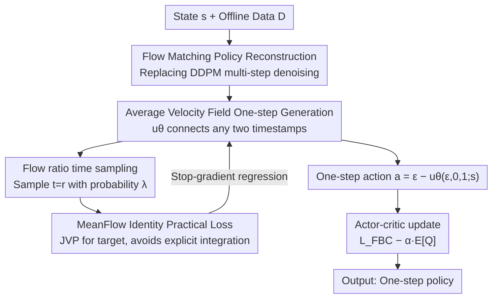

# One-Step Flow Q-Learning: Addressing the Diffusion Policy Bottleneck in Offline RL

**Conference**: ICLR 2026  
**OpenReview**: [https://openreview.net/forum?id=60VgwdzxDM](https://openreview.net/forum?id=60VgwdzxDM)  
**Code**: None  
**Area**: Reinforcement Learning / Offline RL / Flow Matching Policy  
**Keywords**: Offline Reinforcement Learning, Diffusion Q-Learning, Flow Matching, Average Velocity Field, One-step generation

## TL;DR
This paper transforms Diffusion Q-Learning (DQL)—the strongest but slowest and most fragile approach in offline RL—from a DDPM multi-step denoising process into a Flow Matching framework. By replacing marginal velocity with an "average velocity field," the policy generates actions in **one single step during both training and inference**. This achieves significant acceleration and outperforms multi-step DQL on D4RL, reaching a new SOTA.

## Background & Motivation

**Background**: The mainstream high-performance route in offline RL involves replacing the Gaussian policy in TD3+BC with a diffusion model. DQL, representatively using DDPM as the policy network, can characterize complex multimodal action distributions and has long remained a strong baseline, surpassing newer diffusion planners and policy methods.

**Limitations of Prior Work**: The Achilles' heel of DQL lies in its reliance on the DDPM diffusion policy. Generating an action requires a $K$-step reverse denoising chain, leading to slow inference. Training suffers a "double penalty"—the critic loss requires sampling the next action $a'$, and the actor loss requires sampling the current action $a$, each necessitating a full $K$-step sampling process. Furthermore, the actor uses reparameterization for Backpropagation Through Time (BPTT) over the entire denoising chain, where gradients propagate recursively through a long stochastic computational graph, increasing computational load and causing numerical instability or convergence to sub-optimal solutions.

**Key Challenge**: The diffusion policy itself is the bottleneck. However, "simply reducing steps" is not viable: setting $K$ to a small value violates the assumption that $a_K$ approximates isotropic Gaussian noise, leading to a collapse in performance (experimentally, DQL+DDIM one-step inference dropped by 76.3 points). Existing acceleration schemes either switch to more efficient solvers, use IQL training, or train an auxiliary policy to be distilled into a one-step policy—all of which introduce extra modules, multi-stage training, or compromises in expressiveness and scalability.

**Goal**: Can we **directly train a one-step policy** to eliminate inefficiency at both training and inference stages without relying on auxiliary models, distillation, or multi-stage pipelines?

**Key Insight**: Flow Matching (FM) maps noise to data along straighter, smoother paths, making it naturally more suitable for one-step sampling than diffusion. However, the authors found a critical hurdle: standard FM learns the **marginal velocity field**, where the ground-truth trajectories themselves are curved (not due to network approximation errors). Consequently, even with a step size of 1, reliable one-step generation is impossible.

**Core Idea**: Instead of learning the instantaneous (marginal) velocity, the model learns the **average velocity field**. It directly characterizes the total displacement between any two timestamps, allowing the model to jump from noise to action in one step, thereby eliminating iterative denoising and recursive gradients to derive One-Step Flow Q-Learning (OFQL).

## Method

### Overall Architecture
The goal of OFQL is to maintain the "behavior-regularized actor-critic" training skeleton of DQL while replacing the slow and fragile DDPM diffusion policy with a **true one-step** Flow Matching policy. The transition involves: first, rewriting the policy onto the linear paths of Flow Matching; second, changing the training target from "instantaneous velocity" to "average velocity"; third, employing an integral-free practical loss with a time-sampling technique; and finally, using one-step generated actions to calculate critic and actor losses.

### Key Designs

**1. Flow Matching Reconstruction: Replacing multi-step denoising with linear flow paths**

DQL's slowness is rooted in DDPM's Markovian denoising chain, where sampling must proceed through $K$ Gaussian transitions and training requires BPTT. OFQL first places the policy in a Flow Matching framework: given data action $a$, state $s$, and noise $\epsilon\sim\mathcal N(0,I)$, it defines a linear path and conditional velocity:

$$a_t = (1-t)a + t\epsilon,\qquad v_t = \frac{da_t}{dt} = \epsilon - a,\quad t\in[0,1]$$

Standard FM uses the conditional flow matching loss $L_{\mathrm{CFM}}=\mathbb E\,\|v_\theta(a_t,t;s)-v_t\|^2$ to learn the **marginal velocity** $v_\theta$, and samples by solving an ODE (e.g., Euler). While paths are straighter than diffusion, the ground-truth marginal velocity trajectories **remain inherently curved** unless the target distribution collapses to a delta or explicit rectification is performed. Simply setting $\Delta t=1$ leads to large discretization errors. FM reconstruction is merely a "change of track"; the real breakthrough lies in the next design.

**2. Average Velocity Field One-step Generation: Directly learning displacement between two timestamps**

To ensure accurate one-step generation, the authors no longer treat $v(a_t,t;s)$ as the training target (the instantaneous velocity). Instead, they model the **average velocity**, which connects any two timestamps $r$ and $t$:

$$u(a_t,r,t;s)\triangleq\frac{1}{t-r}\int_r^t v(a_\tau,\tau;s)\,d\tau,\qquad 0\le r\le t\le1$$

This $u$ is fully determined by the instantaneous velocity field $v$ and is independent of the network architecture. Thus, it serves as the ground truth for fitting the network $u_\theta$. Once learned, actions can be obtained via a single "endpoint mapping":

$$a = T_\theta(\epsilon,s) = \epsilon - u_\theta(\epsilon,\,r{=}0,\,t{=}1;\,s),\quad \epsilon\sim\mathcal N(0,I)$$

This completely eliminates ODE numerical integration and discretization errors. The resulting policy is the push-forward of the Gaussian prior via the endpoint mapping $\pi_\theta=(T_\theta)_\#\,\mathcal N(0,I)$. When used as a regularizer, it is equivalent to behavior cloning on the behavior policy. **Because it inherits the non-linear transport mapping of Flow Matching, it retains the ability to characterize complex multimodal distributions**—the very expressiveness DQL sought when replacing Gaussian policies with diffusion, but achieved here without sacrificing "one-step" efficiency.

**3. MeanFlow Identity Practical Loss: Avoiding integration via JVP**

The definition of average velocity contains an integral, which is incomputable during optimization. OFQL rewrites it into an equivalent differentiable form using the MeanFlow identity:

$$u(a_t,r,t;s) = v(a_t,t;s) - (t-r)\frac{d}{dt}u(a_t,r,t;s)$$

The total derivative expands as $\frac{d}{dt}u = v\cdot\partial_{a_t}u + \partial_t u$, which can be calculated efficiently via the Jacobian-vector product (JVP). When $t=r$, $u$ reduces to instantaneous velocity. During training, $v$ is approximated by the conditional velocity $v_t=\epsilon-a$, yielding the target:

$$u_{\mathrm{tgt}} = v_t - (t-r)\big(v_t\cdot\partial_{a_t}u_\theta + \partial_t u_\theta\big)$$

The final loss applies a stop-gradient ($\mathrm{sg}$) to the target to avoid high-order gradients:

$$L_{\mathrm{FBC}}(\theta) = \mathbb E_{t,r,(a,s),\epsilon}\,\big\|u_\theta(a_t,r,t;s) - \mathrm{sg}(u_{\mathrm{tgt}})\big\|_2^2$$

This makes learning average velocity trainable by bypassing explicit integration while keeping costs low with JVP.

**4. Flow ratio time sampling: Stabilizing bootstrapping with $\lambda$**

Since the target average velocity depends on the estimate of instantaneous velocity, the accuracy of the latter determines the quality of the former. OFQL introduces a **flow ratio** $\lambda$ in sampling $(t,r)$—the probability of setting $t=r$. When $t=r$, the target reduces to pure instantaneous velocity, "biasing" the model to learn instantaneous velocity first while maintaining the regression of average velocity, thus improving bootstrapping stability. Ablation shows performance drops at extremes: $\lambda=1$ degrades to pure FM, and $\lambda=0$ fails to learn instantaneous velocity. $\lambda=0.5$ is most stable and serves as an effective regularizer. $(t,r)$ are sampled from a logit-normal distribution $(-0.4, 1.0)$, and the policy network concatenates the target step $r$ embedding alongside the standard $t$ embedding.

### Loss & Training
OFQL adopts the actor-critic framework of DQL, with the only change being that behavior regularization and action sampling are one-step:

$$L(\phi)=\mathbb E\Big[\big(r+\gamma\min_{i\in\{1,2\}}Q_{\phi'_i}(s',a') - Q_{\phi_i}(s,a)\big)^2\Big],\quad a'\sim\pi_{\theta'}$$
$$L(\theta)=L_{\mathrm{FBC}}(\theta) - \alpha\,\mathbb E_{s,\,a\sim\pi_\theta}\big[Q_\phi(s,a)\big]$$

Action sampling $a=\epsilon-u_\theta(\epsilon,0,1;s)$ is a differentiable one-step operation. $\alpha$ is adaptively normalized by the $Q$-value scale ($\alpha=\eta/\mathbb E[\|Q\|]$, denominator treated as constant). $\eta$ is grid-searched over $\{0.001, 0.01, 0.1, 0.3, 0.5\}$. Optimization uses Adam with a learning rate of $3\times10^{-4}$.

## Key Experimental Results

### Main Results
On D4RL benchmark categories, OFQL leads consistently (normalized score mean):

| Domain | BC | TD3-BC | IQL | DQL | FQL (1-step distillation) | OFQL (Ours) |
|----|----|--------|-----|-----|------|------|
| MuJoCo (locomotion) | 51.9 | 75.3 | 77.0 | 87.9 | 79.2 | **92.5** |
| AntMaze | 0.2 | 3.5 | 57.1 | 64.6 | 79.0 | **84.6** |
| Kitchen | 44.8 | 0.0 | 48.7 | 61.6 | 53.1 | **67.0** |

Ours improves DQL on MuJoCo from 87.9 to 92.5 (gains are most significant in sub-optimal/noisy trajectories like medium/medium-replay). On AntMaze, it rises sharply from 64.6 to 84.6, and on Kitchen from 61.6 to 67.0, significantly outperforming the one-step distillation method FQL (+13.3 on MuJoCo).

### Ablation Study

**One-step policy comparison (Mean of 9 MuJoCo tasks, Table 2)**:

| Method (steps) | DQL (5) | DQL+DDIM (1) | FBRAC (1) | FQL (1) | OFQL (1) |
|------|------|------|------|------|------|
| Score | 87.9 | 11.6 (-76.3) | 67.1 (-20.8) | 79.2 (-8.7) | **92.6 (+4.7)** |

Only OFQL outperforms DQL under one-step conditions; DDIM one-step inference nearly collapses, and while FBRAC/FQL improve, they remain below DQL.

**Flow ratio ablation (HalfCheetah, Table 3)**: $\lambda=0.5$ achieves the best scores across Medium-Expert / Medium / Medium-Replay (95.2 / 63.8 / 51.2). $\lambda=1$ (pure FM) and $\lambda=0$ show significant degradation.

### Key Findings
- **Average velocity parameterization is key to one-step generation**: Toy data shows u-param one-step generation has strong mode coverage fitting the target distribution, whereas v-param (marginal velocity) requires multiple steps to reach comparable quality and collapses with few steps.
- **Efficiency Dominance**: For 1M training steps, OFQL takes 6.3 hours, while DQL with 5 steps takes 11.7 hours and 50 steps takes 49.5 hours. Inference frequency for OFQL reaches 846.5 Hz, far exceeding 5-step DQL (238.7 Hz) and 50-step DQL (35.5 Hz). Even compared to one-step FQL, OFQL trains faster (FQL training requires multi-NFE to construct distillation targets) and performs better.
- **Reasons for Improvement**: Attributed to maintaining expressiveness for complex distributions and avoiding BPTT in Q-learning, leading to more stable value estimation and better convergence; this is particularly critical in sparse-reward tasks like AntMaze requiring stable Q-guidance.

## Highlights & Insights
- **Precise Bottleneck Identification**: Instead of generalized "diffusion acceleration," the paper targets the "diffusion policy" itself and demonstrates that "trajectory curvature is an intrinsic property of marginal velocity fields, not a fitting error," explaining why reducing steps inevitably fails.
- **Transfer Value of Average Velocity Fields**: Introducing the MeanFlow concept from generative modeling into RL policies, combined uniquely with Q-gradient guided velocity learning (rather than pure supervision), this "learning displacement → endpoint mapping one-step sampling" can be transferred to any control scenario requiring fast, differentiable action generation.
- **Near Zero-Cost Integration**: OFQL reuses the architecture and training pipeline of DQL, merely concatenating the target step $r$ embedding and changing behavior regularization/sampling to one-step—minimal engineering changes yielding both speed and performance gains.

## Limitations & Future Work
- Evaluation is concentrated on simulated benchmarks like D4RL; high-dimensional visual inputs or real-world robotics are not yet addressed. The claimed "high-frequency real-time control" potential remains to be verified on hardware.
- Hyperparameters like flow ratio $\lambda$ and $\eta$ still require grid search per dataset, as performance is sensitive to $\lambda$, leaving automated tuning for future work.
- The average velocity target relies on an on-the-fly approximation of instantaneous velocity (using conditional velocity); the impact of this bias on final policy quality lacks detailed theoretical characterization.

## Related Work & Insights
- **vs. DQL (Multi-step Diffusion Policy)**: DQL uses DDPM multi-step denoising + BPTT, which is slow and fragile; OFQL uses Flow Matching + Average Velocity Field for one-step generation without BPTT, outperforming DQL in performance and speed.
- **vs. FQL (One-step Distilled Flow Policy)**: FQL trains a multi-step flow model first then distills it, requiring repetitive multi-step model queries during training; OFQL **trains a one-step policy directly** without a distillation phase, resulting in faster training and higher performance.
- **vs. IDQL / EDP (Efficiency/IQL-based)**: These typically sacrifice performance for efficiency (lower than DQL); OFQL improves both, avoiding the trade-off.
- **vs. Standard Flow Matching / Consistency Models**: Standard FM has curved marginal trajectories (one-step inaccuracy); Consistency Models have unstable training. OFQL bypasses both using average velocity parameterization via MeanFlow.

## Rating
- Novelty: ⭐⭐⭐⭐⭐ First systematic introduction of "average velocity fields" to offline RL policies with Q-gradient guidance.
- Experimental Thoroughness: ⭐⭐⭐⭐ Extensive across D4RL domains and one-step baselines, though lacks real-world robot/vision tasks.
- Writing Quality: ⭐⭐⭐⭐⭐ Motivation is well-structured, clearly explaining why trajectories are curved and why average velocity solves it.
- Value: ⭐⭐⭐⭐⭐ Simutaneously achieves speed and performance, with direct practical implications for high-frequency control.

<!-- RELATED:START -->

## Related Papers

- [\[ICLR 2026\] Mean Flow Policy with Instantaneous Velocity Constraint for One-step Action Generation](mean_flow_policy_with_instantaneous_velocity_constraint_for_one-step_action_gene.md)
- [\[ICLR 2026\] Guided Flow Policy: Learning from High-Value Actions in Offline Reinforcement Learning](guided_flow_policy_learning_from_high-value_actions_in_offline_reinforcement_lea.md)
- [\[ICLR 2026\] Flow Matching Policy Gradients](flow_matching_policy_gradients.md)
- [\[ICLR 2026\] Flow Actor-Critic for Offline Reinforcement Learning (FAC)](flow_actor-critic_for_offline_reinforcement_learning.md)
- [\[ICML 2026\] Fast and Highly Expressive Policy Learning for Offline Reinforcement Learning via Bootstrapped Flow Q-Learning](../../ICML2026/reinforcement_learning/fast_and_highly_expressive_policy_learning_for_offline_reinforcement_learning_vi.md)

<!-- RELATED:END -->
