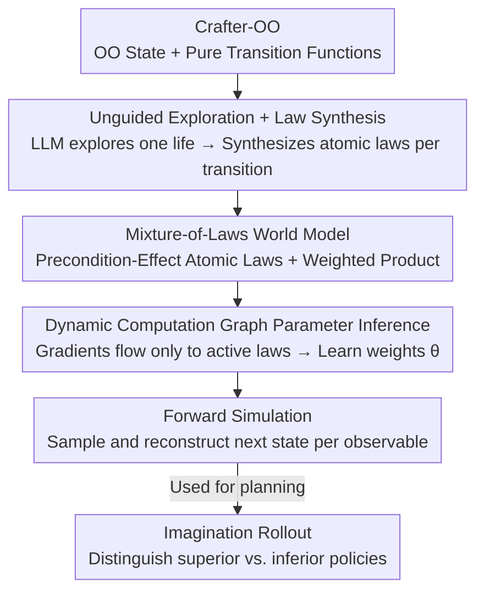

# One Life to Learn: Inferring Symbolic World Models for Stochastic Environments from Unguided Exploration

**Conference**: ICLR 2026  
**OpenReview**: [https://openreview.net/forum?id=UQ36IrVCw2](https://openreview.net/forum?id=UQ36IrVCw2)  
**Code**: https://onelife-worldmodel.github.io  
**Area**: Reinforcement Learning / World Models / Program Synthesis  
**Keywords**: Symbolic World Models, Probabilistic Programs, Single-episode Exploration, Credit Assignment, Crafter

## TL;DR
This paper proposes ONELIFE, which enables an agent to run a single unguided episode in a complex, dangerous, and stochastic open world and infer the environment's transition dynamics $p(s_{t+1}\mid s_t,a_t)$ as a set of executable probabilistic "law" programs from observations alone. By utilizing a "precondition-effect" structure to construct on-demand dynamic computation graphs, the method backpropagates gradients only to truly relevant laws, outperforming the strong baseline PoE-World in 16 out of 23 mechanisms in Crafter-OO.

## Background & Motivation
**Background**: Symbolic world models aim to represent environment transition dynamics as readable, modifiable, and verifiable code rather than black-box neural networks. Prior works (WorldCoder, Code World Models, PoE-World) mostly use LLMs to synthesize programs but assume environments are **simple, deterministic, data-abundant, and guided by human rewards**—such as GridWorld or Atari, where thousands of interactions are possible given a reward/goal.

**Limitations of Prior Work**: Real-world open-world sandboxes (Minecraft, RuneScape, or Crafter used here) violate these assumptions: ① **Irreducible Stochasticity**—results of the same action are probabilistic (e.g., how zombies track players); ② **No External Rewards**—players define their own goals without "win" criteria; ③ **High Exploration Cost**—entering dangerous areas leads to death, meaning one cannot rely on massive trial-and-error. Existing methods fail across these three dimensions simultaneously.

**Key Challenge**: Writing the world as a program requires many "state transition" samples for supervision. However, dangerous stochastic environments provide very few, noisy samples with no rewards to indicate which hypotheses are correct. Reverse-engineering a full set of rules under a "one life" budget without guidance is a fundamental conflict.

**Goal**: To enable agents to perform **autonomous scientific discovery**, inferring transition functions from observations within a single episode to achieve both the ability to distinguish reasonable from unreasonable future states (state ranking) and generate realistic future states (state fidelity).

**Key Insight**: The authors observe that writing the world as a "single large program" (WorldCoder, PoE-World) leads to poor credit assignment—any transition only affects a small part of the state, but irrelevant parts of a large program might produce noise for all attributes, polluting the posterior. Instead, the transition function should be **decomposed into atomic laws**, each governing a narrow slice of the state with a "precondition" determining when it is active.

**Core Idea**: Use a "mixture of probabilistic laws with preconditions and effects" instead of a "single large program." Each transition activates only relevant laws to form a specialized computation graph, with gradients flowing only through active laws, achieving **precise credit assignment** over high-dimensional hierarchical state spaces.

## Method

### Overall Architecture
ONELIFE models the environment as a pure but stochastic transition function $T:\mathcal{S}\times\mathcal{A}\to\Delta(\mathcal{S})$ and approximates it using a mixture of **modular probabilistic laws**. The pipeline consists of: first, using an LLM-driven **unguided exploration strategy** to run one life and collect $(s_t,a_t,s_{t+1})$ transition data (without rewards); then, using a **law synthesizer** to compare states transition-by-transition and prompt an LLM to write a Python law class with "precondition + effect" for each changed attribute, resulting in a pool of candidate laws (including false hypotheses); next, using **parameter inference** to learn a weight $\theta_i$ for each law by maximizing observation likelihood, pushing weights of invalid laws to zero while allowing valid laws to vote; finally, using the learned model for **forward simulation** to sample the next state for planning. To support evaluation, the authors rewrote Crafter as **Crafter-OO**—a testbed exposing structured object-oriented states where transitions are pure functions.

### Key Designs

**1. Crafter-OO: Transforming complex sandboxes into pure function testbeds for symbolic methods**

Prior symbolic world models implicitly assumed "access to object-oriented world states," which only holds in toy environments like Minigrid/BabyAI or through extra engineering like OCAtari. There was a lack of environments more complex than GridWorld but more structured than Atari. The authors rewrote Hafner's Crafter into Crafter-OO: all information needed to calculate the next state is encapsulated in a **structured, hierarchical, OO text state** (containing 100+ key-value pairs), and transitions are pure functions $T(s,a)\to s'$ without "hidden variables." States are described via Python/JSON rather than PDDL because PDDL state representations would explode in size, and LLMs are much better at writing Python than Probabilistic PDDL. This representation is naturally readable and writable by LLMs.

**2. Mixture-of-Laws World Model: Decomposing transition functions into atomic probabilistic laws**

To address poor credit assignment in large programs, ONELIFE represents the transition function as a mixture of atomic laws $L_i=(c_i,e_i)$: the precondition $c_i(s,a)\to\{\text{true},\text{false}\}$ determines if a law applies, and the effect $e_i(s,a)\to\Delta(\mathcal{S})$ provides a probability distribution over a **narrow slice** of the state. An **observable extractor** $E:\mathcal{S}\to\mathcal{O}$ maps complex states to primitive values (e.g., `player.position`, `inventory`). For an observable $o$, the predictions of activated laws $I_o(s,a)$ are combined via a **weighted product**:

$$p(o=v\mid s,a;\theta)\propto\prod_{i\in I_o(s,a)}\phi_{i,o}(o=v\mid s,a)^{\theta_i}$$

Assuming observables are conditionally independent given $(s,a)$, the full next-state distribution is the product of individual distributions $p(s'\mid s,a;\theta)=\prod_{o\in\mathcal{O}}p(o\mid s,a;\theta)$. Learned weights $\theta$ perform **model selection**: the optimizer pushes weights of invalid laws to zero while aggregating reasonable ones. This differs from PoE-World in its **atomicity**—each expert in PoE-World predicts the *entire* next state, whereas ONELIFE laws focus on minimal subsets (e.g., only player health or a specific map tile), enabling dynamic computation graphs.

**3. Unguided Exploration + Universal Synthesizer: Discovering mechanisms while playing without priors**

Under the no-reward setting, there are no offline datasets or external goals. Pure random exploration in hostile environments like Crafter-OO does not survive long enough to see diverse mechanisms. Thus, an LLM-driven exploration strategy is used (based on the Balrog agent scaffold), maintaining a sliding window of recent states/actions and a temporary set of hypotheses about world rules. A key distinction is made: **General Category Priors** (high-level concepts for survival games like "hostile entities exist" or "resources can be collected") are given to the agent to avoid aimless walking; however, **Environment-Specific Dynamics** (exact rules like "zombies chase players" or "crafting a pickaxe requires wood") are strictly withheld. The synthesizer is a **single universal synthesizer** that systematically compares OO states to identify changed attributes and outputs Python classes with `precondition` and `effect` methods, automatically decomposing complex events into atomic laws.

**4. Sparse Credit Assignment on Dynamic Computation Graphs: Gradients flow only through active laws**

With atomic laws, the inference phase can construct a **separate computation graph for each transition** based on the "precondition-effect" structure. The learning objective is to maximize the log-likelihood of the transition dataset $\mathcal{D}=\{(s_t,a_t,s_{t+1})\}$. Given observable conditional independence, the negative log-likelihood for a single transition decomposes into a sum over observables $\mathcal{L}(\theta;s,a,s')=-\sum_{o\in\mathcal{O}}\log p(v_o^*\mid s,a;\theta)$, where $v_o^*=E(s')_o$. The unnormalized log-score is a weighted sum of active laws $\ell_o(v\mid s,a;\theta)=\sum_{i\in I_o(s,a)}\theta_i\log\phi_{i,o}(o=v\mid s,a)$. Crucially, the gradient **is only calculated for the weights of active laws $i\in I_o(s_t,a_t)$**, routing credit specifically to the laws that made predictions for that outcome. This is far more precise than "static graph" methods like PoE-World. Optimization is performed using L-BFGS.

### Mechanism: Zombie Tracking the Player
Consider a state $s_t$ where the player is at some coordinates, a zombie is nearby, and the action $a_t$ is "move right." During simulation, the model finds active laws for each observable: `player.pos` is explained by `PlayerMovementLaw`, and `zombie.pos` by `ZombieMovementLaw`. `InventoryUpdateLaw` is not activated. For the zombie's position, the model outputs a discrete distribution—e.g., "up 0.60 / left 0.20 / right 0.05 / down 0.05 / stay 0.10"—capturing the stochastic nature of zombie movement. The world model thus captures the "chasing" behavior without supervision.

## Key Experimental Results

### Main Results
Comparison of methods on Crafter-OO (all using the same exploration and synthesis, differing only in parameter inference), averaged over 10 trials:

| Law Synthesis | Inference | Rank@1 ↑ | MRR ↑ | Raw Edit Dist. ↓ | Norm. Edit Dist. ↓ |
|---|---|---|---|---|---|
| Random World Model | — | 8.5% | 0.322 | 121.538 | 0.809 |
| WorldCoder | — | 0.0% | 0.264 | 27.180 | 0.181 |
| ONELIFE | PoE-World | 10.8% | 0.351 | 10.634 | 0.071 |
| ONELIFE | No Inference | 13.0% | 0.429 | **8.540** | **0.057** |
| ONELIFE | ONELIFE | **18.7%** | **0.479** | 8.764 | 0.058 |

ONELIFE shows its greatest advantage in discriminative metrics: Rank@1 reaches 18.7% and MRR 0.479, which are **+7.9 percentage points** and **+0.128** higher than the PoE-World inference baseline, respectively. While generation fidelity (edit distance) is comparable to "No Inference," the authors emphasize that optimizing generation alone does not yield a more useful world model—PoE-World reduces edit distance significantly but has a Rank@1 barely better than random.

### Ablation Study

| Configuration | Rank@1 | MRR | Description |
|---|---|---|---|
| ONELIFE (Full) | 18.7% | 0.479 | Includes learned law weights $\theta$ |
| No Inference | 13.0% | 0.429 | Weights fixed, no weighting of laws |

Removing parameter inference drops Rank@1 by 5.7 percentage points, proving that weighting is essential to distinguish valid laws from false hypotheses.

### Key Findings
- **Fine-grained Evaluation**: ONELIFE outperforms PoE-World in MRR across **16/23** mechanism categories (resource collection, tool crafting, survival, etc.), indicating that gains come from robust rule understanding rather than exploiting simple mechanisms.
- **Discrimination > Generation**: While exact generation of complex future states remains difficult, the model learns accurate rule comprehension, assigning high probability to legal transitions and low probability to illegal ones—which is what planning requires.
- **Planning Utility**: By performing rollouts entirely within the world model, the model can distinguish superior policies in multi-step goal-oriented tasks, validating the usability of "planning in imagination."

## Highlights & Insights
- **Atomic Laws + Dynamic Computation Graphs**: The core insight is replacing "entire programs" with "small laws for narrow slices," allowing gradients to flow only through active laws. This shifts credit assignment from "global noise" to "on-demand precision."
- **"One Life" Setting**: This frames symbolic world modeling as autonomous scientific discovery. A single episode with no rewards or rule priors approximates the situation of an agent entering a new environment.
- **Categorical Priors vs. Specific Rules**: Providing category intuitions (to prevent aimless walking) while hiding specific rules (to force reverse engineering) is a clever experimental control.
- **Crafter-OO Asset**: Exposing OO states, pure transitions, and 30+ scenarios provides a fundamental foundation for future symbolic RL and world modeling research.

## Limitations & Future Work
- Precise generation of the full next state remains challenging (limited improvement in state fidelity), and the current implementation focuses on categorical/discrete distributions.
- Evaluation relies on manually designed "mutators" to create illegal future states for ranking; the "difficulty" of these distractors is human-determined.
- Dependence on LLMs: Both exploration and synthesis heavily rely on LLM capabilities. The sensitivity to different LLMs (e.g., smaller models) was not fully explored.
- The experiments were limited to the Crafter environment; whether "one-life rule learning" scales to massive open worlds like Minecraft remains to be seen.

## Related Work & Insights
- **vs. WorldCoder / Code World Models**: These synthesize **single, deterministic** programs. ONELIFE uses a **probabilistic mixture of atomic laws**. WorldCoder’s performance drops to 0% Rank@1 in stochastic environments.
- **vs. PoE-World**: While both use a product-of-experts, PoE-World experts predict the entire state and use static computation graphs with 30+ specialized synthesizers. ONELIFE utilizes atomic laws for minimal subsets and dynamic graphs for precise credit routing.
- **vs. Implicit World Models (Dreamer, etc.)**: While these learn latent representations, ONELIFE learns **explicit, readable, and verifiable** symbolic rules, framing world modeling as "system rule reverse engineering."
- **vs. PDDL Inference**: Traditional domain inference often uses deterministic PDDL. ONELIFE uses Python probabilistic programs because PDDL is less expressive for stochasticity and LLMs are more proficient in Python.

## Rating
- Novelty: ⭐⭐⭐⭐⭐ "One life + unguided + stochastic open world" setup combined with dynamic computation graphs.
- Experimental Thoroughness: ⭐⭐⭐⭐ 23 scenario evaluation + ablation + planning validation, though limited to one environment.
- Writing Quality: ⭐⭐⭐⭐ Motivation is clear; formulas and diagrams are well-integrated.
- Value: ⭐⭐⭐⭐⭐ The open-sourced Crafter-OO and its evaluation suite provide a solid foundation for the field.

<!-- RELATED:START -->

## Related Papers

- [\[ICLR 2026\] Distributional value gradients for stochastic environments](distributional_value_gradients_for_stochastic_environments.md)
- [\[ICLR 2026\] One Model for All Tasks: Leveraging Efficient World Models in Multi-Task Planning](one_model_for_all_tasks_leveraging_efficient_world_models_in_multi-task_planning.md)
- [\[ICLR 2026\] EGG-SR: Embedding Symbolic Equivalence into Symbolic Regression via Equality Graph](egg-sr_embedding_symbolic_equivalence_into_symbolic_regression_via_equality_grap.md)
- [\[CVPR 2026\] DreamSAC: Learning Hamiltonian World Models via Symmetry Exploration](../../CVPR2026/reinforcement_learning/dreamsac_learning_hamiltonian_world_models_via_symmetry_exploration.md)
- [\[ICML 2026\] Flow-Equivariant World Models: Memory for Partially Observed Dynamic Environments](../../ICML2026/reinforcement_learning/flow_equivariant_world_models_memory_for_partially_observed_dynamic_environments.md)

<!-- RELATED:END -->
