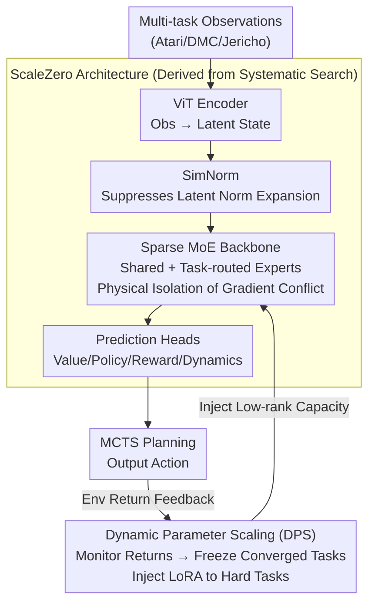

# One Model for All Tasks: Leveraging Efficient World Models in Multi-Task Planning

**Conference**: ICLR 2026  
**arXiv**: [2509.07945](https://arxiv.org/abs/2509.07945)  
**Code**: [https://github.com/opendilab/LightZero](https://github.com/opendilab/LightZero)  
**Area**: Multi-task Reinforcement Learning / World Models  
**Keywords**: multitask RL, world model, MoE, MCTS, plasticity collapse, dynamic parameter scaling

## TL;DR
ScaleZero is proposed to address gradient conflict and plasticity collapse in multi-task learning by introducing a Mixture-of-Experts (MoE) architecture into a unified world model. Combined with a Dynamic Parameter Scaling (DPS) strategy for adaptive model capacity allocation, a single multi-task model achieves performance comparable to single-task expert models across Atari, DMC, and Jericho benchmarks while reducing environmental interactions by approximately 28.5%.

## Background & Motivation
**Background**: Unified world models (e.g., UniZero) integrate representation learning, dynamics prediction, and policy learning within a single Transformer. Combined with MCTS planning, they have achieved SOTA results in single-task settings. Extending these to heterogeneous multi-task learning (varying observation/action spaces and complexities) is a critical step toward generalist agents.

**Limitations of Prior Work**: UniZero encounters severe **plasticity collapse** during multi-task training—simple tasks (e.g., Pong) converge rapidly, and their gradients dominate shared parameter updates, causing complex tasks (e.g., Seaquest) to collapse after an initial learning phase. This manifests as a surge in dead neurons and uncontrolled expansion of latent state norms.

**Key Challenge**: The **gradient conflict** in shared backbones across heterogeneous tasks—gradient directions beneficial for task $i$ may be harmful to task $j$ ($\cos(g_i, g_j) < 0$). Simultaneously, static resource allocation treats all tasks equally regardless of complexity, leading to computational waste.

**Goal**: (1) How to mitigate gradient conflict and plasticity collapse in a shared world model? (2) How to dynamically allocate model capacity based on task learning progress?

**Key Insight**: Approaching from two complementary perspectives—**architectural level** by replacing dense FFNs with MoE to allow different tasks to follow distinct expert paths, reducing interference; **process level** by using DPS to gradually inject LoRA adapters to expand capacity based on learning progress.

**Core Idea**: MoE mitigates gradient conflict within single iterations + DPS optimizes resource allocation throughout the training process = An efficient multi-task world model.

## Method

### Overall Architecture
ScaleZero aims to enable a **single** world model to master multiple tasks with diverse observation/action spaces and disparate difficulties without collapsing under simple task gradients, as seen in UniZero. It approaches this from two angles: structurally, the shared backbone is converted into a sparse MoE network to isolate parameter paths for different tasks; procedurally, capacity is injected based on learning progress to focus compute on unsolved difficult tasks.

The data flow of the pipeline is: observations are first mapped to latent states by a ViT encoder (replacing the original ResNet), and latent representations are normalized using SimNorm to suppress norm expansion. Latent sequences enter a Transformer backbone where dense FFNs are replaced by sparse MoE layers (shared experts + task-routed experts). Backbone outputs pass through four prediction heads—value, policy, reward, and dynamics—to facilitate MCTS planning. The model is trained end-to-end using a unified loss $\mathcal{L} = \sum_{t}(\mathcal{L}_{\text{value}} + \mathcal{L}_{\text{policy}} + \mathcal{L}_{\text{reward}} + \mathcal{L}_{\text{dynamics}})$. DPS determines when to freeze tasks or inject new LoRA capacity based on the rate of change in task returns.

The architecture (ViT encoder + SimNorm + MoE backbone + prediction heads) was determined via "Systematic Architecture Exploration" across five dimensions. The MoE backbone provides the most significant gains, while DPS acts as an orthogonal capacity scheduling loop over the training process:

### Key Designs

**1. Sparse MoE Backbone: Physical Isolation of Gradient Conflict**

This directly addresses the pain point where shared backbones suffer from gradient interference across heterogeneous tasks. The dense FFN in the Transformer backbone is replaced with an MoE layer containing $N$ parallel experts. Each input activates only the top-k experts, with the output being a weighted sum $\text{MoE}(x) = \sum_{i=1}^{N} G_i(x) \cdot \text{Expert}_i(x)$, where the gating network $G(x)$ automatically selects expert subsets. The design uses hybrid experts: 1 shared expert to capture cross-task general knowledge, and multiple routed experts to handle task-specific dynamics.

Consequently, inputs from different tasks are routed to different parameter subsets, physically isolating gradient conflicts rather than attempting post-hoc corrections during optimization. Experiments confirm that MoE provides the most consistent gains, maintaining dead neuron ratios and latent state norms at healthy levels.

**2. Dynamic Parameter Scaling (DPS): Scheduling Compute based on Learning Progress**

Static resource allocation treats all tasks equally, which is inefficient given the vast difficulty gap between tasks like Pong and Seaquest. DPS monitors the return curve of each task. Once a task converges (plateaus), its parameters are frozen, and new LoRA adapters are injected into paths for tasks that have not yet converged. Weight updates are defined as $(W_0 + \alpha BA)x$, where only the low-rank matrices $(A, B)$ are trained.

This effectively generates an automated "task curriculum"—mastering and freezing simple tasks first, then concentrating the released capacity on difficult tasks without manual difficulty ranking. Efficiency gains are notable, reducing environmental interactions by 28.5% while maintaining performance.

**3. Systematic Architecture Exploration: Identifying Effective Modifications**

ScaleZero was developed by evaluating modifications across five dimensions: task conditioning methods, encoders (ResNet vs. ViT), latent normalization (LayerNorm vs. SimNorm), backbones (Dense vs. MoE), and optimization strategies (Gradient correction MoCo vs. Standard). Results indicate that the MoE backbone offers the most consistent benefits, SimNorm provides partial help, and other changes show negligible impact. This exploration clarifies how multi-task world models should be structured.

### Loss & Training
The model uses pure online RL training without relying on expert data or offline datasets. A shared inverse dynamics controller assists MCTS planning. The injection layer and rank for LoRA in DPS are adaptively configured based on the size of the task set.

## Key Experimental Results

### Main Results (Atari 100k, 26 Games, HNS)

| Method | Type | Mean HNS | Median HNS |
|------|------|-----------|-------------|
| UniZero | 26 Single-task Models | 0.38 | 0.21 |
| UniZero | 1 Multi-task Model | 0.31 | 0.16 |
| **Ours** | **1 Multi-task Model** | **0.39** | 0.16 |

### DMC Suite (18 Continuous Control Tasks)

| Method | Type | Mean Return | Median Return |
|------|------|---------|---------|
| UniZero (ST) | 18 Single-task | 787.2 | 875.1 |
| **Ours (MT)** | **1 Multi-task** | 769.7 | **887.3** |

### DPS Efficiency Gain

| Configuration | Env Interactions | Performance | Description |
|------|---------|------|------|
| Ours (full) | 100% | baseline | Full Training |
| Ours + DPS | **71.5%** | Near baseline | 28.5% Interaction Reduction |

### Key Findings
- **Ours**' single multi-task model outperforms the average normalized score of 26 single-task expert models (0.39 vs 0.38), indicating positive knowledge transfer.
- MoE provides the largest architectural gain, elevating UniZero MT from collapse to single-task parity.
- Stable learning was achieved on previously collapsing difficult tasks like Seaquest, with dead neuron ratios remaining healthy.
- The DPS strategy achieves a better performance-efficiency tradeoff by reducing interactions by 28.5%.
- Median scores on DMC surpassed single-task models (887.3 vs 875.1), suggesting most tasks benefit from the multi-task setup.

## Highlights & Insights
- **Quantitative Diagnosis of Plasticity Collapse**: Rather than vague statements about multi-task difficulty, the study quantifies failure modes using dead neuron ratios and latent norms, attributing them to gradient competition and representation interference.
- **Successful Application of MoE in RL World Models**: While MoE is common in LLMs, this work proves its efficacy in online RL world models, providing both theoretical (gradient separation) and empirical (improved plasticity) validation.
- **Task Curriculum via DPS**: Instead of a predefined curriculum, DPS uses real-time return feedback to discover task difficulty rankings and adaptively schedules computational resources.

## Limitations & Future Work
- The 100k step limit in Atari 100k may not fully showcase the long-term benefits of DPS.
- MoE introduces additional gating networks and expert parameters; although sparse, the total parameter count increases.
- Cross-modal processing (vision vs. text vs. state) still requires different encoders, falling short of a truly unified input processor.
- DPS convergence detection based on heuristic return rules may be sensitive to noise.
- Extensions to complex real-world robotic tasks remain unexplored.

## Related Work & Insights
- **vs. UniZero**: UniZero uses a monolithic Transformer for unified representation/dynamics/prediction but collapses in multi-task settings due to gradient conflict; ScaleZero mitigates this at the root using MoE.
- **vs. L2M**: L2M performs multi-task RL but depends on supervised learning from offline expert data; ScaleZero is purely online.
- **vs. Gradient Correction (PCGrad/NashMTL)**: Optimization-level corrections showed limited effectiveness in these experiments compared to architectural improvements (MoE).

## Rating
- Novelty: ⭐⭐⭐⭐ MoE combined with world models is novel, and DPS is creative.
- Experimental Thoroughness: ⭐⭐⭐⭐⭐ Evaluated across three disparate benchmarks (Atari/DMC/Jericho) with systemic ablations.
- Writing Quality: ⭐⭐⭐⭐ Clear logic from diagnosis to design to validation.
- Value: ⭐⭐⭐⭐ Provides a practical architectural blueprint for multi-task world models; code is open-source.

## Related Papers

- [\[ICLR 2026\] Mixture-of-World Models: Scaling Multi-Task Reinforcement Learning with Modular Latent Dynamics](mixture-of-world_models_scaling_multi-task_reinforcement_learning_with_modular_l.md)
- [\[ICLR 2026\] Efficient Estimation of Kernel Surrogate Models for Task Attribution](efficient_estimation_of_kernel_surrogate_models_for_task_attribution.md)
- [\[ICLR 2026\] One Life to Learn: Inferring Symbolic World Models for Stochastic Environments from Unguided Exploration](one_life_to_learn_inferring_symbolic_world_models_for_stochastic_environments_fr.md)
- [\[ICLR 2026\] Deep SPI: Safe Policy Improvement via World Models](deep_spi_safe_policy_improvement_via_world_models.md)
- [\[ICLR 2026\] WIMLE: Uncertainty-Aware World Models with IMLE for Sample-Efficient Continuous Control](wimle_uncertainty-aware_world_models_with_imle_for_sample-efficient_continuous_c.md)

<!-- RELATED:END -->

<!-- RELATED:START -->

## Related Papers

- [\[ICLR 2026\] Mixture-of-World Models: Scaling Multi-Task Reinforcement Learning with Modular Latent Dynamics](mixture-of-world_models_scaling_multi-task_reinforcement_learning_with_modular_l.md)
- [\[ICLR 2026\] One Life to Learn: Inferring Symbolic World Models for Stochastic Environments from Unguided Exploration](one_life_to_learn_inferring_symbolic_world_models_for_stochastic_environments_fr.md)
- [\[ICLR 2026\] Efficient Estimation of Kernel Surrogate Models for Task Attribution](efficient_estimation_of_kernel_surrogate_models_for_task_attribution.md)
- [\[ICLR 2026\] Efficient Reinforcement Learning by Guiding World Models with Non-Curated Data](efficient_reinforcement_learning_by_guiding_world_models_with_non-curated_data.md)
- [\[ICLR 2026\] WIMLE: Uncertainty-Aware World Models with IMLE for Sample-Efficient Continuous Control](wimle_uncertainty-aware_world_models_with_imle_for_sample-efficient_continuous_c.md)

<!-- RELATED:END -->
