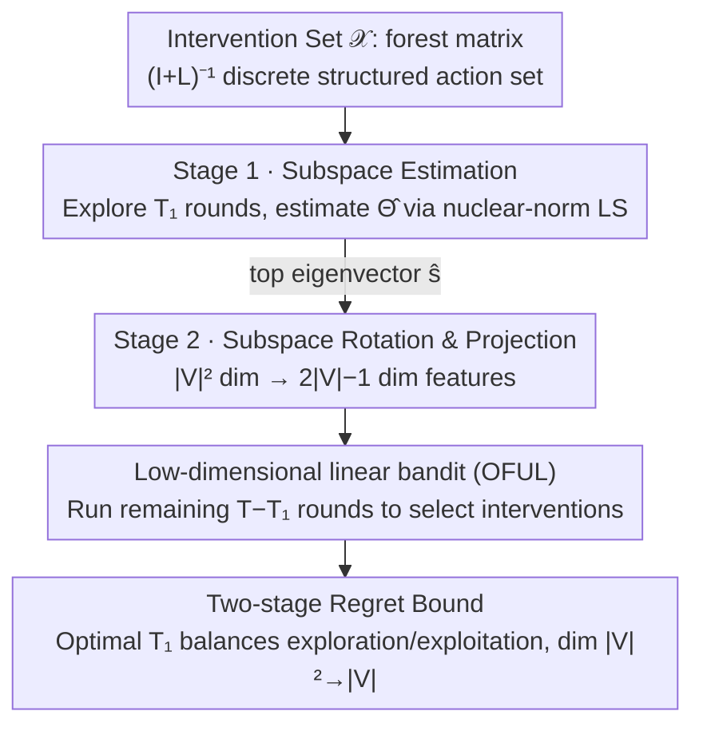

# Online Minimization of Polarization and Disagreement via Low-Rank Matrix Bandits

**Conference**: ICLR 2026  
**arXiv**: [2510.00803](https://arxiv.org/abs/2510.00803)  
**Code**: [GitHub](https://github.com/FedericoCinus/online-min-pol)  
**Area**: online learning, social network  
**Keywords**: opinion polarization, Friedkin-Johnsen model, low-rank matrix bandit, regret minimization, social network intervention

## TL;DR

This work formalizes the problem of minimizing polarization and disagreement under the Friedkin-Johnsen opinion dynamics model as an online low-rank matrix bandit problem (OPD-Min) for the first time. It proposes a two-stage algorithm, OPD-Min-ESTR, which reduces the dimensionality from $|V|^2$ to $O(|V|)$ through subspace estimation, significantly outperforming full-dimensional linear bandit baselines on both synthetic and real-world networks.

## Background & Motivation

**Background**: Social media can exacerbate opinion polarization and social division. The Friedkin-Johnsen (FJ) model is a classic model for studying opinion dynamics: each agent's expressed opinion is a weighted average of their internal opinion and their neighbors' expressed opinions, eventually converging to a unique equilibrium $\bm{z}^* = (\mathbf{I} + \mathbf{L})^{-1}\bm{s}$, where $\mathbf{L}$ is the graph Laplacian and $\bm{s}$ is the internal opinion vector.

**Limitations of Prior Work**: Musco et al. (2018) pioneered research on minimizing polarization and disagreement at the FJ equilibrium but assumed full knowledge of all agents' internal opinions. In reality, acquiring internal opinions is costly—requiring extensive user surveys or behavioral analysis—and may even be impossible under privacy constraints.

**Key Challenge**: While some works have relaxed these assumptions—using binary internal opinions (Chen et al., 2018), SDP upper bound optimization (Chaitanya et al., 2024), or limited query inference (Cinus et al., 2025)—none have addressed the true online setting. In this setting, internal opinions are entirely unknown and cannot be queried; learning must occur solely through scalar feedback (polarization + disagreement values) after each intervention.

**Ours**: This paper formalizes the problem as Online Polarization and Disagreement Minimization (OPD-Min), establishing a critical connection between social media algorithmic interventions and multi-armed bandit theory. By exploiting the rank-one structure of the objective function $f(\mathbf{X}) = \langle \bm{s}\bm{s}^\top, \mathbf{X} \rangle$, the authors design an efficient low-rank matrix bandit algorithm.

## Method

### Overall Architecture

The paper frames social network intervention as a rank-one matrix bandit: at each step $t$, the learner selects a graph Laplacian $\mathbf{L}_t$ from a finite intervention set $\mathcal{L}$ (equivalent to selecting a forest matrix $\mathbf{X}_t = (\mathbf{I} + \mathbf{L}_t)^{-1}$). After FJ dynamics converge, only a noisy scalar loss $Y_t = \langle \mathbf{\Theta}^*, \mathbf{X}_t \rangle + \eta_t$ is returned, where the unknown parameter $\mathbf{\Theta}^* = \bm{s}\bm{s}^\top$ is the rank-one outer product of internal opinions. The goal is to minimize cumulative regret $R_T = \sum_{t=1}^T [f(\mathbf{X}_t) - f(\mathbf{X}^*)]$. The algorithm OPD-Min-ESTR (Explore-Subspace-Then-Refine) operates in two stages: Stage 1 explores for $T_1$ rounds to estimate the direction $\hat{\bm{s}}$ of $\mathbf{\Theta}^*$ using nuclear-norm regularized least squares; Stage 2 uses this direction to rotate and compress the $|V|^2$-dimensional problem into $O(|V|)$ dimensions, running a standard linear bandit (OFUL) in the low-dimensional space for the remaining $T - T_1$ rounds. The exploration budget $T_1$ is optimally determined by regret analysis.

### Key Designs

**1. Subspace Estimation: Compressing $|V|^2$-dimensional exploration into direction estimation**

A naive approach treating the matrix as a $|V|^2$-dimensional linear bandit lead to a regret bound inflating to $\tilde{O}(|V|^2\sqrt{T})$. Conversely, existing low-rank matrix bandits often assume sampling from continuous distributions like Gaussians, which fails for discrete structured action sets like forest matrices. In Stage 1, this work uses nuclear-norm regularized least squares to estimate the parameter matrix: $\widehat{\mathbf{\Theta}} = \arg\min_{\mathbf{\Theta}} \frac{1}{2T_1} \sum_{t=1}^{T_1} (Y_t - \langle \mathbf{X}_t, \mathbf{\Theta} \rangle)^2 + \lambda_{T_1} \|\mathbf{\Theta}\|_{\text{nuc}}$, with $\lambda_{T_1} = 2\sqrt{2\log(2|V|/\delta)/T_1}$. The key contribution is proving that Restricted Strong Convexity (RSC) holds directly for the set of forest matrices without assuming an external "good exploration distribution." The curvature parameter $\kappa = \kappa_{\min}(\mathcal{X})$ measures the diversity of the action set. By applying Talagrand's concentration inequality and Rademacher processes, the estimation error is bounded by $\|\widehat{\mathbf{\Theta}} - \mathbf{\Theta}^*\|_F^2 \leq \frac{36\log(2|V|/\delta)}{\kappa^2 T_1}$.

**2. Subspace Rotation: Reducing linear bandit dimensionality from $|V|^2$ to $O(|V|)$**

After obtaining $\widehat{\mathbf{\Theta}}$, its top eigenvector $\hat{\bm{s}}$ is extracted and extended into an orthogonal basis $[\hat{\bm{s}}, \hat{\mathbf{S}}_\perp]$. Each arm is rotated as $\mathbf{X}' = [\hat{\bm{s}}, \hat{\mathbf{S}}_\perp]^\top \mathbf{X} [\hat{\bm{s}}, \hat{\mathbf{S}}_\perp]$. By keeping only the first row and column of the rotated matrix, a $k = 2|V|-1$ dimensional feature vector $\bm{x}_{\text{sub}}$ is constructed for a standard linear bandit. This dimensionality reduction is possible because $\mathbf{\Theta}^*$ is rank-one, concentrating all signals in the direction of $\bm{s}$. The projection error from the discarded orthogonal complement is controlled by the Davis-Kahan $\sin\theta$ theorem and vanishes as $T_1$ increases.

**3. Two-stage Regret Bound: Trading $|V|^2$ for $|V|$ with optimal budget**

By balancing the linear growth of exploration cost in Stage 1 against the decreasing regret of Stage 2, the optimal exploration budget is found to be $T_1 \asymp \frac{1}{\|\bm{s}\|^2 \kappa} \sqrt{T \log(2|V|/\delta)}$. Theorem 4.1 proves a total regret of $R_T = \widetilde{\mathcal{O}}\left(\max\left\{\frac{1}{\kappa}, \sqrt{|V|}\right\}\sqrt{|V| \cdot T}\right)$. This achieves the optimal $\sqrt{T}$ rate while reducing the dimensional factor from $|V|^2$ to $|V|$, benefiting both statistical and computational efficiency.

## Key Experimental Results

### Main Results: Cumulative Regret on Synthetic Networks

| Method | $|V|=8$ ER (regret/runtime) | $|V|=16$ ER (regret/runtime) | $|V|=8$ SBM | $|V|=16$ SBM |
|------|----------------------------|------------------------------|-------------|-------------|
| OPD-Min (Ours) | Low regret / **Fast** | Low regret / **Fast** | Low regret / **Fast** | Low regret / **Fast** |
| Full-dim OFUL | High regret / Slow | **Sig.** higher regret / **Extremely slow** | High regret / Slow | High regret / Slow |
| Oracle Subspace | Lowest regret / Fast | Lowest regret / Fast | Lowest regret / Fast | Lowest regret / Fast |

The gap is particularly evident at $|V|=16$, where OFUL's regret and runtime are significantly worse, while OPD-Min closely tracks the oracle baseline.

### Ablation Study: RSC Parameter Verification

| Graph Type | Arm regime | $|V|=32$ | $|V|=128$ | $|V|=1024$ |
|-------|-----------|----------|-----------|------------|
| ER | Diverse | 0.393 | 0.410 | 0.499 |
| ER | Local | $1.68 \times 10^{-5}$ | $1.49 \times 10^{-7}$ | $2.21 \times 10^{-7}$ |
| SBM | Diverse | 0.386 | 0.476 | 0.462 |
| SBM | Local | $2.97 \times 10^{-6}$ | $8.05 \times 10^{-7}$ | $1.05 \times 10^{-7}$ |

In the Diverse arm regime, $\kappa$ is reasonable (≈0.4-0.5), whereas in the Local regime, $\kappa$ is extremely small due to near-collinear arms.

### Key Findings

- OPD-Min consistently outperforms full-dimensional OFUL across all network topologies and parameters, with a runtime advantage that grows with $|V|$.
- The algorithm scales to networks with $|V|=1024$ nodes.
- Results are consistent on real-world networks (Florentine families, Karate club, Les Misérables).
- The online algorithm quickly surpasses the offline SDP baseline (Chaitanya et al., 2024), finding better strategies after approximately 250 interventions.
- Interventions are easier to identify and exploit under polarized (bimodal) opinion distributions.

## Highlights & Insights

- First work to connect polarization minimization with online learning and bandit theory.
- Provides a self-contained RSC analysis for structured action sets (forest matrices), removing the reliance on continuous sampling assumptions found in existing low-rank bandits.
- Dimensionality reduction from $|V|^2$ to $O(V)$ improves both statistical and computational efficiency simultaneously.
- Privacy-friendly approach requiring only scalar feedback (global polarization + disagreement) without observing individual opinions.

## Limitations & Future Work

- The RSC parameter $\kappa$ can be extremely small in Local arm regimes, potentially making the theoretical bound pessimistic.
- Only scalar equilibrium feedback is considered; richer signals (e.g., community-level polarization) could enhance performance.
- Assumes FJ dynamics converge to equilibrium between interventions, ignoring the effects of non-equilibrium states.
- The assumption of static internal opinions over time may be too strong for reality.
- The action set is limited to undirected graph Laplacians, excluding directed graphs or other intervention forms.

## Related Work & Insights

- **Musco et al. (2018)**: Pioneered offline polarization minimization; this work extends it to the online setting.
- **LowESTR** (Lu et al., 2021) and **G-ESTT** (Kang et al., 2022): This paper builds upon the ESTR framework with customized analysis for the specific structure of OPD-Min.
- **LowPopArt** (Jang et al., 2024): A low-rank bandit method based on optimal design, but its $O(|V|^6)$ complexity is infeasible for social networks.
- Inspiration for recommender systems: Similar frameworks could be applied to mitigate polarization in content recommendation.

## Rating

- Novelty: ⭐⭐⭐⭐⭐ Elegant problem modeling connecting opinion dynamics with online bandit theory.
- Experimental Thoroughness: ⭐⭐⭐⭐ Extensive experiments on synthetic and real networks, including RSC and scalability analysis, though lacking true platform data.
- Writing Quality: ⭐⭐⭐⭐ Rigorous theoretical derivations, well-organized main text and appendices.
- Value: ⭐⭐⭐⭐ Groundbreaking work, though practical deployment on social platforms remains a future step.

<!-- RELATED:START -->

## Related Papers

- [\[ICLR 2026\] QeRL: Quantization-enhanced Low-rank Reinforcement Learning for LLMs](qerl_beyond_efficiency_-_quantization-enhanced_reinforcement_learning_for_llms.md)
- [\[ICLR 2026\] Revisiting Matrix Sketching in Linear Bandits: Achieving Sublinear Regret via Dyadic Block Sketching](revisiting_matrix_sketching_in_linear_bandits_achieving_sublinear_regret_via_dya.md)
- [\[ACL 2026\] GeoRA: Geometry-Aware Low-Rank Adaptation for RLVR](../../ACL2026/reinforcement_learning/geora_geometry-aware_low-rank_adaptation_for_rlvr.md)
- [\[AAAI 2026\] Beyond the Lower Bound: Bridging Regret Minimization and Best Arm Identification in Lexicographic Bandits](../../AAAI2026/reinforcement_learning/beyond_the_lower_bound_bridging_regret_minimization_and_best_arm_identification_.md)
- [\[ICLR 2026\] Single Index Bandits: Generalized Linear Contextual Bandits with Unknown Reward Functions](single_index_bandits_generalized_linear_contextual_bandits_with_unknown_reward_f.md)

<!-- RELATED:END -->
